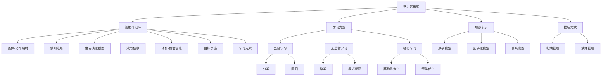

# 19.1 学习的形式

## 一、背景与动机

### 1.1 机器学习的历史渊源与现代崛起

机器学习作为人工智能的核心分支，其历史可以追溯到20世纪中叶。1959年，Arthur Samuel开发了第一个具有学习能力的程序——跳棋程序，这个程序能够通过自我对弈不断改进棋艺。这一开创性工作奠定了机器学习的基础概念：计算机系统能够通过经验自动改进性能。

然而，机器学习真正进入主流视野是在21世纪的第二个十年。随着计算能力的指数级增长、海量数据的积累以及算法理论的突破，机器学习技术从学术实验室走向了工业应用的前沿。图灵奖得主David Patterson和Google AI负责人Jeff Dean在2018年宣称，计算机体系结构的"黄金时代"正归功于机器学习。这一论断的背后是机器学习在各行各业的广泛应用：从星系引力透镜图像分析（速度提升一千万倍）到数据中心冷却系统优化（能耗降低40%），机器学习正在重塑我们对计算和智能的理解。

### 1.2 为什么要让机器进行学习

在传统的软件工程范式中，程序员通过编写明确的规则来指导计算机完成任务。然而，这种方法面临两个根本性挑战：

**挑战一：不可预见性**

程序设计者无法预见未来所有可能发生的情形。考虑一个导航迷宫的机器人，它需要掌握每一个可能遇到的新迷宫的布局；一个用于预测股市价格的程序必须能适应各种股票涨跌的情形。在这些场景中，预编程所有可能的响应是不现实的。

**挑战二：隐性知识的提取困难**

有时候设计者并不知道如何设计一个程序来求解目标问题。大多数人都能辨认自己家人的面孔，但他们实现这一点利用的是潜意识，即使能力再强的程序员也不知道如何编写计算机程序来完成这项任务，除非使用机器学习算法。这种"我们知道如何做，但无法明确表述"的知识被称为隐性知识（tacit knowledge），机器学习为提取和利用这类知识提供了途径。

### 1.3 归纳与演绎的根本区别

从一组特定的观测结果得出一个普遍的规则，我们称之为**归纳**（induction）。例如，我们观察到过去的每一天太阳都会升起，因此我们推断太阳明天也会升起。这与演绎（deduction）形成鲜明对比：在演绎中，只要前提是正确的，结论就保证是正确的；而在归纳中，结论可能是不正确的，即使所有观测都是准确的。

这种不确定性是机器学习的本质特征。机器学习算法从有限的训练样本中推断一般规律，这种推断永远无法保证100%的正确性。理解这一点对于正确评估和应用机器学习系统至关重要。

## 二、知识逻辑图谱

## 三、核心概念与数学分析

### 3.1 智能体组件的学习视角

在智能体架构中，有七个核心组件可以通过机器学习进行改进：

**组件（1）：条件-动作映射**

从当前状态到动作的直接映射，形式化表示为：

$$a = \pi(s)$$

其中 $\pi$ 是策略函数，$s$ 是当前状态，$a$ 是执行的动作。例如，自动驾驶汽车学习"当看到红灯时停车"的规则。

**组件（2）：感知推断**

从感知序列推断世界相关性质：

$$\hat{s} = f(o_1, o_2, ..., o_t)$$

其中 $o_t$ 是在时刻 $t$ 的观测。例如，从照相机图像中识别公共汽车。

**组件（3）：世界演化模型**

关于世界演化方式的信息：

$$s_{t+1} = T(s_t, a_t)$$

其中 $T$ 是转移函数。例如，学习在潮湿道路上刹车的距离。

**组件（4-6）：价值与目标**

效用信息、动作-价值信息和目标状态的学习涉及价值函数的估计：

$$V(s) = \mathbb{E}\left[\sum_{t=0}^{\infty} \gamma^t r_t \mid s_0 = s\right]$$

$$Q(s,a) = \mathbb{E}\left[\sum_{t=0}^{\infty} \gamma^t r_t \mid s_0 = s, a_0 = a\right]$$

### 3.2 三种基本学习类型的数学框架

**监督学习（Supervised Learning）**

给定训练集 $\{(x_1, y_1), (x_2, y_2), ..., (x_N, y_N)\}$，寻找函数 $h$ 使得：

$$h^* = \arg\min_{h \in \mathcal{H}} \sum_{j=1}^{N} L(y_j, h(x_j))$$

其中 $\mathcal{H}$ 是假设空间，$L$ 是损失函数。

- **分类问题**：输出 $y \in \{c_1, c_2, ..., c_k\}$ 是离散类别
- **回归问题**：输出 $y \in \mathbb{R}$ 是连续值

**无监督学习（Unsupervised Learning）**

给定输入集 $\{x_1, x_2, ..., x_N\}$，发现潜在结构：

$$\max_{\theta} \sum_{j=1}^{N} \log P(x_j; \theta)$$

最常见的任务是**聚类**，将数据划分为 $K$ 个簇：

$$\min_{\mu_1,...\mu_K} \sum_{j=1}^{N} \min_{k} ||x_j - \mu_k||^2$$

**强化学习（Reinforcement Learning）**

智能体通过与环境交互学习策略：

$$\pi^* = \arg\max_{\pi} \mathbb{E}\left[\sum_{t=0}^{T} \gamma^t r_t \mid \pi\right]$$

其中 $r_t$ 是在时刻 $t$ 获得的奖励，$\gamma \in [0,1]$ 是折扣因子。

### 3.3 先验知识与迁移学习

本章假设不存在关于智能体的先验知识（prior knowledge），它从零开始学习。然而，在实际应用中，我们可以利用**迁移学习**（transfer learning）：

$$h_{target} = \arg\min_{h} \sum_{j=1}^{N_{target}} L(y_j, h(x_j)) + \lambda \cdot \text{Sim}(h, h_{source})$$

其中 $h_{source}$ 是在源领域学习到的模型，$\text{Sim}$ 衡量两个模型的相似性。迁移学习允许我们将一个领域的知识迁移到新领域，以更少的数据使学习过程进行得更快。

## 四、定理与证明

### 4.1 归纳推理的不确定性定理

**定理**：归纳推理的结论不具有逻辑必然性，即使所有前提都为真。

**证明**：

考虑归纳推理的形式：

前提：$P(a_1), P(a_2), ..., P(a_n)$（观察到 $n$ 个实例具有性质 $P$）
结论：$\forall x: P(x)$（所有实例都具有性质 $P$）

构造反例：设 $P(x)$ 表示"$x$ 是白天，太阳升起"。即使在过去的每一天太阳都升起（所有前提为真），我们也不能逻辑地保证明天太阳一定会升起（结论可能为假）。可能存在某种宇宙事件导致太阳不再升起。

因此，归纳推理的有效性依赖于额外的假设（如自然齐一性假设），而非纯粹的逻辑推导。$\square$

### 4.2 学习问题的可学习性条件

**定理**：一个学习问题是可学习的，当且仅当满足以下条件：

1. **平稳性**：数据分布 $P(X,Y)$ 不随时间变化
2. **可实现性**：真实函数 $f \in \mathcal{H}$（假设空间包含真实函数）
3. **充分性**：训练样本数量 $N$ 足够大

**证明概要**：

- 必要性：若分布非平稳，过去的样本无法预测未来；若 $f \notin \mathcal{H}$，任何假设都有不可消除的偏差；若 $N$ 太小，估计方差过大。
- 充分性：在PAC学习框架下（见19.5节），当 $N \geq \frac{1}{\epsilon}(\ln\frac{1}{\delta} + \ln|\mathcal{H}|)$ 时，以至少 $1-\delta$ 的概率，一致性假设的错误率不超过 $\epsilon$。$\square$

## 五、具体示例

### 5.1 自动驾驶汽车的学习场景

考虑一个可以通过观测人类司机行为来学习自动驾驶的汽车智能体：

**学习条件-动作规则（组件1）**：
- 输入：当前状态（车的速度、行驶方向、道路条件）
- 输出：刹车距离
- 反馈：环境本身（动作结束后感知实际刹车距离）

**学习感知分类（组件2）**：
- 输入：照相机图像
- 输出："公共汽车"、"行人"、"交通灯"等标签
- 反馈：人工标注或已标记的数据集

**学习世界模型（组件3）**：
- 输入：当前状态和采取的动作
- 输出：下一状态
- 反馈：实际观测到的结果

**学习效用函数（组件4）**：
- 输入：旅程状态
- 输出：乘客满意度
- 反馈：乘客抱怨或赞扬

### 5.2 餐厅等待问题的学习框架

本书贯穿使用的餐厅等待问题是一个典型的监督学习问题：

**输入属性**（10维向量）：
1. Alternate：附近是否有其他餐厅（布尔值）
2. Bar：是否有舒适的吧台（布尔值）
3. Fri/Sat：是否为周五或周六（布尔值）
4. Hungry：是否饿了（布尔值）
5. Patrons：顾客数量（None/Some/Full）
6. Price：价格范围（$ / $$ / $$$）
7. Raining：是否下雨（布尔值）
8. Reservation：是否有预订（布尔值）
9. Type：餐厅类型（French/Italian/Thai/Burger）
10. WaitEstimate：预计等待时间（0-10/10-30/30-60/>60分钟）

**输出**：WillWait（是否等待，布尔值）

**学习挑战**：输入属性的值一共有 $2^6 \times 3^2 \times 4^2 = 9216$ 种可能的组合，但训练集只有12个样例。学习算法需要通过这12个样例对缺失的9204个输出值给出最好的猜测。

## 六、一句话本质

**学习的形式本质上是从有限观测中归纳一般规律的过程，通过选择适当的假设空间和优化目标，使智能体能够从经验中自动改进性能，在不确定性和计算约束下做出最优预测。**

## 七、总结与反思

### 7.1 核心要点回顾

1. **机器学习的必要性**：面对不可预见的环境和隐性知识，预编程方法存在根本局限，学习提供了适应性解决方案。

2. **学习类型的选择**：监督学习适用于有标注数据的场景；无监督学习适用于发现隐藏结构；强化学习适用于序贯决策和延迟反馈场景。

3. **归纳的本质**：机器学习基于归纳推理，结论具有概率性而非确定性，需要在偏差和方差之间权衡。

4. **组件化视角**：智能体的多个组件（感知、决策、模型、价值）都可以通过学习改进，形成完整的自适应系统。

### 7.2 与其他章节的联系

- 与**第2章**（智能体）的联系：本章详细阐述了智能体各组件的学习机制
- 与**第20章**（概率模型学习）的联系：本章关注判别模型，第20章关注生成模型
- 与**第21章**（深度学习）的联系：本章介绍基础学习方法，第21章深入神经网络
- 与**第22章**（强化学习）的联系：本章简要介绍强化学习概念，第22章系统阐述

### 7.3 批判性思考

**问题1**：机器学习的成功是否意味着人类程序员将被取代？

**思考**：并非如此。机器学习系统的设计仍然需要人类专家选择模型框架、设计特征、定义损失函数和评估指标。机器学习是工具而非替代品，它扩展了程序员的能力边界，但没有消除对人类判断的需求。

**问题2**：归纳推理的不确定性是否限制了机器学习的应用？

**思考**：虽然归纳结论不具有逻辑必然性，但在实际应用中，我们可以通过以下方式管理不确定性：
- 使用概率框架量化不确定性
- 收集更多数据减少方差
- 设计鲁棒的损失函数
- 进行严格的交叉验证

**问题3**：先验知识在机器学习中的作用是什么？

**思考**：虽然本章假设从零开始学习，但先验知识在实际应用中至关重要：
- 指导假设空间的选择
- 提供正则化约束
- 支持迁移学习
- 加速收敛过程

### 7.4 前沿展望

1. **元学习**（Meta-learning）：学习如何学习，使系统能够快速适应新任务
2. **自监督学习**：从无标注数据中自动生成监督信号
3. **神经符号结合**：将连接主义学习与符号推理相结合
4. **因果学习**：从相关性发现迈向因果机制理解

这些方向代表了机器学习从"拟合数据"向"理解世界"的演进，将在未来几十年继续推动人工智能的发展。
