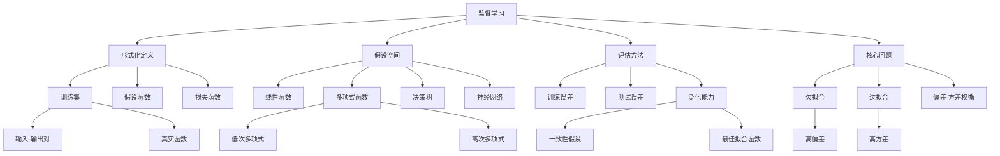

# 19.2 监督学习

## 一、背景与动机

### 1.1 从经验中学习的范式转变

监督学习代表了机器学习中最成熟、应用最广泛的学习范式。其核心思想源于一个深刻的观察：人类通过观察输入-输出对（如看到一张图片并被告知这是"猫"）来学习概念，而非通过明确的规则定义。这种学习方式在自然界中普遍存在——儿童通过不断接收外界对其行为的反馈来学习语言和世界模型。

监督学习的形式化可以追溯到20世纪50年代，当时Frank Rosenblatt发明了感知机（Perceptron），这是第一个能够从数据中学习分类规则的算法。尽管早期的感知机存在局限性（如无法解决XOR问题），但它奠定了监督学习的理论基础。随着统计学习理论的发展（特别是Vapnik和Chervonenkis在60-70年代的工作），监督学习获得了坚实的数学基础。

### 1.2 为什么需要监督学习

在许多实际应用中，我们面临以下挑战：

**挑战一：规则难以显式表述**

考虑手写数字识别问题。虽然人类可以轻松识别数字，但很难用一组明确的规则来描述"7"和"1"的区别。监督学习允许我们从大量标注样本中自动学习这些复杂的决策边界。

**挑战二：模式过于复杂**

在医学诊断中，疾病的症状与诊断之间的关系可能涉及数百个变量和非线性交互。手工构建这样的诊断系统几乎不可能，但监督学习可以从历史病例中学习这些复杂模式。

**挑战三：环境持续变化**

在垃圾邮件检测中，垃圾邮件发送者不断改变策略。预编程的规则很快就会过时，而监督学习系统可以通过持续学习新标注的样本来适应这些变化。

### 1.3 偏差-方差权衡的核心困境

监督学习面临一个根本性的困境：**偏差-方差权衡**（bias-variance tradeoff）。这个困境源于学习的基本限制：

- **高偏差**（欠拟合）：模型过于简单，无法捕捉数据中的真实模式
- **高方差**（过拟合）：模型过于复杂，捕捉了数据中的噪声而非真实信号

找到"恰到好处"的模型复杂度是监督学习的核心艺术。正如爱因斯坦所言："任何理论的终极目标都是尽可能让不可削减的基本元素变得更加简单且更少，但也不能放弃对任何一个单一经验数据的充分阐释。"这一原则被称为**奥卡姆剃刀**（Ockham's razor），它建议我们选择能够解释数据的最简单假设。

## 二、知识逻辑图谱

## 三、核心概念与数学分析

### 3.1 监督学习的形式化定义

**定义**：给定一个训练集含有 $N$ 个"输入-输出"对样例：

$$(x_1, y_1), (x_2, y_2), \ldots, (x_N, y_N)$$

其中每一对数据都由一个未知的函数 $y = f(x)$ 生成，监督学习的任务是寻找一个函数 $h$（称为**假设**或**模型**）来近似真实的函数 $f$。

**假设空间**（Hypothesis Space）：

函数 $h$ 取自一个假设空间 $\mathcal{H}$，其中包含所有可能的函数。例如：
- 线性函数：$\mathcal{H} = \{h(x) = w_1x + w_0 : w_0, w_1 \in \mathbb{R}\}$
- 多项式函数：$\mathcal{H} = \{h(x) = \sum_{i=0}^{d} w_i x^i : w_i \in \mathbb{R}\}$
- 决策树：所有可能的决策树构成的集合

**学习目标**：

$$h^* = \arg\min_{h \in \mathcal{H}} \text{Loss}(h, \text{data})$$

### 3.2 损失函数与误差度量

**0/1损失**（分类问题）：

$$L_{0/1}(y, \hat{y}) = \begin{cases} 0 & \text{if } y = \hat{y} \\ 1 & \text{if } y \neq \hat{y} \end{cases}$$

**平方误差损失**（回归问题）：

$$L_2(y, \hat{y}) = (y - \hat{y})^2$$

**绝对值损失**：

$$L_1(y, \hat{y}) = |y - \hat{y}|$$

**经验损失**（训练误差）：

$$\text{EmpLoss}_L(h) = \frac{1}{N}\sum_{j=1}^{N} L(y_j, h(x_j))$$

**泛化误差**（真实误差）：

$$\text{GenLoss}_L(h) = \mathbb{E}_{(x,y) \sim P}[L(y, h(x))]$$

### 3.3 偏差与方差的数学分析

**偏差**（Bias）：

$$\text{Bias}(h) = \mathbb{E}[h(x)] - f(x)$$

偏差衡量模型预测的平均值与真实值之间的差距。高偏差意味着模型过于简单，无法捕捉数据的真实模式（欠拟合）。

**方差**（Variance）：

$$\text{Var}(h) = \mathbb{E}[(h(x) - \mathbb{E}[h(x)])^2]$$

方差衡量模型对训练数据波动的敏感程度。高方差意味着模型过于复杂，对训练数据中的噪声过度敏感（过拟合）。

**偏差-方差分解**：

对于平方误差损失，期望预测误差可以分解为：

$$\mathbb{E}[(y - h(x))^2] = \underbrace{(f(x) - \mathbb{E}[h(x)])^2}_{\text{偏差}^2} + \underbrace{\mathbb{E}[(h(x) - \mathbb{E}[h(x)])^2]}_{\text{方差}} + \underbrace{\sigma^2}_{\text{噪声}}$$

其中 $\sigma^2$ 是不可约减的噪声方差。

### 3.4 贝叶斯视角下的学习

从贝叶斯视角看，监督学习是选择使后验概率最大的假设：

$$h^* = \arg\max_{h \in \mathcal{H}} P(h|\text{data})$$

根据贝叶斯法则：

$$P(h|\text{data}) = \frac{P(\text{data}|h)P(h)}{P(\text{data})}$$

因此：

$$h^* = \arg\max_{h \in \mathcal{H}} P(\text{data}|h)P(h)$$

其中：
- $P(\text{data}|h)$ 是**似然**，表示假设 $h$ 下观测到数据的概率
- $P(h)$ 是**先验**，表示在观测数据前对假设的偏好

这一框架解释了为什么简单的假设（如低次多项式）通常更受欢迎——它们具有更高的先验概率 $P(h)$。

## 四、定理与证明

### 4.1 一致性假设的存在性定理

**定理**：对于有限假设空间 $\mathcal{H}$ 和有限训练集，如果真实函数 $f \in \mathcal{H}$，则存在一个一致性假设 $h$ 使得对所有训练样例 $(x_j, y_j)$，有 $h(x_j) = y_j$。

**证明**：

由于 $f \in \mathcal{H}$ 且对所有训练样例 $y_j = f(x_j)$，因此 $f$ 本身就是一个一致性假设。$\square$

### 4.2 泛化误差的收敛定理

**定理**：设 $h$ 是在训练集上学习得到的一致性假设，训练集大小为 $N$，假设空间大小为 $|\mathcal{H}|$。则以至少 $1-\delta$ 的概率，$h$ 的泛化误差满足：

$$\text{error}(h) \leq \frac{1}{N}\left(\ln|\mathcal{H}| + \ln\frac{1}{\delta}\right)$$

**证明概要**：

考虑假设空间中的"坏"假设（误差 $> \epsilon$）。单个坏假设与所有 $N$ 个训练样例一致的概率最多为 $(1-\epsilon)^N \leq e^{-\epsilon N}$。

所有坏假设中至少有一个与训练数据一致的概率上界为：

$$|\mathcal{H}| \cdot e^{-\epsilon N}$$

令其等于 $\delta$ 并解出 $\epsilon$：

$$|\mathcal{H}| \cdot e^{-\epsilon N} = \delta$$
$$e^{-\epsilon N} = \frac{\delta}{|\mathcal{H}|}$$
$$-\epsilon N = \ln\frac{\delta}{|\mathcal{H}|}$$
$$\epsilon = \frac{1}{N}\left(\ln|\mathcal{H}| + \ln\frac{1}{\delta}\right)$$

因此，以至少 $1-\delta$ 的概率，一致性假设的误差不超过上述界限。$\square$

### 4.3 偏差-方差权衡定理

**定理**：不存在一个学习算法能够在所有问题上同时达到最小偏差和最小方差。

**证明**：

考虑两个极端情况：

**情况1**：常数函数 $h(x) = c$
- 偏差：$\text{Bias} = c - f(x)$（通常很大）
- 方差：$\text{Var} = 0$（不依赖于训练数据）

**情况2**：查表函数（记忆所有训练点）
- 偏差：$\text{Bias} = 0$（在训练点上完美拟合）
- 方差：$\text{Var}$ 很大（对新数据预测不稳定）

任何介于两者之间的模型都必须在偏差和方差之间做出权衡。$\square$

## 五、具体示例

### 5.1 多项式拟合示例

考虑从13个数据点中学习一个函数。我们比较四个假设空间：

**线性函数**：$h(x) = w_1x + w_0$
- 参数数量：2
- 特点：简单，可能欠拟合
- 训练误差：非零（除非数据恰好共线）

**正弦函数**：$h(x) = w_1x + \sin(w_0x)$
- 参数数量：2
- 特点：能捕捉周期性模式
- 训练误差：较小

**分段线性函数**：
- 参数数量：$2 \times (N-1)$（连接所有数据点）
- 特点：总是与训练数据一致
- 训练误差：0

**12次多项式**：$h(x) = \sum_{i=0}^{12} w_i x^i$
- 参数数量：13
- 特点：13个参数可以完美拟合13个点
- 训练误差：0
- 问题：在数据点之间可能有剧烈波动（过拟合）

### 5.2 餐厅等待问题的监督学习框架

**问题定义**：
- 输入：10维属性向量 $x$
- 输出：布尔值 $y \in \{\text{Yes}, \text{No}\}$
- 训练集：12个标注样例

**假设空间选择**：

1. **决策树**：树形结构的if-then规则
   - 优点：可解释性强
   - 缺点：可能过拟合

2. **线性分类器**：$h(x) = \text{Threshold}(w \cdot x)$
   - 优点：简单，泛化好
   - 缺点：只能学习线性决策边界

3. **逻辑回归**：$h(x) = \text{Logistic}(w \cdot x)$
   - 优点：输出概率，可微分
   - 缺点：仍然是线性决策边界

**学习过程**：

给定训练集 $\{(x_j, y_j)\}_{j=1}^{12}$，我们需要：

1. 选择假设空间 $\mathcal{H}$
2. 定义损失函数 $L$
3. 求解优化问题：$h^* = \arg\min_{h \in \mathcal{H}} \sum_{j=1}^{12} L(y_j, h(x_j))$
4. 在测试集上评估泛化性能

### 5.3 学习曲线分析

学习曲线展示了模型性能随训练数据量增加的变化：

**欠拟合情况**：
- 训练误差和测试误差都很高
- 增加数据量对性能提升有限
- 解决方案：增加模型复杂度

**过拟合情况**：
- 训练误差很低，测试误差很高
- 两者差距随数据量增加而减小
- 解决方案：增加数据量或降低模型复杂度

**理想情况**：
- 训练误差略高于测试误差
- 两者都随数据量增加而下降
- 最终收敛到接近贝叶斯最优误差

## 六、一句话本质

**监督学习本质上是通过优化经验损失在假设空间中寻找最佳近似函数的过程，核心挑战在于平衡模型的表达能力与泛化能力，在偏差与方差之间找到最优权衡点。**

## 七、总结与反思

### 7.1 核心要点回顾

1. **形式化框架**：监督学习由训练集、假设空间、损失函数三部分组成，目标是找到最小化经验损失的假设。

2. **评估标准**：训练误差衡量拟合程度，测试误差衡量泛化能力，两者差距反映过拟合程度。

3. **偏差-方差权衡**：简单模型有高偏差低方差（欠拟合），复杂模型有低偏差高方差（过拟合），最优模型位于中间。

4. **贝叶斯视角**：最优假设最大化后验概率，等价于最大化似然与先验的乘积，解释了简单性偏好的来源。

### 7.2 与其他章节的联系

- 与**19.1节**的联系：本节详细展开监督学习的数学框架
- 与**19.3节**的联系：决策树是监督学习的一种具体实现
- 与**19.4节**的联系：模型选择解决偏差-方差权衡的实践问题
- 与**19.5节**的联系：学习理论提供监督学习的理论保证
- 与**19.6节**的联系：线性模型和逻辑回归是监督学习的经典方法

### 7.3 批判性思考

**问题1**：为什么奥卡姆剃刀原则在实践中有效？

**思考**：奥卡姆剃刀建议"如无必要，勿增实体"。从贝叶斯视角看，简单假设具有更高的先验概率；从PAC学习理论看，简单假设空间需要更少的样本才能达到相同的泛化保证。然而，深度学习的成功表明，参数数量本身不是衡量复杂度的唯一标准——网络结构和优化算法同样重要。

**问题2**：如何确定模型复杂度是否合适？

**思考**：实践中常用以下方法：
- 交叉验证：在验证集上评估不同复杂度模型的性能
- 学习曲线：分析训练误差和验证误差随数据量的变化
- 正则化：通过惩罚项控制复杂度，让数据决定最优复杂度
- 早停：在验证误差开始上升前停止训练

**问题3**：监督学习的局限性是什么？

**思考**：
1. **标注成本**：需要大量标注数据，获取成本高
2. **分布偏移**：训练分布与测试分布不同时性能下降
3. **因果关系**：学习的是相关性而非因果关系
4. **对抗攻击**：对输入的微小扰动敏感

### 7.4 前沿展望

1. **主动学习**：智能选择最有价值的样本进行标注，减少标注成本
2. **半监督学习**：利用大量未标注数据辅助少量标注数据学习
3. **领域自适应**：解决训练分布与测试分布不一致的问题
4. **因果推断**：从相关性学习迈向因果关系发现

监督学习作为机器学习的基石，其理论和方法仍在不断发展。理解其基本原理和局限性，对于正确应用和改进这些技术至关重要。
