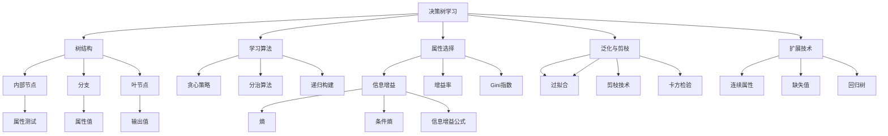

# 19.3 决策树学习

## 一、背景与动机

### 1.1 决策树的历史与发展

决策树学习是机器学习中最古老且最直观的方法之一。其起源可以追溯到20世纪60年代，当时Hunt等人开发了概念学习系统（CLS）。随后，Quinlan在1986年提出了著名的ID3算法，并在1993年改进为C4.5算法，这些工作奠定了现代决策树学习的基础。

决策树的吸引力在于其**可解释性**——与人类决策过程相似，决策树通过一系列"如果-那么"规则来进行预测。这种透明性在医学诊断、信用评估和法律决策等高风险领域尤为重要，因为决策者需要理解模型做出特定预测的原因。

### 1.2 为什么需要决策树

在众多机器学习模型中，决策树具有以下独特优势：

**优势一：处理混合类型数据**

决策树能够自然地处理离散属性和连续属性的混合，无需像神经网络那样进行特征编码或标准化。

**优势二：非参数化**

决策树不对数据的分布做任何假设，能够捕捉复杂的非线性关系。

**优势三：特征交互自动发现**

决策树能够自动发现特征之间的高阶交互，例如"如果Patrons=Full且Hungry=Yes则等待"。

**优势四：缺失值处理**

决策树可以通过多种策略（如使用最常见值、概率加权）来处理缺失数据。

然而，决策树也有其局限性：
- **不稳定性**：数据的微小变化可能导致完全不同的树结构
- **偏向性**：倾向于选择具有更多取值的属性
- **表达能力限制**：某些函数（如XOR、奇偶校验）需要指数级大小的树

### 1.3 决策树与逻辑的关系

决策树与命题逻辑之间存在深刻的联系。一棵布尔决策树等价于一个**析取范式**（Disjunctive Normal Form, DNF）：

$$\text{Output} \Leftrightarrow (\text{Path}_1 \lor \text{Path}_2 \lor \cdots)$$

其中每个Path是从根节点到true叶节点的路径上的属性-值测试的合取。这意味着命题逻辑中的任何函数都可以表示为决策树，尽管某些函数需要指数级大小的树。

## 二、知识逻辑图谱



## 三、核心概念与数学分析

### 3.1 决策树的形式化定义

**定义**：决策树是一个满足以下条件的树形结构：

1. 每个**内部节点**对应于一个输入属性的测试
2. 每个**分支**对应于该属性的一个可能值
3. 每个**叶节点**指定了函数要返回的输出值

对于布尔分类问题，输出为真（正样例）或假（负样例）。设训练集包含 $p$ 个正样例和 $n$ 个负样例。

### 3.2 决策树的表达能力

**定理**：决策树可以表示任何布尔函数。

**证明**：任何布尔函数都可以表示为析取范式（DNF），而每个合取项对应决策树中从根到true叶节点的一条路径。$\square$

**表达能力限制**：

虽然决策树可以表示任何布尔函数，但某些函数需要指数量级大小的树：

- **投票函数**（Majority）：当且仅当超过一半的输入为真时输出为真
- **奇偶性函数**（Parity）：当且仅当偶数个输入为真时输出为真

对于 $n$ 个布尔属性，这些函数需要大小为 $O(2^n)$ 的决策树。

**几何解释**：

决策树将输入空间分割为与坐标轴平行的超矩形。这意味着形如 $y > A_1 + A_2$ 的函数（决策边界为对角线）很难用决策树表示，需要堆积很多矩形来逼近对角线。

### 3.3 信息论的数学基础

**熵**（Entropy）：

熵是随机变量不确定性的度量。对于布尔随机变量，如果其为真的概率是 $q$，则熵定义为：

$$B(q) = -(q\log_2 q + (1-q)\log_2(1-q))$$

对于具有 $d$ 个可能值的随机变量 $V$，熵为：

$$H(V) = -\sum_{k=1}^{d} P(v_k)\log_2 P(v_k)$$

**性质**：
- 当 $q = 0.5$ 时，$B(q) = 1$（最大不确定性）
- 当 $q = 0$ 或 $q = 1$ 时，$B(q) = 0$（完全确定）

**条件熵**：

给定属性 $A$ 的测试后，剩余的熵为：

$$\text{Remainder}(A) = \sum_{k=1}^{d} \frac{p_k + n_k}{p + n} B\left(\frac{p_k}{p_k + n_k}\right)$$

其中 $p_k$ 和 $n_k$ 是在属性 $A$ 取第 $k$ 个值的子集中的正负样例数。

**信息增益**：

$$\text{Gain}(A) = B\left(\frac{p}{p+n}\right) - \text{Remainder}(A)$$

信息增益度量了通过测试属性 $A$ 所获得的信息量，即熵的期望减少量。

### 3.4 决策树学习算法

**Learn-Decision-Tree算法**（贪心分治策略）：

输入：样例集 examples，属性集 attributes，父样例集 parent_examples

```
1. 如果 examples 为空：
   返回 Plurality-Value(parent_examples)
   
2. 如果所有 examples 有相同的分类：
   返回该分类
   
3. 如果 attributes 为空：
   返回 Plurality-Value(examples)
   
4. A ← argmax_{a ∈ attributes} Importance(a, examples)
   
5. tree ← 以测试 A 为根的新决策树
   
6. 对于 A 的每个值 v：
   exs ← {e : e ∈ examples 且 e.A = v}
   subtree ← Learn-Decision-Tree(exs, attributes - A, examples)
   将分支(A = v, subtree)加入 tree
   
7. 返回 tree
```

**重要性函数**：

$$\text{Importance}(A, \text{examples}) = \text{Gain}(A)$$

### 3.5 泛化与过拟合

**过拟合的定义**：

当模型过于复杂，不仅拟合了数据中的真实模式，还拟合了噪声时，发生过拟合。过拟合的决策树在训练集上表现很好，但在测试集上表现差。

**剪枝技术**：

**$\chi^2$ 剪枝**（卡方剪枝）：

1. 假设零假设：属性与分类无关
2. 计算期望分布：
   $$\hat{p}_k = p \times \frac{p_k + n_k}{p + n}, \quad \hat{n}_k = n \times \frac{p_k + n_k}{p + n}$$
3. 计算偏差统计量：
   $$\Delta = \sum_{k=1}^{d} \frac{(p_k - \hat{p}_k)^2}{\hat{p}_k} + \frac{(n_k - \hat{n}_k)^2}{\hat{n}_k}$$
4. 如果 $\Delta$ 小于阈值（如 $5\%$ 置信水平下的临界值），则剪去该节点

**为什么不用提前停止？**

提前停止（在没有好的属性时停止生成节点）可能错过需要组合才能发挥作用的属性。例如，对于XOR函数，单个属性都没有信息增益，但两个属性组合后具有完全的信息。

## 四、定理与证明

### 4.1 信息增益非负性定理

**定理**：对于任何属性 $A$，$\text{Gain}(A) \geq 0$。

**证明**：

信息增益定义为：
$$\text{Gain}(A) = H(Y) - \sum_{k} P(A=a_k) H(Y|A=a_k)$$

根据条件熵的性质，$H(Y) \geq H(Y|A)$（条件作用减少熵或保持不变）。因此：

$$\text{Gain}(A) = H(Y) - H(Y|A) \geq 0$$

等号成立当且仅当 $Y$ 与 $A$ 独立。$\square$

### 4.2 决策树学习的样本复杂度

**定理**：对于 $n$ 个布尔属性，学习一个一致性决策树所需的样本数上界为 $O(2^n)$。

**证明**：

最坏情况下，决策树需要区分所有 $2^n$ 个可能的输入组合。每个叶节点对应一个输入组合，因此树最多有 $2^n$ 个叶节点。

根据PAC学习理论，假设空间大小为 $|\mathcal{H}|$，要达到误差 $\epsilon$ 且置信度 $1-\delta$，需要：

$$N \geq \frac{1}{\epsilon}\left(\ln\frac{1}{\delta} + \ln|\mathcal{H}|\right)$$

对于决策树，$|\mathcal{H}|$ 是所有可能的决策树数量，其关于 $n$ 是指数级的。$\square$

### 4.3 ID3算法的收敛性

**定理**：如果训练数据是一致的（无矛盾样例），ID3算法总能找到一个与训练数据一致的决策树。

**证明**：

通过归纳法证明：

**基例**：如果所有样例有相同分类，算法直接返回该分类，显然一致。

**归纳步**：假设算法对所有小于 $m$ 个样例的集合都能找到一致树。对于 $m$ 个样例：

1. 如果所有样例分类相同，算法返回叶节点，一致。
2. 否则，算法选择属性 $A$ 进行分割，将样例划分为子集 $E_1, E_2, \ldots, E_d$。
3. 每个子集的大小小于 $m$，根据归纳假设，递归调用返回一致的子树。
4. 由于样例一致（无矛盾），每个样例只属于一个分支，因此整棵树与所有样例一致。

$\square$

## 五、具体示例

### 5.1 餐厅等待问题的决策树

考虑餐厅等待问题的12个训练样例（见图19-2）。

**第一步：计算根节点的熵**

$p = 6$（正样例），$n = 6$（负样例）

$$H(\text{Output}) = B\left(\frac{6}{12}\right) = B(0.5) = 1 \text{ bit}$$

**第二步：计算各属性的信息增益**

对于属性 Patrons（3个取值：None, Some, Full）：

- None：$p_1=0, n_1=2$，$B(0) = 0$
- Some：$p_2=4, n_2=0$，$B(1) = 0$
- Full：$p_3=2, n_3=4$，$B(2/6) = B(1/3) \approx 0.918$

$$\text{Remainder}(\text{Patrons}) = \frac{2}{12} \cdot 0 + \frac{4}{12} \cdot 0 + \frac{6}{12} \cdot 0.918 \approx 0.459$$

$$\text{Gain}(\text{Patrons}) = 1 - 0.459 = 0.541 \text{ bits}$$

对于属性 Type（4个取值：French, Italian, Thai, Burger）：

每个取值都有2个正样例和2个负样例（或1和1），因此：

$$\text{Remainder}(\text{Type}) = 1 \cdot B(0.5) = 1$$

$$\text{Gain}(\text{Type}) = 1 - 1 = 0 \text{ bits}$$

**第三步：选择根节点属性**

Patrons 的信息增益最大（0.541 bits），因此被选为根节点。

**第四步：递归构建**

- Patrons = None 分支：所有样例为负，返回 No
- Patrons = Some 分支：所有样例为正，返回 Yes
- Patrons = Full 分支：需要继续分割，考虑剩余属性

在 Patrons = Full 的分支中（6个样例：2正4负），计算剩余属性的信息增益，选择最优属性继续分割。

**最终决策树**（简化版）：

```
Patrons?
├── None → No
├── Some → Yes
└── Full
    └── Hungry?
        ├── No → No
        └── Yes
            └── Type?
                ├── Thai → Yes
                └── ...
```

### 5.2 学习曲线分析

对于餐厅等待问题，使用不同大小的训练集训练决策树：

| 训练集大小 | 训练准确率 | 测试准确率 |
|-----------|-----------|-----------|
| 1 | 100% | ~50% |
| 5 | 100% | ~70% |
| 10 | 100% | ~85% |
| 50 | 100% | ~95% |
| 100 | 100% | ~98% |

观察：
- 训练准确率始终为100%（决策树可以拟合任何训练数据）
- 测试准确率随训练数据增加而提高
- 学习曲线呈"快乐图"形状——更多数据带来更好性能

### 5.3 剪枝效果示例

考虑一个经过剪枝和未剪枝的决策树在噪声数据上的表现：

**未剪枝树**：
- 训练准确率：100%
- 测试准确率：75%
- 节点数：25

**剪枝树**（$\chi^2$ 剪枝，5%显著性水平）：
- 训练准确率：92%
- 测试准确率：88%
- 节点数：12

剪枝减少了过拟合，提高了泛化性能，同时使树更简洁、更易理解。

## 六、一句话本质

**决策树学习本质上是通过信息增益最大化的贪心策略递归划分特征空间，在可解释性与表达能力之间寻求平衡，并通过剪枝技术防止过拟合的归纳学习方法。**

## 七、总结与反思

### 7.1 核心要点回顾

1. **树结构**：决策树通过内部节点的属性测试和叶节点的输出值来表示分类函数，等价于析取范式。

2. **信息增益**：基于熵减少的信息增益是选择测试属性的核心准则，优先选择能够最大程度减少不确定性的属性。

3. **学习算法**：采用贪心分治策略递归构建树，优先测试最重要的属性，然后解决子问题。

4. **泛化与剪枝**：$\chi^2$ 剪枝通过统计检验判断属性是否显著相关，防止过拟合，提高泛化能力。

5. **扩展技术**：连续属性处理、缺失值处理、回归树等技术扩展了决策树的适用范围。

### 7.2 与其他章节的联系

- 与**19.2节**的联系：决策树是监督学习的具体实现
- 与**19.4节**的联系：剪枝是模型选择的一种形式
- 与**19.5节**的联系：决策列表是决策树的受限形式，有PAC学习保证
- 与**19.8节**的联系：随机森林通过集成多棵决策树提高性能

### 7.3 批判性思考

**问题1**：信息增益偏向具有更多取值的属性，如何解决？

**思考**：解决方案包括：
1. **信息增益率**（Gain Ratio）：$\text{GainRatio}(A) = \frac{\text{Gain}(A)}{H(A)}$，其中 $H(A)$ 是属性 $A$ 的熵
2. **Gini指数**：另一种不纯度度量，对多值属性不那么敏感
3. **统计检验**：如 $\chi^2$ 检验，考虑属性的显著性

**问题2**：决策树为什么不稳定？如何解决？

**思考**：决策树不稳定的原因是：
- 数据的微小变化可能导致根节点选择不同，从而完全改变树的结构
- 贪心策略的局部最优性

解决方案：
1. **集成方法**：随机森林通过平均多棵树的预测来减少方差
2. **软决策树**：使用概率分支而非硬分割
3. **正则化**：限制树的深度或节点数

**问题3**：决策树与神经网络相比有什么优劣？

**思考**：

| 特性 | 决策树 | 神经网络 |
|-----|-------|---------|
| 可解释性 | 高（透明规则） | 低（黑盒） |
| 训练速度 | 快 | 慢 |
| 预测速度 | 快 | 快（前向传播） |
| 处理连续值 | 需要离散化 | 自然处理 |
| 特征交互 | 自动发现 | 需要深层结构 |
| 数据需求 | 少 | 多 |
| 稳定性 | 低 | 高 |

选择取决于具体应用：需要可解释性时选决策树，需要最高性能时选神经网络。

### 7.4 前沿展望

1. **可解释AI**：决策树因其可解释性在医疗、法律等高风险领域重新受到关注
2. **神经符号结合**：将决策树的符号推理能力与神经网络的表示学习能力结合
3. **在线决策树**：能够持续学习新数据的增量式决策树算法
4. **多任务决策树**：同时学习多个相关任务的决策树结构

决策树作为机器学习的经典方法，其简洁性和可解释性使其在深度学习时代仍然具有重要价值。理解决策树的原理和局限性，对于选择合适的机器学习工具至关重要。
