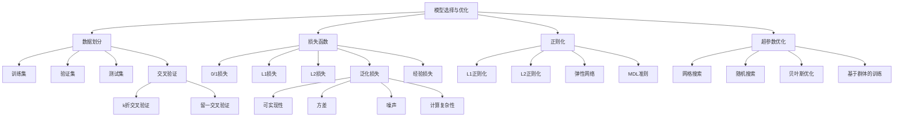

# 19.4 模型选择与模型优化

## 一、背景与动机

### 1.1 从训练到泛化的核心挑战

在机器学习的实践中，训练一个模型只是第一步。真正的挑战在于确保模型能够很好地泛化到未见过的新数据上。这引出了两个核心问题：

**问题一：什么是"最佳拟合"？**

在训练集上达到100%准确率的模型未必是最好的。一个复杂的模型可能"记住"了训练数据中的噪声，而不是学习到潜在的真实模式。因此，我们需要一个更精细的框架来定义"最佳"。

**问题二：如何选择合适的模型复杂度？**

从简单的线性模型到复杂的深度神经网络，假设空间的选择范围极其广泛。选择过于简单的模型会导致欠拟合（无法捕捉数据模式），选择过于复杂的模型会导致过拟合（捕捉噪声）。找到"恰到好处"的复杂度是模型选择的核心任务。

### 1.2 模型选择的历史演进

早期的机器学习实践者主要依赖经验和直觉来选择模型。随着统计学习理论的发展（特别是Vapnik-Chervonenkis理论和贝叶斯模型选择），模型选择获得了坚实的理论基础。

在实践中，交叉验证（cross-validation）成为模型选择的黄金标准。Stone在1974年的工作奠定了交叉验证的理论基础，而Akaike信息准则（AIC）和贝叶斯信息准则（BIC）提供了不需要额外验证数据的替代方案。

### 1.3 超参数优化的重要性

现代机器学习模型通常包含多个超参数（如正则化系数、学习率、网络层数等）。这些超参数不能从数据中学习，必须通过优化过程确定。超参数优化的复杂性随着超参数数量的增加而指数增长，催生了贝叶斯优化、随机搜索等高效方法。

## 二、知识逻辑图谱



## 三、核心概念与数学分析

### 3.1 数据划分策略

**训练集、验证集、测试集**

为了无偏地估计模型性能，我们将数据划分为三个互不相交的集合：

1. **训练集**（Training Set）：用于训练模型参数
2. **验证集**（Validation Set）：用于模型选择和超参数调优
3. **测试集**（Test Set）：用于最终性能评估

**k折交叉验证**（k-fold Cross-Validation）：

当数据量有限时，采用k折交叉验证：

1. 将数据随机划分为k个子集
2. 对于i = 1到k：
   - 使用第i个子集作为验证集
   - 使用其余k-1个子集作为训练集
   - 训练模型并记录验证性能
3. 返回k次验证性能的平均值

数学表示：

$$\text{CV}(h) = \frac{1}{k} \sum_{i=1}^{k} \text{Error}_i(h)$$

其中$\text{Error}_i(h)$是在第i折上的验证误差。

**留一交叉验证**（Leave-One-Out Cross-Validation, LOOCV）：

k = N时的特例，每次留出一个样例作为验证集。计算量大但偏差小。

### 3.2 损失函数与风险

**期望泛化损失**（Expected Generalization Loss）：

$$\text{GenLoss}_L(h) = \sum_{(x,y) \in \mathcal{E}} L(y, h(x)) P(x, y)$$

其中$\mathcal{E}$是所有可能输入-输出对的集合，$P(x,y)$是数据生成分布。

**经验损失**（Empirical Loss）：

$$\text{EmpLoss}_{L,E}(h) = \frac{1}{N} \sum_{(x,y) \in E} L(y, h(x))$$

**损失函数类型**：

1. **0/1损失**（分类）：
   $$L_{0/1}(y, \hat{y}) = \begin{cases} 0 & \text{if } y = \hat{y} \\ 1 & \text{otherwise} \end{cases}$$

2. **L1损失**（绝对值损失）：
   $$L_1(y, \hat{y}) = |y - \hat{y}|$$

3. **L2损失**（平方误差）：
   $$L_2(y, \hat{y}) = (y - \hat{y})^2$$

### 3.3 正则化理论

**正则化的目标**：

最小化总代价：

$$\text{Cost}(h) = \text{EmpLoss}(h) + \lambda \cdot \text{Complexity}(h)$$

$$\hat{h}^* = \arg\min_{h \in \mathcal{H}} \text{Cost}(h)$$

其中$\lambda > 0$是正则化系数，控制拟合与复杂度的权衡。

**L1正则化**（Lasso）：

$$\text{Complexity}(h_w) = \sum_i |w_i|$$

性质：倾向于产生稀疏解（许多权重为0）

**L2正则化**（Ridge）：

$$\text{Complexity}(h_w) = \sum_i w_i^2$$

性质：倾向于产生小权重解，但不强制为0

**弹性网络**（Elastic Net）：

$$\text{Complexity}(h_w) = \alpha \sum_i |w_i| + (1-\alpha) \sum_i w_i^2$$

结合L1和L2的优点。

**最小描述长度**（Minimum Description Length, MDL）：

$$\text{MDL}(h) = \text{bits}(h) + \text{bits}(\text{data}|h)$$

其中：
- $\text{bits}(h)$：编码假设所需的位数
- $\text{bits}(\text{data}|h)$：在假设h下编码数据所需的位数

### 3.4 模型选择算法

**模型选择框架**：

```
function Model-Selection(Learner, examples, k):
    err ← 数组，以size为索引
    training_set, test_set ← 划分examples
    
    for size = 1 to ∞:
        err[size] ← Cross-Validation(Learner, size, training_set, k)
        if err开始显著增长:
            best_size ← argmin err[size]
            h ← Learner(best_size, training_set)
            return h, Error-Rate(h, test_set)
```

**交叉验证子程序**：

```
function Cross-Validation(Learner, size, examples, k):
    N ← examples的个数
    errs ← 0
    for i = 1 to k:
        validation_set ← examples[(i-1)×N/k : i×N/k]
        training_set ← examples - validation_set
        h ← Learner(size, training_set)
        errs ← errs + Error-Rate(h, validation_set)
    return errs / k
```

### 3.5 超参数优化方法

**网格搜索**（Grid Search）：

对于每个超参数，定义一组离散值，尝试所有组合。

计算复杂度：$O(\prod_{i=1}^{d} n_i)$，其中$d$是超参数数量，$n_i$是第i个超参数的值数量。

**随机搜索**（Random Search）：

从超参数空间中随机采样，尝试固定次数。

优点：
- 可以探索连续超参数空间
- 当某些超参数更重要时，效率高于网格搜索

**贝叶斯优化**（Bayesian Optimization）：

将超参数优化视为黑盒优化问题：

$$x^* = \arg\min_{x \in \mathcal{X}} f(x)$$

其中$f(x)$是使用超参数x训练模型在验证集上的损失。

使用高斯过程建模$f$的后验分布，通过采集函数（如期望改进EI）选择下一个评估点：

$$\text{EI}(x) = \mathbb{E}[\max(f^* - f(x), 0)]$$

其中$f^*$是当前最优值。

**基于群体的训练**（Population-Based Training, PBT）：

1. 初始化：随机生成多个模型（群体），每个有不同的超参数
2. 训练：并行训练所有模型
3. 选择：保留表现好的模型
4. 进化：基于好模型的超参数，通过随机突变生成新超参数
5. 重复步骤2-4

## 四、定理与证明

### 4.1 交叉验证的一致性定理

**定理**：当$N \to \infty$时，k折交叉验证误差收敛于真实泛化误差。

**证明概要**：

设$\hat{R}(h)$是经验风险，$R(h)$是真实风险。

对于每折$i$，训练集大小为$\frac{(k-1)N}{k}$，验证集大小为$\frac{N}{k}$。

根据大数定律，当$N \to \infty$时：

$$\hat{R}_i(h) \xrightarrow{p} R(h)$$

因此：

$$\text{CV}(h) = \frac{1}{k} \sum_{i=1}^{k} \hat{R}_i(h) \xrightarrow{p} R(h)$$

$\square$

### 4.2 正则化的偏差-方差权衡定理

**定理**：对于线性回归，L2正则化在偏差和方差之间提供了可控的权衡。

**证明**：

考虑线性模型$y = Xw + \epsilon$，其中$\epsilon \sim \mathcal{N}(0, \sigma^2 I)$。

无正则化解（OLS）：
$$\hat{w}_{\text{OLS}} = (X^T X)^{-1} X^T y$$

L2正则化解（Ridge）：
$$\hat{w}_{\text{ridge}} = (X^T X + \lambda I)^{-1} X^T y$$

**偏差分析**：

$$\mathbb{E}[\hat{w}_{\text{ridge}}] = (X^T X + \lambda I)^{-1} X^T X w$$

当$\lambda > 0$时，$\mathbb{E}[\hat{w}_{\text{ridge}}] \neq w$，存在偏差。

**方差分析**：

$$\text{Var}(\hat{w}_{\text{ridge}}) = \sigma^2 (X^T X + \lambda I)^{-1} X^T X (X^T X + \lambda I)^{-1}$$

当$\lambda$增加时，方差减小。

因此，$\lambda$控制偏差-方差权衡。$\square$

### 4.3 模型选择的一致性定理

**定理**：在适当条件下，基于验证集选择的模型具有一致性：当$N \to \infty$时，选择的模型收敛于真实模型。

**证明概要**：

设$\mathcal{H}_1, \mathcal{H}_2, \ldots$是一系列嵌套的假设空间，$h^*_k$是$\mathcal{H}_k$中的最优假设。

对于每个$k$，验证误差$\hat{R}_{\text{val}}(h^*_k)$是$R(h^*_k)$的一致估计。

选择$\hat{k} = \arg\min_k \hat{R}_{\text{val}}(h^*_k)$。

当$N \to \infty$时，$\hat{R}_{\text{val}}(h^*_k) \xrightarrow{p} R(h^*_k)$，因此$\hat{k}$收敛于使$R(h^*_k)$最小的$k$。

$\square$

## 五、具体示例

### 5.1 多项式拟合的模型选择

考虑一维回归问题，真实函数是3次多项式，我们观察带有噪声的数据点。

**实验设置**：
- 训练集：20个点
- 验证集：10个点
- 测试集：10个点
- 候选模型：次数1到15的多项式

**结果**：

| 多项式次数 | 训练误差 | 验证误差 | 测试误差 |
|-----------|---------|---------|---------|
| 1 | 0.85 | 0.82 | 0.83 |
| 3 | 0.15 | 0.18 | 0.17 |
| 5 | 0.08 | 0.12 | 0.14 |
| 10 | 0.02 | 0.25 | 0.28 |
| 15 | 0.00 | 0.45 | 0.52 |

**分析**：
- 次数1：欠拟合，偏差大
- 次数3：接近真实模型，泛化最好
- 次数5：轻微过拟合
- 次数10-15：严重过拟合，验证误差和测试误差显著上升

**模型选择**：基于验证误差，选择次数3的多项式。

### 5.2 正则化系数的选择

考虑线性回归问题，有100个特征，但只有20个是真正相关的。

**L1正则化（Lasso）**：

| $\lambda$ | 非零系数数量 | 训练误差 | 验证误差 |
|----------|------------|---------|---------|
| 0.001 | 98 | 0.05 | 0.35 |
| 0.01 | 45 | 0.12 | 0.18 |
| 0.1 | 18 | 0.28 | 0.15 |
| 1.0 | 5 | 0.65 | 0.42 |

**分析**：
- $\lambda$太小：过拟合，保留太多无关特征
- $\lambda = 0.1$：接近最优，保留约20个特征
- $\lambda$太大：欠拟合，消除太多有用特征

### 5.3 决策树的剪枝阈值选择

在餐厅等待问题上，使用$\chi^2$剪枝：

| 显著性水平 | 节点数 | 训练准确率 | 验证准确率 |
|-----------|-------|-----------|-----------|
| 不剪枝 | 25 | 100% | 75% |
| 1% | 12 | 92% | 88% |
| 5% | 8 | 85% | 87% |
| 10% | 5 | 78% | 82% |

**分析**：5%显著性水平提供了最佳验证性能，平衡了拟合和泛化。

## 六、一句话本质

**模型选择与优化本质上是在经验拟合与模型复杂度之间寻找最优权衡，通过数据划分、正则化和超参数优化等技术，使学习到的假设能够最好地泛化到未见过的新数据。**

## 七、总结与反思

### 7.1 核心要点回顾

1. **数据划分**：训练集用于参数学习，验证集用于模型选择，测试集用于最终评估。交叉验证在有限数据下提供更可靠的性能估计。

2. **损失函数**：从0/1损失到L1/L2损失，不同损失函数适用于不同问题。泛化损失是最终目标，经验损失是近似。

3. **正则化**：通过惩罚模型复杂度防止过拟合。L1产生稀疏解，L2产生小权重解，MDL从信息论角度提供统一框架。

4. **超参数优化**：网格搜索系统但计算量大，随机搜索高效，贝叶斯优化利用先验信息，PBT结合并行性和进化策略。

5. **模型选择原则**：选择在验证集上表现最好的模型，而非训练集上表现最好的模型。

### 7.2 与其他章节的联系

- 与**19.2节**的联系：模型选择解决监督学习中的偏差-方差权衡
- 与**19.3节**的联系：剪枝是决策树的模型选择技术
- 与**19.5节**的联系：学习理论提供模型选择的理论保证
- 与**19.6节**的联系：正则化是线性模型的核心技术
- 与**19.8节**的联系：集成学习通过组合多个模型提高性能

### 7.3 批判性思考

**问题1**：为什么测试集只能使用一次？

**思考**：如果多次使用测试集进行模型选择和调优，测试集信息会泄露到模型选择过程中，导致对泛化性能的高估。这类似于"偷看答案"后再做选择。正确的做法是：
- 使用验证集进行所有模型选择和超参数调优
- 仅在最终评估时使用测试集
- 如果需要多次评估，使用嵌套交叉验证

**问题2**：交叉验证的k如何选择？

**思考**：
- k=5或10：计算效率和估计准确性的良好平衡
- k=N（LOOCV）：偏差最小但计算量大，方差可能较大
- k=2：计算最快但估计较粗糙

一般规则：
- 大数据集：k=5足够
- 小数据集：k=10或LOOCV
- 类别不平衡：使用分层交叉验证保持类别比例

**问题3**：正则化系数$\lambda$如何影响模型？

**思考**：
- $\lambda = 0$：无正则化，可能过拟合
- $\lambda \to \infty$：所有权重趋于0，模型退化为常数
- 最优$\lambda$：通过交叉验证选择，通常在"欠拟合"和"过拟合"之间的某个点

### 7.4 前沿展望

1. **自动化机器学习**（AutoML）：自动进行模型选择和超参数优化，降低机器学习门槛
2. **神经架构搜索**（NAS）：自动设计神经网络结构
3. **元学习**：学习如何快速适应新任务的最优模型选择策略
4. **因果模型选择**：不仅考虑预测性能，还考虑因果可解释性

模型选择与优化是机器学习的核心实践技能。掌握这些技术，能够将理论知识转化为实际应用中的高性能模型。
