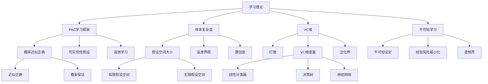

# 19.5 学习理论

## 一、背景与动机

### 1.1 从经验到理论的跨越

机器学习的实践者常常面临一个根本性问题：我们如何确定所学到的假设能够很好地预测还未被观测过的输入？这个问题触及了归纳推理的本质，也是哲学史上长期争论的主题。从休谟对因果关系的怀疑，到波普尔对证伪主义的倡导，再到现代统计学习理论，人类一直在探索从有限经验推断普遍规律的可靠性。

计算学习理论（Computational Learning Theory）作为人工智能、统计学和计算机科学理论的交汇点，为这一问题提供了数学上的回答。它告诉我们，在什么条件下学习是可能的，需要多少样本，以及可以期望达到什么样的性能。

### 1.2 PAC学习的诞生

20世纪80年代，Leslie Valiant提出了**概率近似正确**（Probably Approximately Correct, PAC）学习框架，为学习理论奠定了现代基础。PAC学习的核心洞见是：我们不需要学习到一个完美的假设，只需要一个"大概率近似正确"的假设就足够了。这一洞见既现实（完美学习通常不可能）又强大（提供了可证明的保证）。

Valiant因此获得了2010年的图灵奖，表彰他在计算学习理论方面的开创性贡献。

### 1.3 学习理论的实践意义

学习理论不仅是学术上的好奇，它对实践有重要指导：

- **样本复杂度**：告诉我们需要多少训练数据
- **模型选择**：指导我们应该选择多大的假设空间
- **算法设计**：启发我们设计高效的学习算法
- **性能保证**：提供泛化误差的上界

## 二、知识逻辑图谱

## 三、核心概念与数学分析

### 3.1 PAC学习的形式化定义

**定义**：一个概念类 $\mathcal{C}$ 是PAC可学习的，如果存在一个算法 $A$，使得对于任意 $\epsilon > 0$（精度参数）、$\delta > 0$（置信参数）、任意目标概念 $c \in \mathcal{C}$、以及任意数据分布 $D$，算法 $A$ 在从 $D$ 中独立同分布抽取的 $m$ 个样例上运行时，以至少 $1-\delta$ 的概率，输出一个假设 $h$，使得：

$$\text{error}(h) = P_{x \sim D}(h(x) \neq c(x)) \leq \epsilon$$

且算法 $A$ 的运行时间是 $1/\epsilon$、$1/\delta$、$n$（实例大小）和 $|c|$（目标概念大小）的多项式。

### 3.2 有限假设空间的样本复杂度

**定理**：对于有限假设空间 $\mathcal{H}$，如果目标概念 $c \in \mathcal{H}$（可实现性假设），则样本复杂度为：

$$m \geq \frac{1}{\epsilon}\left(\ln|\mathcal{H}| + \ln\frac{1}{\delta}\right)$$

**证明**：

设 $h \in \mathcal{H}$ 是一个"坏"假设，即 $\text{error}(h) > \epsilon$。

$h$ 与单个样例一致的概率最多为 $1-\epsilon$。

$h$ 与所有 $m$ 个样例一致的概率最多为 $(1-\epsilon)^m \leq e^{-\epsilon m}$。

所有坏假设中至少有一个与训练数据一致的概率：

$$P(\text{bad consistent}) \leq |\mathcal{H}| \cdot e^{-\epsilon m}$$

我们希望这个概率小于 $\delta$：

$$|\mathcal{H}| \cdot e^{-\epsilon m} \leq \delta$$

$$e^{-\epsilon m} \leq \frac{\delta}{|\mathcal{H}|}$$

$$-\epsilon m \leq \ln\delta - \ln|\mathcal{H}|$$

$$m \geq \frac{1}{\epsilon}(\ln|\mathcal{H}| + \ln\frac{1}{\delta})$$

$\square$

### 3.3 VC维理论

**打散**（Shattering）：假设空间 $\mathcal{H}$ 打散一个样例集 $S$，如果对于 $S$ 的每一种标记方式，都存在 $h \in \mathcal{H}$ 与之 consistent。

**VC维**（Vapnik-Chervonenkis Dimension）：

$$\text{VC}(\mathcal{H}) = \max\{|S| : \mathcal{H} \text{ 打散 } S\}$$

即 $\mathcal{H}$ 能打散的最大集合的大小。

**VC维示例**：

- 二维线性分类器：VC维 = 3（可以打散任意3个点，但不能打散所有4个点的配置）
- 一维决策树桩（单属性阈值）：VC维 = 2
- $d$ 维线性分类器：VC维 = $d+1$

**基于VC维的泛化界**：

对于任意假设空间 $\mathcal{H}$，以至少 $1-\delta$ 的概率，对所有 $h \in \mathcal{H}$：

$$\text{error}(h) \leq \widehat{\text{error}}(h) + O\left(\sqrt{\frac{\text{VC}(\mathcal{H})\ln m + \ln(1/\delta)}{m}}\right)$$

其中 $\widehat{\text{error}}(h)$ 是训练误差，$m$ 是训练样本数。

### 3.4 不可知学习

当目标概念不在假设空间中时（不可知设定），我们寻求最小化经验风险的假设：

$$\hat{h} = \arg\min_{h \in \mathcal{H}} \widehat{\text{error}}(h)$$

**泛化界**：

以至少 $1-\delta$ 的概率：

$$\text{error}(\hat{h}) \leq \min_{h \in \mathcal{H}} \text{error}(h) + O\left(\sqrt{\frac{\text{VC}(\mathcal{H})\ln m + \ln(1/\delta)}{m}}\right)$$

这意味着经验风险最小化器接近假设空间中的最优假设。

### 3.5 决策列表的PAC学习

**定义**：$k$-DL是使用最多 $k$ 个文字合取作为测试的决策列表。

**假设空间大小**：

$$|k\text{-DL}(n)| \leq 3^{c} \cdot c! \text{，其中 } c = |Conj(n,k)| = O(n^k)$$

因此：

$$|k\text{-DL}(n)| = 2^{O(n^k \log(n^k))}$$

**样本复杂度**：

$$m \geq \frac{1}{\epsilon}\left(\ln\frac{1}{\delta} + O(n^k \log(n^k))\right)$$

对于固定的 $k$，这是关于 $n$ 的多项式，因此 $k$-DL是PAC可学习的。

## 四、定理与证明

### 4.1 一致收敛定理

**定理**（一致收敛）：对于有限假设空间 $\mathcal{H}$，以至少 $1-\delta$ 的概率，对所有 $h \in \mathcal{H}$：

$$|\widehat{\text{error}}(h) - \text{error}(h)| \leq \sqrt{\frac{\ln|\mathcal{H}| + \ln(2/\delta)}{2m}}$$

**证明**：

对于单个假设 $h$，根据Hoeffding不等式：

$$P(|\widehat{\text{error}}(h) - \text{error}(h)| > \epsilon) \leq 2e^{-2m\epsilon^2}$$

对所有 $h \in \mathcal{H}$ 应用联合界：

$$P(\exists h: |\widehat{\text{error}}(h) - \text{error}(h)| > \epsilon) \leq 2|\mathcal{H}|e^{-2m\epsilon^2}$$

令右边等于 $\delta$ 并解出 $\epsilon$：

$$\epsilon = \sqrt{\frac{\ln|\mathcal{H}| + \ln(2/\delta)}{2m}}$$

$\square$

### 4.2 VC维与增长函数的关系

**定理**（Sauer-Shelah引理）：对于VC维为 $d$ 的假设空间，增长函数满足：

$$\Pi_{\mathcal{H}}(m) \leq \sum_{i=0}^{d} \binom{m}{i} = O(m^d)$$

其中增长函数 $\Pi_{\mathcal{H}}(m)$ 是 $\mathcal{H}$ 在 $m$ 个点上能产生的不同标记的最大数。

**证明概要**：

通过对 $m+d$ 的归纳证明。关键观察是：如果 $\mathcal{H}$ 打散一个大小为 $d+1$ 的集合，则存在两个假设在 $d$ 个点上一致但在第 $d+1$ 个点上不同。$\square$

### 4.3 没有免费午餐定理

**定理**（No Free Lunch）：对于任何学习算法，存在数据分布使得该算法的期望误差至少为某个正数，除非算法看到所有可能的样例。

**形式化表述**：

设 $X$ 是实例空间，$C$ 是所有从 $X$ 到 $\{0,1\}$ 的函数的集合。对于任何学习算法 $A$ 和任何 $m < |X|/2$：

$$\max_{c \in C} E_{S \sim D^m}[\text{error}(A(S))] \geq \frac{1}{4}$$

**证明概要**：

考虑均匀分布 $D$ 在 $X$ 上。对于任何未在训练集中出现的样例，算法只能随机猜测，因此期望错误率为 $1/2$。由于 $m < |X|/2$，至少一半的样例未出现。$\square$

**启示**：学习需要假设（归纳偏置），没有普适的学习算法。

## 五、具体示例

### 5.1 布尔函数的样本复杂度

对于 $n$ 个布尔属性，所有布尔函数的假设空间大小为 $|\mathcal{H}| = 2^{2^n}$。

PAC学习所需样本数：

$$m \geq \frac{1}{\epsilon}\left(2^n \ln 2 + \ln\frac{1}{\delta}\right)$$

这意味着我们需要几乎看到所有可能的样例（共 $2^n$ 个）才能PAC学习所有布尔函数。

**启示**：必须限制假设空间才能有效学习。

### 5.2 线性分类器的VC维

在 $\mathbb{R}^d$ 中，线性分类器的VC维为 $d+1$。

**验证**：

- 可以打散 $d+1$ 个处于一般位置的点（不共超平面）
- 不能打散 $d+2$ 个点（Radon定理）

**泛化界**：

$$\text{error}(h) \leq \widehat{\text{error}}(h) + O\left(\sqrt{\frac{(d+1)\ln m + \ln(1/\delta)}{m}}\right)$$

### 5.3 决策树的样本复杂度

对于深度为 $k$ 的决策树，节点数最多为 $2^k$，假设空间大小为 $O(n^{2^k})$（每个节点选择一个属性和阈值）。

样本复杂度：

$$m \geq \frac{1}{\epsilon}\left(2^k \ln n + \ln\frac{1}{\delta}\right)$$

对于固定的 $k$，这是关于 $n$ 的多项式。

## 六、一句话本质

**学习理论本质上是通过概率分析和复杂度度量（如VC维）来刻画学习问题的可学习性条件、样本复杂度和泛化性能界限，揭示在有限数据和计算约束下归纳推理的理论极限与可能。**

## 七、总结与反思

### 7.1 核心要点回顾

1. **PAC学习框架**：定义了"大概率近似正确"的学习目标，为学习算法提供了可证明的保证。

2. **样本复杂度**：对于有限假设空间，样本复杂度与 $\ln|\mathcal{H}|$ 成正比；对于无限假设空间，使用VC维度量复杂度。

3. **VC维**：假设空间复杂度的核心度量，决定了泛化界的形式。

4. **不可知学习**：当目标概念不在假设空间中时，经验风险最小化仍然提供接近最优的保证。

5. **没有免费午餐**：学习需要归纳偏置，不存在普适的学习算法。

### 7.2 与其他章节的联系

- 与**19.2节**的联系：学习理论为监督学习提供理论基础
- 与**19.3节**的联系：决策列表的PAC可学习性分析
- 与**19.4节**的联系：样本复杂度指导模型选择
- 与**19.6节**的联系：线性分类器的VC维分析

### 7.3 批判性思考

**问题1**：PAC学习的"概率"和"近似"是否意味着学习不可靠？

**思考**：恰恰相反，PAC框架的现实性是其优势：
- "近似"（$\epsilon$）：承认完美学习通常不可能，允许小误差
- "概率"（$\delta$）：承认小概率失败的可能性

这两个参数都是可调节的，通过增加样本量，可以使两者任意小。

**问题2**：VC维是否完全刻画了假设空间的复杂度？

**思考**：VC维是重要的复杂度度量，但不是唯一的：
- 优点：与泛化界直接相关，对许多假设空间可计算
- 局限：对于某些假设空间（如某些神经网络），VC维可能过大或难以计算

替代方案包括：Rademacher复杂度、覆盖数等。

**问题3**：学习理论中的界限是否紧致？

**思考**：理论界限通常是上界，可能不紧：
- 对于某些问题，实际所需样本远少于理论界限
- 界限中的常数因子可能很大
- 分布相关分析（如利用数据分布的结构）可以给出更紧的界限

然而，理论界限提供了最坏情况保证，对于算法设计和理解学习本质仍然有价值。

### 7.4 前沿展望

1. **深度学习理论**：理解过参数化神经网络的泛化性能（传统理论预测应该过拟合，但实践中泛化很好）

2. **在线学习理论**：数据流式到达时的学习理论保证

3. **差分隐私学习**：在保护隐私的同时学习的理论保证

4. **因果学习理论**：从相关性学习扩展到因果发现的学习理论

学习理论为机器学习提供了坚实的数学基础，帮助我们理解什么是可学习的、需要多少数据、以及可以期望什么样的性能。虽然理论界限可能保守，但它们指导了算法设计，并揭示了学习的基本限制。
