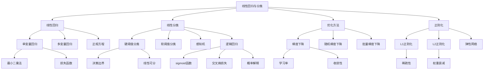

# 19.6 线性回归与分类

## 一、背景与动机

### 1.1 线性模型的历史渊源

线性回归是统计学中最古老且最广泛应用的方法之一，其历史可以追溯到18世纪。1805年，Legendre发表了最小二乘法（Least Squares）的开创性工作，随后Gauss在1809年也独立提出了这一方法，并证明了其在误差服从正态分布时的最优性。这一方法在19世纪天文学和大地测量学中得到了广泛应用。

线性分类器的历史同样悠久。1943年，McCulloch和Pitts提出了神经元的数学模型，奠定了神经网络的基础。1958年，Rosenblatt发明了感知机（Perceptron），这是第一个能够从数据中学习分类规则的算法。尽管Minsky和Papert在1969年证明了感知机的局限性（无法解决XOR问题），但线性模型因其简洁性和可解释性，至今仍是机器学习的基石。

### 1.2 为什么线性模型仍然重要

在深度学习时代，线性模型似乎过于简单，但它们仍然具有不可替代的价值：

**优势一：可解释性**

线性模型的权重直接反映了特征的重要性。在医学、金融等高风险领域，理解决策依据至关重要。

**优势二：计算效率**

线性模型有闭式解，训练和预测都极其高效，适合大规模应用。

**优势三：理论基础扎实**

线性模型的统计性质得到了深入研究，置信区间、假设检验等统计工具都可以应用。

**优势四：作为基线**

在尝试复杂模型之前，线性模型提供了一个重要的性能基线。

### 1.3 从回归到分类的扩展

线性模型最初用于回归问题（预测连续值），但通过引入阈值函数，可以扩展到分类问题。硬阈值（感知机）简单但不可微，软阈值（逻辑斯谛函数）连续可微，更适合梯度优化。这一扩展使线性模型成为分类任务的重要工具。

## 二、知识逻辑图谱



## 三、核心概念与数学分析

### 3.1 单变量线性回归

**模型定义**：

$$h_w(x) = w_1 x + w_0$$

其中 $w_0$ 是截距，$w_1$ 是斜率，$w = (w_0, w_1)$ 是权重向量。

**损失函数**（平方误差）：

$$\text{Loss}(w) = \sum_{j=1}^{N} (y_j - h_w(x_j))^2 = \sum_{j=1}^{N} (y_j - (w_1 x_j + w_0))^2$$

**最优解**（正规方程）：

令偏导数为零：

$$\frac{\partial}{\partial w_0} \text{Loss}(w) = -2\sum_{j=1}^{N} (y_j - w_1 x_j - w_0) = 0$$

$$\frac{\partial}{\partial w_1} \text{Loss}(w) = -2\sum_{j=1}^{N} (y_j - w_1 x_j - w_0)x_j = 0$$

解得：

$$w_1 = \frac{N\sum x_j y_j - (\sum x_j)(\sum y_j)}{N\sum x_j^2 - (\sum x_j)^2}$$

$$w_0 = \frac{\sum y_j - w_1 \sum x_j}{N}$$

**几何解释**：

最优拟合直线使得所有数据点到直线的垂直距离（残差）的平方和最小。

### 3.2 梯度下降优化

当闭式解不可得或计算代价太高时，使用梯度下降：

**算法**：

```
初始化 w
while 未收敛:
    for 每个权重 w_i:
        w_i ← w_i - α * ∂Loss/∂w_i
```

其中 $α$ 是学习率。

**单变量回归的梯度**：

对于单个样例 $(x, y)$：

$$\frac{\partial}{\partial w_0} \text{Loss} = -2(y - h_w(x))$$

$$\frac{\partial}{\partial w_1} \text{Loss} = -2(y - h_w(x))x$$

**更新规则**：

$$w_0 \leftarrow w_0 + \alpha (y - h_w(x))$$

$$w_1 \leftarrow w_1 + \alpha (y - h_w(x))x$$

**批量梯度下降 vs 随机梯度下降**：

- **批量梯度下降**：每次更新使用所有训练样例
  $$w_i \leftarrow w_i + \alpha \sum_{j=1}^{N} (y_j - h_w(x_j))x_{j,i}$$

- **随机梯度下降（SGD）**：每次更新使用一个或少量样例（小批量）
  $$w_i \leftarrow w_i + \alpha (y_j - h_w(x_j))x_{j,i}$$

SGD收敛更快，适合大规模数据。

### 3.3 多变量线性回归

**模型定义**：

$$h_w(x) = w_0 + \sum_{i=1}^{n} w_i x_i = w^T x$$

其中 $x_0 = 1$（引入虚拟特征）。

**矩阵形式**：

设 $X$ 是 $N \times (n+1)$ 的设计矩阵，$y$ 是 $N \times 1$ 的输出向量：

$$\hat{y} = Xw$$

$$\text{Loss}(w) = ||Xw - y||^2 = (Xw - y)^T(Xw - y)$$

**正规方程**：

$$\nabla_w \text{Loss} = 2X^T(Xw - y) = 0$$

$$X^T X w = X^T y$$

$$w^* = (X^T X)^{-1} X^T y$$

$(X^T X)^{-1} X^T$ 称为 $X$ 的**伪逆**（Moore-Penrose pseudoinverse）。

### 3.4 正则化

**L2正则化（Ridge回归）**：

$$\text{Cost}(w) = \text{Loss}(w) + \lambda \sum_{i=1}^{n} w_i^2$$

解：

$$w^* = (X^T X + \lambda I)^{-1} X^T y$$

**L1正则化（Lasso）**：

$$\text{Cost}(w) = \text{Loss}(w) + \lambda \sum_{i=1}^{n} |w_i|$$

没有闭式解，需要使用优化算法（如坐标下降）。

**L1 vs L2**：

- L1倾向于产生稀疏解（许多权重为0）
- L2倾向于产生小权重解，但不强制为0
- L1不是旋转不变的，L2是旋转不变的

### 3.5 线性分类器

**硬阈值分类器（感知机）**：

$$h_w(x) = \text{Threshold}(w^T x) = \begin{cases} 1 & \text{if } w^T x \geq 0 \\ 0 & \text{otherwise} \end{cases}$$

**感知机学习规则**：

$$w_i \leftarrow w_i + \alpha (y - h_w(x)) x_i$$

**收敛定理**：如果数据线性可分，感知机算法在有限步内收敛。

**软阈值分类器（逻辑回归）**：

使用sigmoid（逻辑斯谛）函数：

$$\sigma(z) = \frac{1}{1 + e^{-z}}$$

$$h_w(x) = \sigma(w^T x) = \frac{1}{1 + e^{-w^T x}}$$

输出解释为概率：$P(y=1|x) = h_w(x)$

**损失函数**（交叉熵/对数损失）：

$$\text{Loss}(w) = -\sum_{j=1}^{N} [y_j \ln h_w(x_j) + (1-y_j) \ln(1-h_w(x_j))]$$

**梯度**：

$$\frac{\partial}{\partial w_i} \text{Loss} = -\sum_{j=1}^{N} (y_j - h_w(x_j)) x_{j,i}$$

注意：与线性回归形式相同！

## 四、定理与证明

### 4.1 最小二乘估计的最优性定理

**定理**：如果误差服从均值为0、方差为$\sigma^2$的正态分布，则最小二乘估计是最大似然估计。

**证明**：

假设 $y_j = w^T x_j + \epsilon_j$，其中 $\epsilon_j \sim \mathcal{N}(0, \sigma^2)$。

似然函数：

$$L(w) = \prod_{j=1}^{N} \frac{1}{\sqrt{2\pi}\sigma} \exp\left(-\frac{(y_j - w^T x_j)^2}{2\sigma^2}\right)$$

对数似然：

$$\ln L(w) = -\frac{N}{2}\ln(2\pi\sigma^2) - \frac{1}{2\sigma^2}\sum_{j=1}^{N}(y_j - w^T x_j)^2$$

最大化对数似然等价于最小化平方误差和。$\square$

### 4.2 感知机收敛定理

**定理**：如果训练数据线性可分，感知机算法在有限步内收敛到一个完美分类器。

**证明概要**：

设 $w^*$ 是一个完美的分离超平面，$||w^*|| = 1$，且对所有样例有 $y_j(w^*)^T x_j \geq \gamma > 0$。

定义间隔 $\gamma = \min_j y_j(w^*)^T x_j$。

可以证明：
1. $w^T w^*$ 随每次更新增加至少 $\gamma$
2. $||w||^2$ 随每次更新增加最多 $R^2$，其中 $R = \max_j ||x_j||$

因此，更新次数 $T \leq (R/\gamma)^2$。$\square$

### 4.3 梯度下降的收敛性定理

**定理**：对于凸损失函数，适当选择学习率的梯度下降收敛到全局最优。

**证明概要**：

对于凸函数 $f$，有：

$$f(w_{t+1}) \leq f(w_t) - \frac{\alpha}{2}||\nabla f(w_t)||^2$$

当 $f$ 是 $L$-光滑（梯度是$L$-Lipschitz）时，选择 $\alpha \leq 1/L$，可以保证收敛。

对于强凸函数，收敛速度是线性的；对于一般凸函数，收敛速度是 $O(1/T)$。$\square$

## 五、具体示例

### 5.1 房价预测的单变量回归

**数据**：房屋面积（平方英尺）vs 价格（千美元）

| 面积 | 价格 |
|-----|-----|
| 1000 | 300 |
| 1500 | 450 |
| 2000 | 500 |
| 2500 | 650 |
| 3000 | 700 |

**计算**：

$N = 5$

$\sum x_j = 10000$，$\sum y_j = 2600$

$\sum x_j y_j = 5,750,000$

$\sum x_j^2 = 22,500,000$

$$w_1 = \frac{5 \times 5,750,000 - 10,000 \times 2600}{5 \times 22,500,000 - 10,000^2} = \frac{2,750,000}{12,500,000} = 0.22$$

$$w_0 = \frac{2600 - 0.22 \times 10000}{5} = \frac{400}{5} = 80$$

**模型**：$\text{价格} = 0.22 \times \text{面积} + 80$

**预测**：1500平方英尺的房屋价格 = $0.22 \times 1500 + 80 = 410$（千美元）

### 5.2 地震与爆炸的分类

**数据**：体波震级 $x_1$ vs 面波震级 $x_2$

地震（0）：(4.5, 3.5), (5.0, 4.0), (4.0, 3.0)

爆炸（1）：(5.5, 3.0), (6.0, 2.5), (5.0, 2.0)

**线性分类器**：

决策边界：$-4.9 + 1.7x_1 - x_2 = 0$

即：$x_2 = 1.7x_1 - 4.9$

**分类规则**：

$$h(x) = \begin{cases} 1 & \text{if } -4.9 + 1.7x_1 - x_2 > 0 \text{ (爆炸)} \\ 0 & \text{otherwise (地震)} \end{cases}$$

**验证**：

对于点 (5.5, 3.0)：$-4.9 + 1.7 \times 5.5 - 3.0 = -4.9 + 9.35 - 3.0 = 1.45 > 0$ → 爆炸 ✓

### 5.3 逻辑回归的概率输出

**场景**：根据考试成绩预测录取概率

**模型**：$P(\text{录取}|x) = \sigma(-3 + 0.5x)$，其中 $x$ 是考试分数

**计算**：

- 分数 = 6：$P = \sigma(-3 + 3) = \sigma(0) = 0.5$
- 分数 = 8：$P = \sigma(-3 + 4) = \sigma(1) = 0.731$
- 分数 = 4：$P = \sigma(-3 + 2) = \sigma(-1) = 0.269$

**决策边界**：$P = 0.5$ 当 $-3 + 0.5x = 0$，即 $x = 6$

## 六、一句话本质

**线性回归与分类本质上是通过优化线性模型的权重参数来最小化预测误差（平方误差或交叉熵），在简单性与表达能力之间取得平衡，并通过正则化和梯度下降等技术实现高效训练和良好泛化的基础机器学习方法。**

## 七、总结与反思

### 7.1 核心要点回顾

1. **线性回归**：通过最小化平方误差找到最佳拟合直线或超平面，有闭式解（正规方程）和迭代解（梯度下降）。

2. **梯度下降**：通过沿梯度反方向更新权重来最小化损失函数，SGD适合大规模数据。

3. **正则化**：L1产生稀疏解，L2产生小权重解，防止过拟合。

4. **线性分类**：硬阈值（感知机）简单但不可微；软阈值（逻辑回归）输出概率，可微分，优化更稳定。

5. **概率解释**：逻辑回归的输出可解释为类别概率，损失函数对应最大似然估计。

### 7.2 与其他章节的联系

- 与**19.2节**的联系：线性模型是监督学习的经典方法
- 与**19.3节**的联系：决策树可以看作分段线性模型
- 与**19.4节**的联系：正则化是模型选择的核心技术
- 与**19.5节**的联系：线性分类器的VC维为$d+1$
- 与**21章**的联系：神经网络是多层非线性变换的堆叠

### 7.3 批判性思考

**问题1**：线性模型假设线性关系，这在现实中是否过于严格？

**思考**：
- 可以通过特征工程（多项式特征、交互特征）扩展线性模型
- 核技巧将线性模型扩展到非线性（见19.7节）
- 分段线性模型（如决策树）可以逼近任意函数
- 在实践中，简单线性模型往往作为基线，复杂关系使用非线性模型

**问题2**：为什么逻辑回归比感知机更受欢迎？

**思考**：
1. **可微性**：逻辑回归可微，可以使用梯度下降稳定优化
2. **概率输出**：提供置信度信息，不只是硬分类
3. **统计基础**：有坚实的统计理论支持，可以进行假设检验
4. **多分类扩展**：可以自然扩展到多分类（softmax回归）

**问题3**：如何选择L1和L2正则化？

**思考**：
- **L1**：当特征很多，怀疑只有部分特征重要时；需要特征选择时
- **L2**：当所有特征都可能有贡献时；当特征高度相关时
- **弹性网络**：结合两者优点，通过超参数$\alpha$调节

### 7.4 前沿展望

1. **广义线性模型（GLM）**：将线性模型扩展到指数族分布
2. **稀疏学习**：高维数据下的L1正则化理论
3. **在线学习**：数据流式到达时的线性模型更新
4. **联邦学习**：分布式场景下的线性模型训练

线性模型作为机器学习的基石，其理论和方法仍在不断发展。掌握线性模型是理解更复杂方法的基础。
