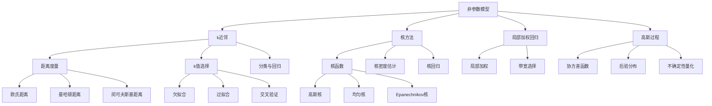

# 19.7 非参数模型

## 一、背景与动机

### 1.1 参数模型 vs 非参数模型

在机器学习中，模型可以分为两大类：**参数模型**（Parametric Models）和**非参数模型**（Nonparametric Models）。

**参数模型**（如线性回归、逻辑回归）使用固定数量的参数来概括数据信息。一旦参数被估计，训练数据就可以被丢弃。参数模型的复杂度是固定的，不随训练数据量的增加而增加。

**非参数模型**则不同：它们无法用固定数量的参数来表示。模型的复杂度随着训练数据的增加而增加。非参数模型也被称为**基于实例的学习**（Instance-based Learning）或**基于记忆的学习**（Memory-based Learning），因为它们保留了训练数据本身作为模型的一部分。

### 1.2 为什么需要非参数模型

参数模型面临一个根本性的限制：模型复杂度是固定的。当数据量很大时，强行用少量参数来表示数据可能丢失重要信息。非参数模型提供了更大的灵活性：

**优势一：数据驱动的复杂度**

非参数模型的复杂度自动适应数据量。数据越多，模型越复杂，能够捕捉更精细的模式。

**优势二：无分布假设**

非参数模型不对数据的分布做任何假设，能够适应各种复杂的数据结构。

**优势三：局部适应性**

非参数模型（如k近邻）可以适应数据的不同区域有不同的复杂度。

**局限性**：
- 预测时需要存储所有训练数据（或大部分）
- 预测时间可能较长（需要搜索或计算）
- 高维数据面临"维度灾难"

### 1.3 非参数方法的历史

k近邻算法可以追溯到1951年Fix和Hodges的工作。核方法在60年代由Parzen和Rosenblatt发展。局部加权回归在70年代由Cleveland提出。这些方法虽然在深度学习时代似乎不那么"时髦"，但在特定领域（如地理信息系统、推荐系统）仍然非常重要。

## 二、知识逻辑图谱

## 三、核心概念与数学分析

### 3.1 k近邻算法

**基本思想**：给定查询点 $x_q$，找到训练集中与它最接近的 $k$ 个样例，基于这些邻居进行预测。

**距离度量**：

**闵可夫斯基距离**（$L^p$范数）：

$$L^p(x_j, x_q) = \left(\sum_{i} |x_{j,i} - x_{q,i}|^p\right)^{1/p}$$

特殊情况：
- $p=1$：曼哈顿距离（$L_1$）
- $p=2$：欧氏距离（$L_2$）
- $p=\infty$：切比雪夫距离

**分类**：

$$h(x_q) = \arg\max_{c} \sum_{x_j \in NN(k, x_q)} \mathbb{I}(y_j = c)$$

即选择 $k$ 个邻居中最常见的类别。

**回归**：

$$h(x_q) = \frac{1}{k} \sum_{x_j \in NN(k, x_q)} y_j$$

即 $k$ 个邻居输出的平均值。

**k值选择**：

- $k=1$：最近邻，高方差，容易过拟合
- $k$ 很大：低方差，可能欠拟合
- 通常通过交叉验证选择最优 $k$

### 3.2 核方法

**核密度估计**（Kernel Density Estimation, KDE）：

$$\hat{f}(x) = \frac{1}{Nh} \sum_{j=1}^{N} K\left(\frac{x - x_j}{h}\right)$$

其中 $K$ 是核函数，$h$ 是带宽参数。

**常用核函数**：

1. **高斯核**：
   $$K(u) = \frac{1}{\sqrt{2\pi}} e^{-u^2/2}$$

2. **均匀核**：
   $$K(u) = \frac{1}{2} \mathbb{I}(|u| \leq 1)$$

3. **Epanechnikov核**：
   $$K(u) = \frac{3}{4}(1 - u^2) \mathbb{I}(|u| \leq 1)$$

**核回归**（Nadaraya-Watson估计）：

$$h(x) = \frac{\sum_{j=1}^{N} K_h(x - x_j) y_j}{\sum_{j=1}^{N} K_h(x - x_j)}$$

这是加权平均，权重由核函数决定。

**带宽选择**：

- $h$ 太小：估计方差大（过拟合）
- $h$ 太大：估计偏差大（欠拟合）
- 可以通过交叉验证或规则（如Silverman规则）选择

### 3.3 局部加权回归

**基本思想**：在查询点 $x_q$ 附近拟合一个局部模型（通常是线性模型），距离 $x_q$ 越近的样例权重越大。

**加权最小二乘**：

$$\min_{w} \sum_{j=1}^{N} W(x_q, x_j) (y_j - w^T x_j)^2$$

其中 $W(x_q, x_j)$ 是权重函数，通常使用核函数：

$$W(x_q, x_j) = K_h(||x_q - x_j||)$$

**局部线性回归**：

在每个查询点 $x_q$ 处，求解：

$$\min_{w_0, w_1} \sum_{j=1}^{N} K_h(x_q - x_j) (y_j - (w_0 + w_1 x_j))^2$$

预测：$h(x_q) = w_0 + w_1 x_q$

### 3.4 高斯过程

**定义**：高斯过程是随机变量的集合，其中任意有限个随机变量的联合分布都是高斯分布。

**函数空间视角**：高斯过程定义了函数的先验分布。给定训练数据后，可以得到函数的后验分布。

**核函数（协方差函数）**：

高斯过程由均值函数 $m(x)$ 和协方差函数 $k(x, x')$ 完全确定：

$$f(x) \sim \mathcal{GP}(m(x), k(x, x'))$$

常用协方差函数：

1. **平方指数（RBF）核**：
   $$k(x, x') = \sigma^2 \exp\left(-\frac{||x - x'||^2}{2l^2}\right)$$

2. **Matérn核**：更灵活的核函数族

**预测**：

给定训练数据 $(X, y)$ 和测试点 $x_*$，后验分布为：

$$p(f_* | X, y, x_*) = \mathcal{N}(\mu_*, \sigma_*^2)$$

其中：

$$\mu_* = k_*^T (K + \sigma_n^2 I)^{-1} y$$

$$\sigma_*^2 = k(x_*, x_*) - k_*^T (K + \sigma_n^2 I)^{-1} k_*$$

$K$ 是训练点的协方差矩阵，$k_*$ 是测试点与训练点的协方差向量。

**优势**：提供预测的不确定性量化

## 四、定理与证明

### 4.1 k近邻的一致性定理

**定理**：当 $N \to \infty$，$k \to \infty$，且 $k/N \to 0$ 时，k近邻分类器收敛于贝叶斯最优分类器。

**证明概要**：

1. 当 $N \to \infty$ 时，$k$ 个最近邻收敛于 $x_q$
2. 当 $k \to \infty$ 时，邻居的投票收敛于期望
3. 因此预测收敛于 $E[y|x=x_q] = P(y=1|x=x_q)$

$\square$

### 4.2 核密度估计的偏差-方差分解

**定理**：核密度估计的均方误差可以分解为：

$$\text{MSE}(\hat{f}(x)) = \text{Bias}^2 + \text{Variance} + O(h^4 + \frac{1}{Nh})$$

其中：
- 偏差 $\propto h^2$（带宽越大，偏差越大）
- 方差 $\propto \frac{1}{Nh}$（带宽越大，方差越小）

**最优带宽**：$h^* \propto N^{-1/5}$

### 4.3 高斯过程的边际似然

**定理**：高斯过程的边际似然（证据）有闭式解：

$$\log p(y|X) = -\frac{1}{2} y^T K_y^{-1} y - \frac{1}{2} \log|K_y| - \frac{N}{2} \log(2\pi)$$

其中 $K_y = K + \sigma_n^2 I$。

**证明**：

由于 $y \sim \mathcal{N}(0, K_y)$，直接代入多元高斯分布的对数似然公式。$\square$

## 五、具体示例

### 5.1 k近邻分类示例

**数据**：二维平面上的两类点

类A（蓝色）：(1, 2), (2, 3), (3, 1)

类B（红色）：(6, 5), (5, 6), (7, 4)

**查询点**：$x_q = (4, 4)$

**计算距离**（欧氏距离）：

- $d(x_q, (3,1)) = \sqrt{1 + 9} = 3.16$
- $d(x_q, (2,3)) = \sqrt{4 + 1} = 2.24$
- $d(x_q, (5,6)) = \sqrt{1 + 4} = 2.24$
- $d(x_q, (6,5)) = \sqrt{4 + 1} = 2.24$

**k=3近邻**：(2,3) A, (5,6) B, (6,5) B

**预测**：B（2票 vs 1票）

### 5.2 核密度估计示例

**数据**：1, 2, 3, 4, 5（5个点）

**带宽**：$h = 1$

**在 x = 3 处的密度估计**（高斯核）：

$$\hat{f}(3) = \frac{1}{5 \times 1} \sum_{j=1}^{5} \frac{1}{\sqrt{2\pi}} e^{-(3-x_j)^2/2}$$

$$= \frac{1}{5\sqrt{2\pi}} [e^{-4} + e^{-1} + e^{0} + e^{-1} + e^{-4}]$$

$$\approx \frac{1}{12.53} [0.018 + 0.368 + 1 + 0.368 + 0.018]$$

$$\approx \frac{1.772}{12.53} \approx 0.141$$

### 5.3 高斯过程回归示例

**训练数据**：(0, 0), (1, 1), (2, 0)

**核函数**：RBF核，$l=1$，$\sigma=1$

**在 x = 1.5 处的预测**：

计算协方差矩阵和向量，代入预测公式：

$$\mu_* = k_*^T (K + \sigma_n^2 I)^{-1} y$$

假设 $\sigma_n = 0.1$，计算得：

$$\mu_* \approx 0.6$$

$$\sigma_* \approx 0.3$$

预测：$f(1.5) \sim \mathcal{N}(0.6, 0.3^2)$

## 六、一句话本质

**非参数模型本质上是通过保留训练数据本身并基于局部相似性（距离或核函数加权）进行预测的方法，其复杂度随数据量自适应增长，能够灵活适应复杂数据结构但面临维度灾难和计算效率挑战。**

## 七、总结与反思

### 7.1 核心要点回顾

1. **k近邻**：基于局部相似性进行预测，k值控制偏差-方差权衡，距离度量影响邻居选择。

2. **核方法**：通过核函数加权实现平滑估计，带宽选择是关键，影响估计的平滑程度。

3. **局部加权回归**：在查询点附近拟合局部模型，结合线性和非参数的优点。

4. **高斯过程**：提供概率框架下的非参数回归，能够量化预测不确定性。

5. **维度灾难**：非参数方法在高维空间面临挑战，需要降维或特殊核函数。

### 7.2 与其他章节的联系

- 与**19.2节**的联系：非参数模型是监督学习的另一种范式
- 与**19.3节**的联系：决策树可以看作自适应的局部模型
- 与**19.6节**的联系：局部加权回归结合线性和非参数方法
- 与**21章**的联系：高斯过程与神经网络的关系（无限宽神经网络等价于高斯过程）

### 7.3 批判性思考

**问题1**：非参数方法是否总是比参数方法好？

**思考**：
- **数据量小**：参数方法更好（非参数方法需要大量数据）
- **数据量大**：非参数方法可以捕捉更复杂的模式
- **维度高**：参数方法通常更好（非参数方法面临维度灾难）
- **解释性**：参数方法通常更可解释

**问题2**：如何选择k近邻中的k值？

**思考**：
- **交叉验证**：最可靠的方法
- **启发式**：$k = \sqrt{N}$ 是一个常用启发式
- **奇数**：对于二分类，选择奇数k避免平局
- **问题相关**：不同问题可能需要不同的k

**问题3**：高斯过程与神经网络相比有什么优劣？

**思考**：

| 特性 | 高斯过程 | 神经网络 |
|-----|---------|---------|
| 训练 | 矩阵求逆（$O(N^3)$） | 梯度下降（$O(N)$每轮） |
| 预测 | 随N增长 | 固定时间 |
| 不确定性 | 自然提供 | 需要额外方法（如MC Dropout） |
| 大数据 | 难以扩展 | 可以扩展 |
| 特征学习 | 需要手工设计核 | 自动学习 |

### 7.4 前沿展望

1. **可扩展高斯过程**：稀疏高斯过程、随机变分推断使GP适用于大数据
2. **深度核学习**：结合神经网络和高斯过程
3. **神经正切核**：理解神经网络训练的核视角
4. **度量学习**：学习最优距离度量用于k近邻

非参数模型虽然在深度学习时代不那么主流，但在小数据、不确定性量化和理论分析方面仍然具有重要价值。理解这些方法的原理和适用场景，对于全面掌握机器学习至关重要。
