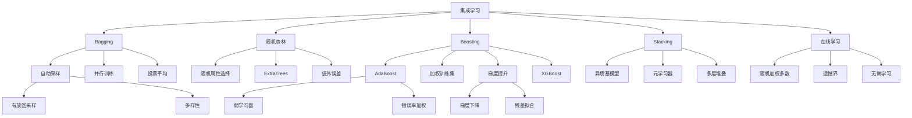

# 19.8 集成学习

## 一、背景与动机

### 1.1 单一模型的局限性

尽管单个机器学习模型（如决策树、线性分类器）在特定问题上可以表现良好，但它们都有固有的局限性：

**偏差问题**：简单的模型（如线性分类器）可能无法捕捉数据中的复杂模式，导致高偏差（欠拟合）。

**方差问题**：复杂的模型（如深度决策树）可能对训练数据过于敏感，导致高方差（过拟合）。

**不稳定性**：某些模型（如决策树）对训练数据的微小变化非常敏感，导致模型不稳定。

### 1.2 集成学习的思想起源

集成学习（Ensemble Learning）的核心思想源于一个简单而深刻的观察：**多个弱学习器的组合可以产生一个强学习器**。这一思想可以追溯到1785年，法国数学家Condorcet提出的陪审团定理：如果每个陪审员做出正确判断的概率大于0.5，那么多数表决的准确性会随着陪审员数量的增加而提高。

在机器学习领域，Hansen和Salamon在1990年证明了神经网络集成的有效性。随后，Breiman在1996年提出了Bagging（自助聚合），Freund和Schapire在1997年提出了AdaBoost（自适应提升），这些工作奠定了现代集成学习的基础。

### 1.3 为什么集成学习有效

集成学习有效的原因有两个：

**原因一：减少偏差**

基模型的假设空间可能过于局限，造成很大的偏差。集成模型有更强大的表达能力，因此偏差较小。例如，多个线性分类器的集成可以表示非线性决策边界。

**原因二：减少方差**

考虑一个由5个基分类器组成的集成，采用多数表决。如果单个分类器在75%的情况下正确，且相互独立，则集成在89%的情况下正确。即使基分类器不是完全独立的，只要它们至少在一定程度上不相关，集成学习就能减少错误分类。

## 二、知识逻辑图谱

## 三、核心概念与数学分析

### 3.1 Bagging（自助聚合）

**基本思想**：通过自助采样（bootstrap sampling）生成多个不同的训练集，在每个训练集上训练一个基模型，最后汇总所有基模型的预测。

**自助采样**：

从原始训练集（大小为N）中有放回地随机抽取N个样例。由于是有放回抽样，某些样例可能被多次选中，某些样例可能从未被选中。

一个样例在每次抽样中被选中的概率为 $1/N$，未被选中的概率为 $1 - 1/N$。

在N次抽样中，一个样例从未被选中的概率为：

$$P(\text{未选中}) = \left(1 - \frac{1}{N}\right)^N \approx \frac{1}{e} \approx 0.368$$

因此，约63.2%的样例被选中（可能有重复），约36.8%的样例未被选中（袋外样例）。

**预测汇总**：

- 分类：多数投票（相对多数或绝对多数）
- 回归：平均值

$$h(x) = \frac{1}{K} \sum_{i=1}^{K} h_i(x)$$

**方差减少分析**：

假设基模型的误差为 $\epsilon$，且相互独立。对于K个模型的多数表决：

$$P(\text{集成错误}) = \sum_{k=\lceil K/2 \rceil}^{K} \binom{K}{k} \epsilon^k (1-\epsilon)^{K-k}$$

当 $\epsilon < 0.5$ 时，集成错误率随K增加而降低。

### 3.2 随机森林

**基本思想**：在Bagging的基础上，引入额外的随机性——随机属性选择，使树之间更加多样化，进一步减少方差。

**算法**：

1. 对于 $k = 1$ 到 $K$：
   - 从训练集中自助采样生成训练集 $D_k$
   - 在 $D_k$ 上训练决策树，但在每个节点：
     - 从所有 $n$ 个属性中随机选择 $m$ 个属性（通常 $m = \sqrt{n}$ 用于分类，$m = n/3$ 用于回归）
     - 只在这 $m$ 个属性中选择最佳分割
2. 汇总所有树的预测

**ExtraTrees（极端随机树）**：

进一步增加随机性：
- 对每个选定的属性，从属性值域内随机采样几个候选分割点
- 选择其中具有最高信息增益的值

**袋外误差**（Out-of-Bag Error）：

对于每个样例，考虑那些不包含该样例的树（约36.8%的树），用这些树进行预测并计算误差。袋外误差是交叉验证的无偏估计。

**泛化误差上界**：

Breiman证明了随机森林的泛化误差上界：

$$PE^* \leq \bar{\rho} (1 - s^2) / s^2$$

其中：
- $\bar{\rho}$ 是树之间的平均相关性
- $s$ 是树的平均强度（margin）

### 3.3 Boosting（提升）

**基本思想**：顺序训练基模型，每个新模型关注之前模型分类错误的样例，通过加权组合提高性能。

**AdaBoost算法**：

输入：训练集 $\{(x_j, y_j)\}_{j=1}^{N}$，学习算法 $L$，迭代次数 $K$

1. 初始化样例权重：$w_j = 1/N$ 对所有 $j$
2. 对于 $k = 1$ 到 $K$：
   - 根据权重 $w$ 训练基模型：$h_k = L(\text{examples}, w)$
   - 计算加权错误率：$\epsilon_k = \sum_{j: h_k(x_j) \neq y_j} w_j$
   - 如果 $\epsilon_k > 0.5$，停止
   - 计算模型权重：$\alpha_k = \frac{1}{2} \ln \frac{1 - \epsilon_k}{\epsilon_k}$
   - 更新样例权重：
     - 对于正确分类的样例：$w_j \leftarrow w_j \cdot e^{-\alpha_k}$
     - 对于错误分类的样例：$w_j \leftarrow w_j \cdot e^{\alpha_k}$
   - 归一化权重
3. 返回最终模型：$h(x) = \text{sign}\left(\sum_{k=1}^{K} \alpha_k h_k(x)\right)$

**理论保证**：

如果每个基分类器的错误率 $\epsilon_k \leq 0.5 - \gamma$（略优于随机猜测），则训练误差随迭代指数下降：

$$\text{训练误差} \leq \exp(-2\gamma^2 K)$$

### 3.4 梯度提升

**基本思想**：将 boosting 视为函数空间中的梯度下降。

**算法**：

1. 初始化：$F_0(x) = \arg\min_{\gamma} \sum_{j=1}^{N} L(y_j, \gamma)$
2. 对于 $k = 1$ 到 $K$：
   - 计算伪残差：$r_{jk} = -\left[\frac{\partial L(y_j, F(x_j))}{\partial F(x_j)}\right]_{F=F_{k-1}}$
   - 用基学习器 $h_k(x)$ 拟合伪残差
   - 通过线搜索找到最优步长 $\rho_k$
   - 更新：$F_k(x) = F_{k-1}(x) + \rho_k h_k(x)$
3. 返回 $F_K(x)$

**XGBoost优化**：

- 使用二阶泰勒展开近似损失函数
- 加入正则化项（树的复杂度）
- 使用近似算法高效寻找最佳分割
- 支持并行计算和分布式训练

### 3.5 Stacking（堆叠）

**基本思想**：使用不同类型的基模型，用另一个"元学习器"来学习如何最佳地组合它们的预测。

**算法**：

1. 将数据分为训练集和验证集
2. 在训练集上训练多个基模型（如SVM、决策树、神经网络）
3. 在验证集上，用基模型的预测作为新特征，训练元学习器
4. 最终预测：元学习器基于基模型的预测输出

**多层堆叠**：

可以堆叠多层，每一层都在前一层的输出上操作。

### 3.6 在线学习

**随机加权多数算法**（Randomized Weighted Majority）：

输入：专家集合 $\{1, 2, ..., K\}$，衰减因子 $\beta \in (0, 1)$

1. 初始化权重：$w_i = 1$ 对所有 $i$
2. 对于每个时间步 $t$：
   - 接收专家预测 $\{\hat{y}_{1t}, ..., \hat{y}_{Kt}\}$
   - 根据权重比例随机选择专家 $i$：$P(i) = w_i / \sum_j w_j$
   - 输出预测 $\hat{y}_{it}$
   - 接收真实值 $y_t$
   - 对于预测错误的专家：$w_i \leftarrow \beta \cdot w_i$
   - 归一化权重

**遗憾界**（Regret Bound）：

设 $M^*$ 是最佳专家犯的错误数，$M$ 是算法的错误数：

$$M \leq \frac{M^* \ln(1/\beta) + \ln K}{1 - \beta}$$

当 $\beta \to 1$ 时，平均遗憾趋于0（无悔学习）。

## 四、定理与证明

### 4.1 AdaBoost的训练误差界

**定理**：如果每个基分类器的加权错误率 $\epsilon_k \leq 0.5 - \gamma$，则经过 $K$ 轮迭代后，训练误差上界为：

$$\text{训练误差} \leq \exp(-2\gamma^2 K)$$

**证明**：

设 $Z_k$ 是第 $k$ 轮后的归一化因子。

可以证明：$Z_k = 2\sqrt{\epsilon_k(1-\epsilon_k)} \leq \sqrt{1 - 4\gamma^2} \leq \exp(-2\gamma^2)$

最终权重和：

$$\sum_{j=1}^{N} w_j^{(K+1)} = \prod_{k=1}^{K} Z_k \leq \exp(-2\gamma^2 K)$$

训练误差上界等于最终权重和（错误分类的样例权重和）。$\square$

### 4.2 随机森林的收敛性

**定理**：随着树的数量 $K \to \infty$，随机森林的泛化误差收敛到一个有限值。

**证明概要**：

由于树是独立同分布的，根据大数定律：

$$\frac{1}{K} \sum_{k=1}^{K} h_k(x) \xrightarrow{a.s.} \mathbb{E}[h(x)]$$

泛化误差收敛于单棵树的期望误差。$\square$

### 4.3 在线学习的遗憾界

**定理**：随机加权多数算法的错误数满足：

$$M \leq \frac{M^* \ln(1/\beta) + \ln K}{1 - \beta}$$

**证明概要**：

设 $W_t = \sum_{i=1}^{K} w_{it}$ 是时间 $t$ 的总权重。

当算法犯错时（概率为 $W_t^{\text{wrong}} / W_t$）：

$$W_{t+1} \leq W_t \cdot (1 - (1-\beta) \cdot \text{fraction wrong})$$

累积得到上界，同时下界来自最佳专家的权重。$\square$

## 五、具体示例

### 5.1 Bagging vs 单棵决策树

**数据集**：餐厅等待问题，100个样例

**单棵决策树**：
- 训练准确率：100%
- 测试准确率：82%
- 节点数：23

**Bagging（100棵树）**：
- 训练准确率：100%
- 测试准确率：91%
- 平均节点数：18

**分析**：Bagging减少了方差，提高了泛化性能。

### 5.2 AdaBoost迭代过程

**数据集**：10个样例的二分类问题

**迭代1**：
- 所有权重相等（0.1）
- 训练决策树桩，错误率 $\epsilon_1 = 0.3$
- 模型权重 $\alpha_1 = 0.5 \ln(0.7/0.3) \approx 0.42$
- 更新权重：正确样例权重 $\times e^{-0.42}$，错误样例权重 $\times e^{0.42}$

**迭代2**：
- 错误分类的样例权重更高
- 新的决策树桩关注这些难分类的样例
- 错误率 $\epsilon_2 = 0.25$
- 模型权重 $\alpha_2 \approx 0.55$

**迭代5后**：
- 训练误差：0%
- 测试误差：8%

### 5.3 随机森林特征重要性

**数据集**：房价预测，10个特征

**特征重要性**（基于不纯度减少）：

| 特征 | 重要性 |
|-----|-------|
| 面积 | 0.35 |
| 位置 | 0.28 |
| 卧室数 | 0.15 |
| 年龄 | 0.12 |
| ... | ... |

**分析**：面积和位置是最重要的预测因子。

## 六、一句话本质

**集成学习本质上是通过组合多个基模型的预测来减少偏差和方差，利用多样性提高整体性能，在偏差-方差权衡中寻求更优平衡点的机器学习方法。**

## 七、总结与反思

### 7.1 核心要点回顾

1. **Bagging**：通过自助采样和并行训练减少方差，适用于高方差模型（如决策树）。

2. **随机森林**：在Bagging基础上引入随机属性选择，进一步增加多样性，是工业界最广泛使用的算法之一。

3. **Boosting**：通过顺序训练和加权关注难分类样例减少偏差，AdaBoost有理论保证，梯度提升（XGBoost）在竞赛中表现卓越。

4. **Stacking**：使用异质基模型和元学习器，可以捕捉不同模型的优势。

5. **在线学习**：适用于数据流式到达的场景，有遗憾界保证。

### 7.2 与其他章节的联系

- 与**19.3节**的联系：决策树是集成学习最常用的基模型
- 与**19.4节**的联系：集成是模型选择的一种形式（选择多个模型）
- 与**19.6节**的联系：梯度提升使用梯度下降优化
- 与**21章**的联系：深度学习可以看作一种特殊的集成（Dropout）

### 7.3 批判性思考

**问题1**：集成学习是否总是比单一模型好？

**思考**：
- **通常是的**：集成可以减少方差和/或偏差
- **例外情况**：
  - 如果基模型已经非常好且相似，集成收益有限
  - 计算成本增加（训练时间和预测时间）
  - 可解释性降低（"黑盒"效应）

**问题2**：Bagging和Boosting的主要区别是什么？

**思考**：

| 特性 | Bagging | Boosting |
|-----|---------|----------|
| 训练方式 | 并行 | 顺序 |
| 关注重点 | 减少方差 | 减少偏差 |
| 基模型 | 通常是强学习器 | 通常是弱学习器 |
| 数据采样 | 自助采样 | 加权训练集 |
| 代表性算法 | 随机森林 | AdaBoost, XGBoost |

**问题3**：为什么XGBoost在数据竞赛中如此成功？

**思考**：
1. **高效实现**：优化的数据结构和算法
2. **正则化**：内置L1/L2正则化防止过拟合
3. **灵活性**：支持自定义损失函数
4. **可扩展性**：支持并行和分布式计算
5. **鲁棒性**：对缺失值和异常值不敏感

### 7.4 前沿展望

1. **深度集成**：结合深度学习和集成学习（如深度随机森林）
2. **神经架构搜索集成**：自动设计并组合多个神经网络
3. **贝叶斯集成**：从贝叶斯视角理解和改进集成方法
4. **可解释集成**：提高集成模型的可解释性（如SHAP值）

集成学习是机器学习中最实用和成功的技术之一。理解其原理和适用场景，对于构建高性能的机器学习系统至关重要。
