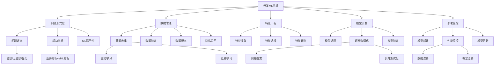

# 19.9 开发机器学习系统

## 一、背景与动机

### 1.1 从算法到系统的转变

早期的机器学习研究主要关注算法设计和理论分析。然而，随着机器学习在实际应用中的普及，人们逐渐认识到：**构建成功的机器学习系统不仅仅是选择正确的算法**。一个完整的机器学习项目涉及问题形式化、数据收集、特征工程、模型训练、部署监控等多个环节。

Google的研究表明，在实际的机器学习系统中，只有一小部分代码是用于模型训练的。大部分代码用于数据收集、验证、特征提取和基础设施。这一现象被称为"机器学习系统中的技术债务"——随着时间推移，系统复杂性不断增加，维护成本越来越高。

### 1.2 软件工程与机器学习的融合

传统的软件工程已经发展出一套成熟的方法论：需求分析、设计、编码、测试、部署、维护。然而，机器学习系统具有独特性：

**不确定性**：传统软件的行为是确定的，而机器学习系统的行为是基于数据的统计推断。

**数据依赖**：机器学习系统的性能严重依赖于数据质量，而数据会随时间变化。

**实验性**：机器学习开发是高度实验性的，需要尝试多种模型和超参数。

**反馈循环**：部署的系统会影响数据收集，形成反馈循环。

这些特性要求我们将软件工程的最佳实践与机器学习的特殊需求相结合。

### 1.3 工业界的需求驱动

工业界的机器学习应用推动了ML系统工程的发展：

- **规模化**：处理数十亿样例和数百万特征
- **实时性**：毫秒级预测延迟要求
- **可靠性**：99.99%以上的可用性要求
- **可解释性**：监管和业务需求
- **公平性**：避免偏见和歧视

这些需求催生了MLOps（机器学习运维）这一新兴领域。

## 二、知识逻辑图谱



## 三、核心概念与数学分析

### 3.1 问题形式化

**任务类型选择**：

给定业务问题，确定ML任务类型：

- **监督学习**：有标注数据可用
  - 分类：预测离散类别 $y \in \{1, 2, ..., K\}$
  - 回归：预测连续值 $y \in \mathbb{R}$
  
- **无监督学习**：无标注数据
  - 聚类：发现数据中的群组
  - 降维：减少特征维度
  
- **强化学习**：序贯决策问题
  - 最大化累积奖励

**损失函数设计**：

损失函数应与业务目标对齐：

$$L_{\text{business}} \approx L_{\text{ML}}$$

例如，在垃圾邮件检测中：
- 将正常邮件误判为垃圾邮件的代价远高于相反错误
- 使用非对称损失：$L(\text{normal}, \text{spam}) = 10 \cdot L(\text{spam}, \text{normal})$

### 3.2 数据管理

**数据收集策略**：

**主动学习**（Active Learning）：

当标注成本高昂时，智能选择最有价值的样例进行标注：

$$x^* = \arg\max_x \text{Uncertainty}(x)$$

不确定性度量：
- 熵：$H(y|x) = -\sum_c p(c|x) \log p(c|x)$
- 边缘采样：$1 - |p(c_1|x) - p(c_2|x)|$

**半监督学习**（Semi-supervised Learning）：

利用少量标注数据和大量未标注数据：

$$\min_f \sum_{i=1}^{l} L(y_i, f(x_i)) + \lambda \cdot \text{Consistency}(f, \{x_j\}_{j=l+1}^{l+u})$$

**弱监督学习**（Weakly Supervised Learning）：

当标注有噪声、不精确或不完整时：

$$\min_f \mathbb{E}_{(x, \tilde{y}) \sim \tilde{P}}[L(\tilde{y}, f(x))]$$

其中 $\tilde{y}$ 是噪声标签。

**数据验证**：

**模式验证**：
- 特征分布：$P(x_i) \approx P_{\text{reference}}(x_i)$
- 相关性：$\text{Corr}(x_i, x_j)$ 在合理范围内
- 缺失值比例：$\frac{\#\text{missing}}{N} < \theta$

**异常检测**：

使用统计检验或机器学习检测异常数据点：

$$\text{Anomaly Score}(x) = ||x - \mu||_{\Sigma^{-1}}^2$$

### 3.3 特征工程

**特征提取**：

从原始数据中提取有意义的特征：

- **数值特征**：标准化、归一化
  $$x' = \frac{x - \mu}{\sigma}$$

- **类别特征**：One-hot编码、嵌入
  $$\text{OneHot}(c) = [0, ..., 1, ..., 0]$$

- **文本特征**：TF-IDF、词嵌入
  $$\text{TF-IDF}(t, d) = \text{tf}(t, d) \cdot \text{idf}(t)$$

- **时间特征**：提取年、月、日、星期、节假日等

**特征选择**：

**过滤法**（Filter）：基于统计检验
- 信息增益：$IG(Y, X) = H(Y) - H(Y|X)$
- 卡方检验：$\chi^2 = \sum \frac{(O - E)^2}{E}$

**包装法**（Wrapper）：基于模型性能
- 前向选择：逐步添加最有用的特征
- 后向消除：逐步移除最无用的特征

**嵌入法**（Embedded）：内置于模型
- L1正则化自动选择特征
- 树模型的特征重要性

**特征转换**：

**降维**：
- PCA：保留最大方差的方向
  $$W = \arg\max_{W^TW=I} \text{Tr}(W^T X^T X W)$$
  
- 自动编码器：神经网络学习压缩表示

**特征交叉**：
- 多项式特征：$x_i \cdot x_j$
- 离散化：将连续值分箱

### 3.4 模型开发与验证

**超参数优化**：

**贝叶斯优化**：

$$x^* = \arg\min_{x \in \mathcal{X}} f(x)$$

其中 $f(x)$ 是使用超参数 $x$ 的模型验证误差。

采集函数（Expected Improvement）：

$$\text{EI}(x) = \mathbb{E}[\max(f^* - f(x), 0)]$$

**交叉验证策略**：

**时间序列交叉验证**：

对于时间序列数据，必须使用基于时间的划分：

```
训练：[1], 验证：[2]
训练：[1,2], 验证：[3]
训练：[1,2,3], 验证：[4]
...
```

**分层交叉验证**：

保持类别比例：

$$P(y|D_{\text{train}}) \approx P(y|D_{\text{val}}) \approx P(y|D)$$

### 3.5 部署与监控

**模型部署模式**：

**在线预测**（Online）：
- 实时响应（毫秒级延迟）
- 使用模型服务框架（TensorFlow Serving, TorchServe）

**批量预测**（Batch）：
- 定期处理大量数据
- 使用数据处理框架（Spark, Hadoop）

**边缘部署**（Edge）：
- 在移动设备或IoT设备上运行
- 模型压缩和量化

**性能监控**：

**数据漂移检测**：

输入分布变化：

$$D_{\text{KL}}(P_{\text{train}}(x) || P_{\text{prod}}(x)) > \epsilon$$

**概念漂移检测**：

$P(y|x)$ 变化：

$$|\text{Accuracy}_{\text{recent}} - \text{Accuracy}_{\text{baseline}}| > \theta$$

**模型更新策略**：

**定期重训练**：
- 每周/每月使用新数据重训练

**持续学习**：
- 在线更新模型参数
- 防止灾难性遗忘

## 四、定理与证明

### 4.1 主动学习的样本复杂度

**定理**：在适当条件下，主动学习可以将标注复杂度从 $O(1/\epsilon)$ 降低到 $O(\log(1/\epsilon))$。

**证明概要**：

主动学习优先选择靠近决策边界的样例。这些样例提供的信息量最大，因此可以用更少的样例达到相同的精度。

对于线性分类器，主动学习只需要 $O(\log(1/\epsilon))$ 个样例，而被动学习需要 $O(1/\epsilon)$ 个样例。$\square$

### 4.2 数据漂移的检测理论

**定理**：如果两个样本来自同一分布，则它们之间的统计距离应该很小。

**Kolmogorov-Smirnov检验**：

对于一维分布，KS统计量：

$$D_{n,m} = \sup_x |F_{1,n}(x) - F_{2,m}(x)|$$

在零假设下（同分布），$D_{n,m}$ 的分布是已知的，可以进行假设检验。$\square$

## 五、具体示例

### 5.1 推荐系统的开发流程

**问题定义**：
- 目标：为用户推荐可能感兴趣的物品
- 类型：可以是监督学习（预测评分）或强化学习（最大化点击）

**数据收集**：
- 用户行为日志：点击、购买、浏览
- 用户画像：年龄、性别、地理位置
- 物品特征：类别、价格、品牌

**特征工程**：
- 用户特征：历史平均评分、活跃度
- 物品特征：平均评分、流行度
- 交叉特征：用户类别偏好、时间特征

**模型选择**：
- 协同过滤：矩阵分解
- 内容推荐：基于物品特征
- 深度学习：神经协同过滤

**部署监控**：
- A/B测试：比较新旧模型的点击率
- 监控指标：CTR、转化率、多样性

### 5.2 数据漂移检测示例

**场景**：信用卡欺诈检测

**训练数据**（2023年1-6月）：
- 欺诈率：0.5%
- 平均交易金额：$150

**生产数据**（2023年7月）：
- 欺诈率：0.8%（概念漂移）
- 平均交易金额：$200（数据漂移）

**检测**：
- KS检验：交易金额分布 $p < 0.01$
- 准确率下降：从95%降到88%

**响应**：
- 触发模型重训练
- 调查漂移原因（新的欺诈模式？季节性变化？）

### 5.3 特征重要性分析

**数据集**：房价预测

**特征重要性**（基于随机森林）：

| 特征 | 重要性 | 备注 |
|-----|-------|-----|
| 面积 | 0.35 | 最重要 |
| 位置 | 0.28 | 次重要 |
| 卧室数 | 0.15 | 中等 |
| 年龄 | 0.12 | 中等 |
| 装修 | 0.08 | 较低 |
| 朝向 | 0.02 | 可移除 |

**行动**：
- 移除"朝向"特征（重要性太低）
- 对"面积"和"位置"进行更细粒度的特征工程

## 六、一句话本质

**开发机器学习系统本质上是一个将业务问题转化为可学习的数学问题，并通过数据管理、特征工程、模型开发和持续监控的迭代循环，构建可靠、可扩展且与业务目标一致的生产级智能系统的工程化过程。**

## 七、总结与反思

### 7.1 核心要点回顾

1. **问题形式化**：明确业务目标，选择合适的ML任务类型，设计对齐业务目标的损失函数。

2. **数据管理**：主动学习降低标注成本，数据验证确保质量，隐私和公平性保护用户权益。

3. **特征工程**：特征提取、选择和转换是提升模型性能的关键步骤，通常比算法选择更重要。

4. **模型开发**：超参数优化（贝叶斯优化）、交叉验证策略（时间序列、分层）确保模型泛化。

5. **部署监控**：在线/批量/边缘部署模式，数据漂移和概念漂移检测，模型更新策略。

### 7.2 与其他章节的联系

- 与**19.1-19.8节**的联系：本节将前面介绍的理论和算法应用于实际系统开发
- 与**27章**的联系：涉及AI的伦理、隐私和公平性问题
- 与**21章**的联系：深度学习系统开发的特殊考虑

### 7.3 批判性思考

**问题1**：特征工程是否会被深度学习取代？

**思考**：
- **传统观点**：深度学习自动学习特征，不需要手工特征工程
- **现实情况**：
  - 结构化数据：特征工程仍然重要
  - 领域知识：可以帮助设计更好的网络架构
  - 数据稀缺：特征工程可以弥补数据不足
  - 可解释性：手工特征更易解释

**问题2**：如何平衡模型复杂度和系统复杂度？

**思考**：
- **简单模型**（线性回归、决策树）：
  - 易于部署和维护
  - 预测速度快
  - 可能牺牲一些性能
  
- **复杂模型**（深度学习、集成）：
  - 性能更好
  - 需要更多计算资源
  - 更难调试和维护

**选择原则**：从简单开始，仅在必要时增加复杂度。

**问题3**：MLOps与传统DevOps的主要区别是什么？

**思考**：

| 方面 | DevOps | MLOps |
|-----|--------|-------|
| 版本控制 | 代码版本 | 代码+数据+模型版本 |
| 测试 | 单元测试、集成测试 | 模型性能测试、数据验证 |
| 监控 | 系统指标 | 数据漂移、模型性能 |
| 回滚 | 代码回滚 | 模型回滚 |
| 可重复性 | 确定性 | 随机性（种子管理） |

### 7.4 前沿展望

1. **AutoML自动化**：自动特征工程、自动模型选择、自动超参数优化
2. **联邦学习**：分布式训练，数据不离开本地
3. **可解释AI**：模型解释工具（SHAP、LIME）的标准化集成
4. **持续学习**：模型能够持续适应新数据而不遗忘旧知识
5. **ML工程平台**：端到端的ML开发平台（Vertex AI, SageMaker, Azure ML）

开发机器学习系统是一门结合科学、工程和艺术的综合学科。掌握这些实践技能，对于将机器学习从研究转化为实际价值至关重要。
