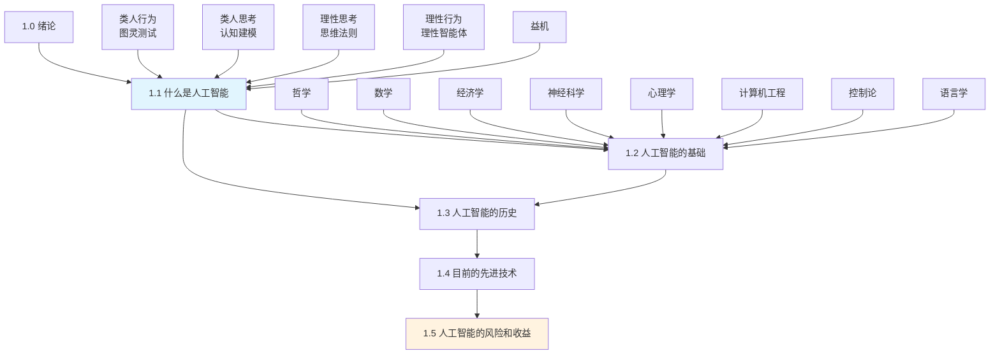

# 第1章 绪论 - 概览

## 学习目标

完成本章学习后，你应该能够：

1. **理解人工智能的多元定义**，区分类人行为/类人思考与理性思考/理性行为这两组维度，掌握四种研究方法的异同
2. **梳理人工智能的跨学科基础**，了解哲学、数学、经济学、神经科学、心理学、计算机工程、控制论和语言学如何为AI提供理论支撑
3. **把握人工智能发展的历史脉络**，从图灵测试到达特茅斯会议，从专家系统到深度学习的演进历程
4. **认识当前AI技术的应用领域**，包括自动驾驶、机器翻译、医疗诊断、博弈等前沿应用
5. **思考AI的风险与伦理问题**，理解价值对齐问题、有益机器的概念以及AI带来的社会挑战

---

## 本章速览

本章作为《人工智能：现代方法》的开篇，系统性地构建了AI的全景图。从四种研究AI的方法（图灵测试、认知建模、思维法则、理性智能体）出发，深入探讨支撑AI的八大学科基础，追溯从1943年神经网络诞生到2020年代深度学习的完整历史，展示当前AI在各行各业的突破性应用，最后引导读者思考AI发展带来的风险与收益。本章不仅是知识地图，更是一扇通往AI思维方式的门户。

---

## 难度预警 ⚠️

| 章节 | 难度 | 说明 |
|------|------|------|
| 1.1 什么是人工智能 | ⭐⭐ | 概念辨析为主，需理解四种方法的差异 |
| 1.2 人工智能的基础 | ⭐⭐⭐ | 涉及哲学、数学等多学科知识，建议结合自身背景选择性深入 |
| 1.3 人工智能的历史 | ⭐⭐ | 时间线较长，人物和事件较多，需要系统记忆 |
| 1.4 目前的先进技术 | ⭐ | 以了解现状为主，内容相对直观 |
| 1.5 人工智能的风险和收益 | ⭐⭐⭐ | 涉及哲学思辨和未来预测，开放性较强 |

**本章难点：**
- 区分"类人"与"理性"、"思维"与"行为"的二维分类框架
- 理解价值对齐问题及其对AI标准模型的挑战
- 把握不同历史阶段AI方法论的演变逻辑

---

## 前置知识

阅读本章前，建议具备以下背景知识：

- **基础逻辑概念**：命题逻辑、推理规则（用于理解1.1.3节）
- **概率论基础**：概率的基本概念（有助于理解不确定性推理）
- **计算机科学基础**：算法、计算复杂度的基本概念
- **生物学常识**：神经元的基本结构和功能

**无需高深的数学背景**，本章以概念介绍为主。

---

## 节依赖图



---

## 核心概念清单

### 基础概念
| 概念 | 定义 | 章节 |
|------|------|------|
| **人工智能 (AI)** | 构建能够在各种情况下有效和安全行动的机器智能体的领域 | 1.1 |
| **智能体 (Agent)** | 能够采取行动的东西；能自主运行、感知环境、适应变化并制定目标的系统 | 1.1.4 |
| **理性智能体 (Rational Agent)** | 为取得最佳结果或最佳期望结果而采取行动的智能体 | 1.1.4 |
| **图灵测试** | 如果人类提问者无法区分书面回答来自人还是计算机，则计算机通过测试 | 1.1.1 |
| **完全图灵测试** | 需要与真实世界对象和人进行交互的图灵测试变体 | 1.1.1 |
| **认知科学** | 结合AI计算机模型和心理学实验技术研究人类心智的跨学科领域 | 1.1.2 |
| **标准模型** | AI专注于构建做正确事情的智能体，其中"正确"由人类提供的目标定义 | 1.1.4 |
| **价值对齐问题** | 施加给机器的目标必须与人类真实需求一致的问题 | 1.1.5 |
| **有益机器** | 对人类可证有益的智能体，意识到自身目标不确定性而谨慎行动 | 1.1.5 |

### 历史术语
| 概念 | 定义 | 章节 |
|------|------|------|
| **达特茅斯会议 (1956)** | 被公认为AI学科诞生的里程碑会议 | 1.3.1 |
| **物理符号系统假说** | 纽厄尔和西蒙提出：物理符号系统具有进行一般智能动作的必要和充分方法 | 1.3.2 |
| **弱方法** | 基于通用搜索机制的通用问题求解方法 | 1.3.4 |
| **专家系统** | 使用大量领域特定规则的知识密集型系统 | 1.3.4 |
| **联结主义** | 使用多层神经网络的机器学习方法 | 1.3.5 |
| **深度学习** | 使用多层简单可调整计算单元的机器学习 | 1.3.8 |

---

## 核心要点速查表

### 四种AI研究方法对比

| 维度 | 类人行为 | 类人思考 | 理性思考 | 理性行为 |
|------|----------|----------|----------|----------|
| **关注点** | 外部行为 | 内部思维 | 逻辑推理 | 最优行动 |
| **测试标准** | 图灵测试 | 与人类思维过程比较 | 思维法则的正确性 | 理性选择 |
| **主要工具** | NLP、知识表示、机器学习 | 认知建模、心理实验 | 形式逻辑、概率论 | 智能体理论、决策论 |
| **代表工作** | 自然语言对话系统 | GPS问题求解器 | 定理证明器 | 自主机器人 |
| **学科联系** | 心理学、语言学 | 认知科学 | 数学逻辑、统计学 | 经济学、控制论 |

### AI的八大学科基础

| 学科 | 核心问题 | 对AI的贡献 | 关键人物 |
|------|----------|-----------|----------|
| **哲学** | 思维如何从物质大脑产生？ | 理性思维法则、知识来源 | 亚里士多德、笛卡尔、休谟 |
| **数学** | 什么可以被计算？ | 形式逻辑、概率论、可计算性 | 布尔、图灵、哥德尔 |
| **经济学** | 如何根据偏好做决定？ | 决策论、博弈论、效用理论 | 冯·诺依曼、西蒙 |
| **神经科学** | 大脑如何处理信息？ | 神经元模型、脑机接口 | 卡哈尔、赫布 |
| **心理学** | 人类如何思考和行为？ | 认知心理学、信息处理模型 | 克雷克、乔姆斯基 |
| **计算机工程** | 如何构建高效计算机？ | 硬件发展、编程语言 | 图灵、冯·诺依曼 |
| **控制论** | 人造物如何自主运行？ | 反馈控制、最优控制 | 维纳、麦克斯韦 |
| **语言学** | 语言如何与思维联系？ | 形式语言、计算语言学 | 乔姆斯基 |

### AI发展简史

| 时期 | 阶段 | 主要特征 | 代表成果 |
|------|------|----------|----------|
| 1943-1956 | 诞生期 | 神经网络、图灵测试、达特茅斯会议 | SNARC、LT程序 |
| 1952-1969 | 早期热情期 | 微世界、GPS、感知机 | Shakey、积木世界 |
| 1966-1973 | 现实期 | 组合爆炸、第一次AI寒冬 | 莱特希尔报告 |
| 1969-1986 | 专家系统期 | 知识工程、商业应用 | Mycin、R1系统 |
| 1986-至今 | 神经网络回归 | 反向传播、深度学习 | CNN、AlphaGo |
| 1987-至今 | 概率与机器学习 | 概率推理、贝叶斯网络 | HMM、SVM |
| 2001-至今 | 大数据时代 | 海量数据、互联网 | ImageNet、Watson |
| 2011-至今 | 深度学习爆发 | GPU、多层网络、端到端学习 | GPT、BERT、AlphaFold |

---

## 概念对比表

### 类人 vs 理性

| 对比维度 | 类人方法 | 理性方法 |
|----------|----------|----------|
| **目标** | 模拟人类智能 | 实现最优智能 |
| **评价标准** | 与人类行为/思维相似度 | 理性行为的最优性 |
| **优点** | 直观、易于验证（与人类比较） | 数学定义明确、普遍适用 |
| **缺点** | 人类未必总是最优 | 可能不符合人类直觉 |
| **适用场景** | 人机交互、用户体验 | 决策系统、自主智能体 |

### 思维 vs 行为

| 对比维度 | 关注思维过程 | 关注外部行为 |
|----------|--------------|--------------|
| **研究内容** | 内部推理、知识表示 | 输入输出映射、行动效果 |
| **方法** | 认知建模、逻辑分析 | 行为观察、性能测试 |
| **可观测性** | 难以直接观察 | 直接可测量 |
| **与心理学关系** | 密切（认知心理学） | 密切（行为主义） |

### 标准模型 vs 有益机器

| 对比维度 | 标准模型 | 有益机器模型 |
|----------|----------|--------------|
| **目标设定** | 人类完全指定 | 机器不确定人类目标 |
| **机器行为** | 追求固定目标 | 寻求许可、观察学习 |
| **风险** | 目标错误导致严重后果 | 更加谨慎、允许人工干预 |
| **理论基础** | 优化理论 | 辅助博弈、逆强化学习 |

---

## 常见误解澄清

### ❌ 误解1：AI的目标是制造能通过图灵测试的机器
**✅ 正确理解：** 虽然图灵测试是AI历史上的重要概念，但现代AI研究人员更关注理解智能的基本原理，而非通过测试本身。正如航空工程不追求制造"骗过鸽子的机器"，AI也不把通过图灵测试作为主要目标。

### ❌ 误解2：AI就是要让计算机像人一样思考
**✅ 正确理解：** 模拟人类思维只是AI的四种方法之一。理性行为方法（理性智能体）强调做正确的事，而非模仿人类。事实上，人类思维可能存在偏见和错误，理性方法追求的是最优解。

### ❌ 误解3：AI是计算机科学的分支，与其他学科关系不大
**✅ 正确理解：** AI是高度跨学科的领域，与哲学、数学、经济学、神经科学、心理学、语言学等都有深厚联系。理解这些基础对深入学习AI至关重要。

### ❌ 误解4：AI的发展是线性的、持续的进步
**✅ 正确理解：** AI发展呈现"热潮-寒冬"的周期性波动，经历了多次乐观与失望的交替。历史上有过两次主要的人工智能寒冬（1970年代和1980年代末）。

### ❌ 误解5：只要计算机足够快，就能实现完美智能
**✅ 正确理解：** 计算速度不是唯一限制。存在计算复杂性问题（NP完全性），某些问题本质上是难解的。此外，智能还需要概念突破和正确的理论基础，而非单纯依赖算力。

### ❌ 误解6：给AI设定明确目标就能确保安全
**✅ 正确理解：** 这正是迈达斯国王问题。过于"聪明"地追求固定目标可能导致意想不到的后果（如国际象棋AI可能选择催眠对手）。价值对齐和有益机器的概念强调了目标不确定性的重要性。

---

## 本章测验

### 题目1
**以下哪种方法强调"做正确的事情"而非"像人类一样做"？**

A. 图灵测试方法  
B. 认知建模方法  
C. 思维法则方法  
D. 理性智能体方法  

<details>
<summary>答案</summary>

**答案：D**

理性智能体方法关注采取最优行动以取得最佳结果，而非模拟人类思维或行为。这是AI的"标准模型"的基础。
</details>

---

### 题目2
**1956年达特茅斯会议的主要贡献是什么？**

A. 发明了第一台神经网络计算机  
B. 正式确立了"人工智能"这一学科名称  
C. 提出了图灵测试  
D. 开发了第一个专家系统  

<details>
<summary>答案</summary>

**答案：B**

达特茅斯会议被广泛认为是AI学科诞生的里程碑，会议召集了当时的主要研究人员，确立了人工智能的研究方向。第一台神经网络计算机SNARC诞生于1950年，图灵测试提出于1950年，第一个专家系统出现在1960年代后期。
</details>

---

### 题目3
**价值对齐问题是指什么？**

A. 确保AI系统的计算效率高  
B. 确保AI系统的价值观与人类一致  
C. 确保AI系统能处理多任务  
D. 确保AI系统能自我学习  

<details>
<summary>答案</summary>

**答案：B**

价值对齐问题（Value Alignment Problem）是指施加给机器的目标或价值必须与人类的真实需求和价值观一致。这是有益机器概念的核心问题。
</details>

---

### 题目4
**以下哪项不属于支撑AI的学科基础？**

A. 哲学  
B. 数学  
C. 化学  
D. 神经科学  

<details>
<summary>答案</summary>

**答案：C**

第1.2节详细讨论了八大基础学科：哲学、数学、经济学、神经科学、心理学、计算机工程、控制理论与控制论、语言学。化学虽然在某些AI应用（如材料科学）中有用，但不是AI的核心基础学科。
</details>

---

### 题目5
**反向传播算法对AI发展的主要贡献是什么？**

A. 使专家系统成为可能  
B. 使深度学习成为可能  
C. 使自然语言处理成为可能  
D. 使图灵测试成为可能  

<details>
<summary>答案</summary>

**答案：B**

反向传播算法（1986年重新发明）使得训练多层神经网络成为可能，这是深度学习爆发的关键技术基础。专家系统依赖知识工程，NLP有多种方法，图灵测试是行为评价标准。
</details>

---

## 快速复习卡

### 核心定义
```
人工智能 = 理解 + 构建智能实体
智能体 = 能够感知环境并采取行动的东西
理性智能体 = 追求最优期望结果的智能体
图灵测试 = 人类无法区分的对话能力
```

### 四维分类（必须记住）
```
         类人          理性
思维   认知建模      思维法则
行为   图灵测试      理性智能体
```

### 关键年份
```
1943 - 麦卡洛克-皮茨神经元模型
1950 - 图灵测试
1956 - 达特茅斯会议（AI诞生）
1958 - Lisp语言发明
1969 - 感知机限制证明 / 专家系统兴起
1986 - 反向传播算法复兴
1997 - 深蓝击败卡斯帕罗夫
2012 - ImageNet深度学习突破
2016 - AlphaGo击败李世石
```

### 八大学科贡献
```
哲学 → 理性思维法则
数学 → 逻辑、概率、可计算性
经济学 → 决策论、博弈论
神经科学 → 神经元模型
心理学 → 认知模型
计算机工程 → 硬件、软件工具
控制论 → 反馈、最优控制
语言学 → 形式语言
```

---

## 扩展阅读建议

### 入门读物
1. **《人工智能简史》** - 尼克（尼克·博斯特洛姆）
   - 适合了解AI发展的通俗历史

2. **《AI 3.0》** - 梅拉妮·米切尔
   - 深入浅出介绍机器学习与深度学习

3. **《生命3.0》** - 马克斯·泰格马克
   - 探讨AI对未来人类社会的影响

### 深度阅读
4. **《超级智能》** - 尼克·博斯特洛姆
   - 深入讨论通用人工智能和超级智能的风险

5. **《理解信念》** - 尼尔斯·尼尔森
   - AI先驱对领域的系统性总结

6. **《情感机器》** - 马文·明斯基
   - 从认知科学角度理解智能

### 历史文献
7. **"Computing Machinery and Intelligence"** (1950) - 艾伦·图灵
   - 图灵测试的原始论文

8. **"A Proposal for the Dartmouth Summer Research Project on Artificial Intelligence"** (1955) - 麦卡锡等
   - AI学科诞生的宣言书

### 相关章节预习
- **第5章** - 对抗搜索和博弈（AlphaGo相关技术）
- **第16章** - 做简单决策（价值对齐的初步讨论）
- **第27章** - AI的哲学、伦理和安全性（风险与收益的深入讨论）
