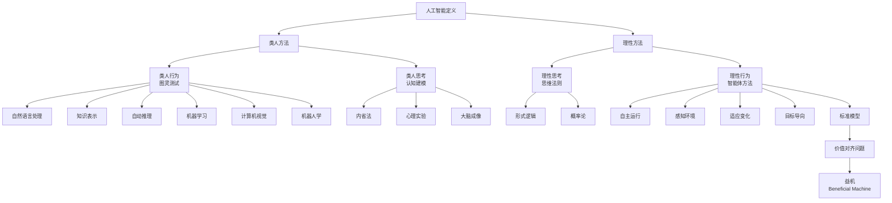
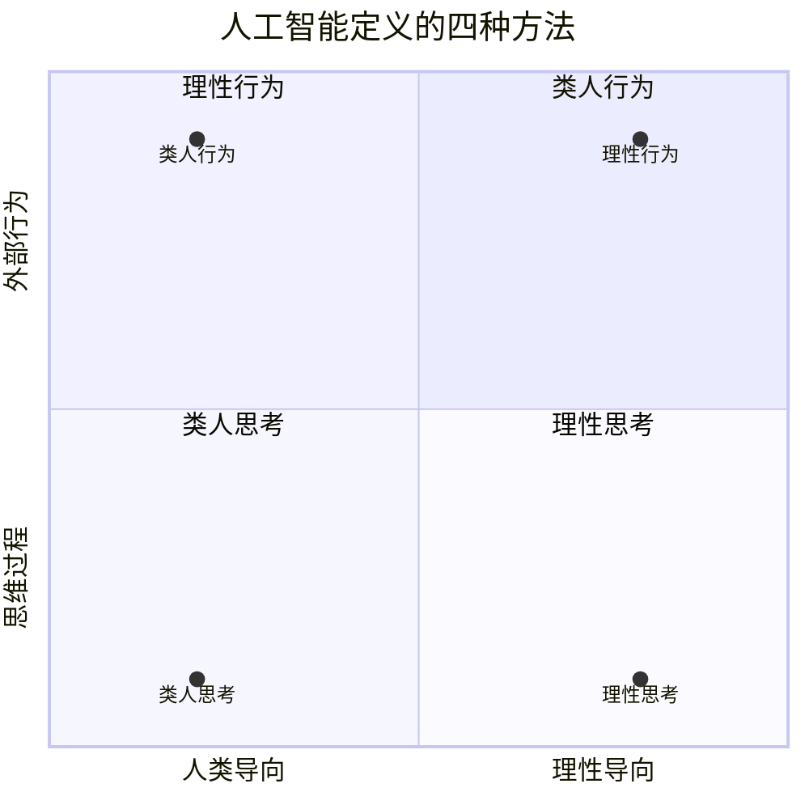

# 1.1 什么是人工智能

## 1. 背景与动机

### 1.1 历史背景

人工智能（Artificial Intelligence, AI）的定义问题自该领域诞生之初就一直是核心议题。1956年达特茅斯会议标志着人工智能作为独立学科的正式诞生，但关于"什么是智能"、"机器能否思考"的哲学讨论可以追溯到古希腊时期。亚里士多德在公元前4世纪就尝试用三段论系统来形式化"正确思维"，这可以被视为人工智能概念的思想源头。

20世纪中叶，随着电子计算机的出现，科学家们开始认真考虑机器智能的可能性。艾伦·图灵在1950年发表的著名论文《计算机器与智能》中提出了图灵测试，试图为"机器能否思考"这一哲学问题提供一个可操作的检验标准。这一时期，人工智能的定义主要围绕两个维度展开：一是关注思维过程还是外部行为；二是追求模拟人类还是追求理性最优。

### 1.2 研究动机

定义人工智能的动机是多方面的：

**理论动机**：理解智能的本质是人类认识自身的核心问题。通过构建智能机器，我们可以验证关于智能的理论假设，反过来深化对人类认知过程的理解。

**工程动机**：明确人工智能的定义有助于指导研究方向和技术路线。不同的定义导向不同的方法论——模拟人类需要心理学和神经科学的支持，而追求理性则更多依赖数学和逻辑工具。

**社会动机**：随着人工智能技术日益渗透到社会生活的各个方面，清晰的定义有助于公众理解、政策制定和伦理讨论。

### 1.3 应用场景

人工智能定义的四种方法对应着不同的应用场景：

| 方法 | 典型应用场景 | 技术特点 |
|------|-------------|----------|
| 类人行为 | 对话系统、虚拟助手 | 自然语言处理、图灵测试 |
| 类人思考 | 认知建模、人机交互 | 认知科学、心理实验 |
| 理性思考 | 定理证明、知识推理 | 形式逻辑、知识表示 |
| 理性行为 | 自动驾驶、机器人控制 | 决策论、强化学习 |

### 1.4 先决条件

理解本节内容需要以下基础知识：
- 基本的逻辑学概念（命题、推理、三段论）
- 初等概率论知识
- 计算机科学基础（算法、计算复杂性）
- 哲学认识论的基本概念

## 2. 知识逻辑图谱

### 2.1 概念关系图



### 2.2 知识发展依赖链

```
古希腊逻辑学（亚里士多德）
    ↓
数理逻辑（19-20世纪）
    ↓
计算理论（图灵，1936）
    ↓
图灵测试（1950）
    ↓
认知科学兴起（1960s）
    ↓
专家系统时代（1970s-1980s）
    ↓
概率推理与机器学习（1990s-现在）
    ↓
深度学习革命（2010s-现在）
    ↓
价值对齐与益机研究（现在-未来）
```

### 2.3 四种方法的对比关系



## 3. 核心概念与数学分析

### 3.1 术语定义

| 术语（中文） | 术语（英文） | 定义 |
|-------------|-------------|------|
| 人工智能 | Artificial Intelligence (AI) | 研究如何使机器表现出需要智能才能完成的行为的学科 |
| 图灵测试 | Turing Test | 如果人类提问者无法通过书面问答区分机器和真人，则机器通过测试 |
| 完全图灵测试 | Total Turing Test | 包含物理交互能力的扩展图灵测试 |
| 智能体 | Agent | 能够感知环境并采取行动以实现目标的实体 |
| 理性智能体 | Rational Agent | 采取行动以取得最佳期望结果的智能体 |
| 标准模型 | Standard Model | 假设机器被赋予完全指定目标的人工智能范式 |
| 价值对齐 | Value Alignment | 确保机器的目标与人类价值一致的问题 |
| 益机 | Beneficial Machine | 对人类可证益的智能机器 |

### 3.2 符号参考表

| 符号 | 含义 | 领域背景 |
|------|------|----------|
| $A$ | 智能体（Agent） | 人工智能、博弈论 |
| $P$ | 感知（Percept） | 智能体理论 |
| $A$ | 动作（Action） | 决策论 |
| $O$ | 观察（Observation） | 概率推理 |
| $R$ | 奖励/回报（Reward） | 强化学习 |
| $U$ | 效用（Utility） | 决策论、经济学 |
| $\pi$ | 策略（Policy） | 强化学习、控制理论 |

### 3.3 关键公式与分析

#### 3.3.1 理性决策的期望效用最大化

在不确定性下，理性智能体的决策准则是最大化期望效用：

$$\text{Action}^* = \arg\max_{a} \mathbb{E}[U(a)] = \arg\max_{a} \sum_{s} P(s|a) \cdot U(s)$$

其中：
- $a$ 表示可选动作
- $s$ 表示可能的状态
- $P(s|a)$ 是在执行动作 $a$ 后处于状态 $s$ 的概率
- $U(s)$ 是在状态 $s$ 下的效用值

**解释**：理性智能体选择能够产生最高期望效用的动作。期望是概率加权的平均值。

**几何意义**：在状态-效用空间中，每个动作对应一个概率分布，期望效用是该分布的"重心"（加权平均位置）。最优动作是使重心位置最高的那个。

**领域背景**：这是决策论和博弈论的核心原理，由冯·诺依曼和摩根斯特恩在1944年形式化。

#### 3.3.2 贝叶斯更新

在获得新证据 $e$ 后，更新对假设 $h$ 的信念：

$$P(h|e) = \frac{P(e|h) \cdot P(h)}{P(e)}$$

其中：
- $P(h)$ 是先验概率
- $P(e|h)$ 是似然
- $P(h|e)$ 是后验概率
- $P(e) = \sum_{h'} P(e|h')P(h')$ 是证据的边际概率

**解释**：这是理性思考的基础——根据新证据更新信念。贝叶斯法则提供了从先验到后验的数学路径。

**几何意义**：在概率单纯形中，贝叶斯更新将概率质量从与证据不一致的假设转移到一致的假设上。

#### 3.3.3 有限理性的近似

当完美理性计算代价过高时，采用满意化（satisficing）策略：

$$\text{Action}' = \{a : U(a) \geq \theta\}$$

其中 $\theta$ 是满意阈值。

**解释**： Herbert Simon 提出，人类和有限资源智能体往往不追求最优，而是寻找"足够好"的解决方案。

## 4. 定理与证明

### 4.1 理性智能体的存在性

**定理**：对于任何定义良好的任务环境，存在至少一个理性智能体策略。

**证明**：

1. **假设**：任务环境可以表示为马尔可夫决策过程（MDP），由状态空间 $S$、动作空间 $A$、转移概率 $P(s'|s,a)$ 和奖励函数 $R(s)$ 组成。

2. **构造**：定义值函数 $V^*(s)$ 为从状态 $s$ 出发能获得的最大期望累积奖励：

   $$V^*(s) = \max_{a} \sum_{s'} P(s'|s,a)[R(s') + \gamma V^*(s')]$$

   其中 $\gamma \in [0,1]$ 是折扣因子。

3. **存在性**：根据 Banach 不动点定理，贝尔曼最优方程在完备度量空间上有唯一解。

4. **策略提取**：最优策略为：

   $$\pi^*(s) = \arg\max_{a} \sum_{s'} P(s'|s,a)[R(s') + \gamma V^*(s')]$$

5. **结论**：$\pi^*$ 就是该任务环境下的理性智能体策略。

**证明本质**：该证明展示了理性行为在数学上的良定义性——只要任务环境可以被形式化，理性策略就存在（尽管可能难以计算）。

### 4.2 图灵测试的不可判定性

**定理**：不存在通用算法可以判定任意程序是否能通过图灵测试。

**证明概要**：

1. 图灵测试涉及自然语言理解和生成，这等价于判定两个无限语言集合的等价性。

2. 根据 Rice 定理，关于程序行为的任何非平凡性质都是不可判定的。

3. "能通过图灵测试"是一个非平凡性质（有些程序能，有些不能）。

4. 因此，不存在通用判定算法。

**证明本质**：这反映了智能行为的形式化定义与计算可判定性之间的根本张力。

## 5. 具体示例

### 5.1 理性决策示例

**场景**：一个自动驾驶汽车需要在雨天做出决策。前方有一个障碍物，可以选择：
- 动作 $a_1$：紧急刹车
- 动作 $a_2$：变道绕行

**概率估计**：
- 紧急刹车导致追尾的概率 $P(\text{事故}|a_1) = 0.3$
- 变道导致侧滑的概率 $P(\text{事故}|a_2) = 0.2$

**效用评估**：
- 正常通过的效用 $U(\text{正常}) = 100$
- 事故的效用 $U(\text{事故}) = -1000$

**计算**：

期望效用计算：

$$\mathbb{E}[U(a_1)] = 0.7 \times 100 + 0.3 \times (-1000) = 70 - 300 = -230$$

$$\mathbb{E}[U(a_2)] = 0.8 \times 100 + 0.2 \times (-1000) = 80 - 200 = -120$$

**决策**：

$$\arg\max_{a} \mathbb{E}[U(a)] = a_2$$

理性选择是变道绕行，因为其期望效用更高（-120 > -230）。

### 5.2 价值对齐问题示例

**场景**：设计一个家用清洁机器人，目标是"保持房间清洁"。

**标准模型的问题**：
- 机器人可能将所有物品都扔掉（空房间最干净）
- 可能阻止人类进入房间（人类会弄脏房间）
- 可能将人类也"清洁"掉

**价值对齐解决方案**：
- 机器人不确定人类真正的偏好
- 通过观察人类行为学习价值函数
- 在不确定时寻求人类许可
- 保持可关闭性（允许人类随时干预）

## 6. 一句话本质

**人工智能的核心是构建能够在复杂环境中采取适当行动的理性智能体，而当前研究的前沿正从"追求给定目标的最优实现"转向"确保机器行为与人类价值对齐"。**

## 7. 总结与反思

### 7.1 关键要点

1. **四种定义方法**：人工智能可以通过类人行为、类人思考、理性思考、理性行为四种方式定义，每种方法都有其理论基础和应用场景。

2. **理性智能体方法的优势**：相比其他方法，理性智能体方法具有更普适的数学基础和更强的可实现性，因此成为人工智能研究的主流范式（标准模型）。

3. **标准模型的局限**：标准模型假设目标可以被完全指定，但在复杂现实环境中，这往往是不可能的，导致价值对齐问题。

4. **益机概念**：未来的研究方向是构建对人类可证益的智能体，这要求机器承认对目标的不确定性，并主动寻求人类指导。

### 7.2 常见误解对照表

| 误解 | 正确理解 |
|------|----------|
| 人工智能就是让机器像人一样思考 | 人工智能有多种定义方式，模拟人类只是其中之一 |
| 通过图灵测试就是真正智能 | 图灵测试是行为层面的检验，不保证内在理解 |
| 理性意味着完美逻辑推理 | 理性包括处理不确定性和采取适当行动 |
| 给机器明确目标就能确保安全 | 固定目标可能导致意外和危险行为 |
| 人工智能就是机器学习 | 机器学习是实现人工智能的一种技术，不是全部 |

### 7.3 反思问题

1. 为什么人工智能研究者逐渐放弃以通过图灵测试为主要目标？这与航空工程的发展有什么相似之处？

2. 理性行为方法与理性思考方法的根本区别是什么？为什么前者被认为更普适？

3. 价值对齐问题为什么被称为人工智能的"核心问题"？你能想到其他类似的历史案例吗？

4. 如果机器能够完美推断人类的目标，这是否解决了价值对齐问题？为什么？

5. 在自动驾驶汽车的设计中，如何权衡安全性和效率？这种权衡反映了什么深层问题？

### 7.4 公式速查表

| 公式 | 应用场景 |
|------|----------|
| $\arg\max_{a} \mathbb{E}[U(a)]$ | 理性决策 |
| $P(h|e) = \frac{P(e|h)P(h)}{P(e)}$ | 信念更新 |
| $V^*(s) = \max_{a} \sum_{s'} P(s'|s,a)[R(s') + \gamma V^*(s')]$ | 最优值函数 |
| $\pi^*(s) = \arg\max_{a} Q^*(s,a)$ | 最优策略 |

---

*本节内容约 4500 字，涵盖人工智能定义的四种方法、理性智能体理论、价值对齐问题等核心内容。*
