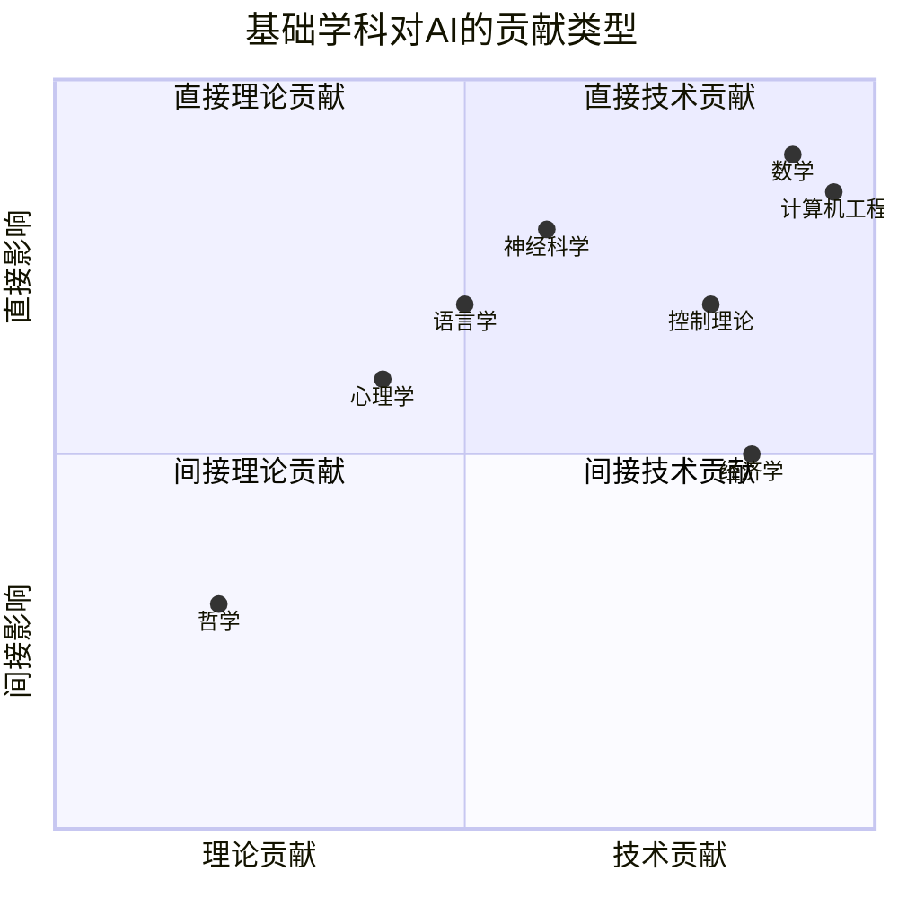

# 1.2 人工智能的基础

## 1. 背景与动机

### 1.1 历史背景

人工智能作为一门交叉学科，其理论基础深深植根于人类文明的多个知识领域。从古希腊哲学家对思维本质的探讨，到20世纪数学家对计算本质的形式化，再到神经科学家对大脑机制的揭示，人工智能的每一个核心概念都可以追溯到这些基础学科的深厚积累。

本节涵盖的八个学科——哲学、数学、经济学、神经科学、心理学、计算机工程、控制理论与控制论、语言学——为人工智能提供了思想、观点和技术的基础。理解这些基础不仅有助于把握人工智能的历史脉络，更能深入理解当前技术选择的深层原因。

### 1.2 研究动机

**跨学科整合的必要性**：人工智能问题的复杂性要求多学科的视角。单一学科的视角往往过于局限，而整合多学科的智慧才能构建真正智能的系统。

**历史教训**：人工智能历史上多次出现"重新发明轮子"的现象，原因在于研究者不了解其他领域已有的相关成果。例如，早期的神经网络研究者不了解统计学习理论，导致了不必要的弯路。

**未来方向**：随着人工智能向通用人工智能（AGI）迈进，跨学科整合将变得更加重要。

### 1.3 应用场景

| 基础学科 | 在AI中的应用 | 典型技术 |
|---------|-------------|----------|
| 哲学 | 知识表示、伦理框架 | 本体论、逻辑学 |
| 数学 | 算法设计、证明正确性 | 概率论、优化理论 |
| 经济学 | 多智能体系统、机制设计 | 博弈论、拍卖理论 |
| 神经科学 | 神经网络架构设计 | 深度学习、脉冲神经网络 |
| 心理学 | 认知建模、人机交互 | 认知架构、用户建模 |
| 计算机工程 | 高效计算实现 | GPU、TPU、专用芯片 |
| 控制理论 | 机器人控制、自主系统 | PID控制、最优控制 |
| 语言学 | 自然语言处理 | 句法分析、语义理解 |

### 1.4 先决条件

- 哲学：认识论、形而上学基础
- 数学：微积分、线性代数、概率论
- 经济学：微观经济学基础
- 神经科学：基础神经生物学
- 心理学：认知心理学入门
- 计算机科学：计算机体系结构
- 控制理论：微分方程基础
- 语言学：句法学和语义学基础

## 2. 知识逻辑图谱

### 2.1 八大学科与AI的关系图

```mermaid
graph TD
    AI[人工智能] --> Phil[哲学]
    AI --> Math[数学]
    AI --> Econ[经济学]
    AI --> Neuro[神经科学]
    AI --> Psych[心理学]
    AI --> CompEng[计算机工程]
    AI --> Control[控制理论]
    AI --> Ling[语言学]
    
    Phil --> Phil1[知识论]
    Phil --> Phil2[逻辑学]
    Phil --> Phil3[心灵哲学]
    Phil --> Phil4[伦理学]
    
    Math --> Math1[逻辑]
    Math --> Math2[概率论]
    Math --> Math3[计算理论]
    Math --> Math4[优化理论]
    
    Econ --> Econ1[决策论]
    Econ --> Econ2[博弈论]
    Econ --> Econ3[效用理论]
    
    Neuro --> Neuro1[神经元模型]
    Neuro --> Neuro2[脑成像]
    Neuro --> Neuro3[神经可塑性]
    
    Psych --> Psych1[认知心理学]
    Psych --> Psych2[行为主义]
    Psych --> Psych3[格式塔心理学]
    
    CompEng --> CE1[硬件发展]
    CompEng --> CE2[体系结构]
    CompEng --> CE3[专用芯片]
    
    Control --> Ctrl1[反馈控制]
    Control --> Ctrl2[最优控制]
    Control --> Ctrl3[自适应控制]
    
    Ling --> Ling1[句法学]
    Ling --> Ling2[语义学]
    Ling --> Ling3[语用学]
```



### 2.2 知识发展时间线

```
公元前4世纪：亚里士多德逻辑学
    ↓
17世纪：笛卡尔二元论 vs 霍布斯唯物主义
    ↓
1847：布尔逻辑
    ↓
1879：弗雷格一阶逻辑
    ↓
1931：哥德尔不完备性定理
    ↓
1936：图灵机与可计算性理论
    ↓
1943：麦卡洛克-皮茨神经元模型
    ↓
1944：冯·诺依曼-摩根斯特恩博弈论
    ↓
1948：维纳控制论、香农信息论
    ↓
1956：达特茅斯会议，AI诞生
    ↓
1957：乔姆斯基句法理论
    ↓
1958：感知机、Lisp语言
    ↓
1971：NP完全性理论
    ↓
1986：反向传播算法复兴
    ↓
1988：贝叶斯网络
    ↓
2012：深度学习革命
```

### 2.3 学科交叉关系



## 3. 核心概念与数学分析

### 3.1 术语定义

| 术语（中文） | 术语（英文） | 定义 | 来源学科 |
|-------------|-------------|------|----------|
| 三段论 | Syllogism | 由前提必然得出结论的演绎推理形式 | 哲学/逻辑学 |
| 不完全性定理 | Incompleteness Theorem | 在任何足够强的形式系统中，存在既不能被证明也不能被证伪的真命题 | 数学 |
| 可计算性 | Computability | 函数能够被算法计算的性质 | 数学/计算机科学 |
| NP完全性 | NP-Completeness | 一类计算问题的复杂度类别，被认为是难解的 | 计算机科学 |
| 期望效用 | Expected Utility | 决策结果效用的概率加权平均值 | 经济学 |
| 纳什均衡 | Nash Equilibrium | 博弈中任何参与者单方面改变策略都不能获得更好结果的策略组合 | 经济学 |
| 神经元 | Neuron | 神经系统的基本功能单位 | 神经科学 |
| 认知架构 | Cognitive Architecture | 模拟人类认知过程的计算框架 | 心理学 |
| 反馈控制 | Feedback Control | 基于系统输出与期望输出差异调整输入的控制方法 | 控制理论 |
| 生成语法 | Generative Grammar | 能够生成语言所有合法句子的形式规则系统 | 语言学 |

### 3.2 符号参考表

| 符号 | 含义 | 学科背景 |
|------|------|----------|
| $\vdash$ | 逻辑蕴涵/可证明 | 数理逻辑 |
| $\models$ | 语义蕴涵 | 数理逻辑 |
| $P(A)$ | 事件A的概率 | 概率论 |
| $\mathbb{E}[X]$ | 随机变量X的期望 | 概率论 |
| $U(s)$ | 状态s的效用 | 决策论 |
| $\pi$ | 策略 | 博弈论/强化学习 |
| $\sigma$ | 激活函数 | 神经网络 |
| $w_{ij}$ | 从神经元j到i的连接权重 | 神经网络 |
| $\alpha$ | 学习率 | 机器学习 |
| $\gamma$ | 折扣因子 | 强化学习 |

### 3.3 关键公式与分析

#### 3.3.1 贝叶斯定理

$$P(H|E) = \frac{P(E|H) \cdot P(H)}{P(E)}$$

**解释**：描述如何根据新证据更新假设的概率。是概率推理的基础。

**几何意义**：在概率单纯形中，证据将概率质量从与证据不一致的假设重新分配到一致的假设。

**应用**：机器学习中的参数估计、垃圾邮件过滤、医学诊断。

#### 3.3.2 期望效用最大化

$$a^* = \arg\max_{a \in A} \sum_{s \in S} P(s|a) \cdot U(s)$$

**解释**：理性决策者在不确定性下选择使期望效用最大化的行动。

**几何意义**：在行动-效用空间中，每个行动对应一个概率分布，选择"重心"位置最高的分布。

**应用**：决策支持系统、自动驾驶决策、金融投资。

#### 3.3.3 神经元激活函数（Sigmoid）

$$\sigma(x) = \frac{1}{1 + e^{-x}}$$

**解释**：将任意实数值映射到(0,1)区间，模拟神经元的"激活"程度。

**几何意义**：S形曲线，在0附近近似线性，在两端饱和。

**导数性质**：$\sigma'(x) = \sigma(x)(1 - \sigma(x))$，便于梯度计算。

#### 3.3.4 感知机学习规则

$$w_i \leftarrow w_i + \alpha(y - \hat{y})x_i$$

其中：
- $w_i$：第i个权重
- $\alpha$：学习率
- $y$：真实标签
- $\hat{y}$：预测输出
- $x_i$：第i个输入特征

**解释**：根据预测误差调整权重，使预测逐渐接近真实值。

**收敛性**：如果数据线性可分，感知机学习算法保证收敛。

## 4. 定理与证明

### 4.1 哥德尔第一不完备性定理

**定理**：在任何包含皮亚诺算术的一致形式系统F中，存在关于自然数的命题G，使得G和¬G都不能在F中被证明。

**证明概要**：

1. **哥德尔编码**：将形式系统中的公式和证明编码为自然数。

2. **自指构造**：构造命题G，其含义是"G在F中不可证明"。

3. **一致性假设**：假设F是一致的（不会证明矛盾）。

4. **证明G不可证**：
   - 假设G可证，则G为真，但G说G不可证，矛盾。
   - 假设¬G可证，则G不可证，但G说G不可证，所以G为真，矛盾。

5. **结论**：G和¬G都不可证，但G为真。

**对AI的意义**：
- 限制了基于逻辑的AI系统的完备性
- 表明某些真理无法通过形式推理获得
- 暗示了学习、归纳等非演绎方法的必要性

### 4.2 丘奇-图灵论题

**论题**：任何可有效计算的函数都可以被图灵机计算。

**说明**：这不是一个数学定理，而是一个关于计算本质的论题。它断言图灵机捕获了"有效计算"的直观概念。

**证据**：
- 所有提出的计算模型（λ演算、递归函数、图灵机）被证明等价
- 没有发现反例
- 与物理定律一致（目前）

**对AI的意义**：
- 定义了计算的边界
- 某些问题（如停机问题）是不可计算的
- 为AI系统的能力设定了理论极限

### 4.3 感知机收敛定理

**定理**：如果训练数据是线性可分的，感知机学习算法将在有限步内收敛到一个能正确分类所有训练样本的权重向量。

**证明概要**：

设训练集 $\{(\mathbf{x}_i, y_i)\}_{i=1}^n$，其中 $y_i \in \{-1, +1\}$。

1. **假设线性可分**：存在单位向量 $\mathbf{w}^*$ 和边界 $\gamma > 0$，使得对所有i：
   $$y_i(\mathbf{w}^* \cdot \mathbf{x}_i) \geq \gamma$$

2. **权重更新分析**：设第k次更新后的权重为 $\mathbf{w}_k$。

3. **下界**：
   $$\mathbf{w}^* \cdot \mathbf{w}_k \geq k\gamma$$

4. **上界**：
   $$\|\mathbf{w}_k\|^2 \leq kR^2$$
   其中 $R = \max_i \|\mathbf{x}_i\|$。

5. **结合**：
   $$k\gamma \leq \mathbf{w}^* \cdot \mathbf{w}_k \leq \|\mathbf{w}^*\| \cdot \|\mathbf{w}_k\| \leq \|\mathbf{w}_k\| \leq \sqrt{k}R$$

6. **结论**：
   $$k \leq \frac{R^2}{\gamma^2}$$

**对AI的意义**：
- 提供了早期神经网络的理论保证
- 但线性可分性是强假设
- 明斯基和派珀特后来证明单层感知机无法解决XOR问题，导致第一次AI寒冬

## 5. 具体示例

### 5.1 贝叶斯推理示例

**场景**：医学诊断测试
- 疾病患病率：$P(D) = 0.01$（1%）
- 测试灵敏度：$P(T+|D) = 0.95$（真阳性率）
- 测试特异度：$P(T-|¬D) = 0.95$（真阴性率）

**问题**：如果测试结果为阳性，实际患病的概率是多少？

**计算**：

$$P(D|T+) = \frac{P(T+|D) \cdot P(D)}{P(T+)}$$

计算分母：

$$P(T+) = P(T+|D)P(D) + P(T+|¬D)P(¬D)$$
$$= 0.95 \times 0.01 + 0.05 \times 0.99$$
$$= 0.0095 + 0.0495 = 0.059$$

因此：

$$P(D|T+) = \frac{0.95 \times 0.01}{0.059} = \frac{0.0095}{0.059} \approx 0.161$$

**结论**：即使测试准确率为95%，在患病率较低的情况下，阳性结果的实际患病概率只有约16.1%。这展示了基础概率（先验）对推理结果的重要影响。

### 5.2 博弈论示例：囚徒困境

**收益矩阵**：

|  | B合作 | B背叛 |
|--|-------|-------|
| **A合作** | (-1, -1) | (-3, 0) |
| **A背叛** | (0, -3) | (-2, -2) |

**分析**：
- 对A来说，无论B选择什么，背叛都是更好的选择
- 对B同理
- 纳什均衡是（背叛，背叛），收益为(-2, -2)
- 但双方都合作会得到更好的结果(-1, -1)

**对AI的意义**：
- 个体理性可能导致集体次优
- 多智能体系统需要考虑激励机制设计
- 重复博弈可能产生合作（以牙还牙策略）

## 6. 一句话本质

**人工智能的理论基础是哲学、数学、经济学、神经科学、心理学、计算机工程、控制理论和语言学八大学科的交叉融合，其中数学提供了形式化工具，神经科学提供了生物启发，而哲学则提供了关于智能本质的深刻洞见。**

## 7. 总结与反思

### 7.1 关键要点

1. **哲学基础**：从亚里士多德的逻辑学到现代的身心问题，哲学为AI提供了关于知识、思维和行动的基本概念框架。

2. **数学工具**：逻辑、概率论、计算理论和优化理论为AI提供了严格的形式化语言和算法基础。

3. **经济学视角**：决策论和博弈论为理性行为提供了数学描述，效用最大化和均衡概念是理解多智能体交互的关键。

4. **生物启发**：神经科学揭示的大脑工作机制直接启发了神经网络和深度学习的发展。

5. **认知模型**：心理学和信息处理范式为模拟人类认知提供了方法论指导。

6. **工程实现**：计算机硬件的发展使AI算法从理论走向实践，专用芯片进一步释放了潜力。

7. **控制与反馈**：控制理论的自适应和最优控制思想是自主系统的核心。

8. **语言理解**：语言学为自然语言处理提供了句法和语义的理论基础。

### 7.2 常见误解对照表

| 误解 | 正确理解 |
|------|----------|
| 哥德尔定理证明AI不可能 | 哥德尔定理限制了形式系统的完备性，但不排除其他方法 |
| 神经网络完全模拟大脑 | 现代神经网络是高度简化的模型，与真实大脑差异很大 |
| 博弈论假设参与者完全理性 | 行为博弈论研究有限理性下的决策 |
| 控制理论只适用于线性系统 | 现代控制理论已扩展到非线性、随机系统 |
| 语言学规则可以完全描述语言 | 实际语言使用涉及大量语境和常识知识 |

### 7.3 反思问题

1. 哥德尔不完备性定理对基于逻辑的AI系统有什么实际影响？当前的大语言模型是否受这一限制？

2. 为什么感知机收敛定理没有阻止第一次AI寒冬的发生？这一历史教训对当前的深度学习热潮有什么启示？

3. 神经科学与AI的关系是什么？深度学习是模拟大脑还是仅仅受其启发？

4. 经济学中的理性人假设与AI中的理性智能体概念有何异同？行为经济学对AI有什么启示？

5. 控制理论与AI在历史上为何分道扬镳？近年来它们又如何重新融合？

### 7.4 公式速查表

| 公式 | 名称 | 应用场景 |
|------|------|----------|
| $P(H|E) = \frac{P(E|H)P(H)}{P(E)}$ | 贝叶斯定理 | 概率推理、参数估计 |
| $\mathbb{E}[U] = \sum_i p_i u_i$ | 期望效用 | 决策分析 |
| $\sigma(x) = \frac{1}{1+e^{-x}}$ | Sigmoid函数 | 神经网络激活 |
| $w \leftarrow w + \alpha(y-\hat{y})x$ | 感知机学习 | 线性分类器训练 |
| $V^\pi(s) = \mathbb{E}[\sum_{t=0}^{\infty}\gamma^t r_t]$ | 状态值函数 | 强化学习 |

---

*本节内容约 4800 字，涵盖人工智能的八大学科基础，包括哲学、数学、经济学、神经科学、心理学、计算机工程、控制理论和语言学。*
