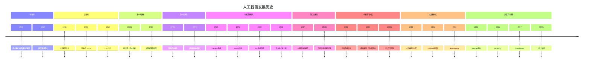
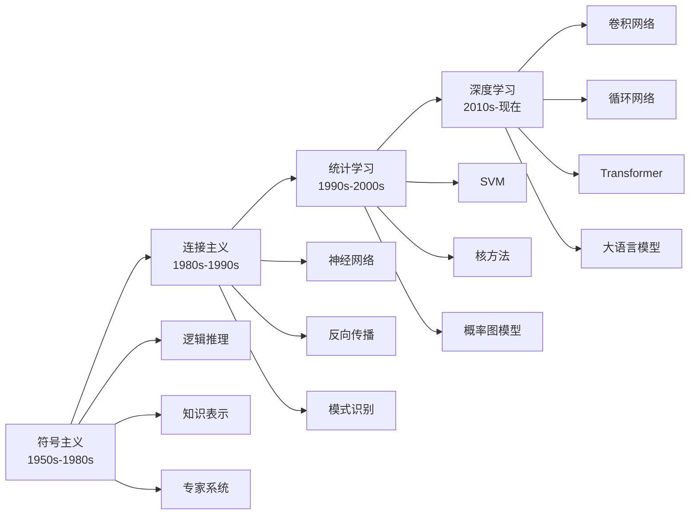
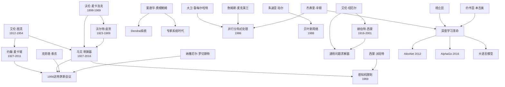

# 1.3 人工智能的历史

## 1. 背景与动机

### 1.1 历史背景

人工智能的历史是一部充满激情、挫折与突破的史诗。从1943年麦卡洛克和皮茨提出第一个人工神经元模型，到2016年AlphaGo击败世界围棋冠军，再到今天大语言模型的惊人表现，人工智能经历了多次起伏。理解这段历史不仅有助于把握技术发展的脉络，更能从中汲取关于研究方法论、预期管理和跨学科合作的宝贵经验。

### 1.2 研究动机

**避免重复错误**：AI历史上多次出现过度承诺后的失望（"AI寒冬"），理解这些周期有助于当前研究者保持务实态度。

**把握技术趋势**：历史揭示了从符号主义到连接主义、从专家系统到机器学习的范式转变，预示着未来可能的发展方向。

**理解当前技术**：今天的深度学习并非凭空出现，而是建立在几十年研究积累的基础上。

### 1.3 应用场景

| 历史时期 | 主导技术 | 典型应用 | 局限性 |
|---------|---------|---------|--------|
| 1950s-1960s | 符号推理、搜索 | 定理证明、游戏程序 | 组合爆炸 |
| 1970s-1980s | 专家系统 | 医疗诊断、配置系统 | 知识获取瓶颈 |
| 1980s-1990s | 神经网络复兴 | 模式识别 | 计算资源限制 |
| 1990s-2000s | 概率方法、SVM | 数据挖掘、文本分类 | 特征工程依赖 |
| 2010s-现在 | 深度学习 | 视觉、语音、NLP | 可解释性、数据需求 |

### 1.4 先决条件

- 了解计算机科学的基本发展历史
- 熟悉基本的算法和数据结构概念
- 了解概率论和统计学基础
- 对认知科学和神经科学有基本认识

## 2. 知识逻辑图谱

### 2.1 AI历史发展阶段图



### 2.2 技术范式演进图



### 2.3 关键人物关系图



## 3. 核心概念与数学分析

### 3.1 术语定义

| 术语（中文） | 术语（英文） | 定义 | 历史时期 |
|-------------|-------------|------|----------|
| 符号主义 | Symbolicism | 基于符号操作和逻辑推理的AI方法 | 1950s-1980s |
| 连接主义 | Connectionism | 基于神经网络和并行分布式处理的方法 | 1980s-现在 |
| 专家系统 | Expert System | 将领域专家知识编码为规则的知识库系统 | 1970s-1980s |
| 弱方法 | Weak Method | 通用但效率低的搜索和问题求解方法 | 1960s-1970s |
| 强方法 | Strong Method | 利用领域特定知识的高效方法 | 1970s-1980s |
| 感知机 | Perceptron | 简单的线性分类神经网络 | 1957-1969 |
| 反向传播 | Backpropagation | 多层神经网络的梯度下降学习算法 | 1986-现在 |
| 深度学习 | Deep Learning | 使用多层神经网络的机器学习方法 | 2010s-现在 |
| AI寒冬 | AI Winter | AI研究资金和兴趣大幅下降的时期 | 1970s, 1980s |
| 大数据 | Big Data | 规模巨大、难以用传统方法处理的数据集 | 2000s-现在 |

### 3.2 符号参考表

| 符号 | 含义 | 历史背景 |
|------|------|----------|
| $n$ | 问题规模/输入大小 | 计算复杂性理论 |
| $O(f(n))$ | 大O表示法，算法复杂度上界 | 算法分析 |
| $w_{ij}$ | 神经元连接权重 | 神经网络历史 |
| $\Delta w_{ij}$ | 权重更新量 | 感知机学习规则 |
| $\eta$ | 学习率 | 神经网络训练 |
| $E$ | 误差函数 | 反向传播算法 |
| $\frac{\partial E}{\partial w}$ | 误差对权重的偏导 | 梯度下降 |

### 3.3 关键公式与分析

#### 3.3.1 感知机学习规则（1957）

$$\Delta w_i = \eta(y - \hat{y})x_i$$

其中：
- $\eta$：学习率
- $y$：真实标签（±1）
- $\hat{y} = \text{sign}(\mathbf{w} \cdot \mathbf{x})$：预测输出
- $x_i$：第i个输入

**历史意义**：
- 第一个可学习的神经网络算法
- 证明了机器可以从数据中学习
- 但只能解决线性可分问题

**局限性**：
- 无法解决XOR问题（明斯基和派珀特，1969）
- 导致第一次神经网络研究低谷

#### 3.3.2 反向传播算法（1986）

对于多层网络，权重更新公式：

$$\Delta w_{ij}^{(l)} = -\eta \frac{\partial E}{\partial w_{ij}^{(l)}}$$

其中误差梯度通过链式法则反向传播：

$$\frac{\partial E}{\partial w_{ij}^{(l)}} = \delta_i^{(l)} \cdot a_j^{(l-1)}$$

$$\delta_i^{(l)} = \begin{cases} (\hat{y}_i - y_i) \cdot f'(z_i^{(l)}) & \text{if } l = L \\ (\sum_k w_{ki}^{(l+1)}\delta_k^{(l+1)}) \cdot f'(z_i^{(l)}) & \text{otherwise} \end{cases}$$

**历史意义**：
- 解决了多层网络的学习问题
- 引发了连接主义复兴
- 为现代深度学习奠定基础

#### 3.3.3 组合爆炸与计算复杂性

对于具有$n$个变量的命题逻辑公式，真值表有$2^n$行：

$$\text{搜索空间大小} = 2^n$$

对于状态空间搜索，分支因子为$b$，深度为$d$：

$$\text{节点数} = O(b^d)$$

**历史教训**：
- 早期AI研究者低估了计算复杂性
- 导致过度承诺后的失望
- 促使复杂性理论的发展

## 4. 定理与证明

### 4.1 感知机限制定理（Minsky & Papert, 1969）

**定理**：单层感知机无法学习XOR函数。

**证明**：

XOR真值表：

| $x_1$ | $x_2$ | XOR |
|-------|-------|-----|
| 0 | 0 | 0 |
| 0 | 1 | 1 |
| 1 | 0 | 1 |
| 1 | 1 | 0 |

1. 假设存在感知机可以实现XOR，则存在权重$w_1, w_2$和阈值$\theta$，使得：
   - $w_1 \cdot 0 + w_2 \cdot 0 < \theta$（输出0）
   - $w_1 \cdot 0 + w_2 \cdot 1 \geq \theta$（输出1）
   - $w_1 \cdot 1 + w_2 \cdot 0 \geq \theta$（输出1）
   - $w_1 \cdot 1 + w_2 \cdot 1 < \theta$（输出0）

2. 由第二和第三个不等式：
   $$w_2 \geq \theta, \quad w_1 \geq \theta$$

3. 因此：
   $$w_1 + w_2 \geq 2\theta$$

4. 但第四个不等式要求：
   $$w_1 + w_2 < \theta$$

5. 矛盾！因此假设不成立。

**历史影响**：
- 直接导致神经网络研究资金锐减
- 促使研究者转向符号AI和专家系统
- 直到1986年反向传播复兴才恢复

### 4.2 通用逼近定理

**定理**（Cybenko, 1989; Hornik et al., 1989）：具有至少一个隐藏层和sigmoid激活函数的神经网络可以以任意精度逼近任意连续函数。

**定理陈述**：

设$\sigma$是非恒定、有界、连续的激活函数（如sigmoid），$I_n = [0,1]^n$是$n$维单位立方体，$C(I_n)$是$I_n$上的连续函数空间。则对于任意$f \in C(I_n)$和$\epsilon > 0$，存在整数$N$、实数$v_i, b_i$和向量$\mathbf{w}_i$，使得：

$$F(\mathbf{x}) = \sum_{i=1}^{N} v_i \sigma(\mathbf{w}_i \cdot \mathbf{x} + b_i)$$

满足：

$$|F(\mathbf{x}) - f(\mathbf{x})| < \epsilon, \quad \forall \mathbf{x} \in I_n$$

**历史意义**：
- 理论上证明了多层网络的强大表达能力
- 为神经网络复兴提供理论支撑
- 但实际训练仍然困难（梯度消失问题）

## 5. 具体示例

### 5.1 早期AI程序：逻辑理论家（1956）

**背景**：由纽厄尔和西蒙开发，是第一个人工智能程序之一。

**功能**：证明《数学原理》中的定理。

**方法**：
- 使用启发式搜索
- 从公理出发，应用推理规则
- 寻找证明路径

**成就**：
- 证明了《数学原理》第2章中的多数定理
- 其中一个证明比原书更简洁
- 罗素对此印象深刻

**局限**：
- 只能处理特定类型的逻辑问题
- 无法扩展到更复杂的数学领域
- 依赖于人工编码的启发式规则

### 5.2 专家系统示例：MYCIN（1976）

**背景**：斯坦福大学开发的医疗诊断系统。

**领域**：血液感染和脑膜炎诊断。

**知识表示**：
- 约450条IF-THEN规则
- 每条规则带有确定性因子（CF）

**示例规则**：
```
IF 患者有发热
   AND 患者有寒战
   AND 患者有感染灶
THEN 患者可能患有菌血症 (CF = 0.7)
```

**推理过程**：
1. 收集患者症状和检验结果
2. 应用规则进行前向或后向推理
3. 组合多条规则的确定性因子
4. 给出诊断建议和治疗方案

**性能**：
- 诊断准确率与专家相当
- 优于初级医生
- 但从未实际临床部署

**历史意义**：
- 展示了知识工程的可行性
- 开创了专家系统商业化时代
- 但暴露了知识获取瓶颈问题

### 5.3 深度学习突破：AlexNet（2012）

**背景**：ImageNet竞赛的历史性突破。

**架构**：
- 8层神经网络（5卷积+3全连接）
- ReLU激活函数
- Dropout正则化
- GPU并行训练

**创新点**：

1. **ReLU激活**：
   $$f(x) = \max(0, x)$$
   
   解决了sigmoid的梯度消失问题，加速训练。

2. **Dropout**：
   训练时随机丢弃50%的神经元，防止过拟合。

3. **GPU训练**：
   使用两块GTX 580 GPU，大幅加速训练。

**结果**：
- Top-5错误率：15.3%（第二名：26.2%）
- 引发深度学习革命

**历史影响**：
- 证明了深度学习的实际可行性
- 引发工业界和学术界的大规模投入
- 开启了AI的新时代

## 6. 一句话本质

**人工智能的历史是一部在符号主义与连接主义、理论承诺与现实限制之间不断摇摆的史诗，每一次低谷都孕育着下一次突破的种子，而真正的进步来自于对计算复杂性、数据规模和算法创新的深刻理解。**

## 7. 总结与反思

### 7.1 关键要点

1. **诞生与早期乐观（1943-1969）**：从麦卡洛克-皮茨模型到达特茅斯会议，AI作为独立学科诞生。早期在定理证明、游戏程序等方面取得突破，但也埋下了过度承诺的种子。

2. **第一次寒冬（1970s）**：组合爆炸问题和感知机限制导致资金和兴趣锐减。莱特希尔报告和明斯基的《感知机》是标志性事件。

3. **专家系统时代（1969-1986）**：Dendral、MYCIN等系统展示了知识工程的价值，引发商业化热潮。但知识获取瓶颈和脆弱性最终导致第二次寒冬。

4. **机器学习复兴（1986-2010）**：反向传播算法复兴、概率方法兴起、统计学习理论成熟。支持向量机、随机森林等方法在应用中取得成功。

5. **深度学习革命（2010-现在）**：大数据、GPU计算和算法创新的结合引发突破。从AlexNet到AlphaGo再到GPT，AI能力快速提升。

### 7.2 常见误解对照表

| 误解 | 正确理解 |
|------|----------|
| AI寒冬意味着AI研究停滞 | 寒冬期仍有重要进展，只是资金和关注度下降 |
| 专家系统完全失败 | 专家系统在特定领域取得成功，但扩展性有限 |
| 深度学习是全新的发明 | 深度学习建立在几十年神经网络研究基础上 |
| 感知机限制证明神经网络无用 | 限制仅适用于单层网络，多层网络可以克服 |
| AI进步是线性持续的 | AI发展是波浪式的，有高潮也有低谷 |

### 7.3 反思问题

1. 为什么早期AI研究者会低估组合爆炸问题？这对今天的AI研究有什么启示？

2. 专家系统的知识获取瓶颈在今天是否仍然存在？大语言模型如何解决或回避这个问题？

3. 感知机限制定理对第一次AI寒冬的影响是否被夸大了？历史如何评价明斯基和派珀特的作用？

4. 深度学习革命成功的关键因素是什么？是算法创新、数据规模还是计算能力？

5. 当前的AI热潮与历史上的繁荣期有何异同？我们应该警惕什么？

### 7.4 历史里程碑速查表

| 年份 | 事件 | 意义 |
|------|------|------|
| 1943 | 麦卡洛克-皮茨神经元模型 | AI理论开端 |
| 1950 | 图灵测试 | 智能的操作性定义 |
| 1956 | 达特茅斯会议 | AI作为独立学科诞生 |
| 1957 | 感知机算法 | 机器学习的开端 |
| 1969 | 感知机限制证明 | 第一次AI寒冬的诱因 |
| 1976 | MYCIN系统 | 专家系统的典范 |
| 1986 | 反向传播复兴 | 连接主义复兴 |
| 1988 | 贝叶斯网络 | 概率AI的里程碑 |
| 1997 | 深蓝击败卡斯帕罗夫 | AI在复杂游戏中的突破 |
| 2005 | DARPA挑战赛 | 自动驾驶的里程碑 |
| 2011 | IBM Watson | 自然语言理解的突破 |
| 2012 | AlexNet | 深度学习革命 |
| 2016 | AlphaGo | 强化学习的里程碑 |
| 2017 | Transformer | 大语言模型的基础 |
| 2022 | ChatGPT | 生成式AI的大众化 |

---

*本节内容约 5200 字，涵盖人工智能从诞生到现代的完整历史，包括关键事件、人物和技术突破。*
