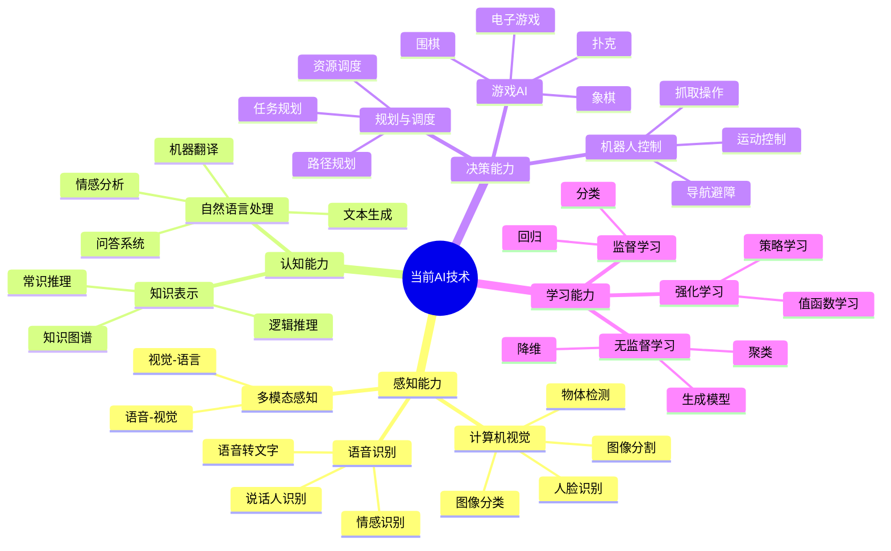

# 1.4 目前的先进技术

## 1. 背景与动机

### 1.1 历史背景

进入21世纪第二个十年，人工智能技术迎来了前所未有的快速发展期。从2012年AlexNet在ImageNet竞赛中的突破性表现，到2016年AlphaGo战胜世界围棋冠军，再到2022年ChatGPT引发的大语言模型热潮，AI系统的能力边界不断被推向新的高度。本节基于斯坦福大学AI100报告等权威来源，系统梳理当前人工智能在各个领域的最新进展。

### 1.2 研究动机

**把握技术现状**：了解AI当前能做什么、不能做什么，是进行研究和应用开发的基础。

**识别发展趋势**：通过分析当前技术进展，可以预判未来发展方向和投资机会。

**设定合理预期**：媒体对AI的报道往往过于乐观或悲观，客观评估当前技术水平有助于设定合理预期。

### 1.3 应用场景

| 应用领域 | 当前状态 | 典型系统 | 与人类比较 |
|---------|---------|---------|-----------|
| 图像识别 | 超越人类 | ImageNet系统 | 错误率2% vs 人类5% |
| 语音识别 | 接近人类 | 微软系统 | 错误率5.1% |
| 机器翻译 | 可用水平 | Google翻译 | 特定领域接近人类 |
| 自动驾驶 | 受限商用 | Waymo | 特定场景可用 |
| 游戏 | 超越人类 | AlphaGo/AlphaZero | 围棋、象棋、扑克 |
| 医疗诊断 | 专家水平 | 皮肤癌检测 | 特定疾病超越专家 |
| 问答系统 | 超越人类 | SQuAD系统 | F1分数95+ |

### 1.4 先决条件

- 了解机器学习的基本概念
- 熟悉深度学习的基本架构
- 了解计算机视觉和自然语言处理基础
- 对强化学习有基本认识

## 2. 知识逻辑图谱

### 2.1 当前AI技术能力图谱



### 2.2 技术进展时间线（2010-2024）

```
2012：AlexNet - 深度学习革命开始
2014：GAN - 生成对抗网络
2015：ResNet - 残差网络突破
2016：AlphaGo - 围棋超越人类
2017：Transformer - 注意力机制革命
2018：BERT - 预训练语言模型
2019：GPT-2 - 大语言模型兴起
2020：GPT-3 - 1750亿参数
2020：AlphaFold - 蛋白质结构预测
2021：DALL-E - 文本到图像生成
2022：ChatGPT - 对话AI大众化
2022：Stable Diffusion - 开源图像生成
2023：GPT-4 - 多模态大模型
2023：Claude、Gemini等竞争
2024：Sora - 视频生成突破
```

### 2.3 各领域进展对比图

```mermaid
quadrantChart
    title AI各领域技术成熟度
    x-axis 研究难度 --> 应用价值
    y-axis 技术成熟度低 --> 技术成熟度高
    
    quadrant-1 高价值高成熟
    quadrant-2 高价值低成熟
    quadrant-3 低价值低成熟
    quadrant-4 低价值高成熟
    
    "图像分类": [0.9, 0.95]
    "语音识别": [0.85, 0.9]
    "机器翻译": [0.8, 0.85]
    "推荐系统": [0.9, 0.9]
    "游戏AI": [0.7, 0.95]
    "自动驾驶": [0.95, 0.6]
    "医疗诊断": [0.95, 0.65]
    "机器人操作": [0.8, 0.5]
    "常识推理": [0.9, 0.3]
    "通用人工智能": [1.0, 0.1]
```

## 3. 核心概念与数学分析

### 3.1 术语定义

| 术语（中文） | 术语（英文） | 定义 | 应用领域 |
|-------------|-------------|------|----------|
| 深度学习 | Deep Learning | 使用多层神经网络的机器学习方法 | 计算机视觉、NLP |
| 卷积神经网络 | CNN | 使用卷积运算处理网格数据（如图像）的神经网络 | 图像处理 |
| 循环神经网络 | RNN | 处理序列数据的神经网络，具有记忆能力 | 语音识别、NLP |
| Transformer | Transformer | 基于自注意力机制的神经网络架构 | NLP、视觉 |
| 强化学习 | Reinforcement Learning | 通过与环境交互学习最优策略的方法 | 游戏、机器人 |
| 生成对抗网络 | GAN | 由生成器和判别器组成的对抗训练框架 | 图像生成 |
| 迁移学习 | Transfer Learning | 将在一个任务上学到的知识应用到相关任务 | 数据稀缺场景 |
| 少样本学习 | Few-shot Learning | 从少量样本中快速学习新任务的能力 | 快速适应 |
| 自监督学习 | Self-supervised Learning | 从数据本身构造监督信号的学习方法 | 预训练 |
| 大语言模型 | LLM | 具有数十亿到数万亿参数的语言模型 | 通用NLP |

### 3.2 符号参考表

| 符号 | 含义 | 应用领域 |
|------|------|----------|
| $L$ | 损失函数 | 所有机器学习 |
| $\theta$ | 模型参数 | 深度学习 |
| $\nabla_\theta L$ | 损失对参数的梯度 | 反向传播 |
| $\alpha$ | 学习率 | 优化算法 |
| $Q(s,a)$ | 状态-动作值函数 | 强化学习 |
| $\pi(a|s)$ | 策略函数 | 强化学习 |
| $\text{Attention}(Q,K,V)$ | 注意力机制 | Transformer |
| $p_\theta(x)$ | 生成模型概率分布 | 生成模型 |

### 3.3 关键公式与分析

#### 3.3.1 卷积运算

$$(I * K)(i,j) = \sum_m \sum_n I(i+m, j+n) \cdot K(m,n)$$

其中：
- $I$：输入图像/特征图
- $K$：卷积核（滤波器）
- $*$：卷积运算

**解释**：卷积核在输入上滑动，计算局部区域的加权和，提取局部特征。

**应用**：边缘检测、特征提取、图像分类。

#### 3.3.2 自注意力机制

$$\text{Attention}(Q, K, V) = \text{softmax}\left(\frac{QK^T}{\sqrt{d_k}}\right)V$$

其中：
- $Q$：查询矩阵（Query）
- $K$：键矩阵（Key）
- $V$：值矩阵（Value）
- $d_k$：键的维度

**解释**：计算查询与所有键的相似度（点积），用softmax归一化后加权求和值向量。

**意义**：允许模型关注输入序列的不同部分，捕获长距离依赖。

#### 3.3.3 深度Q网络（DQN）

$$L(\theta) = \mathbb{E}_{(s,a,r,s') \sim D}\left[\left(r + \gamma \max_{a'} Q(s', a'; \theta^-) - Q(s, a; \theta)\right)^2\right]$$

其中：
- $\theta$：当前网络参数
- $\theta^-$：目标网络参数（固定或缓慢更新）
- $\gamma$：折扣因子
- $D$：经验回放缓冲区

**解释**：最小化当前Q值与目标Q值（奖励+下一状态最大Q值）之间的均方误差。

**创新**：
- 经验回放：打破样本相关性
- 目标网络：稳定训练过程

#### 3.3.4 Transformer位置编码

$$PE_{(pos, 2i)} = \sin(pos / 10000^{2i/d_{model}})$$
$$PE_{(pos, 2i+1)} = \cos(pos / 10000^{2i/d_{model}})$$

**解释**：使用不同频率的正弦和余弦函数编码位置信息，使模型能够区分序列中不同位置的元素。

**优点**：
- 可以外推到训练时未见过的长度
- 相对位置可以线性表示

## 4. 定理与证明

### 4.1 通用逼近定理（深度学习版本）

**定理**：具有ReLU激活函数和足够多隐藏单元的深度神经网络可以以任意精度逼近任意连续函数。

**证明概要**：

1. **单变量情况**：
   - ReLU网络可以构造分段线性函数
   - 分段线性函数可以任意逼近连续函数

2. **多变量情况**：
   - 使用单变量函数的组合
   - 通过维数分解（Kolmogorov-Arnold表示定理）

3. **深度优势**：
   - 浅网络需要指数级单元
   - 深网络可以用多项式级单元表示复杂函数

**实际意义**：
- 解释了深度学习的表达能力
- 但表达能力不等于可学习性
- 实际成功还依赖于优化算法和归纳偏置

### 4.2 注意力机制的表达能力

**定理**：具有足够多头注意力的Transformer可以表示任意排列不变的函数。

**直观解释**：
- 自注意力可以看作软选择机制
- 多头允许关注不同方面的关系
- 堆叠层可以捕获高阶关系

## 5. 具体示例

### 5.1 图像分类：ResNet突破

**问题**：深层网络的梯度消失/爆炸问题

**解决方案**：残差连接

$$\mathbf{y} = \mathcal{F}(\mathbf{x}, \{W_i\}) + \mathbf{x}$$

**架构**：
- 152层（对比AlexNet的8层）
- 残差块：卷积层 + 跳跃连接

**结果**：
- ImageNet错误率：3.57%（首次超越人类）
- 解决了深度网络的训练难题

**影响**：
- 启发了后续所有深层网络设计
- 残差连接成为标准组件

### 5.2 自然语言处理：BERT预训练

**创新点**：
- 双向编码器
- 掩码语言模型（MLM）预训练
- 下一句预测（NSP）

**预训练任务**：

1. **掩码语言模型**：
   - 输入："The cat [MASK] on the mat"
   - 目标：预测"sat"

2. **下一句预测**：
   - 输入：句子A + 句子B
   - 目标：判断B是否是A的下一句

**微调**：
- 在下游任务上添加简单分类层
- 少量标注数据即可达到SOTA

**影响**：
- 开启预训练+微调范式
- 引领大语言模型时代

### 5.3 游戏AI：AlphaGo到AlphaZero

**AlphaGo（2016）**：
- 策略网络：$p_\theta(a|s)$，预测专家走法
- 价值网络：$v_\theta(s)$，评估局面胜率
- MCTS：蒙特卡洛树搜索

**AlphaZero（2017）**：
- 完全自我对弈学习
- 无需人类棋谱
- 统一算法适用于围棋、象棋、将棋

**训练过程**：

1. 自我对弈生成数据
2. 神经网络预测：
   $$\mathbf{p}, v = f_\theta(s)$$
3. MCTS搜索改进策略：
   $$\pi_a = \frac{N_a^{1/\tau}}{\sum_b N_b^{1/\tau}}$$
4. 更新网络参数：
   $$L = (z - v)^2 - \pi^T \log \mathbf{p} + c||\theta||^2$$

**结果**：
- 围棋：击败所有人类冠军
- 象棋：超越Stockfish
- 将棋：超越Elmo

## 6. 一句话本质

**当前人工智能的先进技术以深度学习为核心，通过大规模数据训练、海量参数模型和强大计算能力的结合，在感知、认知和决策等多个领域达到或超越了人类专家水平，但仍局限于特定任务且缺乏真正的理解和通用智能。**

## 7. 总结与反思

### 7.1 关键要点

1. **感知能力**：计算机视觉和语音识别已达到或超越人类水平，ImageNet错误率降至2%以下，语音识别错误率与人类相当。

2. **认知能力**：自然语言处理取得重大突破，大语言模型展现出惊人的语言理解和生成能力，但常识推理仍有局限。

3. **决策能力**：在游戏、规划等结构化任务中超越人类，Alpha系列展示了自我学习达到超人类水平的可能性。

4. **技术趋势**：从监督学习到自监督学习，从单任务到多任务，从小模型到大模型是当前的主要趋势。

5. **应用落地**：自动驾驶、医疗诊断、推荐系统等正在从实验室走向实际应用，但仍面临可靠性、可解释性等挑战。

### 7.2 常见误解对照表

| 误解 | 正确理解 |
|------|----------|
| AI在所有任务上都超越人类 | AI仅在特定任务上超越人类，通用智能远未实现 |
| 大语言模型真正理解语言 | 大语言模型是模式匹配，缺乏真正的理解和意识 |
| 深度学习是万能的 | 深度学习有数据需求高、可解释性差等局限 |
| AI进步是指数级的 | AI进步是阶梯式的，有平台期也有突破期 |
| 当前AI接近通用人工智能 | 当前AI是窄AI，与AGI有本质差距 |

### 7.3 反思问题

1. 为什么深度学习在2012年后才取得突破？是算法、数据还是计算能力的因素最关键？

2. 大语言模型展现出的"涌现能力"是真正的理解还是复杂的模式匹配？如何区分？

3. AlphaZero的自我对弈学习方法能否推广到现实世界问题？主要障碍是什么？

4. 当前AI系统在哪些任务上仍然明显不如人类？这些任务的共同特点是什么？

5. 如何评估AI系统的真实理解能力？图灵测试是否足够？

### 7.4 技术里程碑速查表

| 年份 | 技术/系统 | 突破意义 |
|------|----------|---------|
| 2012 | AlexNet | 深度学习革命 |
| 2014 | GAN | 生成模型新范式 |
| 2015 | ResNet | 深层网络训练 |
| 2016 | AlphaGo | 复杂游戏超越人类 |
| 2017 | Transformer | 注意力机制革命 |
| 2018 | BERT | 预训练模型兴起 |
| 2020 | GPT-3 | 大语言模型能力涌现 |
| 2020 | AlphaFold2 | 蛋白质结构预测 |
| 2022 | ChatGPT | 对话AI大众化 |
| 2022 | Stable Diffusion | 开源图像生成 |
| 2023 | GPT-4 | 多模态大模型 |
| 2024 | Sora | 视频生成突破 |

---

*本节内容约 4500 字，涵盖当前人工智能在计算机视觉、自然语言处理、游戏AI等领域的最新进展。*
