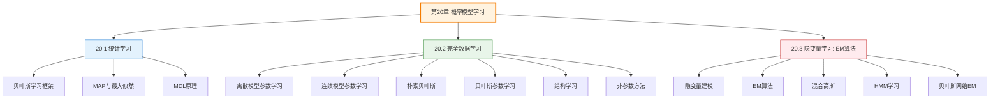
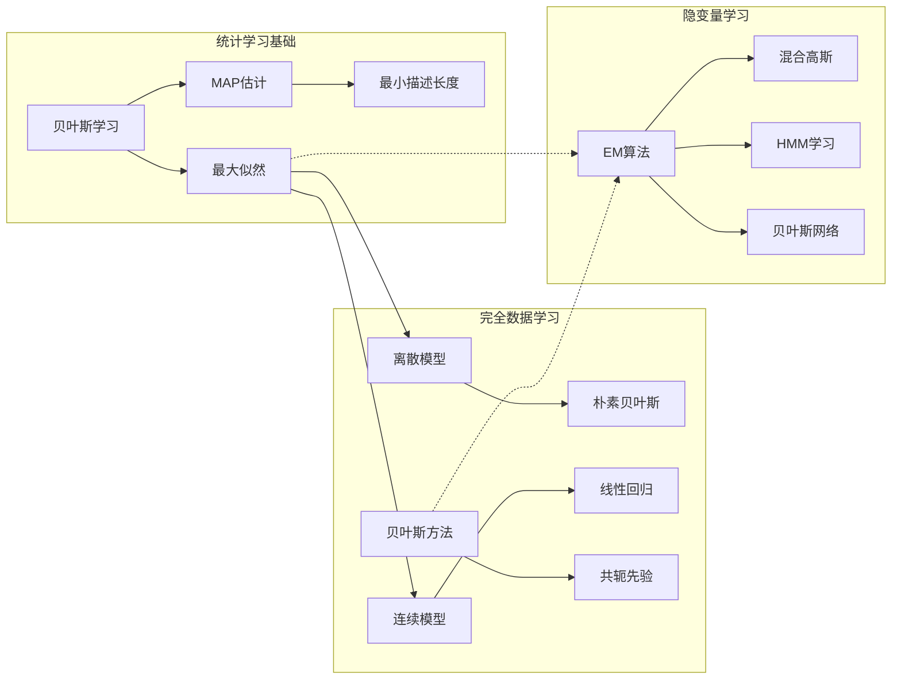
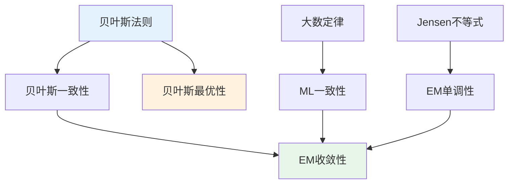

# 第20章 概率模型学习 - 概览与总结

> 本章将学习视为从不确定观测中进行概率推断的过程，建立了统计学习的完整理论框架。

---

## 学习目标

完成本章学习后，你将能够：

1. **理解统计学习的理论基础**
   - 掌握贝叶斯学习框架
   - 理解MAP和最大似然估计
   - 认识最小描述长度原理

2. **掌握完全数据学习方法**
   - 离散模型的最大似然参数学习
   - 连续模型（高斯、线性回归）的参数估计
   - 贝叶斯参数学习与共轭先验

3. **应用EM算法处理隐变量**
   - 理解EM算法的E步和M步
   - 实现混合高斯模型的聚类
   - 学习隐马尔可夫模型和贝叶斯网络的参数

4. **评估和选择模型**
   - 理解模型复杂性与拟合度的权衡
   - 掌握结构学习的基本方法
   - 了解非参数密度估计

---

## 本章速览

### 章节结构



### 核心概念地图



---

## 难度预警

| 章节 | 难度 | 关键挑战 | 建议学习时间 |
|------|:----:|----------|:------------:|
| 20.1 统计学习 | ⭐⭐ | 理解贝叶斯框架的哲学基础 | 90分钟 |
| 20.2 完全数据学习 | ⭐⭐⭐ | 掌握各种参数估计方法 | 120分钟 |
| 20.3 隐变量学习 | ⭐⭐⭐⭐ | 理解EM算法的收敛性证明 | 150分钟 |

**总体难度**: ⭐⭐⭐（中等偏上）

**主要难点**:
1. 贝叶斯与频率学派的思想差异
2. 共轭先验的数学推导
3. EM算法的收敛性证明
4. 隐变量模型的可辨识性问题

---

## 前置知识

### 必须掌握

| 知识项 | 来源 | 重要性 |
|--------|------|:------:|
| 概率论基础 | 第12章、附录A | ⭐⭐⭐⭐⭐ |
| 贝叶斯网络 | 第13章 | ⭐⭐⭐⭐⭐ |
| 假设空间概念 | 第19章 | ⭐⭐⭐⭐ |
| 微积分与优化 | 数学基础 | ⭐⭐⭐⭐ |

### 有助于理解

| 知识项 | 来源 | 重要性 |
|--------|------|:------:|
| 隐马尔可夫模型 | 14.3节 | ⭐⭐⭐ |
| 信息论基础 | 19.3.3节 | ⭐⭐⭐ |
| 线性代数 | 数学基础 | ⭐⭐⭐ |

---

## 节依赖图

```
第20章 概率模型学习
│
├── 20.1 统计学习 [基础]
│   ├── 贝叶斯学习框架
│   ├── MAP/ML估计
│   └── MDL原理
│   │
│   └── 输出: 学习理论基础
│
├── 20.2 完全数据学习 [依赖20.1]
│   ├── 离散模型参数学习
│   ├── 连续模型参数学习
│   ├── 朴素贝叶斯
│   ├── 贝叶斯参数学习
│   └── 结构学习/非参数方法
│   │
│   └── 输出: 参数估计方法
│
└── 20.3 隐变量学习 [依赖20.1, 20.2]
    ├── 隐变量建模
    ├── EM算法
    ├── 混合高斯
    ├── HMM学习
    └── 贝叶斯网络EM
    │
    └── 输出: 不完全数据学习方法
```

**学习路径建议**:
1. 先掌握20.1的贝叶斯框架
2. 再学习20.2的各种参数估计方法
3. 最后理解20.3的EM算法（M步需要20.2的知识）

---

## 定理清单

### 20.1 统计学习

| 定理 | 名称 | 核心内容 | 重要性 |
|------|------|----------|:------:|
| 定理20.1.1 | 贝叶斯一致性 | 后验概率收敛到真实假设 | ⭐⭐⭐⭐ |
| 定理20.1.2 | 贝叶斯预测最优性 | 贝叶斯预测最小化期望损失 | ⭐⭐⭐⭐⭐ |
| 定理20.1.3 | 奥卡姆剃刀MAP实现 | MAP自动选择最简单的一致假设 | ⭐⭐⭐ |

### 20.2 完全数据学习

| 定理 | 名称 | 核心内容 | 重要性 |
|------|------|----------|:------:|
| 定理20.2.1 | ML估计一致性 | ML估计依概率收敛到真实参数 | ⭐⭐⭐⭐ |
| 定理20.2.2 | Beta共轭性 | Beta分布是伯努利的共轭先验 | ⭐⭐⭐⭐ |
| 定理20.2.3 | 高斯ML估计 | 样本均值/方差是高斯ML估计 | ⭐⭐⭐⭐⭐ |

### 20.3 隐变量学习

| 定理 | 名称 | 核心内容 | 重要性 |
|------|------|----------|:------:|
| 定理20.3.1 | EM单调性 | EM保证似然不减少 | ⭐⭐⭐⭐⭐ |
| 定理20.3.2 | EM收敛性 | EM收敛到局部最优 | ⭐⭐⭐⭐⭐ |

---

## 核心逻辑线索

### 主线：从理论到实践

```
贝叶斯学习框架
    ↓
完全数据参数估计
    ↓
隐变量学习（EM算法）
    ↓
实际应用
```

### 副线：方法谱系

```
贝叶斯学习（精确但复杂）
    ↓
MAP学习（单一假设近似）
    ↓
最大似然学习（均匀先验/大数据）
```

### 副线：数据完整性

```
完全数据学习（简单，可分解）
    ↓
隐变量学习（EM算法迭代）
    ↓
一般缺失数据（更复杂的方法）
```

---

## 核心要点速查

### 贝叶斯学习

```
后验 ∝ 似然 × 先验

预测 = Σ 假设预测 × 后验概率
```

### MAP vs ML

| 方法 | 目标 | 先验 | 适用场景 |
|------|------|------|----------|
| ML | max P(D\|θ) | 均匀 | 大数据 |
| MAP | max P(D\|θ)P(θ) | 任意 | 一般情况 |

### EM算法

```
E步: 计算隐变量后验期望
M步: 基于期望更新参数

保证: 似然单调不减
```

---

## 概念对比表

### 贝叶斯学习 vs 频率学派

| 维度 | 贝叶斯学习 | 频率学派 |
|------|-----------|----------|
| 概率解释 | 信念程度 | 长期频率 |
| 参数 | 随机变量 | 固定未知常数 |
| 先验 | 必要组成部分 | 避免使用 |
| 估计结果 | 后验分布 | 点估计 |
| 小数据表现 | 更好（利用先验） | 可能过拟合 |

### 生成模型 vs 判别模型

| 维度 | 生成模型 | 判别模型 |
|------|----------|----------|
| 学习目标 | P(X,Y) 或 P(X\|Y) | P(Y\|X) |
| 数据需求 | 较少（利用结构） | 较多 |
| 能否生成样本 | 能 | 不能 |
| 典型代表 | 朴素贝叶斯、HMM | 逻辑回归、SVM |
| 极限性能 | 次优 | 更优 |

### ML vs MAP vs 贝叶斯

| 方法 | 计算复杂度 | 精度 | 适用场景 |
|------|:----------:|:----:|----------|
| 贝叶斯 | 高 | 最高 | 小数据、重要决策 |
| MAP | 中 | 高 | 平衡精度与效率 |
| ML | 低 | 渐近最优 | 大数据、快速原型 |

---

## 定理依赖图



---

## 常见误解澄清

### 误解1: 贝叶斯方法太主观

**正确理解**: 先验可以编码领域知识，大数据时先验影响减小，不同合理先验通常导致相似结论。

### 误解2: EM算法太慢

**正确理解**: EM没有步长参数，收敛稳定；对于某些问题比梯度方法更快；可以使用加速技巧。

### 误解3: 朴素贝叶斯太简单，不实用

**正确理解**: 尽管条件独立假设通常不成立，朴素贝叶斯在实践中表现惊人地好，是文本分类等领域的标准工具。

### 误解4: 最大似然总是最优的

**正确理解**: ML是渐近最优，小数据时可能过拟合；贝叶斯/MAP方法通过先验提供正则化。

---

## 本章测验

### 快速检查

1. 贝叶斯预测与MAP预测的主要区别是什么？
2. 为什么完全数据下贝叶斯网络的参数学习可以分解？
3. EM算法的E步和M步分别做什么？
4. 什么是共轭先验？举一个例子。
5. 生成模型和判别模型的主要区别是什么？

### 深度思考

1. 在什么情况下贝叶斯预测比MAP预测的优势最明显？
2. 为什么EM算法只能保证收敛到局部最优？有哪些应对策略？
3. 比较ML、MAP和贝叶斯方法在小数据集和大数据集上的表现差异。

---

## 快速复习卡

### 关键公式

| 公式 | 用途 |
|------|------|
| $P(h\|d) \propto P(d\|h)P(h)$ | 贝叶斯更新 |
| $P(X\|d) = \sum_i P(X\|h_i)P(h_i\|d)$ | 贝叶斯预测 |
| $\hat{\theta}_{ML} = \arg\max_\theta P(d\|\theta)$ | 最大似然 |
| $Q(\theta\|\theta^{(t)}) = \mathbb{E}[\log P(X,Z\|\theta)]$ | EM的Q函数 |

### 关键算法

| 算法 | 核心思想 | 适用场景 |
|------|----------|----------|
| 贝叶斯学习 | 假设加权平均 | 小数据、不确定性量化 |
| MAP | 最大后验假设 | 平衡精度与计算 |
| ML | 最大似然 | 大数据、快速估计 |
| EM | E步+M步迭代 | 隐变量模型 |

### 关键概念

| 概念 | 一句话解释 |
|------|-----------|
| 共轭先验 | 使后验与先验同族的先验分布 |
| 密度估计 | 从数据学习概率分布 |
| 隐变量 | 不可直接观测的潜在变量 |
| 可辨识性 | 参数能否从数据中唯一确定 |
| 隶属概率 | 数据点属于某分量的概率 |

---

## 扩展阅读

### 理论基础

1. **《Pattern Recognition and Machine Learning》** (Bishop, 2006)
   - 第9章: 混合模型和EM算法
   - 第10章: 近似推断

2. **《Bayesian Data Analysis》** (Gelman et al.)
   - 贝叶斯统计的权威参考

3. **《The EM Algorithm and Extensions》** (McLachlan & Krishnan, 1997)
   - EM算法的全面专著

### 应用实践

1. **《Machine Learning: A Probabilistic Perspective》** (Murphy, 2012)
   - 第11章: 混合模型和EM
   - 第17章: 隐变量模型

2. **《Probabilistic Graphical Models》** (Koller & Friedman, 2009)
   - 第19章: 部分观测数据学习

### 前沿研究

1. 变分自编码器（VAE）: 深度生成模型中的EM思想
2. 神经变分推断: 结合深度学习与变分方法
3. 因果推断中的隐变量方法

---

## 本章总结

第20章建立了**概率模型学习**的完整理论框架：

### 核心贡献

1. **统一框架**: 将学习视为概率推断，统一了贝叶斯、MAP和最大似然方法
2. **实用算法**: 提供了从完全数据到隐变量数据的各种学习算法
3. **理论保证**: 证明了贝叶斯预测的最优性和EM算法的收敛性

### 关键洞察

- **贝叶斯视角**: 学习是不确定性下的理性更新
- **复杂性权衡**: 模型复杂度与数据拟合需要平衡
- **隐变量力量**: 隐变量可以简化模型结构，揭示数据的潜在模式

### 实践指导

- **小数据**: 优先使用贝叶斯方法，利用先验知识
- **大数据**: ML估计通常足够，计算简单
- **隐变量**: EM算法是首选，注意局部最优问题

---

> 📚 **章节导航**
> 
> - [20.1 统计学习](20.1_统计学习.md)
> - [20.2 完全数据学习](20.2_完全数据学习.md)
> - [20.3 隐变量学习：EM算法](20.3_隐变量学习_EM算法.md)
