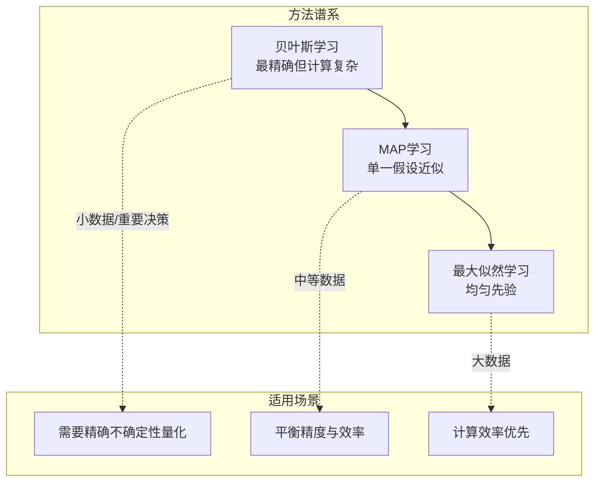
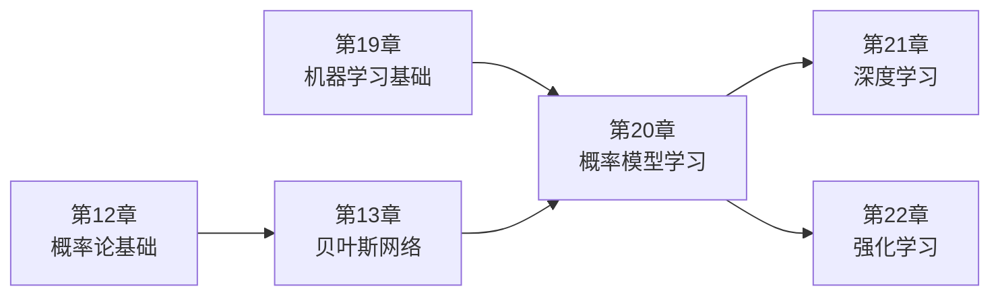

# 20.1 统计学习

## 一、背景与动机

### 1.1 从确定性到不确定性

在人工智能的发展历程中，早期研究主要关注确定性推理和逻辑推断。然而，现实世界充满了不确定性——传感器数据存在噪声、观测信息不完整、因果关系复杂交织。第12章和第13章已经阐述了概率论和决策论为处理不确定性提供了坚实的数学基础，但这些方法的前提是智能体已经掌握了关于世界的概率知识。那么，智能体如何**从经验中学习**这些概率知识呢？这正是统计学习要回答的核心问题。

统计学习将学习视为一种**从不确定观测中进行概率推断**的过程。与传统的逻辑学习不同，统计学习承认我们无法从有限的数据中获得绝对确定的结论，而是应该量化各种假设的可能性，并在此基础上做出最优预测。

### 1.2 学习即推断的范式转变

统计学习带来了一个深刻的范式转变：**学习即推断**（Learning as Inference）。在这一框架下：
- **数据**被视为关于世界的**证据**（evidence）
- **假设**是关于世界如何运作的**概率理论**
- **学习**就是根据观测数据更新对各种假设的信念程度

这种视角统一了机器学习和概率推理，使得我们可以用贝叶斯推断的框架来处理学习问题。

### 1.3 糖果问题的启示

本章以"惊喜糖果"问题引入统计学习：
- 糖果有樱桃味（好吃）和酸橙味（难吃）两种
- 包装袋外观相同，但内部口味比例有5种可能：100%樱桃、75%樱桃+25%酸橙、50-50、25%樱桃+75%酸橙、100%酸橙
- 智能体通过逐颗品尝来推断袋子类型，并预测下一颗糖果的口味

这个看似简单的例子揭示了统计学习的核心挑战：
1. **假设空间**：存在多个可能的理论（5种袋子类型）
2. **证据累积**：观测数据逐步揭示真相
3. **预测不确定性**：即使有了数据，预测仍存在不确定性
4. **最优决策**：如何在不确定性下做出最优预测

## 二、知识逻辑图谱

```mermaid
graph TD
    A[统计学习] --> B[贝叶斯学习]
    A --> C[MAP学习]
    A --> D[最大似然学习]
    
    B --> B1[假设先验 P(h)]
    B --> B2[数据似然 P(d|h)]
    B --> B3[后验概率 P(h|d)]
    B --> B4[全假设加权预测]
    
    C --> C1[最大后验假设 h_MAP]
    C --> C2[单一假设近似]
    C --> C3[复杂度惩罚]
    
    D --> D1[均匀先验假设]
    D --> D2[最大化 P(d|h)]
    D --> D3[大数据极限]
    
    B1 --> E[奥卡姆剃刀]
    B2 --> E
    C3 --> E
    
    E --> F[最小描述长度 MDL]
    
    style A fill:#f9f,stroke:#333,stroke-width:2px
    style B fill:#bbf,stroke:#333
    style E fill:#bfb,stroke:#333
```

```mermaid
graph LR
    subgraph 贝叶斯学习流程
        D[观测数据 d] -->|贝叶斯法则| P[计算后验 P(h|d)]
        P -->|加权平均| Pred[预测 P(X|d)]
    end
    
    subgraph 预测公式
        Pred ==>|"$P(X|d) = \\sum_i P(X|h_i)P(h_i|d)$"| Out[最终预测]
    end
    
    style D fill:#e1f5fe
    style P fill:#fff3e0
    style Pred fill:#e8f5e9
```

## 三、核心概念与数学分析

### 3.1 贝叶斯学习的数学框架

#### 3.1.1 基本设定

设：
- $\mathcal{H} = \{h_1, h_2, \ldots, h_n\}$ 为假设空间
- $\mathbf{d} = (d_1, d_2, \ldots, d_N)$ 为观测数据
- $X$ 为待预测的未知量

#### 3.1.2 贝叶斯法则

贝叶斯学习的核心是**贝叶斯法则**：

$$P(h_i | \mathbf{d}) = \alpha P(\mathbf{d} | h_i) P(h_i) \tag{20-1}$$

其中：
- $P(h_i)$ 是假设 $h_i$ 的**先验概率**（prior）
- $P(\mathbf{d} | h_i)$ 是在假设 $h_i$ 下数据的**似然**（likelihood）
- $P(h_i | \mathbf{d})$ 是给定数据后假设的**后验概率**（posterior）
- $\alpha = 1/P(\mathbf{d})$ 是归一化常数

#### 3.1.3 贝叶斯预测

对于未知量 $X$ 的预测，贝叶斯方法通过对所有假设加权平均得到：

$$P(X | \mathbf{d}) = \sum_i P(X | h_i) P(h_i | \mathbf{d}) \tag{20-2}$$

这个公式体现了贝叶斯学习的核心思想：**不依赖单一最佳假设，而是综合所有假设的贡献**，权重由后验概率决定。

### 3.2 似然计算

在独立同分布（i.i.d.）假设下，数据的似然可以分解为：

$$P(\mathbf{d} | h_i) = \prod_{j=1}^N P(d_j | h_i) \tag{20-3}$$

**糖果问题示例**：
- 假设袋子类型为 $h_3$（50%樱桃，50%酸橙）
- 连续观测到10颗酸橙味糖果
- 似然为：$P(\mathbf{d} | h_3) = 0.5^{10} \approx 0.00098$

### 3.3 MAP学习（最大后验学习）

#### 3.3.1 定义

MAP学习选择使后验概率最大的假设：

$$h_{MAP} = \arg\max_{h_i} P(h_i | \mathbf{d}) = \arg\max_{h_i} P(\mathbf{d} | h_i) P(h_i)$$

#### 3.3.2 与贝叶斯学习的区别

| 特性 | 贝叶斯学习 | MAP学习 |
|------|-----------|---------|
| 假设使用 | 所有假设加权 | 单一最佳假设 |
| 计算复杂度 | 高（需对所有假设求和/积分） | 较低（只需优化） |
| 近似程度 | 精确 | 近似 |
| 大数据行为 | 收敛到真实分布 | 收敛到贝叶斯预测 |

#### 3.3.3 对数形式与复杂度惩罚

对式(20-1)取对数，MAP等价于最小化：

$$-\log_2 P(\mathbf{d} | h_i) - \log_2 P(h_i)$$

这揭示了MAP学习的深层含义：
- $-\log_2 P(h_i)$：描述假设所需的**编码长度**
- $-\log_2 P(\mathbf{d} | h_i)$：给定假设时描述数据所需的**额外编码长度**

因此，MAP学习选择**能够最大程度压缩数据**的假设。

### 3.4 最小描述长度（MDL）

MDL原则直接与编码长度相关：

$$h_{MDL} = \arg\min_{h_i} \left[ L(h_i) + L(\mathbf{d} | h_i) \right]$$

其中 $L(\cdot)$ 表示在二进制编码中的描述长度。

**MAP与MDL的关系**：
- MAP通过先验概率体现简单性偏好
- MDL通过直接计算编码长度体现简单性
- 两者在信息论意义下等价

### 3.5 最大似然学习（ML）

#### 3.5.1 定义

当假设先验为均匀分布时，MAP退化为最大似然：

$$h_{ML} = \arg\max_{h_i} P(\mathbf{d} | h_i)$$

#### 3.5.2 适用场景

- 没有先验知识偏好任何假设
- 所有假设复杂度相同
- **大数据集**（此时先验被数据淹没）

#### 3.5.3 小数据集问题

最大似然在小数据集上可能产生**过拟合**：
- 观测到1颗樱桃味糖果 $\Rightarrow$ 推断袋子100%是樱桃味
- 忽略了其他可能性

## 四、定理与证明

### 定理1：贝叶斯一致性定理

**定理陈述**：对于任何固定的先验分布，如果真实的假设 $h^*$ 在先验中具有非零概率（即 $P(h^*) > 0$），则在一定的技术条件下，当观测数据趋于无穷时，错误假设的后验概率趋于零：

$$\lim_{N \to \infty} P(h_i | \mathbf{d}) = 0 \quad \text{对于所有 } h_i \neq h^*$$

**证明思路**：

1. 由大数定律，当 $N \to \infty$ 时，数据的经验分布收敛于真实分布
2. 对于 $h_i \neq h^*$，似然比 $P(\mathbf{d} | h_i) / P(\mathbf{d} | h^*)$ 依概率指数衰减
3. 由贝叶斯法则，后验概率比满足：
   $$\frac{P(h_i | \mathbf{d})}{P(h^* | \mathbf{d})} = \frac{P(h_i)}{P(h^*)} \cdot \frac{P(\mathbf{d} | h_i)}{P(\mathbf{d} | h^*)}$$
4. 第二项依概率趋于0，因此 $P(h_i | \mathbf{d}) \to 0$

**直观理解**：无限生成"反常"数据的概率极小，真实假设终将胜出。

### 定理2：贝叶斯预测最优性

**定理陈述**：给定假设先验后，贝叶斯预测在期望意义下是最优的——任何其他预测方法都不太可能更准确。

**形式化表述**：

设 $\hat{P}(X | \mathbf{d})$ 为任意预测分布，$P^*(X | \mathbf{d})$ 为贝叶斯预测，则：

$$\mathbb{E}_{\mathbf{d}} \left[ D_{KL}(P_{true} || P^*) \right] \leq \mathbb{E}_{\mathbf{d}} \left[ D_{KL}(P_{true} || \hat{P}) \right]$$

其中 $D_{KL}$ 是KL散度，衡量两个分布之间的差异。

### 定理3：奥卡姆剃刀的MAP实现

**定理陈述**：对于确定性假设空间（$h_i$ 要么完全预测数据，要么完全不预测），MAP学习自动实现奥卡姆剃刀——选择与数据一致的最简单假设。

**证明**：

对于确定性假设：
- 若 $h_i$ 与数据一致：$P(\mathbf{d} | h_i) = 1$
- 若 $h_i$ 与数据不一致：$P(\mathbf{d} | h_i) = 0$

因此，MAP从一致的假设中选择先验概率最大的。如果先验满足：
- 更简单的假设具有更高的先验概率
- 则MAP自动选择最简单的一致假设

## 五、具体示例

### 5.1 糖果问题完整分析

**问题设定**：
- 5种袋子类型 $h_1, h_2, h_3, h_4, h_5$
- 先验分布：$\langle 0.1, 0.2, 0.4, 0.2, 0.1 \rangle$
- 连续观测到10颗酸橙味糖果

**计算过程**：

**步骤1：计算各假设的似然**

假设 $h_i$ 中酸橙比例为 $\theta_i$：

| 假设 | 酸橙比例 $\theta_i$ | 似然 $P(\mathbf{d}|h_i) = \theta_i^{10}$ |
|------|-------------------|-------------------------------------|
| $h_1$ | 0.0 | $0$ |
| $h_2$ | 0.25 | $9.54 \times 10^{-7}$ |
| $h_3$ | 0.50 | $9.77 \times 10^{-4}$ |
| $h_4$ | 0.75 | $5.63 \times 10^{-2}$ |
| $h_5$ | 1.0 | $1$ |

**步骤2：计算非归一化后验**

$$P(h_i | \mathbf{d}) \propto P(\mathbf{d} | h_i) P(h_i)$$

| 假设 | 先验 $P(h_i)$ | 非归一化后验 |
|------|--------------|-------------|
| $h_1$ | 0.1 | 0 |
| $h_2$ | 0.2 | $1.91 \times 10^{-7}$ |
| $h_3$ | 0.4 | $3.91 \times 10^{-4}$ |
| $h_4$ | 0.2 | $1.13 \times 10^{-2}$ |
| $h_5$ | 0.1 | $0.1$ |

**步骤3：归一化**

总和 $\approx 0.1113$

归一化后验：
- $P(h_1 | \mathbf{d}) \approx 0$
- $P(h_2 | \mathbf{d}) \approx 0$
- $P(h_3 | \mathbf{d}) \approx 0.0035$
- $P(h_4 | \mathbf{d}) \approx 0.101$
- $P(h_5 | \mathbf{d}) \approx 0.898$

**步骤4：贝叶斯预测**

下一颗糖果为酸橙味的概率：

$$P(D_{11} = \text{lime} | \mathbf{d}) = \sum_{i=1}^5 \theta_i \cdot P(h_i | \mathbf{d})$$

$$= 0 \times 0 + 0.25 \times 0 + 0.5 \times 0.0035 + 0.75 \times 0.101 + 1.0 \times 0.898$$

$$\approx 0.975$$

**对比MAP预测**：
- MAP假设：$h_5$（全酸橙袋）
- MAP预测：$P(\text{lime}) = 1.0$
- 贝叶斯预测：$P(\text{lime}) \approx 0.975$

贝叶斯预测更保守，考虑了其他假设的可能性。

### 5.2 连续假设空间

当樱桃比例 $\theta$ 可以是 $[0,1]$ 中任意值时，假设空间变为连续的。

**贝叶斯方法**：
- 指定先验分布 $P(\theta)$（如均匀分布或Beta分布）
- 计算后验分布 $P(\theta | \mathbf{d})$
- 预测：$P(X | \mathbf{d}) = \int P(X | \theta) P(\theta | \mathbf{d}) d\theta$

**MAP方法**：
- $h_{MAP} = \arg\max_\theta P(\mathbf{d} | \theta) P(\theta)$
- 若先验均匀：$h_{ML} = \arg\max_\theta P(\mathbf{d} | \theta)$

对于 $c$ 颗樱桃、$\ell$ 颗酸橙的数据：

$$\theta_{ML} = \frac{c}{c + \ell}$$

这就是**样本比例**——最大似然估计的经典结果。

## 六、一句话本质

> **统计学习的本质：在不确定性的世界中，通过概率推断将数据转化为知识，用贝叶斯法则实现从先验信念到后验信念的理性更新，并在假设复杂度与数据拟合之间寻求最优平衡。**

## 七、总结与反思

### 7.1 核心要点回顾

1. **贝叶斯学习框架**
   - 学习 = 概率推断
   - 预测 = 全假设加权平均
   - 最优性：在期望意义下最优

2. **MAP学习**
   - 单一最佳假设近似
   - 等价于复杂度惩罚 + 数据拟合
   - 体现奥卡姆剃刀原则

3. **最大似然学习**
   - 均匀先验下的MAP
   - 大数据极限下的良好近似
   - 小数据集可能过拟合

4. **最小描述长度**
   - 信息论视角的学习
   - 压缩即智能
   - 与MAP等价

### 7.2 方法对比



### 7.3 哲学反思

**贝叶斯学习vs频率学派**：
- 贝叶斯学派：概率是信念程度，先验反映主观知识
- 频率学派：概率是长期频率，避免主观先验

**实用主义视角**：
- 大数据时两者趋同
- 小数据时先验知识至关重要
- 贝叶斯框架提供了统一处理不确定性的语言

**学习的极限**：
- 非全知智能体无法确定哪个理论正确
- 但必须在不确定性下做出决策
- 贝叶斯方法提供了理性决策的数学基础

### 7.4 本章在全书中的位置



第20章架起了概率推理与机器学习的桥梁，为后续学习复杂概率模型（如贝叶斯网络、隐马尔可夫模型）奠定了理论基础。

### 7.5 延伸阅读建议

1. **理论基础**：Jaynes《Probability Theory: The Logic of Science》
2. **贝叶斯统计**：Gelman et al.《Bayesian Data Analysis》
3. **信息论学习**：MacKay《Information Theory, Inference, and Learning Algorithms》
4. **实践应用**：Bishop《Pattern Recognition and Machine Learning》
