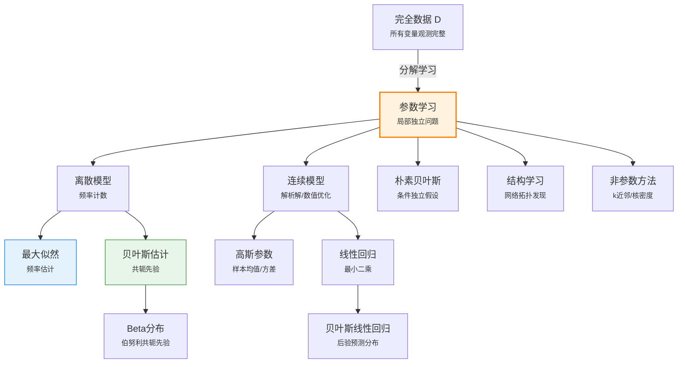

# 20.2 完全数据学习

> 📖 本节 Deep Dive | 预计学习时间: 120 分钟

---

## 1. 背景与动机

### 1.1 历史背景

**学科演进脉络**

完全数据学习是统计学习理论向实际应用转化的关键一步。在20.1节建立的贝叶斯学习框架基础上，本节聚焦于一个核心问题：当数据完整观测时，如何有效地学习概率模型的参数？这一问题的研究可以追溯到20世纪初统计学的形成时期，但其在人工智能领域的系统应用则是随着概率图模型的发展而成熟的。

20世纪80年代，Judea Pearl提出贝叶斯网络后，研究者开始关注如何从这些网络结构中自动学习参数。早期的工作主要集中在最大似然估计，因为它计算简单且有良好的统计性质。然而，最大似然在小数据集上的过拟合问题促使研究者重新审视贝叶斯方法，特别是共轭先验的使用，这使得后验计算变得可行。

进入21世纪，随着数据规模的爆炸式增长，完全数据学习算法得到了广泛应用。朴素贝叶斯分类器因其简单高效而成为文本分类等领域的标准工具；线性高斯模型为回归分析提供了概率基础；而非参数方法如核密度估计则为复杂分布的建模提供了灵活手段。

**里程碑事件**:

| 年份 | 人物/事件 | 贡献 | 影响 |
|------|-----------|------|------|
| 1922 | R.A. Fisher | 系统发展最大似然估计理论 | 确立了频率学派参数估计的基础 |
| 1950s | 朴素贝叶斯 | 在文本分类中应用 | 最简单的贝叶斯网络形式 |
| 1988 | Judea Pearl | 贝叶斯网络提出 | 为结构化概率模型学习奠定基础 |
| 1990s | 贝叶斯网络学习 | 参数与结构学习算法发展 | 使复杂模型学习成为可能 |
| 2002 | Ng & Jordan | 生成模型vs判别模型比较 | 澄清了两类模型的适用场景 |

**演进动机**:
- **早期方法**: 简单的频率计数和直观估计
- **局限性**: 缺乏系统性框架，难以处理复杂模型
- **突破**: 统一的概率框架，结合最大似然与贝叶斯方法

### 1.2 研究动机

**为什么研究者关注这个主题？**

完全数据学习是概率模型学习的基石，其重要性体现在以下几个方面：

1. **理论意义**: 完全数据情形是最简单的学习场景，理解这一情形为解决更复杂的隐变量学习问题奠定基础。许多重要的统计概念（如充分统计量、共轭先验）在完全数据情形下最为清晰。

2. **方法创新**: 完全数据学习发展出了多种参数估计方法——从简单的最大似然到复杂的贝叶斯推断，从参数化模型到非参数方法。这些方法构成了机器学习工具箱的核心组件。

3. **实际应用**: 尽管现实世界常存在缺失数据，但完全数据学习算法仍是许多应用的首选。朴素贝叶斯文本分类、高斯混合模型的初始化、贝叶斯网络的结构学习等都依赖于完全数据学习作为子程序。

**与其他领域的关系**:
- **与统计学的联系**: 最大似然估计、贝叶斯推断是经典统计学的核心内容
- **与信息论的交叉**: 最小描述长度原理、编码理论为模型选择提供了新视角
- **与优化的结合**: 参数估计常转化为优化问题，需要数值方法求解

### 1.3 实际应用场景

| 应用领域 | 具体问题 | 本节理论的作用 | 预期效果 |
|----------|----------|----------------|----------|
| 文本分类 | 垃圾邮件识别、情感分析 | 朴素贝叶斯模型 | 快速准确的分类 |
| 医疗诊断 | 疾病风险评估 | 贝叶斯网络参数学习 | 量化诊断不确定性 |
| 金融预测 | 股票价格建模 | 线性高斯模型 | 趋势分析与预测 |
| 图像处理 | 像素值分布建模 | 非参数密度估计 | 灵活的分布拟合 |
| 推荐系统 | 用户偏好建模 | 离散/连续混合模型 | 个性化推荐 |

**典型案例预览**:
> 通过糖果包装颜色与口味的关联学习，我们将看到如何从完全数据中估计贝叶斯网络的参数。这个例子展示了参数学习的核心思想：在完全数据下，复杂模型的学习可以分解为独立的局部学习问题。

### 1.4 先决条件

**学习本节需要的前置知识**:

| 知识项 | 来源 | 掌握程度要求 | 关键概念 |
|--------|------|:------------:|----------|
| 贝叶斯学习框架 | 20.1节 | 必须熟练掌握 | 先验、似然、后验 |
| 贝叶斯网络 | 第13章 | 理解即可 | 条件概率表、图结构 |
| 微积分与优化 | 数学基础 | 熟练掌握 | 求导、极值、梯度 |
| 概率分布 | 附录A | 理解即可 | 高斯分布、Beta分布 |

**前置检查清单**:
- [ ] 能够计算简单贝叶斯网络中的条件概率
- [ ] 理解最大似然估计的基本思想
- [ ] 能够求解简单的优化问题（求导=0）
- [ ] 熟悉常见概率分布（伯努利、高斯）

---

## 2. 知识逻辑图谱

### 2.1 概念关系图



### 2.2 知识发展依赖链

```
【基础层】           【发展层】              【高潮层】             【应用层】
    ↓                   ↓                     ↓                   ↓
┌─────────┐      ┌─────────────┐       ┌───────────┐      ┌──────────┐
│ 贝叶斯  │ ──→  │ 完全数据    │  ──→  │ 参数学习  │ ──→  │ 实际模型 │
│ 学习    │      │ 学习框架    │       │ 算法      │      │ 应用     │
│ 框架    │      │             │       │           │      │          │
│         │      │ • 离散模型  │       │ • ML估计  │      │ • 文本   │
│ • 先验  │      │ • 连续模型  │       │ • MAP估计 │      │   分类   │
│ • 似然  │      │ • 混合模型  │       │ • 贝叶斯  │      │ • 诊断   │
│ • 后验  │      │             │       │   推断   │      │ • 预测   │
└─────────┘      └─────────────┘       └───────────┘      └──────────┘
     │                   │                   │                │
     └───────────────────┴───────────────────┴────────────────┘
                         知识演进脉络
```

**依赖链详解**:
1. **基础**: 贝叶斯学习框架（20.1节）
2. **发展**: 完全数据学习的具体方法（离散、连续、混合）
3. **高潮**: 参数估计算法（ML、MAP、贝叶斯）
4. **应用**: 实际模型应用（分类、诊断、预测）

### 2.3 本节在章节中的位置

```
第 20 章: 概率模型学习
├── 20.1 统计学习 ← 前置知识
│   └── [核心概念: 贝叶斯框架、MAP/ML]
│
├── 20.2 完全数据学习 ← ⭐ 当前位置
│   ├── [核心概念: 参数学习、密度估计]
│   ├── [核心方法: ML/MAP/贝叶斯参数估计]
│   └── [应用: 朴素贝叶斯、线性回归]
│
└── 20.3 隐变量学习: EM算法 ← 后续发展
    └── [将本节扩展至: 不完全数据学习]
```

**衔接说明**:
- **从前一节继承**: 20.1节的贝叶斯学习框架为参数估计提供了理论基础
- **为后一节铺垫**: 完全数据学习是EM算法中M步的基础

---

## 3. 核心概念与数学分析

### 3.1 核心术语定义

**定义 20.2.1** (密度估计 / Density Estimation):

> **正式定义**: 密度估计是从观测数据中学习概率模型的任务，目标是找到一个概率分布 $P$ 使其最好地解释观测数据的生成过程。

**定义详解**:
- **直观解释**: 根据样本数据推断总体的概率分布
- **数学表述**: 给定样本 $\mathbf{d} = (d_1, ..., d_N)$，估计概率密度函数 $P(x)$ 或概率质量函数
- **为什么这样定义**: 密度估计是统计学习的核心任务，为分类、回归、聚类等任务提供基础

**定义中的关键要素**:
| 要素 | 符号 | 含义 | 约束条件 |
|------|------|------|----------|
| 数据 | $\mathbf{d}$ | 观测样本集 | i.i.d.假设（通常）|
| 模型族 | $\mathcal{P}$ | 候选概率分布集合 | 参数化或非参数化 |
| 估计量 | $\hat{P}$ | 学习到的分布 | 应接近真实分布 |

---

**定义 20.2.2** (参数学习 / Parameter Learning):

> **正式定义**: 对于具有固定结构的概率模型，参数学习是确定模型参数取值的过程，使得模型最好地拟合观测数据。

**定义详解**:
- **直观解释**: 给定模型"形状"，调整"旋钮"使其匹配数据
- **数学表述**: 对于参数化模型 $P(x|\theta)$，寻找最优参数 $\hat{\theta}$
- **等价形式**: 可以基于最大似然、最大后验或完全贝叶斯方法

**示例**: 在贝叶斯网络中，参数学习就是估计各节点的条件概率表（CPT）。

---

**定义 20.2.3** (共轭先验 / Conjugate Prior):

> **正式定义**: 对于似然函数 $P(\mathbf{d}|\theta)$，若先验分布 $P(\theta)$ 与后验分布 $P(\theta|\mathbf{d})$ 属于同一分布族，则称该先验为似然的共轭先验。

**定义详解**:
- **直观解释**: 共轭先验使得贝叶斯更新保持分布形式不变，仅更新参数
- **数学表述**: 若 $P(\theta) \in \mathcal{F}$ 且 $P(\theta|\mathbf{d}) \in \mathcal{F}$，则先验是共轭的
- **重要性**: 大大简化了贝叶斯推断的计算

**常见共轭先验对**:
| 似然 | 共轭先验 | 后验 |
|------|----------|------|
| 伯努利/Binomial | Beta | Beta |
| 多项式/Multinomial | Dirichlet | Dirichlet |
| 高斯（已知方差）| 高斯 | 高斯 |
| 高斯（已知均值）| 逆Gamma | 逆Gamma |
| 泊松 | Gamma | Gamma |

---

**定义 20.2.4** (生成模型与判别模型 / Generative vs Discriminative Models):

> **正式定义**: 生成模型学习联合分布 $P(X, Y)$ 或类条件分布 $P(X|Y)$；判别模型直接学习决策边界 $P(Y|X)$。

**定义详解**:
- **生成模型**: 建模 $P(X|Y)P(Y)$，可以生成新样本
- **判别模型**: 直接建模 $P(Y|X)$，专注于分类边界
- **权衡**: 生成模型在小数据时表现更好，判别模型在极限情况下更优

---

### 3.2 符号系统与约定

**本节符号总表**:

| 符号 | 含义 | 数学表达 | 备注 |
|:----:|------|----------|------|
| $\theta$ | 模型参数 | $\theta \in \Theta$ | 可以是向量 |
| $L(\theta)$ | 对数似然 | $\log P(\mathbf{d}|\theta)$ | 最大化目标 |
| $\hat{\theta}_{ML}$ | ML估计 | $\arg\max_\theta L(\theta)$ | 频率学派 |
| $\hat{\theta}_{MAP}$ | MAP估计 | $\arg\max_\theta [L(\theta) + \log P(\theta)]$ | 贝叶斯近似 |
| $Beta(a,b)$ | Beta分布 | $\propto \theta^{a-1}(1-\theta)^{b-1}$ | 伯努利共轭先验 |
| $\mathcal{N}(\mu, \sigma^2)$ | 高斯分布 | 均值$\mu$，方差$\sigma^2$ | 钟形曲线 |
| $c, \ell$ | 计数 | 樱桃味、酸橙味糖果数量 | 离散数据 |
| $\mu_{ML}$ | 样本均值 | $\frac{1}{N}\sum_j x_j$ | 高斯ML估计 |
| $\sigma^2_{ML}$ | 样本方差 | $\frac{1}{N}\sum_j (x_j - \mu)^2$ | 高斯ML估计 |

### 3.3 关键公式与性质

#### 公式 1: 离散模型的最大似然估计

**数学表述**:
对于伯努利变量（如糖果口味），设观测到 $c$ 次"成功"（樱桃）和 $\ell$ 次"失败"（酸橙），则：

$$\hat{\theta}_{ML} = \frac{c}{c + \ell} = \frac{c}{N}$$

**公式要素解析**:

| 维度 | 内容 |
|------|------|
| **直观解释** | 最大似然估计就是样本中事件发生的相对频率 |
| **几何意义** | 在参数空间 $[0,1]$ 中，这是使似然函数 $\theta^c(1-\theta)^\ell$ 最大的点 |
| **领域背景** | 这是统计学中最基本的估计结果，由Fisher系统研究 |

**推导过程**:
似然函数：$P(\mathbf{d}|\theta) = \theta^c (1-\theta)^\ell$

对数似然：$L(\theta) = c\log\theta + \ell\log(1-\theta)$

求导：$\frac{dL}{d\theta} = \frac{c}{\theta} - \frac{\ell}{1-\theta} = 0$

解得：$\theta = \frac{c}{c+\ell}$

---

#### 公式 2: Beta分布（伯努利的共轭先验）

**数学表述**:
$$Beta(\theta; a, b) = \alpha \theta^{a-1}(1-\theta)^{b-1}$$

其中 $\alpha = \frac{\Gamma(a+b)}{\Gamma(a)\Gamma(b)}$ 是归一化常数。

**公式要素解析**:

| 维度 | 内容 |
|------|------|
| **直观解释** | Beta分布描述了在观察到 $a-1$ 次成功和 $b-1$ 次失败后的信念状态 |
| **几何意义** | 在 $[0,1]$ 区间上的灵活分布，$a$ 和 $b$ 控制形状 |
| **领域背景** | 由Thomas Bayes首次用于统计推断，是贝叶斯统计的核心工具 |

**重要性质**:
- 均值：$\mathbb{E}[\theta] = \frac{a}{a+b}$
- 众数：$\frac{a-1}{a+b-2}$（当 $a,b > 1$）
- 方差：$\frac{ab}{(a+b)^2(a+b+1)}$

**后验更新**: 观测到 $c$ 次成功和 $\ell$ 次失败后：
$$P(\theta|\mathbf{d}) = Beta(\theta; a+c, b+\ell)$$

---

#### 公式 3: 高斯分布的最大似然估计

**数学表述**:
对于观测 $x_1, ..., x_N \sim \mathcal{N}(\mu, \sigma^2)$：

$$\hat{\mu}_{ML} = \frac{1}{N}\sum_{j=1}^N x_j$$

$$\hat{\sigma}^2_{ML} = \frac{1}{N}\sum_{j=1}^N (x_j - \hat{\mu})^2$$

**公式要素解析**:

| 维度 | 内容 |
|------|------|
| **直观解释** | 样本均值和样本方差是高斯参数的最大似然估计 |
| **几何意义** | 均值是数据点的"重心"，方差衡量数据点到均值的平均距离 |
| **领域背景** | 这是统计学中最经典的估计结果，由Gauss和Legendre独立发现 |

**与线性回归的联系**: 对于线性高斯模型 $y = \theta_1 x + \theta_2 + \epsilon$，最大化似然等价于最小化平方误差（最小二乘法）。

---

#### 公式 4: 朴素贝叶斯分类器

**数学表述**:
给定类别 $C$ 和属性 $X_1, ..., X_n$，朴素贝叶斯假设属性条件独立：

$$P(C|x_1, ..., x_n) = \alpha P(C) \prod_{i=1}^n P(x_i|C)$$

**公式要素解析**:

| 维度 | 内容 |
|------|------|
| **直观解释** | 尽管属性独立假设通常不成立，但该分类器在实践中表现惊人地好 |
| **计算优势** | 只需 $O(n)$ 个参数，而非 $O(2^n)$ |
| **领域背景** | 可追溯到20世纪50年代，是文本分类等领域的标准工具 |

**参数估计**: 在完全数据下，各参数可独立估计：
- $P(C=c)$：类别 $c$ 在训练集中的频率
- $P(X_i=x|C=c)$：类别 $c$ 中属性 $i$ 取值为 $x$ 的频率

---

### 3.4 重要性质与推论

**性质 20.2.1** (完全数据下的参数分解):

> **陈述**: 在贝叶斯网络中，给定完全数据，各条件概率参数的最大似然估计可以独立进行，每个参数等于对应条件频率。

**证明概要**: 对数似然可分解为各条件概率项的和，每项只依赖于一个参数。

**直观理解**: 完全数据下，网络中的"信息流"是清晰的，每个局部概率可以独立估计。

**重要性**: 这使得大规模贝叶斯网络的参数学习变得可行。

---

**性质 20.2.2** (Beta分布的共轭性):

> **陈述**: 若先验为 $Beta(a, b)$，观测到 $c$ 次成功和 $\ell$ 次失败后，后验为 $Beta(a+c, b+\ell)$。

**证明概要**: 直接计算后验，利用Beta函数的定义。

**直观理解**: 超参数 $a$ 和 $b$ 可以看作"虚拟计数"，先验相当于已经观测到 $a-1$ 次成功和 $b-1$ 次失败。

**应用提示**: 这一性质使得序列更新变得简单，无需重新计算整个后验。

---

## 4. 定理与证明

### 4.1 最大似然估计的一致性定理

**定理 20.2.1** (最大似然估计的一致性 / Consistency of MLE):

> **正式陈述**: 在适当正则条件下，当样本量 $N \to \infty$ 时，最大似然估计 $\hat{\theta}_{ML}$ 依概率收敛于真实参数 $\theta^*$：
> $$\hat{\theta}_{ML} \xrightarrow{P} \theta^* \quad \text{as } N \to \infty$$

**定理解读**:
- **条件（前提）**:
  1. **条件 1**: 真实参数 $\theta^*$ 在参数空间内部
  2. **条件 2**: 似然函数满足可识别性（不同参数产生不同分布）
  3. **条件 3**: 满足一定的正则条件（如可微性、有界性）

- **结论**: ML估计在大样本下收敛到真实值

- **定理意义**: 为最大似然方法提供了理论保证，说明它是渐近有效的

### 4.2 证明详解

**证明策略概览**:

本证明基于大数定律和似然函数的凹性。核心思想是：当样本量增大时，样本均值收敛于期望，从而使似然函数在真实参数处达到最大。

**核心思路**: 利用大数定律证明对数似然收敛于期望对数似然，然后证明期望对数似然在真实参数处唯一最大。

**关键步骤预览**:
1. 定义期望对数似然（KL散度的负值）
2. 证明大数定律下的收敛性
3. 证明期望对数似然在真实参数处最大
4. 利用连续性论证收敛性

---

**正式证明**:

**步骤 1**: 定义期望对数似然

对于单个样本，定义：

$$\ell(\theta; x) = \log P(x|\theta)$$

期望对数似然（相对于真实分布 $P(x|\theta^*)$）：

$$\mathbb{E}_{\theta^*}[\ell(\theta; X)] = \int \log P(x|\theta) P(x|\theta^*) dx$$

注意到：

$$\mathbb{E}_{\theta^*}[\ell(\theta; X)] - \mathbb{E}_{\theta^*}[\ell(\theta^*; X)] = -D_{KL}(P(\cdot|\theta^*) || P(\cdot|\theta)) \leq 0$$

其中 $D_{KL}$ 是KL散度，非负且当且仅当 $\theta = \theta^*$ 时为0。

因此，$\mathbb{E}_{\theta^*}[\ell(\theta; X)]$ 在 $\theta = \theta^*$ 处唯一最大。

> 💡 **技术注释**: KL散度的非负性（Gibbs不等式）是信息论的基本结果。

---

**步骤 2**: 样本对数似然的收敛

样本对数似然：

$$L_N(\theta) = \frac{1}{N}\sum_{j=1}^N \ell(\theta; x_j)$$

由大数定律，对于每个固定的 $\theta$：

$$L_N(\theta) \xrightarrow{P} \mathbb{E}_{\theta^*}[\ell(\theta; X)] \quad \text{as } N \to \infty$$

> 💡 **技术注释**: 这里需要一致大数定律（uniform LLN）来保证收敛在参数空间上一致。

---

**步骤 3**: ML估计的收敛性

ML估计：

$$\hat{\theta}_{ML} = \arg\max_\theta L_N(\theta)$$

由于 $L_N(\theta)$ 一致收敛于 $\mathbb{E}_{\theta^*}[\ell(\theta; X)]$，且后者在 $\theta^*$ 处唯一最大，由极值点的连续性：

$$\hat{\theta}_{ML} \xrightarrow{P} \theta^*$$

---

**步骤 4**: 渐近正态性 [补充结论]

在更强条件下，可以证明：

$$\sqrt{N}(\hat{\theta}_{ML} - \theta^*) \xrightarrow{d} \mathcal{N}(0, I(\theta^*)^{-1})$$

其中 $I(\theta)$ 是Fisher信息矩阵。

因此，定理得证。

$$\blacksquare \text{ (证毕)}$$

### 4.3 证明分析与提炼

**核心洞见**: 
最大似然估计的一致性本质上源于大数定律：当数据量足够大时，经验分布收敛于真实分布，从而使基于经验分布的估计收敛于真实参数。KL散度的最小化提供了这一收敛的度量。

**证明技巧总结**:

| 技巧 | 在本证明中的应用 | 可迁移性 | 其他应用场景 |
|------|------------------|----------|--------------|
| 大数定律 | 样本均值收敛于期望 | ⭐⭐⭐⭐⭐ | 统计估计、蒙特卡洛方法 |
| KL散度 | 度量分布差异 | ⭐⭐⭐⭐⭐ | 变分推断、信息论 |
| 一致收敛 | 保证极值点收敛 | ⭐⭐⭐⭐ | 极值统计、优化理论 |
| Fisher信息 | 刻画估计精度 | ⭐⭐⭐⭐ | 实验设计、Cramér-Rao界 |

**证明中的关键难点**: 需要一致大数定律来保证收敛在参数空间上一致，而非逐点收敛。

**如果修改条件**: 如果模型不可识别（不同参数产生相同分布），ML估计可能不唯一或收敛到参数集合而非单点。

---

## 5. 具体示例与详解

### 5.1 糖果包装问题的完整参数学习

**示例 20.2.1**: 贝叶斯网络参数估计

**📋 问题陈述**:

考虑图20-2b中的贝叶斯网络，建模糖果口味（Flavor）与包装颜色（Wrapper）的关系：
- Flavor ∈ {cherry, lime}，先验概率为 $\theta$
- Wrapper ∈ {red, green}，条件概率为：
  - $P(\text{red}|\text{cherry}) = \theta_1$
  - $P(\text{red}|\text{lime}) = \theta_2$

观测数据（1000颗糖果）：

| Flavor | Wrapper=red | Wrapper=green |
|--------|-------------|---------------|
| cherry | $r_c = 300$ | $g_c = 200$ |
| lime | $r_\ell = 150$ | $g_\ell = 350$ |

**求解**: 最大似然估计 $\hat{\theta}, \hat{\theta}_1, \hat{\theta}_2$

---

**🔍 解答过程**:

**步骤 1: 写出似然函数**

$$P(\mathbf{d}|\theta, \theta_1, \theta_2) = \theta^{c}(1-\theta)^{\ell} \cdot \theta_1^{r_c}(1-\theta_1)^{g_c} \cdot \theta_2^{r_\ell}(1-\theta_2)^{g_\ell}$$

其中 $c = 500, \ell = 500$。

**步骤 2: 对数似然**

$$L = c\log\theta + \ell\log(1-\theta) + r_c\log\theta_1 + g_c\log(1-\theta_1) + r_\ell\log\theta_2 + g_\ell\log(1-\theta_2)$$

**步骤 3: 分别对每个参数求导**

$$\frac{\partial L}{\partial \theta} = \frac{c}{\theta} - \frac{\ell}{1-\theta} = 0 \Rightarrow \hat{\theta} = \frac{c}{c+\ell} = \frac{500}{1000} = 0.5$$

$$\frac{\partial L}{\partial \theta_1} = \frac{r_c}{\theta_1} - \frac{g_c}{1-\theta_1} = 0 \Rightarrow \hat{\theta}_1 = \frac{r_c}{r_c+g_c} = \frac{300}{500} = 0.6$$

$$\frac{\partial L}{\partial \theta_2} = \frac{r_\ell}{\theta_2} - \frac{g_\ell}{1-\theta_2} = 0 \Rightarrow \hat{\theta}_2 = \frac{r_\ell}{r_\ell+g_\ell} = \frac{150}{500} = 0.3$$

---

**✅ 验证与检验**:

**正确性检查**:
- [x] 所有估计值在 $[0,1]$ 范围内
- [x] 估计值符合直观：樱桃味糖果更可能有红色包装
- [x] 估计值是相应条件频率

**结果的意义**: 
- 糖果口味均衡：50%樱桃，50%酸橙
- 樱桃味糖果：60%红色包装，40%绿色包装
- 酸橙味糖果：30%红色包装，70%绿色包装

---

### 5.2 高斯参数的贝叶斯估计

**示例 20.2.2**: 正态分布的均值估计

**场景**: 观测到 $N=10$ 个样本，假设来自 $\mathcal{N}(\mu, \sigma^2=1)$，已知方差，估计均值。

**数据**: $x = [5.2, 4.8, 5.5, 5.0, 4.9, 5.3, 5.1, 4.7, 5.4, 5.0]$

**贝叶斯方法**:
- 先验: $\mu \sim \mathcal{N}(\mu_0=5, \sigma_0^2=1)$
- 后验: $\mu|\mathbf{d} \sim \mathcal{N}(\mu_N, \sigma_N^2)$

**计算**:

样本均值: $\bar{x} = \frac{1}{10}\sum x_i = 5.09$

后验参数:
$$\sigma_N^2 = \left(\frac{1}{\sigma_0^2} + \frac{N}{\sigma^2}\right)^{-1} = \left(1 + 10\right)^{-1} = \frac{1}{11} \approx 0.091$$

$$\mu_N = \sigma_N^2 \left(\frac{\mu_0}{\sigma_0^2} + \frac{N\bar{x}}{\sigma^2}\right) = \frac{1}{11}(5 + 10 \times 5.09) = \frac{55.9}{11} \approx 5.08$$

**结论**: 后验均值5.08接近样本均值5.09，但向先验均值5略有收缩。

---

### 5.3 朴素贝叶斯文本分类示例

**示例 20.2.3**: 垃圾邮件分类

**场景**: 使用朴素贝叶斯分类器区分垃圾邮件和正常邮件。

**特征**: 邮件中是否包含单词 "free", "win", "meeting", "report"

**训练数据**（简化）:

| 邮件 | free | win | meeting | report | 类别 |
|------|------|-----|---------|--------|------|
| 1 | 1 | 1 | 0 | 0 | 垃圾 |
| 2 | 1 | 0 | 0 | 0 | 垃圾 |
| 3 | 0 | 0 | 1 | 1 | 正常 |
| 4 | 0 | 0 | 1 | 0 | 正常 |
| 5 | 1 | 1 | 0 | 0 | 垃圾 |

**参数估计**:

$P(\text{垃圾}) = 3/5 = 0.6$

$P(\text{free}=1|\text{垃圾}) = 3/3 = 1.0$

$P(\text{free}=1|\text{正常}) = 0/2 = 0$

（其他参数类似估计）

**对新邮件分类**:
邮件内容: "free win"（包含"free"和"win"）

$P(\text{垃圾}|\text{free}, \text{win}) \propto P(\text{垃圾})P(\text{free}|\text{垃圾})P(\text{win}|\text{垃圾}) = 0.6 \times 1.0 \times 0.67 = 0.4$

$P(\text{正常}|\text{free}, \text{win}) \propto 0.4 \times 0 \times 0 = 0$

分类结果: 垃圾邮件

---

## 6. 深入理解与拓展

### 6.1 一句话本质

> 🎯 **核心要点**: 完全数据学习将复杂的参数估计问题分解为独立的局部频率计数问题，使概率模型的高效学习成为可能。

### 6.2 深入思考问题

1. **概念层面**: 为什么完全数据下贝叶斯网络的参数学习可以分解？这种分解在隐变量情况下还成立吗？
   <!-- 思考方向: 考虑对数似然的可加性和条件独立性 -->

2. **方法层面**: 最大似然估计在小数据集上的零概率问题如何解决？拉普拉斯平滑的原理是什么？
   <!-- 思考方向: 考虑虚拟计数和贝叶斯先验的联系 -->

3. **应用层面**: 在什么情况下应该选择生成模型而非判别模型？
   <!-- 思考方向: 考虑数据量、缺失数据、生成需求等因素 -->

4. **拓展层面**: 非参数密度估计与参数方法相比有哪些优缺点？
   <!-- 思考方向: 考虑灵活性、数据需求、维度灾难等问题 -->

### 6.3 与其他节的关系

**本节输出**:
- 参数估计方法：ML、MAP、贝叶斯估计
- 完全数据学习算法：为隐变量学习（EM算法）奠定基础
- 实际模型：朴素贝叶斯、线性回归、贝叶斯网络

**后续发展预告**: 
- 20.3节将介绍EM算法，处理隐变量情况下的参数学习
- 第21章将应用这些概念于深度学习

---

## 7. 总结与反思

### 7.1 关键要点总结

本节必须掌握的 **6** 个核心要点:

1. **密度估计与参数学习**: 从数据中学习概率分布的基本任务
   
   💡 *记忆技巧*: "估计分布的形状和参数"

2. **最大似然估计**: 选择使数据似然最大的参数
   
   $$\hat{\theta}_{ML} = \arg\max_\theta P(\mathbf{d}|\theta)$$
   
   💡 *记忆技巧*: "数据最支持哪个参数？"

3. **贝叶斯参数学习**: 通过共轭先验实现后验更新
   
   💡 *记忆技巧*: "先验 + 数据 → 后验"

4. **Beta分布**: 伯努利参数的共轭先验，后验也是Beta分布
   
   💡 *记忆技巧*: "Beta + 二项数据 = Beta"

5. **完全数据分解**: 贝叶斯网络参数可独立估计
   
   💡 *记忆技巧*: "完全数据下，各节点独立"

6. **朴素贝叶斯**: 条件独立性假设下的高效分类器
   
   💡 *记忆技巧*: "简单但有效"

### 7.2 本节知识框架

```
┌─────────────────────────────────────────────────────────────┐
│  第20.2节: 完全数据学习                                     │
├─────────────────────────────────────────────────────────────┤
│  输入/前置                                                   │
│  • 完全观测数据 D                                           │
│  • 模型结构（如贝叶斯网络）                                  │
│                                                             │
│  处理/核心                                                   │
│  • 离散模型: 频率计数                                       │
│  • 连续模型: 解析解/数值优化                                 │
│  • 贝叶斯方法: 共轭先验                                     │
│  ↓                                                          │
│  输出/结果                                                   │
│  • ML/MAP估计                                               │
│  • 后验分布（贝叶斯）                                        │
│  • 预测模型                                                 │
│                                                             │
│  应用/价值                                                   │
│  • 朴素贝叶斯分类                                           │
│  • 线性回归                                                 │
│  • 贝叶斯网络参数学习                                        │
└─────────────────────────────────────────────────────────────┘
```

### 7.3 常见误解与纠正

| 常见误解 ❌ | 正确理解 ✅ | 为什么容易错 | 如何避免 |
|-------------|-------------|--------------|----------|
| ❌ ML估计总是最优的 | ✅ ML是渐近最优，小数据时可能过拟合 | 忽略样本量影响 | 考虑贝叶斯方法或正则化 |
| ❌ 贝叶斯方法需要大量计算 | ✅ 共轭先验下计算简单 | 混淆了一般贝叶斯与计算困难情况 | 学会识别共轭先验 |
| ❌ 朴素贝叶斯假设太简单，不实用 | ✅ 实践中表现惊人地好 | 被"朴素"的名字误导 | 了解实际应用案例 |
| ❌ 非参数方法总是更好 | ✅ 各有适用场景，非参数需要更多数据 | 被"非参数"的灵活性吸引 | 理解偏差-方差权衡 |

### 7.4 反思问题

**连接性问题** (与本章其他节):
1. 完全数据学习如何应用于EM算法的M步？（见20.3节）
2. 贝叶斯参数学习与20.1节的贝叶斯学习框架有何联系？

**应用性问题**:
1. 在实际应用中，如何选择先验分布？
2. 当数据量很大时，ML和贝叶斯估计的区别是什么？

**批判性问题**:
1. 完全数据假设在实际中有多常见？如何处理缺失数据？
2. 线性高斯模型的局限性是什么？何时应该使用非线性模型？

### 7.5 学习检查清单

- [ ] 能够推导伯努利参数的ML估计
- [ ] 理解Beta分布作为共轭先验的性质
- [ ] 能够计算高斯分布的ML参数估计
- [ ] 理解朴素贝叶斯分类器的工作原理
- [ ] 能够解释完全数据下参数分解的原理
- [ ] 了解生成模型与判别模型的区别
- [ ] 理解贝叶斯线性回归的基本思想

---

## 附录

### A. 公式速查表

| 公式 | 名称 | 使用条件 | 备注 |
|:----:|------|----------|------|
| $$\hat{\theta}_{ML} = \frac{c}{N}$$ | 伯努利ML | 离散二元数据 | 频率估计 |
| $$Beta(\theta; a, b)$$ | Beta分布 | 伯努利参数的先验/后验 | 共轭先验 |
| $$\hat{\mu}_{ML} = \bar{x}$$ | 高斯均值ML | 连续数据 | 样本均值 |
| $$\hat{\sigma}^2_{ML} = \frac{1}{N}\sum(x_i-\bar{x})^2$$ | 高斯方差ML | 连续数据 | 样本方差 |
| $$P(C|\mathbf{x}) \propto P(C)\prod_i P(x_i|C)$$ | 朴素贝叶斯 | 分类问题 | 条件独立假设 |

### B. 术语索引

| 术语 | 英文 | 定义 | 位置 |
|------|------|------|:----:|
| 密度估计 | Density Estimation | 从数据学习概率分布 | 20.2 |
| 参数学习 | Parameter Learning | 估计模型参数 | 20.2 |
| 共轭先验 | Conjugate Prior | 使后验保持同族的先验 | 20.2 |
| Beta分布 | Beta Distribution | 伯努利的共轭先验 | 20.2 |
| 朴素贝叶斯 | Naive Bayes | 条件独立假设的分类器 | 20.2 |
| 生成模型 | Generative Model | 学习联合分布的模型 | 20.2 |
| 判别模型 | Discriminative Model | 学习条件分布的模型 | 20.2 |

### C. 延伸阅读

**理论深化**:
- 《All of Statistics》(Wasserman): 统计学习的简洁介绍
- 《The Elements of Statistical Learning》(Hastie et al.): 统计学习的权威参考

**应用拓展**:
- 文本分类: 朴素贝叶斯在垃圾邮件过滤中的应用
- 贝叶斯网络: 医疗诊断系统中的概率推理

---

> 📌 **下一节**: [20.3 隐变量学习：EM算法](20.3_隐变量学习_EM算法.md)
> 
> 📚 **返回概览**: [第20章概览](00_概览.md)
