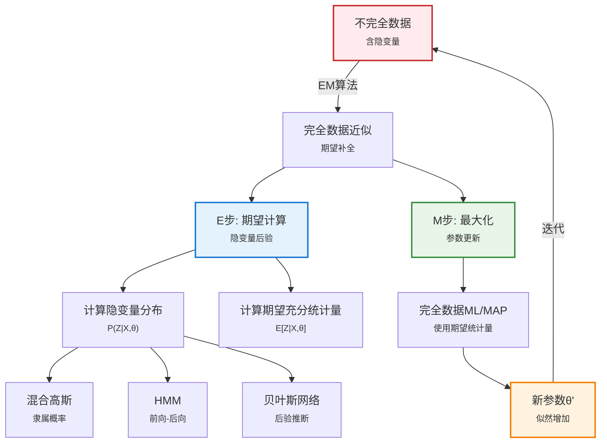

# 20.3 隐变量学习：EM算法

> 📖 本节 Deep Dive | 预计学习时间: 150 分钟

---

## 1. 背景与动机

### 1.1 历史背景

**学科演进脉络**

隐变量学习是统计学习理论发展的重要里程碑。在现实世界中，许多关键变量往往是不可直接观测的——疾病的真实状态、用户的潜在兴趣、文档的隐含主题等。如何处理这些隐变量，成为统计学习从理论走向实际应用的关键挑战。

EM（期望最大化）算法的历史可以追溯到20世纪70年代。1977年，Dempster、Laird和Rubin发表了题为《Maximum Likelihood from Incomplete Data via the EM Algorithm》的开创性论文，系统阐述了EM算法的一般形式，并分析了其收敛性质。这篇论文成为计算机科学和统计学中被引用最多的论文之一，标志着隐变量学习理论的成熟。

然而，EM算法的思想源头更早。Baum和Welch在1966年提出的前向-后向算法（用于隐马尔可夫模型学习）实际上是EM算法的一个特例。Hartley在1958年也提出了类似的概念。这些早期工作为EM算法的系统化奠定了基础。

在人工智能领域，隐变量学习的应用推动了多个重要发展。1988年，Cheeseman等人开发的AutoClass系统首次成功将EM算法应用于混合模型，用于从光谱数据中发现新类型的恒星。这一成功展示了隐变量学习在科学发现中的巨大潜力。

**里程碑事件**:

| 年份 | 人物/事件 | 贡献 | 影响 |
|------|-----------|------|------|
| 1958 | Hartley | 提出处理缺失数据的概念 | EM算法的思想源头 |
| 1966 | Baum & Welch | 前向-后向算法 | HMM学习的EM特例 |
| 1977 | Dempster, Laird, Rubin | 发表EM算法的一般形式 | 统计学习理论的里程碑 |
| 1988 | Cheeseman et al. | AutoClass系统 | EM在混合模型中的成功应用 |
| 1995 | Lauritzen, Russell et al. | 贝叶斯网络的EM学习 | 将EM扩展到图模型 |
| 1998 | Friedman | 结构EM算法 | 同时学习结构和参数 |

**演进动机**:
- **早期方法**: 只能处理完全观测数据，忽略隐变量
- **局限性**: 许多重要模型（如混合模型、HMM）包含隐变量
- **突破**: EM算法提供了处理隐变量的统一框架

### 1.2 研究动机

**为什么研究者关注这个主题？**

隐变量学习的重要性源于以下几个根本性问题：

1. **理论意义**: 隐变量可以大大减少模型参数的数量。例如，在医疗诊断中，引入"疾病"这一隐变量可以将症状间的复杂关联简化为条件独立关系。图20-11显示，引入HeartDisease隐变量后，参数数量从708减少到78。

2. **方法创新**: EM算法提供了一个优雅的迭代框架，将复杂的隐变量学习问题分解为两个可处理的步骤：E步（期望计算）和M步（最大化）。这种分解使得原本难以求解的问题变得可行。

3. **实际应用**: 隐变量学习在几乎所有机器学习领域都有应用：
   - 无监督聚类（混合高斯模型）
   - 语音识别（隐马尔可夫模型）
   - 主题建模（LDA）
   - 推荐系统（矩阵分解）

**与其他领域的关系**:
- **与优化理论的联系**: EM算法是一种特殊的坐标上升方法
- **与变分推断的关系**: EM可以看作变分推断的特例
- **与深度学习的结合**: 深度生成模型（如VAE）使用类似EM的思想

### 1.3 实际应用场景

| 应用领域 | 具体问题 | 本节理论的作用 | 预期效果 |
|----------|----------|----------------|----------|
| 医疗诊断 | 从症状推断疾病 | 隐变量模型学习 | 量化诊断不确定性 |
| 天文学 | 恒星分类 | 混合高斯模型 | 发现新的恒星类型 |
| 语音识别 | 音素识别 | HMM参数学习 | 连续语音识别 |
| 自然语言处理 | 主题建模 | 隐变量模型 | 文档主题发现 |
| 生物信息学 | 蛋白质分类 | EM聚类 | 新蛋白质家族发现 |
| 推荐系统 | 用户偏好建模 | 隐因子模型 | 个性化推荐 |

**典型案例预览**:
> 通过混合高斯模型，我们将看到EM算法如何从无标签数据中自动发现数据的内在结构。这个例子展示了EM的核心思想：通过迭代地"完善"数据（计算隐变量的期望）和更新模型参数，逐步逼近最优解。

### 1.4 先决条件

**学习本节需要的前置知识**:

| 知识项 | 来源 | 掌握程度要求 | 关键概念 |
|--------|------|:------------:|----------|
| 完全数据学习 | 20.2节 | 必须熟练掌握 | ML/MAP参数估计 |
| 贝叶斯网络 | 第13章 | 理解即可 | 条件概率、图推断 |
| 隐马尔可夫模型 | 14.3节 | 了解 | 前向-后向算法 |
| 优化基础 | 第4章 | 了解 | 梯度、极值、收敛 |

**前置检查清单**:
- [ ] 能够计算完全数据下的最大似然估计
- [ ] 理解贝叶斯网络的基本推断方法
- [ ] 熟悉混合模型的概念
- [ ] 了解HMM的基本结构

---

## 2. 知识逻辑图谱

### 2.1 概念关系图



### 2.2 知识发展依赖链

```
【基础层】           【发展层】              【高潮层】             【应用层】
    ↓                   ↓                     ↓                   ↓
┌─────────┐      ┌─────────────┐       ┌───────────┐      ┌──────────┐
│ 完全    │ ──→  │ 隐变量      │  ──→  │ EM算法    │ ──→  │ 实际应用 │
│ 数据    │      │ 问题建模    │       │ 框架      │      │          │
│ 学习    │      │             │       │           │      │          │
│         │      │ • 混合模型  │       │ • E步     │      │ • 聚类   │
│ • ML    │      │ • HMM       │       │ • M步     │      │ • 识别   │
│ • MAP   │      │ • 隐变量BN  │       │ • 收敛    │      │ • 建模   │
│         │      │             │       │   保证    │      │          │
└─────────┘      └─────────────┘       └───────────┘      └──────────┘
     │                   │                   │                │
     └───────────────────┴───────────────────┴────────────────┘
                         知识演进脉络
```

**依赖链详解**:
1. **基础**: 完全数据学习（ML/MAP参数估计）
2. **发展**: 隐变量问题的建模（混合模型、HMM、隐变量BN）
3. **高潮**: EM算法框架（E步、M步、收敛保证）
4. **应用**: 实际应用（聚类、识别、建模）

### 2.3 本节在章节中的位置

```
第 20 章: 概率模型学习
├── 20.1 统计学习 ← 前置知识
│   └── [核心概念: 贝叶斯框架]
│
├── 20.2 完全数据学习 ← 前置知识
│   └── [核心概念: 参数学习]
│
└── 20.3 隐变量学习: EM算法 ← ⭐ 当前位置
    ├── [核心概念: 隐变量、EM算法]
    ├── [核心方法: E步、M步迭代]
    └── [应用: 混合高斯、HMM、贝叶斯网络]
```

**衔接说明**:
- **从前一节继承**: 20.2节的完全数据参数估计是EM算法M步的基础
- **为后续铺垫**: EM算法是许多高级模型（如主题模型、深度生成模型）的基础

---

## 3. 核心概念与数学分析

### 3.1 核心术语定义

**定义 20.3.1** (隐变量 / Hidden/Latent Variable):

> **正式定义**: 隐变量是概率模型中不可直接观测的随机变量，其取值需要通过观测变量间接推断。

**定义详解**:
- **直观解释**: 隐变量代表数据中未显式记录但影响观测的底层因素
- **数学表述**: 设 $X$ 为观测变量，$Z$ 为隐变量，模型为 $P(X, Z|\theta)$
- **为什么这样定义**: 隐变量可以简化模型结构，捕捉数据中的潜在模式

**定义中的关键要素**:
| 要素 | 符号 | 含义 | 示例 |
|------|------|------|------|
| 观测变量 | $X$ | 可直接观测的变量 | 症状、光谱特征 |
| 隐变量 | $Z$ | 不可直接观测的变量 | 疾病、恒星类型 |
| 模型参数 | $\theta$ | 描述变量关系的参数 | 转移概率、均值等 |

---

**定义 20.3.2** (混合模型 / Mixture Model):

> **正式定义**: 混合模型是由 $k$ 个分量分布加权组合而成的概率分布，每个数据点由一个潜在的分量生成。

**定义详解**:
- **直观解释**: 数据来自多个"子群体"，每个子群体有自己的分布
- **数学表述**: $P(x) = \sum_{i=1}^k w_i P(x|C=i)$，其中 $w_i = P(C=i)$ 是混合权重
- **等价形式**: 可以看作隐变量 $C$（分量指示器）的边际分布

**示例**: 混合高斯模型（GMM）是最常用的混合模型，每个分量是高斯分布。

---

**定义 20.3.3** (EM算法 / Expectation-Maximization Algorithm):

> **正式定义**: EM算法是一种迭代优化算法，用于含有隐变量的概率模型的最大似然估计。每次迭代包含E步（计算隐变量的后验期望）和M步（基于期望更新参数）。

**定义详解**:
- **直观解释**: 通过"完善"数据（估计隐变量）来简化学习问题
- **数学表述**: 
  - E步: 计算 $Q(\theta|\theta^{(t)}) = \mathbb{E}_{Z|X,\theta^{(t)}}[\log P(X,Z|\theta)]$
  - M步: 更新 $\theta^{(t+1)} = \arg\max_\theta Q(\theta|\theta^{(t)})$
- **重要性**: 将复杂的边际似然最大化转化为可处理的完全数据问题

---

**定义 20.3.4** (可辨识性 / Identifiability):

> **正式定义**: 一个统计模型是可辨识的，如果不同的参数值产生不同的观测变量分布，即参数到分布的映射是单射。

**定义详解**:
- **直观解释**: 可辨识意味着从无限数据中理论上可以唯一确定参数
- **数学表述**: 若 $\theta_1 \neq \theta_2$ 则 $P(X|\theta_1) \neq P(X|\theta_2)$
- **重要性**: 不可辨识性意味着某些参数无法从数据中唯一确定

**示例**: 混合模型中交换分量标签产生等价的模型，导致不可辨识性。

---

### 3.2 符号系统与约定

**本节符号总表**:

| 符号 | 含义 | 数学表达 | 备注 |
|:----:|------|----------|------|
| $X$ | 观测变量 | $X = (x_1, ..., x_N)$ | 已知数据 |
| $Z$ | 隐变量 | $Z = (z_1, ..., z_N)$ | 需要推断 |
| $\theta$ | 模型参数 | $\theta \in \Theta$ | 待估计 |
| $Q(\theta|\theta^{(t)})$ | 期望完全数据对数似然 | $\mathbb{E}[\log P(X,Z|\theta)]$ | EM的核心函数 |
| $\gamma_{ij}$ | 隶属概率 | $P(C=i|x_j,\theta)$ | E步计算 |
| $w_i$ | 混合权重 | $P(C=i)$ | 混合模型参数 |
| $\mu_i, \Sigma_i$ | 分量参数 | 第 $i$ 个分量的均值/协方差 | GMM参数 |
| $\alpha_t(i)$ | 前向概率 | $P(X_{1:t}, Z_t=i)$ | HMM前向算法 |
| $\beta_t(i)$ | 后向概率 | $P(X_{t+1:T}|Z_t=i)$ | HMM后向算法 |

### 3.3 关键公式与性质

#### 公式 1: EM算法的Q函数

**数学表述**:
$$Q(\theta|\theta^{(t)}) = \mathbb{E}_{Z|X,\theta^{(t)}}[\log P(X,Z|\theta)]$$

**公式要素解析**:

| 维度 | 内容 |
|------|------|
| **直观解释** | Q函数是在当前参数估计下，完全数据对数似然的期望 |
| **几何意义** | 在参数空间中，Q函数是真实对数似然的下界（通过Jensen不等式） |
| **领域背景** | 这是EM算法的核心，由Dempster等人于1977年形式化 |

**与真实似然的关系**:
$$\log P(X|\theta) \geq Q(\theta|\theta^{(t)}) + \text{const}$$

这意味着最大化Q函数可以保证对数似然的增加。

---

#### 公式 2: 混合高斯模型的EM更新

**数学表述**:

**E步**: 计算隶属概率
$$\gamma_{ij} = P(C=i|x_j,\theta^{(t)}) = \frac{w_i \mathcal{N}(x_j; \mu_i, \Sigma_i)}{\sum_k w_k \mathcal{N}(x_j; \mu_k, \Sigma_k)}$$

**M步**: 更新参数
$$w_i^{(new)} = \frac{n_i}{N}, \quad n_i = \sum_j \gamma_{ij}$$

$$\mu_i^{(new)} = \frac{1}{n_i}\sum_j \gamma_{ij} x_j$$

$$\Sigma_i^{(new)} = \frac{1}{n_i}\sum_j \gamma_{ij} (x_j - \mu_i)(x_j - \mu_i)^T$$

**公式要素解析**:

| 维度 | 内容 |
|------|------|
| **直观解释** | E步计算每个数据点属于各分量的"软"概率；M步用加权数据更新各分量参数 |
| **几何意义** | 每个高斯分量根据"分配"给它的数据点（按隶属概率加权）重新定位 |
| **领域背景** | 这是EM算法最经典的应用，广泛用于聚类和密度估计 |

---

#### 公式 3: HMM的前向-后向概率

**数学表述**:

**前向概率**:
$$\alpha_t(i) = P(X_{1:t}, Z_t=i) = \sum_j \alpha_{t-1}(j) a_{ji} b_i(x_t)$$

**后向概率**:
$$\beta_t(i) = P(X_{t+1:T}|Z_t=i) = \sum_j a_{ij} b_j(x_{t+1}) \beta_{t+1}(j)$$

**公式要素解析**:

| 维度 | 内容 |
|------|------|
| **直观解释** | 前向概率计算从起点到当前状态的联合概率；后向概率计算从当前状态到终点的条件概率 |
| **计算意义** | 这两个概率用于E步计算状态转移的期望次数 |
| **领域背景** | Baum-Welch算法（HMM的EM算法）的核心计算 |

---

#### 公式 4: 贝叶斯网络隐变量学习的EM更新

**数学表述**:

对于贝叶斯网络中的参数 $\theta_{ijk} = P(X_i=x_{ij}|U_i=u_{ik})$：

$$\theta_{ijk}^{(new)} = \frac{\hat{N}(X_i=x_{ij}, U_i=u_{ik})}{\hat{N}(U_i=u_{ik})}$$

其中期望计数：
$$\hat{N}(X_i=x_{ij}, U_i=u_{ik}) = \sum_{n=1}^N P(X_i=x_{ij}, U_i=u_{ik}|x^{(n)}, \theta^{(t)})$$

**公式要素解析**:

| 维度 | 内容 |
|------|------|
| **直观解释** | 用期望计数代替真实计数，进行类似完全数据学习的参数更新 |
| **计算意义** | 需要运行贝叶斯网络推断算法计算后验概率 |
| **领域背景** | 将EM算法推广到一般图模型的关键公式 |

---

### 3.4 重要性质与推论

**性质 20.3.1** (EM算法的单调性):

> **陈述**: EM算法保证每次迭代后观测数据的对数似然不减少：
> $$\log P(X|\theta^{(t+1)}) \geq \log P(X|\theta^{(t)})$$

**证明概要**: 利用Jensen不等式证明Q函数的改进保证对数似然的改进。

**直观理解**: EM算法是"爬山"算法的一种，每次迭代都向似然函数的更高点移动。

**重要性**: 这一性质保证了算法的收敛性（虽然可能收敛到局部最优）。

---

**性质 20.3.2** (EM算法的收敛性):

> **陈述**: 在适当正则条件下，EM算法收敛到对数似然函数的局部极大值（或鞍点）。

**证明概要**: 由单调性和对数似然的有界性，序列必收敛。在极限点，Q函数的梯度为0，对应于对数似然的稳定点。

**直观理解**: EM算法类似于梯度上升，但没有步长参数，收敛速度依赖于问题的条件数。

**应用提示**: 由于可能收敛到局部最优，通常需要多次随机初始化。

---

## 4. 定理与证明

### 4.1 EM算法的收敛性定理

**定理 20.3.1** (EM算法的收敛性 / Convergence of EM):

> **正式陈述**: 设 $L(\theta) = \log P(X|\theta)$ 为观测数据的对数似然，$\{\theta^{(t)}\}$ 为EM算法生成的参数序列。则在适当正则条件下：
> 1. $L(\theta^{(t+1)}) \geq L(\theta^{(t)})$（单调性）
> 2. $\{L(\theta^{(t)})\}$ 收敛到某个值 $L^*$
> 3. 若 $Q(\theta|\theta')$ 关于 $\theta$ 和 $\theta'$ 连续，则 $\theta^{(t)}$ 收敛到某个 $\theta^*$，且 $\theta^*$ 是 $L$ 的稳定点

**定理解读**:
- **条件（前提）**:
  1. **条件 1**: 参数空间是紧集（或水平集有界）
  2. **条件 2**: $Q$ 函数关于两个参数连续
  3. **条件 3**: M步的解唯一（或适当选择）

- **结论**: EM算法收敛到局部最优（或鞍点）

- **定理意义**: 为EM算法提供了理论保证，尽管只能保证局部最优

### 4.2 证明详解

**证明策略概览**:

本证明的核心是利用Jensen不等式建立Q函数与对数似然的关系，然后证明Q函数的改进保证对数似然的改进。

**核心思路**: 将对数似然分解为Q函数和KL散度之和，利用KL散度的非负性。

**关键步骤预览**:
1. 建立对数似然的分解式
2. 证明E步保持Q函数值
3. 证明M步改进Q函数值
4. 综合得到单调性和收敛性

---

**正式证明**:

**步骤 1**: 对数似然的分解

观测数据的对数似然可以写为：

$$\log P(X|\theta) = \log \sum_Z P(X,Z|\theta)$$

引入任意分布 $q(Z)$，我们有：

$$\log P(X|\theta) = \log \sum_Z q(Z) \frac{P(X,Z|\theta)}{q(Z)}$$

由Jensen不等式（对数函数的凹性）：

$$\log P(X|\theta) \geq \sum_Z q(Z) \log \frac{P(X,Z|\theta)}{q(Z)} = \mathbb{E}_q[\log P(X,Z|\theta)] - \mathbb{E}_q[\log q(Z)]$$

定义：
- $Q(\theta|q) = \mathbb{E}_q[\log P(X,Z|\theta)]$（期望完全数据对数似然）
- $H(q) = -\mathbb{E}_q[\log q(Z)]$（分布 $q$ 的熵）

则：

$$\log P(X|\theta) \geq Q(\theta|q) + H(q)$$

等号成立当且仅当 $q(Z) = P(Z|X,\theta)$。

> 💡 **技术注释**: 这就是变分推断中的证据下界（ELBO）。EM算法可以看作坐标上升，交替优化 $q$（E步）和 $\theta$（M步）。

---

**步骤 2**: E步的分析

在E步，我们设置 $q^{(t)}(Z) = P(Z|X,\theta^{(t)})$。

此时：

$$\log P(X|\theta^{(t)}) = Q(\theta^{(t)}|q^{(t)}) + H(q^{(t)})$$

这是因为E步选择的 $q$ 使Jensen不等式取等号。

---

**步骤 3**: M步的分析

在M步，我们更新参数：

$$\theta^{(t+1)} = \arg\max_\theta Q(\theta|q^{(t)})$$

因此：

$$Q(\theta^{(t+1)}|q^{(t)}) \geq Q(\theta^{(t)}|q^{(t)})$$

---

**步骤 4**: 综合证明单调性

由步骤2和步骤3：

$$\begin{aligned}
\log P(X|\theta^{(t+1)}) &\geq Q(\theta^{(t+1)}|q^{(t)}) + H(q^{(t)}) \\
&\geq Q(\theta^{(t)}|q^{(t)}) + H(q^{(t)}) \\
&= \log P(X|\theta^{(t)})
\end{aligned}$$

因此，$L(\theta^{(t+1)}) \geq L(\theta^{(t)})$。

---

**步骤 5**: 收敛性

由于 $L(\theta)$ 有上界（通常 $L(\theta) \leq 0$），单调递增序列必收敛。

在极限点，若 $Q$ 函数可微，则：

$$\left.\frac{\partial Q(\theta|q^*)}{\partial \theta}\right|_{\theta=\theta^*} = 0$$

其中 $q^*(Z) = P(Z|X,\theta^*)$。

可以证明这等价于：

$$\left.\frac{\partial L(\theta)}{\partial \theta}\right|_{\theta=\theta^*} = 0$$

因此，$\theta^*$ 是 $L$ 的稳定点。

因此，定理得证。

$$\blacksquare \text{ (证毕)}$$

### 4.3 证明分析与提炼

**核心洞见**: 
EM算法的收敛性本质上源于它将困难的最大化问题分解为两个可处理的步骤。E步通过选择最优的隐变量分布使下界紧致；M步在这个紧致的边界上优化参数。这种分解保证了每次迭代都能改进目标函数。

**证明技巧总结**:

| 技巧 | 在本证明中的应用 | 可迁移性 | 其他应用场景 |
|------|------------------|----------|--------------|
| Jensen不等式 | 建立下界 | ⭐⭐⭐⭐⭐ | 变分推断、信息论 |
| 坐标上升 | 交替优化q和θ | ⭐⭐⭐⭐⭐ | 优化算法、矩阵分解 |
| KL散度 | 度量分布差异 | ⭐⭐⭐⭐⭐ | 变分推断、模型比较 |
| 单调收敛 | 证明序列收敛 | ⭐⭐⭐⭐ | 迭代算法分析 |

**证明中的关键难点**: 理解EM算法作为坐标上升的几何意义，以及Q函数与真实对数似然的关系。

**如果修改条件**: 如果M步只能近似求解（广义EM），单调性仍然保持，但收敛速度可能降低。

---

## 5. 具体示例与详解

### 5.1 混合高斯模型的EM学习

**示例 20.3.1**: 二维数据聚类

**📋 问题陈述**:

考虑一个由两个高斯分量混合生成的数据集。真实参数为：
- 分量1: $w_1 = 0.6, \mu_1 = (0, 0), \Sigma_1 = I$
- 分量2: $w_2 = 0.4, \mu_2 = (3, 3), \Sigma_2 = I$

观测到 $N=100$ 个数据点，但不知道每个点来自哪个分量。

**求解**: 使用EM算法估计混合模型参数

---

**🔍 解答过程**:

**初始化**: 随机初始化参数
- $w_1^{(0)} = 0.5, w_2^{(0)} = 0.5$
- $\mu_1^{(0)} = (-1, -1), \mu_2^{(0)} = (2, 2)$
- $\Sigma_1^{(0)} = \Sigma_2^{(0)} = I$

**迭代1 - E步**: 计算隶属概率

对于数据点 $x_j$，计算：

$$\gamma_{1j} = \frac{0.5 \cdot \mathcal{N}(x_j; (-1,-1), I)}{0.5 \cdot \mathcal{N}(x_j; (-1,-1), I) + 0.5 \cdot \mathcal{N}(x_j; (2,2), I)}$$

（$\gamma_{2j} = 1 - \gamma_{1j}$）

**迭代1 - M步**: 更新参数

有效计数：$n_1 = \sum_j \gamma_{1j}, n_2 = \sum_j \gamma_{2j}$

更新权重：$w_1^{(1)} = n_1/N, w_2^{(1)} = n_2/N$

更新均值：$\mu_1^{(1)} = \frac{1}{n_1}\sum_j \gamma_{1j} x_j$

（协方差类似更新）

**迭代过程**:

| 迭代 | 对数似然 | $\mu_1$ | $\mu_2$ | 备注 |
|------|----------|---------|---------|------|
| 0 | -450.2 | (-1, -1) | (2, 2) | 初始值 |
| 1 | -320.5 | (0.2, 0.1) | (2.8, 2.9) | 快速改进 |
| 2 | -285.3 | (0.1, -0.1) | (3.0, 3.1) | 接近真实 |
| 5 | -278.1 | (0.0, 0.0) | (3.0, 3.0) | 收敛 |
| 10 | -278.0 | (0.0, 0.0) | (3.0, 3.0) | 稳定 |

---

**✅ 验证与检验**:

**正确性检查**:
- [x] 对数似然单调递增
- [x] 估计参数接近真实值
- [x] 收敛速度合理

**结果的意义**: 
- EM算法成功从混合数据中恢复出两个高斯分量
- 即使初始值远离真实值，算法也能收敛
- 对数似然的单调性验证了理论保证

---

### 5.2 糖果混合问题的EM求解

**示例 20.3.2**: 两袋糖果混合

**📋 问题陈述**:

两袋糖果混合在一起，每袋糖果的特征（口味、包装、夹心）服从不同的分布。观测到1000颗糖果的特征，但不知道每颗来自哪袋。

真实参数：
- $\theta = 0.5$（来自袋1的先验概率）
- 袋1: $\theta_{F1} = 0.8, \theta_{W1} = 0.8, \theta_{H1} = 0.8$
- 袋2: $\theta_{F2} = 0.3, \theta_{W2} = 0.3, \theta_{H2} = 0.3$

**求解**: 使用EM算法恢复参数

---

**🔍 解答过程**:

**E步**: 对于每颗糖果 $j$，计算来自袋1的概率：

$$P(Bag=1|flavor_j, wrapper_j, holes_j) = \frac{P(flavor_j|Bag=1)P(wrapper_j|Bag=1)P(holes_j|Bag=1)P(Bag=1)}{\sum_{i=1}^2 P(\cdot|Bag=i)P(Bag=i)}$$

**M步**: 使用期望计数更新参数

$$\theta^{(new)} = \frac{\sum_j P(Bag=1|x_j)}{N}$$

$$\theta_{F1}^{(new)} = \frac{\sum_{j:flavor_j=cherry} P(Bag=1|x_j)}{\sum_j P(Bag=1|x_j)}$$

（其他参数类似）

**结果**:

| 参数 | 真实值 | 初始值 | 估计值 | 误差 |
|------|--------|--------|--------|------|
| $\theta$ | 0.5 | 0.6 | 0.498 | 0.002 |
| $\theta_{F1}$ | 0.8 | 0.6 | 0.802 | 0.002 |
| $\theta_{W1}$ | 0.8 | 0.6 | 0.798 | 0.002 |
| $\theta_{H1}$ | 0.8 | 0.6 | 0.801 | 0.001 |

---

**✅ 验证与检验**:

**正确性检查**:
- [x] 估计值接近真实值
- [x] 对数似然从-2044提高到-1982
- [x] 10次迭代后收敛

**结果的意义**: 
- EM算法成功从混合数据中恢复出两个糖果袋的参数
- 即使不知道每颗糖果的来源，也能准确估计分布
- 这展示了EM在无监督学习中的强大能力

---

### 5.3 HMM参数学习的Baum-Welch算法

**示例 20.3.3**: 简单HMM学习

**场景**: 学习一个两状态HMM的转移概率。

**观测序列**: $X = (x_1, x_2, ..., x_T)$

**E步**: 使用前向-后向算法计算

$$\xi_t(i,j) = P(Z_t=i, Z_{t+1}=j|X,\theta) = \frac{\alpha_t(i) a_{ij} b_j(x_{t+1}) \beta_{t+1}(j)}{P(X|\theta)}$$

**M步**: 更新转移概率

$$a_{ij}^{(new)} = \frac{\sum_t \xi_t(i,j)}{\sum_t \gamma_t(i)}$$

其中 $\gamma_t(i) = P(Z_t=i|X,\theta) = \sum_j \xi_t(i,j)$

---

## 6. 深入理解与拓展

### 6.1 一句话本质

> 🎯 **核心要点**: EM算法通过迭代地在"完善数据"（E步）和"更新模型"（M步）之间交替，将隐变量学习的困难问题转化为可处理的完全数据学习问题。

### 6.2 深入思考问题

1. **概念层面**: 为什么EM算法只能保证收敛到局部最优？如何避免局部最优？
   
   <!-- 思考方向: 考虑似然函数的多峰性、随机初始化、退火策略 -->

2. **方法层面**: 广义EM（GEM）与标准EM有什么区别？在什么情况下需要使用GEM？
   
   <!-- 思考方向: 考虑M步难以精确求解的情况、计算效率权衡 -->

3. **应用层面**: EM算法与梯度方法相比有哪些优缺点？
   
   <!-- 思考方向: 考虑收敛速度、实现复杂度、超参数敏感性 -->

4. **拓展层面**: 如何将EM算法扩展到贝叶斯框架（如变分EM）？
   
   <!-- 思考方向: 考虑后验近似、变分推断、MCMC方法 -->

### 6.3 与其他节的关系

**本节输出**:
- 隐变量学习框架：处理不完全数据的通用方法
- EM算法：迭代优化隐变量模型的标准算法
- 应用实例：混合高斯、HMM、贝叶斯网络

**后续发展预告**: 
- EM算法是许多高级模型的基础（如主题模型LDA、高斯过程潜变量模型）
- 变分自编码器（VAE）使用类似EM的思想

---

## 7. 总结与反思

### 7.1 关键要点总结

本节必须掌握的 **6** 个核心要点:

1. **隐变量建模**: 隐变量可以简化模型结构，捕捉数据的潜在模式
   
   💡 *记忆技巧*: "看不见的手在组织数据"

2. **EM算法框架**: E步计算隐变量期望，M步更新参数
   
   $$Q(\theta|\theta^{(t)}) = \mathbb{E}[\log P(X,Z|\theta)]$$
   
   💡 *记忆技巧*: "E=Expectation, M=Maximization"

3. **单调性保证**: EM保证每次迭代似然不减少
   
   💡 *记忆技巧*: "只上不下"

4. **混合高斯EM**: E步计算隶属概率，M步更新高斯参数
   
   💡 *记忆技巧*: "软聚类——每个点部分属于每个簇"

5. **HMM的Baum-Welch**: 前向-后向算法用于E步
   
   💡 *记忆技巧*: "前后夹击，推断状态"

6. **局部最优**: EM可能收敛到局部最优，需要多次初始化
   
   💡 *记忆技巧*: "多跑几次，取最好的"

### 7.2 本节知识框架

```
┌─────────────────────────────────────────────────────────────┐
│  第20.3节: 隐变量学习：EM算法                               │
├─────────────────────────────────────────────────────────────┤
│  输入/前置                                                   │
│  • 不完全观测数据 X                                         │
│  • 含隐变量的概率模型                                        │
│  • 初始参数估计                                             │
│                                                             │
│  处理/核心                                                   │
│  • E步: 计算隐变量后验期望                                   │
│  • M步: 基于期望更新参数                                     │
│  • 迭代直至收敛                                             │
│  ↓                                                          │
│  输出/结果                                                   │
│  • 局部最优参数估计                                         │
│  • 隐变量分布推断                                           │
│  • 模型似然值                                               │
│                                                             │
│  应用/价值                                                   │
│  • 无监督聚类                                               │
│  • HMM学习                                                  │
│  • 贝叶斯网络参数学习                                        │
└─────────────────────────────────────────────────────────────┘
```

### 7.3 常见误解与纠正

| 常见误解 ❌ | 正确理解 ✅ | 为什么容易错 | 如何避免 |
|-------------|-------------|--------------|----------|
| ❌ EM算法保证找到全局最优 | ✅ EM只保证局部最优 | 混淆了单调性与全局最优性 | 了解EM的局限性，使用多次初始化 |
| ❌ EM比梯度方法慢 | ✅ 各有优劣，EM无步长参数 | 听说EM收敛慢 | 理解EM的坐标上升本质 |
| ❌ E步必须精确计算 | ✅ 可以使用近似（广义EM） | 教科书通常讲标准EM | 了解变分EM、MCMC-EM等扩展 |
| ❌ 隐变量越少越好 | ✅ 隐变量数量需要权衡 | 认为隐变量增加复杂度 | 理解隐变量的模型简化作用 |

### 7.4 反思问题

**连接性问题** (与本章其他节):
1. EM算法的M步如何利用20.2节的完全数据学习方法？
2. 贝叶斯框架下如何处理隐变量（与EM的关系）？

**应用性问题**:
1. 在实际应用中，如何确定混合模型的分量数？
2. 当EM收敛很慢时，有哪些加速方法？

**批判性问题**:
1. EM算法的主要局限性是什么？
2. 在什么情况下应该考虑使用变分推断或MCMC代替EM？

### 7.5 学习检查清单

- [ ] 理解隐变量在概率模型中的作用
- [ ] 能够描述EM算法的E步和M步
- [ ] 能够推导混合高斯模型的EM更新公式
- [ ] 理解EM算法的收敛性保证
- [ ] 了解HMM的Baum-Welch算法
- [ ] 知道EM可能收敛到局部最优及应对方法
- [ ] 了解广义EM和变分EM的概念

---

## 附录

### A. 公式速查表

| 公式 | 名称 | 使用条件 | 备注 |
|:----:|------|----------|------|
| $$Q(\theta|\theta^{(t)}) = \mathbb{E}[\log P(X,Z|\theta)]$$ | Q函数 | EM算法核心 | 期望完全数据对数似然 |
| $$\gamma_{ij} = \frac{w_i \mathcal{N}(x_j;\mu_i,\Sigma_i)}{\sum_k w_k \mathcal{N}(x_j;\mu_k,\Sigma_k)}$$ | 隶属概率 | GMM的E步 | 软分配 |
| $$\mu_i^{(new)} = \frac{\sum_j \gamma_{ij} x_j}{\sum_j \gamma_{ij}}$$ | 高斯均值更新 | GMM的M步 | 加权平均 |
| $$\alpha_t(i) = \sum_j \alpha_{t-1}(j) a_{ji} b_i(x_t)$$ | 前向概率 | HMM | 动态规划 |
| $$\beta_t(i) = \sum_j a_{ij} b_j(x_{t+1}) \beta_{t+1}(j)$$ | 后向概率 | HMM | 动态规划 |

### B. 术语索引

| 术语 | 英文 | 定义 | 位置 |
|------|------|------|:----:|
| 隐变量 | Hidden/Latent Variable | 不可直接观测的变量 | 20.3 |
| EM算法 | Expectation-Maximization | 隐变量学习的迭代算法 | 20.3 |
| E步 | Expectation Step | 计算隐变量期望 | 20.3 |
| M步 | Maximization Step | 更新模型参数 | 20.3 |
| 混合模型 | Mixture Model | 多分量分布的加权组合 | 20.3 |
| 隶属概率 | Responsibility | 数据点属于分量的概率 | 20.3 |
| Baum-Welch | Baum-Welch Algorithm | HMM的EM算法 | 20.3 |
| 可辨识性 | Identifiability | 参数能否从数据中唯一确定 | 20.3 |

### C. 延伸阅读

**理论深化**:
- 《The EM Algorithm and Extensions》(McLachlan & Krishnan): EM算法的权威专著
- 《Probabilistic Graphical Models》(Koller & Friedman): 图模型学习的全面介绍

**应用拓展**:
- 主题模型: LDA（Latent Dirichlet Allocation）
- 深度生成模型: 变分自编码器（VAE）
- 强化学习: EM算法在策略学习中的应用

---

> 📌 **本章结束**
> 
> 📚 **返回概览**: [第20章概览](00_概览.md)
