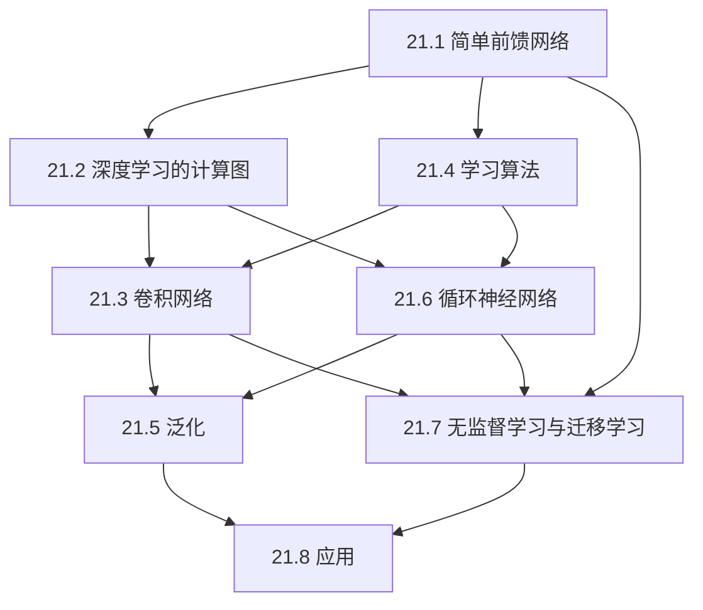
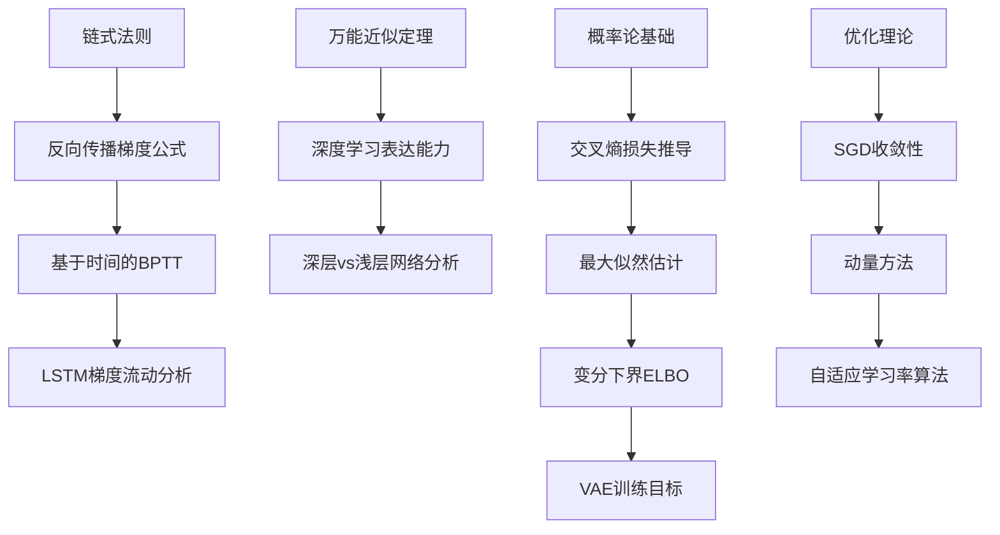

# 第21章 深度学习 - 概览

## 学习目标

完成本章学习后，你将能够：

1. **理解前馈网络基础**：掌握人工神经元、激活函数、层间连接的基本原理
2. **掌握计算图表示**：将神经网络视为计算图，理解自动微分和反向传播
3. **应用卷积神经网络**：理解卷积、池化操作，设计处理图像数据的CNN架构
4. **实现学习算法**：使用随机梯度下降及其变种训练深度网络
5. **改进泛化性能**：应用正则化、Dropout、权重衰减等技术防止过拟合
6. **处理序列数据**：使用RNN和LSTM建模时序依赖关系
7. **探索无监督学习**：理解自编码器、VAE、GAN等生成模型
8. **应用迁移学习**：利用预训练模型解决新任务

---

## 本章速览

### 章节结构

```
第21章 深度学习
├── 21.1 简单前馈网络          [基础] 神经网络的基本单元与反向传播
├── 21.2 深度学习的计算图       [核心] 输入编码、输出层设计、隐藏层组织
├── 21.3 卷积网络              [重点] 卷积、池化、残差网络
├── 21.4 学习算法              [实践] SGD、动量、批量归一化
├── 21.5 泛化                  [关键] 架构选择、权重衰减、Dropout
├── 21.6 循环神经网络          [进阶] RNN、LSTM、时序建模
├── 21.7 无监督学习与迁移学习   [拓展] 自编码器、VAE、GAN、迁移学习
└── 21.8 应用                  [展望] 各领域应用概览
```

### 核心主题

- **表示学习**：从原始数据中自动学习层次化特征表示
- **端到端学习**：从输入直接映射到输出，无需手工特征工程
- **可微分编程**：通过梯度下降优化复杂计算图
- **尺度与深度**：深层网络与大规模数据的力量

---

## 难度预警

### ⭐⭐⭐ 核心难点

1. **反向传播的梯度推导**：链式法则在多层的应用，需要仔细跟踪每个变量的依赖关系
2. **卷积操作的维度变化**：理解输入/输出尺寸、通道数、批量大量的相互作用
3. **LSTM的门控机制**：输入门、遗忘门、输出门的协同工作原理
4. **变分推断的数学基础**：ELBO、KL散度、重参数化技巧

### ⭐⭐ 常见困惑

1. **不同激活函数的选择场景**：何时用ReLU、sigmoid、tanh
2. **批量归一化的作用机制**：训练与测试阶段的不同行为
3. **CNN感受野的计算**：多层卷积后感受野的累积增长
4. **GAN的训练稳定性**：生成器与判别器的平衡

### ⭐ 容易掌握

1. **网络的基本结构**：输入层、隐藏层、输出层的概念
2. **前向传播过程**：数据如何在网络中流动
3. **损失函数的作用**：衡量预测与真实值的差距
4. **过拟合的直观理解**：模型在训练集上表现好但在测试集上差

---

## 前置知识

### 必备基础

- **第19章 样例学习**：逻辑斯谛回归、梯度下降、正则化
- **第20章 概率模型学习**：最大似然估计、贝叶斯推断基础
- **线性代数**：矩阵乘法、向量运算、特征值/特征向量
- **微积分**：偏导数、链式法则、梯度
- **概率论**：条件概率、期望、常见分布（高斯、伯努利）

### 有帮助的知识

- **第14章 时间上的概率推理**：隐马尔可夫模型、动态贝叶斯网络
- **优化理论**：凸优化、约束优化、拉格朗日乘数
- **信号处理**：卷积、傅里叶变换基础

---

## 节依赖图



---

## 定理清单

| 定理/概念 | 位置 | 重要性 | 应用场景 |
|:----------|:----:|:------:|:---------|
| 万能近似定理 | 21.1 | ⭐⭐⭐ | 解释神经网络表达能力 |
| 反向传播算法 | 21.1 | ⭐⭐⭐ | 训练所有前馈网络 |
| 卷积运算定义 | 21.3 | ⭐⭐⭐ | CNN的前向计算 |
| 残差学习公式 | 21.3 | ⭐⭐⭐ | 训练深层网络 |
| BPTT算法 | 21.6 | ⭐⭐⭐ | 训练RNN |
| LSTM更新方程 | 21.6 | ⭐⭐⭐ | 解决梯度消失 |
| ELBO | 21.7 | ⭐⭐ | VAE训练 |
| 权重衰减 = MAP | 21.5 | ⭐⭐ | 正则化理论解释 |

---

## 核心逻辑线索

### 主线：从简单网络到深度学习系统

```
神经元模型 (McCulloch-Pitts)
    ↓
感知机与梯度下降
    ↓
多层前馈网络 + 反向传播
    ↓
    ├─→ 卷积网络 (空间结构)
    ├─→ 循环网络 (时间结构)
    ↓
深层网络的训练技巧
    ├─→ 更好的初始化
    ├─→ 批归一化
    ├─→ 残差连接
    ↓
泛化与正则化
    ├─→ 权重衰减
    ├─→ Dropout
    ├─→ 架构搜索
    ↓
无监督与迁移学习
    ├─→ 自编码器
    ├─→ VAE/GAN
    └─→ 预训练+微调
```

---

## 核心要点速查

### 激活函数对比

| 函数 | 公式 | 值域 | 优点 | 缺点 |
|:-----|:-----|:----:|:-----|:-----|
| Sigmoid | $\frac{1}{1+e^{-x}}$ | (0,1) | 概率解释 | 梯度消失 |
| Tanh | $\frac{e^x-e^{-x}}{e^x+e^{-x}}$ | (-1,1) | 零中心化 | 梯度消失 |
| ReLU | $\max(0,x)$ | [0,∞) | 计算快、缓解梯度消失 | 死亡ReLU |
| Softplus | $\ln(1+e^x)$ | (0,∞) | 光滑可微 | 计算开销大 |

### 损失函数选择

| 任务类型 | 输出层 | 损失函数 |
|:---------|:-------|:---------|
| 二分类 | Sigmoid | 二元交叉熵 |
| 多分类 | Softmax | 交叉熵 |
| 回归 | 线性 | 均方误差 |
| 概率回归 | 混合密度 | 负对数似然 |

### CNN关键超参数

```
卷积层: 核大小(k)、步长(s)、填充(p)、输出通道数(d)
池化层: 池化类型(max/avg)、核大小、步长
输出尺寸 = ⌊(输入尺寸 - k + 2p) / s⌋ + 1
```

### RNN vs LSTM

| 特性 | 基本RNN | LSTM |
|:-----|:--------|:-----|
| 记忆机制 | 隐藏状态覆盖 | 细胞状态保留 |
| 梯度流动 | 容易消失/爆炸 | 门控保护 |
| 长期依赖 | 难以捕捉 | 可有效建模 |
| 参数量 | 较少 | 较多（约4倍） |

---

## 概念对比表

### 前馈网络 vs 循环网络

| 维度 | 前馈网络 (FFN) | 循环网络 (RNN) |
|:-----|:---------------|:---------------|
| 连接结构 | 有向无环图 | 允许循环连接 |
| 状态记忆 | 无内部状态 | 有隐藏状态 |
| 输入类型 | 固定大小向量 | 变长序列 |
| 参数共享 | 层间无共享 | 时间步共享 |
| 典型应用 | 图像分类 | 序列建模 |

### 监督学习 vs 无监督学习

| 维度 | 监督学习 | 无监督学习 |
|:-----|:---------|:-----------|
| 训练数据 | (输入, 标签)对 | 仅输入 |
| 目标 | 学习映射 $f: X \to Y$ | 学习数据分布 $P(X)$ |
| 评估 | 预测准确性 | 生成质量/表示有用性 |
| 典型任务 | 分类、回归 | 聚类、降维、生成 |

### 权重衰减 vs Dropout

| 维度 | 权重衰减 (L2) | Dropout |
|:-----|:--------------|:--------|
| 作用阶段 | 损失函数 | 训练过程 |
| 机制 | 惩罚大权值 | 随机停用神经元 |
| 效果 | 平滑决策边界 | 集成学习近似 |
| 贝叶斯解释 | 高斯先验 | - |

---

## 定理依赖图



---

## 常见误解澄清

### ❌ 误解1：深层网络总能比浅层网络更好地拟合数据
**✅ 正解**：虽然万能近似定理保证表达能力，但深层网络也面临优化困难（梯度消失、局部极小值）。实践中需要配合残差连接、批归一化等技术才能有效训练深层网络。

### ❌ 误解2：ReLU完全解决了梯度消失问题
**✅ 正解**：ReLU在正区间导数为1，确实缓解了梯度消失，但：
- 负区间梯度为0，可能导致"死亡ReLU"
- 深层网络中仍可能出现梯度爆炸
- 并非所有任务都适合使用ReLU

### ❌ 误解3：Dropout在测试时也应该启用
**✅ 正解**：Dropout仅在训练时随机停用神经元，测试时应使用完整的网络（所有神经元激活，但权重按保留概率缩放或不缩放，取决于实现）。

### ❌ 误解4：CNN只能用于图像
**✅ 正解**：卷积操作适用于任何具有局部相关性和平移不变性的数据：
- 一维卷积：文本、音频、时间序列
- 二维卷积：图像、视频帧
- 三维卷积：视频、医学影像

### ❌ 误解5：LSTM可以完全避免梯度消失
**✅ 正解**：LSTM通过门控机制显著改善梯度流动，使长期依赖学习成为可能，但在极长序列上仍可能遇到困难（此时可考虑Transformer等注意力机制）。

---

## 本章测验

### 快速自测题

**Q1**: 为什么神经网络需要非线性激活函数？
<details>
<summary>答案</summary>
如果没有非线性激活，多层网络将等价于单层线性变换，失去深度带来的表达能力提升。
</details>

**Q2**: 在反向传播中，梯度消失的主要原因是什么？
<details>
<summary>答案</summary>
激活函数导数小于1，在多层连乘后梯度指数级衰减；或权重初始化过小。
</details>

**Q3**: 卷积操作的两个核心假设是什么？
<details>
<summary>答案</summary>
局部连接性（邻接像素相关）和平移不变性（特征位置无关）。
</details>

**Q4**: 批量归一化的主要作用是什么？
<details>
<summary>答案</summary>
稳定每层的输入分布，加速收敛，允许使用更大学习率，具有一定正则化效果。
</details>

**Q5**: LSTM中的三个门分别控制什么？
<details>
<summary>答案</summary>
遗忘门：控制记忆保留；输入门：控制新信息写入；输出门：控制记忆输出。
</details>

---

## 快速复习卡

### 公式卡

```
神经元输出: a = g(w^T x + b)

Sigmoid: σ(x) = 1/(1+e^(-x))
ReLU: max(0, x)
Softmax: p_i = e^(z_i) / Σ_j e^(z_j)

反向传播: ∂L/∂w_ij = δ_j · a_i
误差信号: δ_j = g'(in_j) · Σ_k w_jk δ_k

卷积: (x * k)_i = Σ_j k_j · x_{i+j-(l+1)/2}

残差块: z^(i) = g(z^(i-1) + f(z^(i-1)))
```

### 术语卡

| 术语 | 一句话解释 |
|:-----|:-----------|
| 梯度消失 | 反向传播时梯度逐层衰减，浅层难以学习 |
| 感受野 | 输出单元对应输入区域的大小 |
| 特征图 | 卷积层输出的二维激活图 |
| 迁移学习 | 将任务A学到的知识应用到任务B |
| 对抗样本 | 人眼不可察觉的扰动导致模型错误分类 |

---

## 扩展阅读

### 经典论文

1. **反向传播 (1986)**: Rumelhart et al. "Learning representations by back-propagating errors"
2. **LeNet (1998)**: LeCun et al. "Gradient-based learning applied to document recognition"
3. **ImageNet突破 (2012)**: Krizhevsky et al. "ImageNet Classification with Deep CNNs"
4. **ResNet (2016)**: He et al. "Deep Residual Learning for Image Recognition"
5. **GAN (2014)**: Goodfellow et al. "Generative Adversarial Networks"
6. **VAE (2014)**: Kingma & Welling "Auto-Encoding Variational Bayes"
7. **LSTM (1997)**: Hochreiter & Schmidhuber "Long Short-Term Memory"

### 推荐教材

- Goodfellow, Bengio, & Courville. *Deep Learning*. MIT Press, 2016.
- Nielsen, M. *Neural Networks and Deep Learning*. Determination Press, 2015.

### 在线资源

- 3Blue1Brown: Neural Networks series (YouTube)
- CS231n: Convolutional Neural Networks for Visual Recognition (Stanford)
- fast.ai: Practical Deep Learning for Coders

---

## 学习路径建议

### 初学者路径
```
21.1 → 21.2 → 21.4 → 21.5
```
掌握前馈网络基础，能够训练简单神经网络。

### 视觉方向
```
21.1 → 21.2 → 21.3 → 21.4 → 21.5 → 第25章
```
重点学习CNN，应用于计算机视觉任务。

### NLP方向
```
21.1 → 21.2 → 21.6 → 21.7 → 第24章
```
重点学习RNN和表示学习，应用于自然语言处理。

### 研究导向
```
全章 + 前沿论文 + 实验复现
```
全面掌握后，关注最新研究进展。
