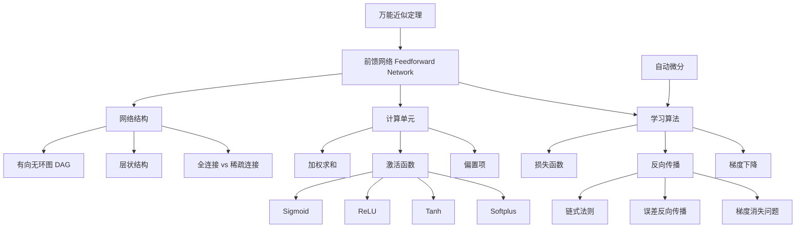

# 21.1 简单前馈网络 - Deep Dive 分析

## 1. 背景与动机

### 1.1 从生物神经元到人工神经网络

前馈网络（Feedforward Network）的起源可以追溯到1943年McCulloch和Pitts的开创性工作，他们首次提出了用计算电路模拟大脑神经元网络的数学模型。这一模型的核心思想是：将生物神经元抽象为简单的计算单元，通过加权求和与非线性激活来模拟神经信号的传递过程。

在生物神经系统中，神经元通过树突接收来自其他神经元的信号，在细胞体中进行整合，当信号强度超过阈值时通过轴突输出。这种"全或无"的放电机制启发了早期的人工神经元模型。然而，现代深度学习中的前馈网络已经超越了这种简单的二元响应，采用了连续可微的激活函数，使得大规模优化成为可能。

### 1.2 为什么需要深度？

传统浅层模型（如线性回归、逻辑斯谛回归）在处理复杂模式时面临根本性限制：

**表达能力局限**：浅层模型的计算路径很短，输入变量之间缺乏复杂的交互。如图21-1所示，线性模型中每个输入独立影响输出，无法捕捉变量间的非线性关系。

**维度灾难**：决策树虽然可以实现较长的计算路径，但如果要对所有输入模式都保持长路径，树的规模将呈指数级增长。

**特征工程的困境**：在深度学习兴起之前，机器学习实践者需要手工设计特征提取器。这不仅耗时耗力，而且人类设计的特征往往无法捕捉数据中的深层模式。

深度学习通过多层非线性变换，自动学习数据的层次化表示。每一层提取不同抽象层次的特征，从低层的边缘、纹理到高层的对象部件、完整概念。这种层次化表示是深度网络强大表达能力的关键。

### 1.3 前馈网络的核心优势

前馈网络作为深度学习的基础架构，具有以下核心优势：

1. **通用近似能力**：万能近似定理保证了足够大的两层网络可以逼近任意连续函数
2. **端到端学习**：从原始输入直接学习到期望输出，无需手工特征工程
3. **可微分计算图**：整个网络是可微分的，可以使用梯度下降进行高效优化
4. **模块化组合**：网络可以分解为层和单元的组合，便于设计和分析

---

## 2. 知识逻辑图谱

---

## 3. 核心概念与数学分析

### 3.1 网络的形式化定义

**定义 21.1（前馈网络）**：一个前馈网络是一个有向无环图 $G = (V, E)$，其中：
- $V$ 是节点集合，每个节点代表一个计算单元
- $E$ 是有向边集合，表示信号流向
- 存在指定的输入节点集合 $V_{in} \subset V$ 和输出节点集合 $V_{out} \subset V$
- 图中不存在环路

**定义 21.2（计算单元）**：网络中的每个单元 $j$ 执行以下计算：

$$
a_j = g_j\left(\sum_{i} w_{i,j} a_i\right) = g_j(in_j)
$$

其中：
- $a_j$ 是单元 $j$ 的输出
- $w_{i,j}$ 是从单元 $i$ 到单元 $j$ 的连接权重
- $in_j = \sum_{i} w_{i,j} a_i$ 是输入的加权和
- $g_j$ 是非线性激活函数

### 3.2 向量形式表示

为简化表达，引入偏置项（bias）：设虚拟单元 $0$ 的输出恒为 $+1$，其到单元 $j$ 的权重为 $w_{0,j}$。则：

$$
a_j = g_j(\mathbf{w}^\top \mathbf{x}) \tag{21-1}
$$

其中：
- $\mathbf{w} = [w_{0,j}, w_{1,j}, \ldots, w_{n,j}]^\top$ 是权重向量（包含偏置）
- $\mathbf{x} = [1, x_1, \ldots, x_n]^\top$ 是输入向量（包含虚拟输入）

### 3.3 激活函数的数学性质

激活函数的非线性是网络表达能力的关键。以下是主要激活函数的数学分析：

#### 3.3.1 Sigmoid 函数

$$
\sigma(x) = \frac{1}{1 + e^{-x}}
$$

**性质分析**：
- **值域**：$(0, 1)$，可解释为概率
- **导数**：$\sigma'(x) = \sigma(x)(1 - \sigma(x))$
- **饱和问题**：当 $|x|$ 较大时，$\sigma(x) \to 0$ 或 $1$，导数趋于0，导致梯度消失

#### 3.3.2 ReLU（修正线性单元）

$$
\text{ReLU}(x) = \max(0, x)
$$

**性质分析**：
- **计算简单**：无需指数运算
- **稀疏激活**：负输入产生0输出，促进稀疏表示
- **导数**：
  $$
  \text{ReLU}'(x) = \begin{cases} 1 & x > 0 \\ 0 & x < 0 \\ \text{未定义} & x = 0 \end{cases}
  $$
- **死亡ReLU问题**：负梯度可能导致神经元永久失活

#### 3.3.3 Softplus 函数

$$
\text{softplus}(x) = \log(1 + e^x)
$$

**性质分析**：
- ReLU的光滑近似
- 导数为sigmoid函数：$\text{softplus}'(x) = \sigma(x)$
- 处处可微，适合理论分析

#### 3.3.4 Tanh 函数

$$
\tanh(x) = \frac{e^{2x} - 1}{e^{2x} + 1} = 2\sigma(2x) - 1
$$

**性质分析**：
- **值域**：$(-1, 1)$，零中心化输出
- **与sigmoid关系**：平移伸缩版本
- **饱和问题**：同样存在梯度消失

### 3.4 万能近似定理

**定理 21.1（万能近似定理）**：设 $\sigma$ 是非常数的、有界的、单调递增的连续函数，$K \subset \mathbb{R}^n$ 是紧致集，$f: K \to \mathbb{R}$ 是连续函数。则对于任意 $\epsilon > 0$，存在整数 $N$、实数 $v_i, b_i \in \mathbb{R}$ 和向量 $\mathbf{w}_i \in \mathbb{R}^n$，使得：

$$
F(\mathbf{x}) = \sum_{i=1}^{N} v_i \sigma(\mathbf{w}_i^\top \mathbf{x} + b_i)
$$

满足：

$$
\sup_{\mathbf{x} \in K} |f(\mathbf{x}) - F(\mathbf{x})| < \epsilon
$$

**证明思路**：

1. **基函数构造**：每个隐藏单元 $\sigma(\mathbf{w}_i^\top \mathbf{x} + b_i)$ 可以看作一个"凸起"函数（bump function）

2. **局部逼近**：通过调整 $\mathbf{w}_i$ 和 $b_i$，可以将这些凸起放置在输入空间的任意位置

3. **线性组合**：输出层的线性组合可以叠加这些凸起，构造任意形状的函数

4. **稠密性论证**：根据Stone-Weierstrass定理，这类函数的线性组合在连续函数空间中是稠密的

**直观理解**：
想象用乐高积木搭建复杂形状——每个隐藏单元提供一个"积木块"（局部响应），足够多的积木块可以逼近任意复杂曲面。

### 3.5 多层网络的函数复合

对于 $L$ 层网络，整体函数可以表示为层的复合：

$$
h_{\mathbf{w}}(\mathbf{x}) = \mathbf{g}^{(L)}(\mathbf{W}^{(L)} \mathbf{g}^{(L-1)}(\mathbf{W}^{(L-1)} \cdots \mathbf{g}^{(1)}(\mathbf{W}^{(1)} \mathbf{x}) \cdots )) \tag{21-3}
$$

其中：
- $\mathbf{W}^{(l)}$ 是第 $l$ 层的权重矩阵
- $\mathbf{g}^{(l)}$ 是第 $l$ 层的激活函数（逐元素应用）

**计算图视角**：
网络可以看作计算图，其中：
- 节点表示基本运算（矩阵乘法、激活函数、加法等）
- 边表示数据流
- 权重是可学习的参数

---

## 4. 定理与证明

### 4.1 反向传播的梯度公式

**定理 21.2（反向传播梯度公式）**：对于前馈网络，损失函数 $Loss$ 关于权重 $w_{i,j}$ 的梯度为：

$$
\frac{\partial Loss}{\partial w_{i,j}} = \Delta_j \cdot a_i
$$

其中 $\Delta_j$ 是单元 $j$ 的"误差信号"，递归定义为：

$$
\Delta_j = \begin{cases}
\displaystyle\frac{\partial Loss}{\partial \hat{y}} \cdot g_j'(in_j) & \text{若 } j \in V_{out} \\[10pt]
\displaystyle\left(\sum_{k} w_{j,k} \Delta_k\right) g_j'(in_j) & \text{否则}
\end{cases}
$$

**证明**：

**情况1：输出层单元**

设 $j$ 是输出单元，$\hat{y} = a_j = g_j(in_j)$。

由链式法则：

$$
\frac{\partial Loss}{\partial w_{i,j}} = \frac{\partial Loss}{\partial \hat{y}} \cdot \frac{\partial \hat{y}}{\partial in_j} \cdot \frac{\partial in_j}{\partial w_{i,j}}
$$

计算各项：
- $\displaystyle\frac{\partial \hat{y}}{\partial in_j} = g_j'(in_j)$（激活函数导数）
- $\displaystyle\frac{\partial in_j}{\partial w_{i,j}} = \frac{\partial}{\partial w_{i,j}} \sum_{i'} w_{i',j} a_{i'} = a_i$

因此：

$$
\frac{\partial Loss}{\partial w_{i,j}} = \frac{\partial Loss}{\partial \hat{y}} \cdot g_j'(in_j) \cdot a_i = \Delta_j \cdot a_i
$$

**情况2：隐藏层单元**

设 $j$ 是隐藏层单元，其输出 $a_j$ 连接到后续层单元 $k$。

由链式法则：

$$
\frac{\partial Loss}{\partial w_{i,j}} = \sum_{k} \frac{\partial Loss}{\partial in_k} \cdot \frac{\partial in_k}{\partial a_j} \cdot \frac{\partial a_j}{\partial in_j} \cdot \frac{\partial in_j}{\partial w_{i,j}}
$$

注意 $\displaystyle\frac{\partial Loss}{\partial in_k} = \Delta_k$（归纳假设），且：
- $\displaystyle\frac{\partial in_k}{\partial a_j} = w_{j,k}$
- $\displaystyle\frac{\partial a_j}{\partial in_j} = g_j'(in_j)$
- $\displaystyle\frac{\partial in_j}{\partial w_{i,j}} = a_i$

因此：

$$
\frac{\partial Loss}{\partial w_{i,j}} = \left(\sum_{k} w_{j,k} \Delta_k\right) g_j'(in_j) \cdot a_i = \Delta_j \cdot a_i
$$

**证毕**。

### 4.2 梯度消失问题的形式化分析

**定理 21.3（梯度消失下界）**：对于 $L$ 层网络，若所有激活函数满足 $|g'(x)| \leq \gamma < 1$，则第 $l$ 层梯度的上界随深度指数衰减：

$$
\left\|\frac{\partial Loss}{\partial \mathbf{W}^{(l)}}\right\| \leq C \cdot \gamma^{L-l}
$$

其中 $C$ 是与网络宽度相关的常数。

**证明概要**：

误差信号从输出层向输入层传播时，每层乘以激活函数导数和权重。若激活函数导数有界于 $\gamma < 1$，则经过 $L-l$ 层传播后，梯度至少衰减 $\gamma^{L-l}$ 倍。

对于sigmoid和tanh，$\gamma = 1/4$（在0附近），深度网络中浅层梯度将极其微小。

---

## 5. 具体示例

### 5.1 XOR问题的神经网络解法

**问题描述**：XOR函数定义如下：

| $x_1$ | $x_2$ | $x_1 \oplus x_2$ |
|:-----:|:-----:|:---------------:|
| 0 | 0 | 0 |
| 0 | 1 | 1 |
| 1 | 0 | 1 |
| 1 | 1 | 0 |

XOR不是线性可分的，单层感知机无法解决。

**网络结构**：
- 输入层：2个单元（$x_1, x_2$）+ 1个偏置单元
- 隐藏层：2个单元（$h_1, h_2$）
- 输出层：1个单元（$y$）

**权重配置示例**：

设激活函数为阶跃函数（或近似阶跃的sigmoid）：

**隐藏层**：
- $h_1$ 实现 $x_1 \land \neg x_2$：$w_{1,3} = 1, w_{2,3} = -1, w_{0,3} = -0.5$
- $h_2$ 实现 $\neg x_1 \land x_2$：$w_{1,4} = -1, w_{2,4} = 1, w_{0,4} = -0.5$

**输出层**：
- $y$ 实现 $h_1 \lor h_2$：$w_{3,5} = 1, w_{4,5} = 1, w_{0,5} = -0.5$

**验证**：

对于输入 $(1, 1)$：
- $in_3 = 1 \cdot 1 + 1 \cdot (-1) + (-0.5) = -0.5 < 0 \Rightarrow h_1 = 0$
- $in_4 = 1 \cdot (-1) + 1 \cdot 1 + (-0.5) = -0.5 < 0 \Rightarrow h_2 = 0$
- $in_5 = 0 + 0 - 0.5 < 0 \Rightarrow y = 0$ ✓

### 5.2 梯度计算数值示例

考虑图21-3的网络，设：
- 输入：$\mathbf{x} = [1, 0.5]^\top$
- 目标输出：$y = 1$
- 权重：$w_{0,3} = 0.1, w_{1,3} = 0.2, w_{2,3} = 0.3, w_{0,4} = 0.1, w_{1,4} = 0.4, w_{2,4} = 0.5$
- $w_{0,5} = 0.1, w_{3,5} = 0.6, w_{4,5} = 0.7$
- 激活函数：sigmoid

**前向传播**：

$$
in_3 = 0.1 + 0.2 \times 1 + 0.3 \times 0.5 = 0.45
$$

$$
a_3 = \sigma(0.45) = \frac{1}{1 + e^{-0.45}} \approx 0.6105
$$

$$
in_4 = 0.1 + 0.4 \times 1 + 0.5 \times 0.5 = 0.75
$$

$$
a_4 = \sigma(0.75) \approx 0.6792
$$

$$
in_5 = 0.1 + 0.6 \times 0.6105 + 0.7 \times 0.6792 \approx 0.9415
$$

$$
\hat{y} = \sigma(0.9415) \approx 0.7192
$$

**损失**：$Loss = (1 - 0.7192)^2 \approx 0.0788$

**反向传播**：

输出层误差信号：

$$
\Delta_5 = 2(\hat{y} - y) \cdot g_5'(in_5) = 2(0.7192 - 1) \cdot 0.7192(1 - 0.7192) \approx -0.1136
$$

权重 $w_{3,5}$ 的梯度：

$$
\frac{\partial Loss}{\partial w_{3,5}} = \Delta_5 \cdot a_3 = -0.1136 \times 0.6105 \approx -0.0694
$$

隐藏层误差信号：

$$
\Delta_3 = \Delta_5 \cdot w_{3,5} \cdot g_3'(in_3) = -0.1136 \times 0.6 \times 0.6105(1 - 0.6105) \approx -0.0162
$$

权重 $w_{1,3}$ 的梯度：

$$
\frac{\partial Loss}{\partial w_{1,3}} = \Delta_3 \cdot x_1 = -0.0162 \times 1 = -0.0162
$$

---

## 6. 一句话本质

**前馈网络是通过多层可微非线性变换构建的函数逼近器，利用反向传播算法高效计算梯度，实现从数据中学习复杂映射关系。**

---

## 7. 总结与反思

### 7.1 核心要点回顾

1. **结构特性**：前馈网络是有向无环图，信息单向流动，无内部状态

2. **表达能力**：万能近似定理保证了两层网络（一个非线性隐藏层）可以逼近任意连续函数

3. **学习机制**：梯度下降+反向传播实现了端到端的参数学习

4. **关键设计**：
   - 非线性激活函数是表达能力的来源
   - 偏置项提供平移自由度
   - 深度增加层次化抽象能力

### 7.2 深层思考

**为什么深度比宽度更重要？**

虽然万能近似定理表明单层隐藏网络已足够，但实践表明深层网络更有效。理论分析表明：
- 某些函数用浅层网络表示需要指数级单元
- 深层网络可以复用中间表示，实现计算共享
- 层次化结构与数据的层次化结构（如图像的边缘→纹理→部件→对象）相契合

**激活函数选择的权衡**：

| 激活函数 | 优点 | 缺点 | 适用场景 |
|:--------:|:----:|:----:|:--------:|
| Sigmoid | 输出有界，概率解释 | 梯度消失，非零中心化 | 输出层（二分类） |
| Tanh | 零中心化 | 梯度消失 | 隐藏层（浅网络） |
| ReLU | 计算快，缓解梯度消失 | 死亡ReLU | 隐藏层（深网络） |

**梯度消失与梯度爆炸**：

深度网络训练中，误差信号反向传播时可能：
- **梯度消失**：导数<1，信号逐层衰减，浅层难以学习
- **梯度爆炸**：导数>1，信号逐层放大，参数更新不稳定

解决方案包括：
- 更好的初始化策略（如Xavier、He初始化）
- 批归一化（Batch Normalization）
- 残差连接（Residual Connections）
- 门控机制（如LSTM中的门控）

### 7.3 与其他章节的关系

- **第19章**：前馈网络是逻辑斯谛回归的扩展，从单层到多层
- **第21.2节**：计算图视角统一了各种网络结构
- **第21.4节**：更详细的训练算法和优化技巧
- **第21.6节**：循环网络引入反馈连接，处理序列数据

### 7.4 前沿发展

1. **神经正切核（NTK）理论**：在特定条件下，宽神经网络的行为可以用核方法描述
2. **过参数化理论**：解释为什么大网络能够泛化良好
3. **隐式正则化**：梯度下降本身具有正则化效应
4. ** lottery ticket hypothesis**：大网络中存在稀疏子网络可以独立训练

---

## 参考文献

1. McCulloch, W. S., & Pitts, W. (1943). A logical calculus of the ideas immanent in nervous activity. *Bulletin of Mathematical Biophysics*, 5(4), 115-133.

2. Cybenko, G. (1989). Approximation by superpositions of a sigmoidal function. *Mathematics of Control, Signals and Systems*, 2(4), 303-314.

3. Hornik, K., Stinchcombe, M., & White, H. (1989). Multilayer feedforward networks are universal approximators. *Neural Networks*, 2(5), 359-366.

4. Rumelhart, D. E., Hinton, G. E., & Williams, R. J. (1986). Learning representations by back-propagating errors. *Nature*, 323(6088), 533-536.
