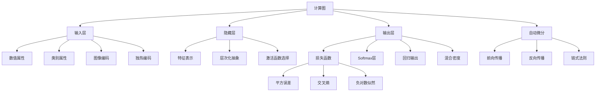

# 21.2 深度学习的计算图 - Deep Dive 分析

## 1. 背景与动机

### 1.1 为什么需要计算图视角？

在前一节中，我们将神经网络视为层与层的组合。然而，这种视角有其局限性：

- **灵活性受限**：严格的层级结构难以表达复杂的计算流程（如跳跃连接、多分支结构）
- **自动微分困难**：手动推导梯度公式对复杂网络极其繁琐且易出错
- **优化机会丢失**：无法自动识别计算中的冗余和并行机会

**计算图（Computation Graph）** 视角将神经网络视为由基本运算节点构成的有向图，每个节点执行简单的数学操作（加法、乘法、激活函数等）。这种表示方法：

1. **统一了各种架构**：全连接、卷积、循环网络都可以用同一框架描述
2. **启用了自动微分**：通过反向传播自动计算任意复杂网络的梯度
3. **支持端到端学习**：从输入到输出的整个流程可微可优化

### 1.2 从层到图的演进

```
传统视角: 输入层 → 隐藏层 → 输出层

计算图视角:
    x ──→ [×W₁] ──→ [+b₁] ──→ [g₁] ──→ [×W₂] ──→ [+b₂] ──→ [g₂] ──→ ŷ
              ↓         ↓        ↓
            权重     偏置    激活函数
```

### 1.3 端到端学习的意义

计算图使得**端到端学习（End-to-End Learning）**成为可能：

- **传统方法**：手工设计特征提取器 → 训练分类器
- **端到端学习**：原始输入 → [可训练计算图] → 期望输出

优势：
- 消除人工特征工程的主观性和局限性
- 允许模型自动发现最优表示
- 整体优化而非模块化优化

---

## 2. 知识逻辑图谱



---

## 3. 核心概念与数学分析

### 3.1 计算图的形式化定义

**定义 21.3（计算图）**：一个计算图是有向无环图 $G = (V, E)$，其中：

- **节点集合 $V$**：每个节点 $v \in V$ 表示一个基本运算
- **边集合 $E$**：有向边 $(u, v) \in E$ 表示节点 $u$ 的输出作为节点 $v$ 的输入
- **输入节点 $V_{in} \subseteq V$**：没有入边的节点（外部输入或参数）
- **输出节点 $V_{out} \subseteq V$**：没有出边的节点（计算结果）

**节点类型**：

| 类型 | 操作 | 导数 |
|:-----|:-----|:-----|
| 加法 | $h = f + g$ | $\frac{\partial h}{\partial f} = 1, \frac{\partial h}{\partial g} = 1$ |
| 乘法 | $h = f \cdot g$ | $\frac{\partial h}{\partial f} = g, \frac{\partial h}{\partial g} = f$ |
| 激活 | $h = \sigma(f)$ | $\frac{\partial h}{\partial f} = \sigma'(f)$ |
| 矩阵乘 | $h = Wf$ | $\frac{\partial h}{\partial W} = f^\top, \frac{\partial h}{\partial f} = W^\top$ |

### 3.2 输入编码

#### 3.2.1 数值属性

对于连续数值特征 $x \in \mathbb{R}$：

**标准化（Standardization）**：
$$\hat{x} = \frac{x - \mu}{\sigma}$$

其中 $\mu$ 和 $\sigma$ 是训练集的均值和标准差。使数据零均值、单位方差。

**归一化（Normalization）**：
$$\hat{x} = \frac{x - x_{min}}{x_{max} - x_{min}}$$

将数据缩放到 $[0, 1]$ 或 $[-1, 1]$ 区间。

**对数变换**：对于跨越多个数量级的数据
$$\hat{x} = \log(1 + x)$$

#### 3.2.2 类别属性：独热编码

对于具有 $d$ 个可能取值的类别属性：

$$\text{one\_hot}(k) = \mathbf{e}_k = [0, \ldots, 0, \underbrace{1}_{\text{第}k\text{位}}, 0, \ldots, 0]^\top$$

**为什么不用整数编码？**

假设颜色属性：{红=1, 绿=2, 蓝=3}

整数编码的问题：
- 网络会认为"绿"介于"红"和"蓝"之间（数值相邻关系）
- 实际上三种颜色是平等的，不存在序关系

独热编码消除了这种虚假的数值关系。

#### 3.2.3 图像的特殊编码

图像数据 $\mathbf{X} \in \mathbb{R}^{H \times W \times C}$（高×宽×通道）：

- **空间结构**：相邻像素在语义上相关
- **通道信息**：RGB三通道对应不同颜色分量
- **归一化**：通常将像素值从 $[0, 255]$ 缩放到 $[0, 1]$ 或 $[-1, 1]$

### 3.3 输出层与损失函数

#### 3.3.1 最大似然框架

**核心思想**：将网络输出解释为概率分布，最大化观测数据的似然。

对于训练集 $\{ (\mathbf{x}_j, \mathbf{y}_j) \}_{j=1}^N$，最优参数：

$$\mathbf{w}^* = \arg\min_{\mathbf{w}} -\sum_{j=1}^N \log P_{\mathbf{w}}(\mathbf{y}_j | \mathbf{x}_j) \tag{21-6}$$

#### 3.3.2 交叉熵损失

**定义 21.4（交叉熵）**：两个分布 $P$ 和 $Q$ 之间的交叉熵为：

$$H(P, Q) = -\mathbb{E}_{z \sim P(z)}[\log Q(z)] = -\int P(z) \log Q(z) dz \tag{21-7}$$

在机器学习中：
- $P$ 是数据的真实分布（通过样本估计）
- $Q = P_{\mathbf{w}}(y|x)$ 是模型的预测分布

**交叉熵损失 = 负对数似然**

#### 3.3.3 Softmax层

对于 $d$ 类分类问题，Softmax将 logits 转换为概率分布：

$$\text{softmax}(\mathbf{z})_k = \frac{e^{z_k}}{\sum_{k'=1}^d e^{z_{k'}}} \tag{21-8}$$

**性质**：
1. $\text{softmax}(\mathbf{z})_k \in (0, 1)$（非负性）
2. $\sum_k \text{softmax}(\mathbf{z})_k = 1$（归一性）
3. 放大差异：较大输入获得更大比例的概率质量

**与Sigmoid的关系**：当 $d=2$ 时，softmax等价于sigmoid。

证明：设两类logits为 $z_1, z_2$
$$p_1 = \frac{e^{z_1}}{e^{z_1} + e^{z_2}} = \frac{1}{1 + e^{-(z_1-z_2)}} = \sigma(z_1 - z_2)$$

#### 3.3.4 回归输出

对于回归问题（目标值连续）：

- **输出层**：线性激活 $\hat{y} = \mathbf{w}^\top \mathbf{h} + b$
- **概率解释**：假设观测值服从高斯分布 $y \sim \mathcal{N}(\hat{y}, \sigma^2)$
- **损失函数**：均方误差（MSE）

$$\text{MSE} = \frac{1}{N}\sum_{j=1}^N (y_j - \hat{y}_j)^2$$

**定理 21.4**：在固定方差高斯假设下，最大化似然等价于最小化MSE。

证明：
$$\log P(y|\hat{y}) = \log \frac{1}{\sqrt{2\pi}\sigma} \exp\left(-\frac{(y-\hat{y})^2}{2\sigma^2}\right) = C - \frac{(y-\hat{y})^2}{2\sigma^2}$$
最大化似然即最小化 $(y-\hat{y})^2$。

### 3.4 隐藏层的特征学习

#### 3.4.1 层次化表示

深层网络的每一层学习不同抽象层次的特征：

```
输入层: 原始像素/信号
    ↓
第一层: 边缘、颜色、简单纹理
    ↓
第二层: 形状、复杂纹理、局部模式
    ↓
第三层: 对象部件（眼睛、车轮等）
    ↓
输出层: 完整对象类别
```

这种层次化结构与人类的视觉处理层次（V1 → V2 → V4 → IT）相呼应。

#### 3.4.2 特征学习机制

隐藏层通过学习将输入变换到更适合任务的表示空间：

$$\mathbf{h}^{(l)} = g^{(l)}(\mathbf{W}^{(l)} \mathbf{h}^{(l-1)} + \mathbf{b}^{(l)})$$

理想情况下，变换后的特征 $\mathbf{h}^{(l)}$ 满足：
1. **线性可分性**：在高层空间，不同类别可用线性边界分开
2. **判别性**：保留与任务相关的信息，去除噪声
3. **压缩性**：用较少的维度捕捉数据的主要变化因素

---

## 4. 定理与证明

### 4.1 交叉熵与KL散度的关系

**定理 21.5**：最小化交叉熵等价于最小化KL散度。

**证明**：

KL散度（相对熵）定义为：
$$D_{KL}(P \| Q) = \int P(z) \log \frac{P(z)}{Q(z)} dz = \int P(z) \log P(z) dz - \int P(z) \log Q(z) dz$$

$$= -H(P) + H(P, Q)$$

其中 $H(P)$ 是 $P$ 的熵（与模型参数无关）。

因此：
$$\arg\min_Q H(P, Q) = \arg\min_Q D_{KL}(P \| Q)$$

**直观理解**：
- 交叉熵衡量用 $Q$ 编码 $P$ 所需的平均比特数
- KL散度衡量使用 $Q$ 而非真实分布 $P$ 进行编码的额外代价
- 两者最小化等价，因为 $H(P)$ 是常数

### 4.2 Softmax的梯度

**定理 21.6**：对于Softmax输出 $p_k = \frac{e^{z_k}}{\sum_j e^{z_j}}$，交叉熵损失 $L = -\sum_k y_k \log p_k$ 关于输入 $z_i$ 的梯度为：

$$\frac{\partial L}{\partial z_i} = p_i - y_i$$

**证明**：

首先计算 $\frac{\partial p_k}{\partial z_i}$（分 $k=i$ 和 $k \neq i$ 两种情况）：

**情况1：$k = i$**
$$\frac{\partial p_i}{\partial z_i} = \frac{e^{z_i} \sum_j e^{z_j} - e^{z_i} \cdot e^{z_i}}{(\sum_j e^{z_j})^2} = p_i - p_i^2 = p_i(1-p_i)$$

**情况2：$k \neq i$**
$$\frac{\partial p_k}{\partial z_i} = \frac{0 \cdot \sum_j e^{z_j} - e^{z_k} \cdot e^{z_i}}{(\sum_j e^{z_j})^2} = -p_k p_i$$

现在计算损失梯度（假设 $y$ 是one-hot向量，$y_c = 1$）：

$$\frac{\partial L}{\partial z_i} = -\sum_k y_k \frac{\partial \log p_k}{\partial z_i} = -\sum_k y_k \frac{1}{p_k} \frac{\partial p_k}{\partial z_i}$$

$$= -y_i \frac{1}{p_i} p_i(1-p_i) - \sum_{k \neq i} y_k \frac{1}{p_k} (-p_k p_i)$$

由于只有 $y_c = 1$，其他 $y_k = 0$：

- 若 $i = c$：$\frac{\partial L}{\partial z_i} = -(1-p_i) = p_i - 1$
- 若 $i \neq c$：$\frac{\partial L}{\partial z_i} = p_i$

统一写成：$\frac{\partial L}{\partial z_i} = p_i - y_i$ ∎

**意义**：梯度形式异常简洁，与线性回归的梯度形式相似，这是Softmax+交叉熵组合广泛使用的数学基础。

---

## 5. 具体示例

### 5.1 多分类任务的完整计算图

**任务**：识别手写数字（0-9），10类分类

**网络结构**：
- 输入：28×28 = 784维向量
- 隐藏层1：256单元，ReLU激活
- 隐藏层2：128单元，ReLU激活
- 输出层：10单元，Softmax激活

**计算图**：

```
x[784] ──→ [W₁: 784×256] ──→ [+b₁] ──→ [ReLU] ──→ h₁[256]
                                               ↓
h₁ ──→ [W₂: 256×128] ──→ [+b₂] ──→ [ReLU] ──→ h₂[128]
                                               ↓
h₂ ──→ [W₃: 128×10] ──→ [+b₃] ──→ [Softmax] ──→ p[10]
                                               ↓
                                         L = -log p_y
```

**参数统计**：
- 第一层：784 × 256 + 256 = 200,960
- 第二层：256 × 128 + 128 = 32,896
- 第三层：128 × 10 + 10 = 1,290
- **总计**：约 235K 参数

### 5.2 损失计算数值示例

假设三分类问题，真实标签为类别2（$\mathbf{y} = [0, 1, 0]^\top$），网络输出logits：

$$\mathbf{z} = [2.0, 1.0, 0.1]^\top$$

**Softmax计算**：

$$e^{z_1} = 7.389, \quad e^{z_2} = 2.718, \quad e^{z_3} = 1.105$$

$$\sum = 11.212$$

$$p_1 = \frac{7.389}{11.212} \approx 0.659, \quad p_2 = \frac{2.718}{11.212} \approx 0.242, \quad p_3 = \frac{1.105}{11.212} \approx 0.099$$

**交叉熵损失**：

$$L = -\sum_k y_k \log p_k = -\log p_2 = -\log(0.242) \approx 1.418$$

**梯度**：

$$\frac{\partial L}{\partial \mathbf{z}} = \mathbf{p} - \mathbf{y} = [0.659, -0.758, 0.099]^\top$$

**数值稳定性注意**：

直接计算softmax可能出现数值溢出：$e^{1000}$ 超出浮点数范围。

**解决方案**：

$$\text{softmax}(\mathbf{z})_k = \frac{e^{z_k - c}}{\sum_j e^{z_j - c}}$$

通常取 $c = \max_j z_j$，确保指数运算在合理范围内。

### 5.3 混合密度网络的输出

对于某些任务，单一预测值不够，需要预测整个分布（如多模态数据）。

**混合密度网络（Mixture Density Network）**：

输出层预测混合高斯分布的参数：
- 混合系数 $\pi_k$（$\sum_k \pi_k = 1$）
- 各成分均值 $\mu_k$
- 各成分方差 $\sigma_k^2$

预测分布：
$$P(y|x) = \sum_{k=1}^K \pi_k(x) \cdot \mathcal{N}(y; \mu_k(x), \sigma_k^2(x))$$

应用场景：
- 逆问题（如从轮廓恢复3D形状，一个轮廓可能对应多个形状）
- 多模态预测（如下一帧视频可能有多种合理延续）

---

## 6. 可视化

### 6.1 计算图展开

简单函数 $f(x, y) = (x + y) \cdot y$ 的计算图：

```
        x ──→ [+] ──→ [×] ──→ f
                ↑     ↑
        y ─────┘     └──── y
```

反向传播时：
1. 计算 $\frac{\partial f}{\partial (x+y)} = y$
2. 计算 $\frac{\partial f}{\partial y} = (x+y) + y$（通过两条路径）
3. 计算 $\frac{\partial f}{\partial x} = y$

### 6.2 不同输出层对比

| 任务类型 | 网络输出 | 可视化 |
|:---------|:---------|:-------|
| 二分类 | 单一概率 | 输出节点 → Sigmoid → [0,1] |
| 多分类 | 概率分布 | 输出向量 → Softmax → 概率和为1 |
| 回归 | 连续值 | 输出节点 → 线性 → 任意实数 |
| 多任务 | 混合输出 | 分支：一部分Softmax，一部分线性 |

---

## 7. 常见陷阱

### ⚠️ 陷阱1：忽视数值稳定性

**问题**：Softmax中的指数运算容易溢出

**错误代码**（概念性）：
```python
# 危险：可能溢出
prob = exp(z) / sum(exp(z))
```

**正确做法**：
```python
# 减去最大值
z_stable = z - max(z)
prob = exp(z_stable) / sum(exp(z_stable))
```

### ⚠️ 陷阱2：类别不平衡时的Softmax

**问题**：某些类别样本极少，Softmax可能永远预测不对

**解决方案**：
- 类别权重：在损失函数中为少数类设置更高权重
- 采样策略：过采样少数类或欠采样多数类
- Focal Loss：降低易分类样本的权重

### ⚠️ 陷阱3：忽略输入缩放

**问题**：不同特征量纲差异大，导致梯度更新不均衡

**示例**：
- 年龄：0-100
- 收入：0-100,000
- 未缩放时，收入特征的权重更新将主导学习过程

**解决方案**：对所有数值特征进行标准化或归一化

### ⚠️ 陷阱4：混淆输出层激活与损失函数

**常见错误**：
- Sigmoid输出 + MSE损失（用于分类）
- Softmax输出 + Sigmoid交叉熵

**推荐组合**：
| 任务 | 输出激活 | 损失函数 |
|:-----|:---------|:---------|
| 二分类 | Sigmoid | Binary Cross Entropy |
| 多分类 | Softmax | Categorical Cross Entropy |
| 回归 | Linear | MSE / MAE |

---

## 8. 一句话本质

**计算图通过将复杂网络分解为可微的基本运算，实现了端到端的自动微分和优化，使深度学习系统能够直接从原始数据学习层次化的特征表示。**

---

## 9. 总结与反思

### 9.1 核心要点回顾

1. **计算图统一框架**：各种神经网络架构都可以用计算图统一描述
2. **输入编码的重要性**：正确的编码方式（独热、标准化）影响学习效果
3. **输出层设计原则**：根据任务类型选择合适的输出激活和损失函数
4. **最大似然视角**：将网络输出解释为概率，用负对数似然作为损失
5. **层次化特征学习**：深层网络自动学习从低级到高级的特征表示

### 9.2 深层思考

**为什么Softmax使用指数函数？**

1. **正值性**：$e^x > 0$ 确保输出概率非负
2. **放大差异**：指数函数放大输入间的相对差异
3. **可微性**：处处可微，便于梯度优化
4. **与熵的关系**：指数族分布与最大熵原理的联系

**输出层设计的贝叶斯视角**：

不同输出层对应不同的概率假设：
- Softmax：分类分布（Categorical）
- Sigmoid + MSE：高斯分布（异方差）
- Softmax + 交叉熵：最大熵原理

### 9.3 与其他章节的关系

- **21.1节**：从层视角到计算图视角的升华
- **21.3节**：卷积作为计算图中的特殊操作
- **21.4节**：基于计算图的自动微分实现
- **21.6节**：循环连接的引入扩展了计算图能力

### 9.4 前沿发展

1. **可微分编程**：将任意程序转换为可微计算图（如JAX、PyTorch）
2. **神经架构搜索（NAS）**：自动设计最优计算图结构
3. **图神经网络（GNN）**：处理非欧几里得数据的计算图扩展
4. **神经符号结合**：将符号推理融入可微计算图
