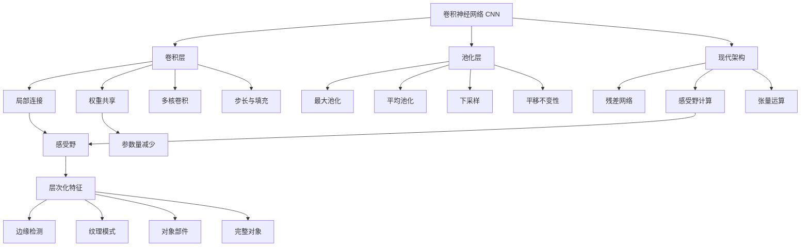

# 21.3 卷积网络 - Deep Dive 分析

## 1. 背景与动机

### 1.1 为什么全连接网络不适合图像？

考虑一个1024×1024像素的RGB图像：

**全连接网络的困境**：
- **参数量爆炸**：第一层若有1024个单元，权重数为 $1024 \times 1024 \times 3 \times 1024 \approx 3$ 十亿
- **忽视空间结构**：全连接层将图像展平为向量，丢失了像素间的空间关系
- **平移敏感**：相同特征出现在不同位置需要分别学习

**人类视觉的启示**：
- **局部感受野**：视觉皮层神经元只响应视野中的局部区域
- **层次化处理**：从简单特征（边缘）到复杂特征（对象）逐级构建
- **平移不变性**：相同特征在不同位置引发相似响应

### 1.2 卷积神经网络的核心思想

卷积神经网络（CNN）通过三个关键设计解决上述问题：

1. **稀疏连接（局部感受野）**：每个神经元只连接输入的局部区域
2. **权重共享**：同一特征检测器应用于整个输入空间
3. **层次化特征**：深层神经元整合浅层特征，扩大感受野

### 1.3 从神经科学到深度学习

CNN的生物学灵感：
- **Hubel & Wiesel (1962)**：发现猫的视觉皮层中存在简单细胞和复杂细胞
- **简单细胞**：响应特定方向的边缘（类似卷积核）
- **复杂细胞**：对位置变化具有一定容忍度（类似池化）
- **Fukushima (1980)**：Neocognitron——首个受生物学启发的层次化视觉模型

---

## 2. 知识逻辑图谱



---

## 3. 核心概念与数学分析

### 3.1 一维卷积运算

**定义 21.7（一维卷积）**：给定输入向量 $\mathbf{x} \in \mathbb{R}^n$ 和核向量 $\mathbf{k} \in \mathbb{R}^l$（$l$ 为奇数），卷积运算定义为：

$$(\mathbf{x} * \mathbf{k})_i = \sum_{j=1}^l k_j \cdot x_{i + j - (l+1)/2} \tag{21-8}$$

**直观理解**：在每个位置 $i$，核与以 $x_i$ 为中心的局部窗口做点积。

**示例**：

输入 $\mathbf{x} = [5, 6, 6, 2, 5, 6, 5]$，核 $\mathbf{k} = [+1, -1, +1]$（检测暗点）

位置3的计算：
$$(\mathbf{x} * \mathbf{k})_3 = 1 \cdot 6 + (-1) \cdot 2 + 1 \cdot 5 = 9$$

### 3.2 二维卷积

对于图像处理，使用二维卷积核 $\mathbf{K} \in \mathbb{R}^{k \times k}$：

$$(\mathbf{X} * \mathbf{K})_{i,j} = \sum_{m=0}^{k-1} \sum_{n=0}^{k-1} K_{m,n} \cdot X_{i+m-\lfloor k/2 \rfloor, j+n-\lfloor k/2 \rfloor}$$

**输出尺寸计算**：

对于输入尺寸 $H \times W$，核大小 $k$，步长 $s$，填充 $p$：

$$H_{out} = \left\lfloor \frac{H + 2p - k}{s} \right\rfloor + 1$$

$$W_{out} = \left\lfloor \frac{W + 2p - k}{s} \right\rfloor + 1$$

**常用配置**：
- 保持尺寸：$k=3, s=1, p=1$
- 下采样一半：$k=2, s=2, p=0$

### 3.3 多通道卷积

实际CNN中，数据和核都有多个通道：

- 输入：$H \times W \times C_{in}$（如RGB图像 $C_{in}=3$）
- 核：$k \times k \times C_{in} \times C_{out}$
- 输出：$H_{out} \times W_{out} \times C_{out}$

每个输出通道对应一组 $C_{in}$ 个卷积核，分别与输入的 $C_{in}$ 个通道卷积后求和。

### 3.4 卷积作为矩阵乘法

卷积可以表示为稀疏矩阵乘法：

$$\mathbf{z} = \mathbf{W}_{conv} \mathbf{x}$$

其中 $\mathbf{W}_{conv}$ 是包含卷积核元素的Toeplitz矩阵。

**示例**：一维卷积，输入长度7，核大小3，步长2

$$\mathbf{W}_{conv} = \begin{pmatrix}
k_1 & k_2 & k_3 & 0 & 0 & 0 & 0 \\
0 & 0 & k_1 & k_2 & k_3 & 0 & 0 \\
0 & 0 & 0 & 0 & k_1 & k_2 & k_3
\end{pmatrix}$$

这种表示说明：
1. 卷积是线性运算
2. 权重共享体现在矩阵的重复模式中
3. 反向传播可以高效实现

### 3.5 池化操作

**最大池化（Max Pooling）**：

$$\text{maxpool}(\mathbf{x})_i = \max_{j \in \text{window}_i} x_j$$

**平均池化（Average Pooling）**：

$$\text{avgpool}(\mathbf{x})_i = \frac{1}{|\text{window}_i|} \sum_{j \in \text{window}_i} x_j$$

**作用**：
1. **降维**：减少后续层的计算量
2. **平移不变性**：小范围内的平移不影响输出
3. **特征聚合**：整合局部信息

**常见配置**：$2 \times 2$ 池化，步长2（尺寸减半）

### 3.6 感受野分析

**定义**：输出单元对应的输入区域大小。

**感受野增长**：
- 第 $m$ 个卷积层（步长1）的感受野：$(l-1)m + 1$
- 每增加一层，感受野增加 $(l-1)$

**快速扩大感受野**：
- 大步长：步长 $s$ 使感受野指数增长 $O(l \cdot s^m)$
- 池化层：同样有扩大感受野的效果
- 大卷积核：直接增大感受野但参数增多

**现代方法**：空洞卷积（Dilated Convolution）在不增加参数的情况下扩大感受野。

---

## 4. 定理与证明

### 4.1 卷积的平移等变性

**定理 21.7（平移等变性）**：卷积运算与平移操作可交换。

形式化：设 $T_\tau$ 为平移操作 $(T_\tau x)_i = x_{i-\tau}$，则：

$$T_\tau (\mathbf{x} * \mathbf{k}) = (T_\tau \mathbf{x}) * \mathbf{k}$$

**证明**：

$$[T_\tau (\mathbf{x} * \mathbf{k})]_i = (\mathbf{x} * \mathbf{k})_{i-\tau} = \sum_j k_j x_{i-\tau+j}$$

$$[(T_\tau \mathbf{x}) * \mathbf{k}]_i = \sum_j k_j (T_\tau \mathbf{x})_{i+j} = \sum_j k_j x_{i+j-\tau}$$

两者相等 ∎

**意义**：特征检测器在输入的任何位置都保持一致的行为。

### 4.2 参数效率

**定理 21.8**：处理 $n \times n$ 输入，使用 $k \times k$ 核、$d$ 个输出通道的卷积层参数量为 $k^2 d$，与输入尺寸 $n$ 无关。

对比全连接层：参数量为 $n^2 d$，随输入尺寸平方增长。

**示例**：
- 图像尺寸：$224 \times 224 = 50176$
- 卷积核：$3 \times 3$，64通道
- 卷积参数：$3 \times 3 \times 64 = 576$
- 全连接参数：$50176 \times 64 \approx 3.2$ 百万

---

## 5. 具体示例

### 5.1 边缘检测核

**水平边缘检测**：

$$\mathbf{K}_{\text{horizontal}} = \begin{pmatrix} -1 & -1 & -1 \\ 0 & 0 & 0 \\ 1 & 1 & 1 \end{pmatrix}$$

响应正的区域：上方暗、下方亮

**垂直边缘检测**：

$$\mathbf{K}_{\text{vertical}} = \begin{pmatrix} -1 & 0 & 1 \\ -1 & 0 & 1 \\ -1 & 0 & 1 \end{pmatrix}$$

**Sobel算子**：

$$\mathbf{K}_{\text{Sobel}_x} = \begin{pmatrix} -1 & 0 & 1 \\ -2 & 0 & 2 \\ -1 & 0 & 1 \end{pmatrix}$$

带平滑的边缘检测，减少噪声影响。

### 5.2 简单CNN完整示例

**网络结构**：处理 $32 \times 32$ RGB图像，10类分类

```
输入: 32×32×3
    ↓
Conv1: 5×5 kernel, 6 filters, stride 1, pad 0
       → 28×28×6
    ↓
ReLU
    ↓
Pool1: 2×2 maxpool, stride 2
       → 14×14×6
    ↓
Conv2: 5×5 kernel, 16 filters, stride 1, pad 0
       → 10×10×16
    ↓
ReLU
    ↓
Pool2: 2×2 maxpool, stride 2
       → 5×5×16
    ↓
Flatten: → 400
    ↓
FC1: 400 → 120
    ↓
ReLU
    ↓
FC2: 120 → 84
    ↓
ReLU
    ↓
FC3: 84 → 10
    ↓
Softmax
```

**这是LeNet-5架构的简化版**

### 5.3 感受野计算实例

**网络配置**：
- 输入：$224 \times 224$
- Conv1: $7 \times 7$, stride 2 → 输出 $112 \times 112$
- Pool1: $3 \times 3$, stride 2 → 输出 $56 \times 56$
- Conv2: $3 \times 3$, stride 1 → 输出 $56 \times 56$
- Conv3: $3 \times 3$, stride 1 → 输出 $56 \times 56$

**感受野计算**：

| 层 | 操作 | 感受野 |
|:--:|:-----|:-------|
| 输入 | - | $1 \times 1$ |
| Conv1 | $7 \times 7$, s=2 | $7 \times 7$ |
| Pool1 | $3 \times 3$, s=2 | $7 + 2 \times (3-1) = 11$ |
| Conv2 | $3 \times 3$, s=1 | $11 + 1 \times (3-1) = 13$ |
| Conv3 | $3 \times 3$, s=1 | $13 + 1 \times (3-1) = 15$ |

---

## 6. 残差网络（ResNet）

### 6.1 深层网络的训练困难

**问题**：随着网络加深，出现：
- **梯度消失**：反向传播信号逐层衰减
- **退化问题**：深层网络训练误差反而高于浅层网络（不是过拟合！）

### 6.2 残差学习

**核心思想**：学习残差 $f(\mathbf{x})$ 而非直接学习映射 $H(\mathbf{x})$

$$\mathbf{y} = \mathbf{x} + f(\mathbf{x}) \tag{21-10}$$

**残差块结构**：
```
输入 x ──→ [×W₁] → [BN] → [ReLU] → [×W₂] → [BN] ──→ + ──→ 输出
    │                                                ↑
    └────────────────── 跳跃连接 ────────────────────┘
```

### 6.3 残差连接的梯度流动

假设残差块：$\mathbf{y} = \mathbf{x} + f(\mathbf{x})$

梯度：
$$\frac{\partial \mathcal{L}}{\partial \mathbf{x}} = \frac{\partial \mathcal{L}}{\partial \mathbf{y}} \cdot \frac{\partial \mathbf{y}}{\partial \mathbf{x}} = \frac{\partial \mathcal{L}}{\partial \mathbf{y}} \cdot (1 + \frac{\partial f}{\partial \mathbf{x}})$$

即使 $\frac{\partial f}{\partial \mathbf{x}} \approx 0$，梯度仍可通过恒等连接传播：
$$\frac{\partial \mathcal{L}}{\partial \mathbf{x}} \approx \frac{\partial \mathcal{L}}{\partial \mathbf{y}}$$

**优势**：
1. 缓解梯度消失
2. 恒等映射易于学习（设 $f = 0$ 即可）
3. 可训练数百甚至上千层的网络

---

## 7. 可视化

### 7.1 卷积操作可视化

**输入图像** → **[卷积核滑动扫描]** → **特征图**

```
输入:          卷积核:        输出特征图:
┌───┬───┬───┐   ┌───┬───┐     ┌───┬───┐
│ 1 │ 2 │ 3 │   │ 1 │ 0 │     │ ? │ ? │
├───┼───┼───┤   ├───┼───┤     ├───┼───┤
│ 4 │ 5 │ 6 │   │ 0 │ 1 │     │ ? │ ? │
├───┼───┼───┤   └───┴───┘     └───┴───┘
│ 7 │ 8 │ 9 │
└───┴───┴───┘
```

### 7.2 层次化特征可视化

| 层 | 可视化内容 | 描述 |
|:--:|:----------|:-----|
| Layer 1 | 边缘、颜色斑点 | 低级特征，类似Gabor滤波器 |
| Layer 3 | 纹理、简单图案 | 组合边缘形成纹理 |
| Layer 5 | 对象部件 | 眼睛、轮胎、文字片段 |
| Layer 10+ | 完整对象 | 人脸、汽车、动物 |

---

## 8. 常见陷阱

### ⚠️ 陷阱1：忽视输入尺寸对齐

**问题**：卷积后尺寸计算错误，导致后续层维度不匹配

**解决方案**：
- 使用公式仔细计算每层的输出尺寸
- 或使用"same"填充自动保持尺寸
- 现代框架通常自动处理，但理解原理很重要

### ⚠️ 陷阱2：过度使用池化

**问题**：过多的池化层导致信息丢失，小物体难以检测

**建议**：
- 现代网络（如ResNet）减少池化，使用步长大于1的卷积替代
- 目标检测等任务需要高分辨率特征图

### ⚠️ 陷阱3：忽视通道数增长

**问题**：通道数设计不当导致显存不足或表达能力不足

**常见模式**：
- 空间分辨率减半时，通道数翻倍（保持计算量相对稳定）
- 如：$224 \times 224 \times 64$ → $112 \times 112 \times 128$ → $56 \times 56 \times 256$

### ⚠️ 陷阱4：混淆卷积核大小与感受野

**误区**：认为只有大卷积核才能获得大感受野

**事实**：
- 多个小卷积核叠加可获等效大感受野，参数更少
- 例：两个 $3 \times 3$ 卷积等效感受野 $5 \times 5$，参数 $2 \times 3^2 = 18$ vs $5^2 = 25$
- VGG网络采用此策略

---

## 9. 一句话本质

**卷积神经网络通过局部连接、权重共享和层次化组织，高效地利用图像的空间结构和平移不变性，实现从像素到语义的可学习特征提取。**

---

## 10. 总结与反思

### 10.1 核心要点回顾

1. **局部感受野**：神经元只响应局部区域，减少参数并保留空间结构
2. **权重共享**：同一卷积核应用于全图，实现平移等变性
3. **层次化特征**：深层整合浅层特征，自动学习层次化表示
4. **池化降维**：聚合局部信息，提供平移不变性
5. **残差连接**：解决深层网络训练困难，实现数百层网络

### 10.2 深层思考

**卷积 vs 全连接的本质区别**：

| 维度 | 全连接 | 卷积 |
|:-----|:-------|:-----|
| 连接模式 | 全部连接 | 局部连接 |
| 参数共享 | 无 | 是 |
| 先验假设 | 无 | 局部性、平移不变性 |
| 适用数据 | 结构化/表格数据 | 图像、信号等网格数据 |

**为什么CNN在图像上表现好？**

1. **正确的归纳偏置**：
   - 局部性：相邻像素相关
   - 平移不变性：对象位置不影响识别
   - 层次化组合：视觉世界的层次结构

2. **参数效率**：
   - 相比全连接，参数减少几个数量级
   - 更不易过拟合

### 10.3 与其他章节的关系

- **21.1-21.2**：卷积是计算图中的特殊线性操作
- **21.4**：CNN的训练同样使用SGD和反向传播
- **21.5**：CNN的泛化受益于正确的架构先验
- **第25章**：计算机视觉的更多CNN应用

### 10.4 前沿发展

1. **注意力机制**：Vision Transformer（ViT）用自注意力替代卷积
2. **可变形卷积**：自适应调整采样位置
3. **神经架构搜索**：自动发现最优CNN结构
4. **轻量化设计**：MobileNet、ShuffleNet等移动设备优化架构
