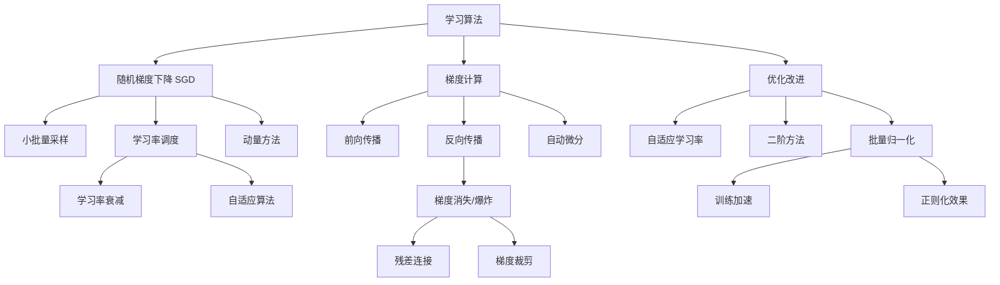

# 21.4 学习算法 - Deep Dive 分析

## 1. 背景与动机

### 1.1 为什么需要专门的学习算法？

深度学习模型通常包含数百万甚至数十亿参数，传统优化方法面临：

- **维度灾难**：参数空间维度极高，网格搜索等方法不可行
- **非凸优化**：损失函数通常是高度非凸的，存在大量局部极小值和鞍点
- **计算成本**：完整梯度计算需要遍历整个数据集，代价高昂
- **数值稳定性**：深层网络中的梯度消失/爆炸问题

### 1.2 从梯度下降到随机梯度下降

**批量梯度下降（Batch GD）**：

$$\mathbf{w}_{t+1} = \mathbf{w}_t - \alpha \nabla_{\mathbf{w}} L(\mathbf{w}_t; \mathcal{D})$$

其中 $\mathcal{D}$ 是整个训练集。

**问题**：
- 每步迭代需要处理全部数据，计算缓慢
- 对于大型数据集，内存可能无法容纳
- 容易陷入局部极小值

**随机梯度下降（SGD）**：

$$\mathbf{w}_{t+1} = \mathbf{w}_t - \alpha \nabla_{\mathbf{w}} L(\mathbf{w}_t; \mathcal{B}_t)$$

其中 $\mathcal{B}_t$ 是随机采样的小批量（mini-batch）。

**优势**：
1. **计算效率**：每步只需处理小批量数据
2. **内存友好**：不需要加载全部数据
3. **噪声帮助逃离局部极小值**：随机性引入噪声，有助于探索参数空间
4. **在线学习**：可处理流式数据

### 1.3 深度学习优化的特殊性

与传统优化不同，深度学习优化具有以下特点：

1. **过参数化**：参数多于训练样本，存在无穷多解
2. **感兴趣的不是全局极小值**：泛化性能比训练损失更重要
3. **早期停止**：往往在收敛前停止训练效果最好
4. **隐式正则化**：优化算法本身影响解的选择

---

## 2. 知识逻辑图谱



---

## 3. 核心概念与数学分析

### 3.1 SGD的形式化描述

**算法：随机梯度下降**

```
输入: 初始参数 w₀, 学习率 α, 批量大小 m, 训练轮数 epochs

对于 epoch = 1, 2, ..., epochs:
    随机打乱训练集
    对于每个小批量 B ⊂ D, |B| = m:
        计算梯度: g ← (1/m) Σᵢ ∇L(w; xᵢ, yᵢ)
        更新参数: w ← w - αg
返回 w
```

**期望梯度等于真实梯度**：

$$\mathbb{E}_{\mathcal{B}}[\nabla L(\mathbf{w}; \mathcal{B})] = \nabla L(\mathbf{w}; \mathcal{D})$$

这意味着SGD是真实梯度的无偏估计。

### 3.2 学习率调度

**固定学习率的问题**：
- 太大：震荡不收敛
- 太小：收敛缓慢

**常用学习率调度策略**：

1. **阶梯衰减（Step Decay）**：
   $$\alpha_t = \alpha_0 \cdot \gamma^{\lfloor t / T \rfloor}$$
   每 $T$ 轮将学习率乘以 $\gamma$（如0.1）

2. **指数衰减（Exponential Decay）**：
   $$\alpha_t = \alpha_0 \cdot e^{-kt}$$

3. **余弦退火（Cosine Annealing）**：
   $$\alpha_t = \alpha_{min} + \frac{1}{2}(\alpha_{max} - \alpha_{min})(1 + \cos(\frac{t}{T}\pi))$$

4. **预热（Warmup）**：
   初始阶段线性增加学习率，然后应用其他调度

### 3.3 动量方法

**物理直觉**：将参数更新视为物理运动，引入速度概念和动量。

**标准SGD**：
$$\mathbf{w}_{t+1} = \mathbf{w}_t - \alpha \mathbf{g}_t$$

**带动量的SGD**：
$$\mathbf{v}_{t+1} = \beta \mathbf{v}_t + \mathbf{g}_t$$
$$\mathbf{w}_{t+1} = \mathbf{w}_t - \alpha \mathbf{v}_{t+1}$$

其中 $\beta \in [0, 1)$ 是动量系数（通常0.9）。

**Nesterov加速梯度（NAG）**：
$$\mathbf{v}_{t+1} = \beta \mathbf{v}_t + \nabla L(\mathbf{w}_t - \alpha \beta \mathbf{v}_t)$$
$$\mathbf{w}_{t+1} = \mathbf{w}_t - \alpha \mathbf{v}_{t+1}$$

**优势**：
- 加速收敛，特别是在病态条件下
- 减少震荡
- 帮助逃离局部极小值和鞍点

### 3.4 自适应学习率方法

#### 3.4.1 AdaGrad

累积梯度平方，对学习率进行自适应调整：

$$\mathbf{r}_t = \mathbf{r}_{t-1} + \mathbf{g}_t \odot \mathbf{g}_t$$
$$\mathbf{w}_{t+1} = \mathbf{w}_t - \frac{\alpha}{\sqrt{\mathbf{r}_t + \epsilon}} \odot \mathbf{g}_t$$

特点：对稀疏梯度给予更大更新，适合处理稀疏数据。

#### 3.4.2 RMSprop

解决AdaGrad学习率单调递减问题：

$$\mathbf{r}_t = \rho \mathbf{r}_{t-1} + (1-\rho) \mathbf{g}_t \odot \mathbf{g}_t$$
$$\mathbf{w}_{t+1} = \mathbf{w}_t - \frac{\alpha}{\sqrt{\mathbf{r}_t + \epsilon}} \odot \mathbf{g}_t$$

通常 $\rho = 0.9$，使用指数移动平均。

#### 3.4.3 Adam（Adaptive Moment Estimation）

结合动量和自适应学习率：

$$\mathbf{m}_t = \beta_1 \mathbf{m}_{t-1} + (1-\beta_1) \mathbf{g}_t \quad \text{(一阶矩估计)}$$
$$\mathbf{v}_t = \beta_2 \mathbf{v}_{t-1} + (1-\beta_2) \mathbf{g}_t \odot \mathbf{g}_t \quad \text{(二阶矩估计)}$$

偏差修正：
$$\hat{\mathbf{m}}_t = \frac{\mathbf{m}_t}{1-\beta_1^t}, \quad \hat{\mathbf{v}}_t = \frac{\mathbf{v}_t}{1-\beta_2^t}$$

参数更新：
$$\mathbf{w}_{t+1} = \mathbf{w}_t - \frac{\alpha}{\sqrt{\hat{\mathbf{v}}_t} + \epsilon} \hat{\mathbf{m}}_t$$

**默认超参数**：$\beta_1=0.9, \beta_2=0.999, \epsilon=10^{-8}$

### 3.5 批量归一化（Batch Normalization）

**问题**：深度网络中，每层输入分布随前层参数变化而变化（内部协变量偏移）。

**解决方案**：对每个小批量进行归一化：

$$\hat{x}_i = \gamma \frac{x_i - \mu_B}{\sqrt{\sigma_B^2 + \epsilon}} + \beta$$

其中：
- $\mu_B = \frac{1}{m} \sum_{i=1}^m x_i$（批量均值）
- $\sigma_B^2 = \frac{1}{m} \sum_{i=1}^m (x_i - \mu_B)^2$（批量方差）
- $\gamma, \beta$ 是可学习的缩放和平移参数

**测试阶段**：使用训练时累积的滑动平均统计量：

$$\hat{x} = \gamma \frac{x - \mu_{moving}}{\sqrt{\sigma_{moving}^2 + \epsilon}} + \beta$$

**优势**：
1. 加速训练（允许更大学习率）
2. 减少对初始化的敏感性
3. 具有一定正则化效果
4. 使深层网络训练成为可能

---

## 4. 定理与证明

### 4.1 SGD的收敛性

**定理 21.9（SGD收敛）**：假设损失函数 $L$ 是凸函数且 $L$-Lipschitz连续，学习率 $\alpha_t = \frac{c}{\sqrt{t}}$，则SGD满足：

$$\mathbb{E}[L(\bar{\mathbf{w}}_T)] - L(\mathbf{w}^*) \leq O(\frac{1}{\sqrt{T}})$$

其中 $\bar{\mathbf{w}}_T = \frac{1}{T}\sum_{t=1}^T \mathbf{w}_t$ 是平均参数，$\mathbf{w}^*$ 是最优解。

**非凸情况**：深度学习中损失通常非凸，SGD可能收敛到：
- 局部极小值
- 鞍点
- 平坦区域

**过参数化下的收敛**：在过参数化情况下，SGD往往能收敛到全局最优。

### 4.2 动量的加速效果

**定理 21.10**：对于二次函数 $f(\mathbf{x}) = \frac{1}{2}\mathbf{x}^\top A \mathbf{x} - \mathbf{b}^\top \mathbf{x}$，最优动量参数 $\beta^* = \frac{\sqrt{\kappa}-1}{\sqrt{\kappa}+1}$，其中 $\kappa = \frac{\lambda_{max}}{\lambda_{min}}$ 是条件数。

此时收敛速度从 $O((1-\frac{1}{\kappa})^t)$ 提升到 $O((1-\frac{1}{\sqrt{\kappa}})^t)$。

---

## 5. 具体示例

### 5.1 不同优化器的轨迹对比

考虑简单函数 $f(x, y) = 0.5x^2 + 2y^2$（椭圆等高线）：

**SGD**：
- 在陡峭方向震荡
- 在平坦方向进展缓慢

**带动量的SGD**：
- 减少震荡
- 在平坦方向累积速度，加速前进

**Adam**：
- 自适应调整每个参数的学习率
- 对陡峭方向使用小学习率，平坦方向使用大学习率

### 5.2 学习率影响数值示例

假设简单凸函数 $f(w) = w^2$，初始 $w_0 = 5$。

**学习率 $\alpha = 0.1$**：
- $w_1 = 5 - 0.1 \times 10 = 4$
- $w_2 = 4 - 0.1 \times 8 = 3.2$
- 稳定收敛

**学习率 $\alpha = 1.1$**（过大）：
- $w_1 = 5 - 1.1 \times 10 = -6$
- $w_2 = -6 - 1.1 \times (-12) = 7.2$
- 发散震荡

**学习率 $\alpha = 0.01$**（过小）：
- 收敛极慢

### 5.3 批量大小选择

| 批量大小 | 优点 | 缺点 | 适用场景 |
|:--------:|:-----|:-----|:---------|
| 32-128 | 噪声适中，泛化好 | GPU利用率低 | 一般训练 |
| 256-1024 | GPU利用率高 | 可能需要调整学习率 | 大规模训练 |
| 1 (纯SGD) | 噪声最大，可能逃离尖锐极小值 | 难以并行，收敛慢 | 理论研究 |
| 全批量 | 梯度准确，收敛稳定 | 内存需求大，泛化可能差 | 小数据集 |

---

## 6. 梯度计算

### 6.1 反向传播算法

**核心思想**：利用链式法则高效计算梯度。

**算法步骤**：

1. **前向传播**：计算每层的输出并保存
2. **计算输出层梯度**：$\delta^{(L)} = \nabla_{\mathbf{a}^{(L)}} \mathcal{L} \odot g'(\mathbf{z}^{(L)})$
3. **反向传播误差**：
   $$\delta^{(l)} = ((\mathbf{W}^{(l+1)})^\top \delta^{(l+1)}) \odot g'(\mathbf{z}^{(l)})$$
4. **计算权重梯度**：
   $$\nabla_{\mathbf{W}^{(l)}} \mathcal{L} = \delta^{(l)} (\mathbf{a}^{(l-1)})^\top$$

### 6.2 计算复杂度

- **前向传播**：$O(|E|)$，与边数成正比
- **反向传播**：$O(|E|)$，与前向相同
- **内存需求**：需要保存前向传播的所有中间值

### 6.3 自动微分

现代深度学习框架（PyTorch、TensorFlow、JAX）使用**自动微分**：

**两种模式**：
1. **前向模式（Forward Mode）**：适合输入少输出多的函数
2. **反向模式（Reverse Mode）**：适合输入多输出少的函数（神经网络常用）

**实现方式**：
- **操作符重载**：记录每个操作到计算图
- **源码转换**：自动将代码转换为计算梯度版本

---

## 7. 常见陷阱

### ⚠️ 陷阱1：学习率设置不当

**问题**：学习率太大导致震荡/发散，太小导致收敛极慢

**诊断**：
- 训练损失震荡 → 学习率过大
- 训练损失几乎不变 → 学习率过小或梯度消失

**建议**：
- 使用学习率预热
- 尝试学习率范围测试（LR Range Test）
- 监控训练曲线

### ⚠️ 陷阱2：忽视批量归一化的训练/测试差异

**问题**：在测试时错误地使用批量统计量

**正确做法**：
- 训练：使用当前批量的均值和方差
- 测试：使用训练时累积的滑动平均统计量
- 现代框架通常自动处理，但自定义实现时需注意

### ⚠️ 陷阱3：Adam一定能获得最好结果

**事实**：
- Adam收敛快，但最终泛化性能可能不如SGD+Momentum
- 许多SOTA模型使用SGD+动量配合精心调度的学习率
- 建议先尝试Adam快速验证，再用SGD精细调优

### ⚠️ 陷阱4：梯度爆炸导致NaN

**问题**：训练过程中损失突然变为NaN

**解决方案**：
- 梯度裁剪（Gradient Clipping）：$\mathbf{g} \leftarrow \mathbf{g} \cdot \min(1, \frac{\theta}{\|\mathbf{g}\|})$
- 使用更保守的学习率
- 检查数值稳定性（如log(0)）

---

## 8. 一句话本质

**深度学习通过随机梯度下降及其变种，利用反向传播高效计算梯度，在高度非凸的损失 landscape 中寻找泛化性能良好的参数配置。**

---

## 9. 总结与反思

### 9.1 核心要点回顾

1. **SGD是核心**：随机梯度下降是深度学习优化的基础
2. **动量加速**：积累历史梯度信息，加速收敛并减少震荡
3. **自适应学习率**：AdaGrad、RMSprop、Adam为不同参数自适应调整学习率
4. **批量归一化**：稳定训练过程，允许使用更大学习率
5. **自动微分**：现代框架使梯度计算自动化，支持复杂架构

### 9.2 深层思考

**优化 vs 泛化**：

深度学习中，我们的目标不是最小化训练损失，而是获得良好的泛化性能。有趣的是：
- SGD的噪声有助于找到平坦的极小值（泛化好）
- 大批量训练往往收敛到尖锐的极小值（泛化差）
- 早停（Early Stopping）通常提高泛化

**隐式正则化**：

优化算法本身具有正则化效果：
- SGD倾向于选择"简单"的解
- 梯度下降的轨迹影响最终解
- 这解释了为什么过参数化网络能够泛化

### 9.3 与其他章节的关系

- **21.1节**：反向传播的基础是链式法则
- **21.3节**：CNN的特殊结构需要相应的梯度计算
- **21.5节**：优化与泛化的权衡
- **21.6节**：RNN使用BPTT计算梯度

### 9.4 前沿发展

1. **二阶优化方法**：自然梯度、KFAC等（计算成本高但理论上更优）
2. **元学习**：学习如何学习，自动调整优化超参数
3. **零阶优化**：无法计算梯度时的替代方案
4. **分布式训练**：大规模并行SGD，处理更大模型和数据
