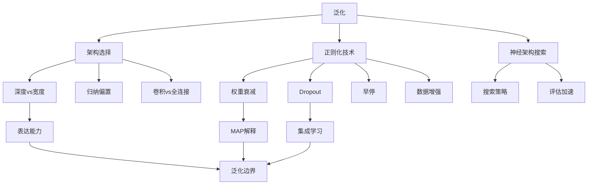

# 21.5 泛化 - Deep Dive 分析

## 1. 背景与动机

### 1.1 什么是泛化？

**核心问题**：模型在训练集上表现好，但在未见过的测试数据上是否同样出色？

**泛化误差**：
$$\text{泛化误差} = \mathbb{E}_{(\mathbf{x}, y) \sim P_{data}}[\mathcal{L}(f(\mathbf{x}), y)] - \frac{1}{N}\sum_{i=1}^N \mathcal{L}(f(\mathbf{x}_i), y_i)$$

即期望风险与经验风险的差距。

### 1.2 深度学习的泛化悖论

传统统计学习理论认为：
- 模型参数越多 → 容量越大 → 越容易过拟合

但深度学习的现实：
- 深度网络有数百万甚至数十亿参数
- 往往能很好地泛化，即使训练误差降到零
- 深层网络通常比浅层网络泛化更好

**需要新的理论来解释这一现象。**

### 1.3 过拟合 vs 欠拟合

```
训练误差
   │  ╲                    过拟合
   │   ╲    最佳模型
   │    ╲  /
   │     ╲/
   │     /╲
   │    /  ╲______ 欠拟合
   │___/
   └────────────────→ 模型复杂度
        高        低
```

**诊断方法**：
- 训练误差低，验证误差高 → 过拟合
- 训练误差高，验证误差高 → 欠拟合
- 两者都低 → 良好泛化

---

## 2. 知识逻辑图谱



---

## 3. 核心概念与数学分析

### 3.1 偏差-方差分解

对于平方损失，期望预测误差可分解为：

$$\mathbb{E}[(y - \hat{f}(\mathbf{x}))^2] = \underbrace{\text{Bias}^2[\hat{f}(\mathbf{x})]}_{\text{偏差}} + \underbrace{\text{Var}[\hat{f}(\mathbf{x})]}_{\text{方差}} + \underbrace{\sigma^2}_{\text{噪声}}$$

其中：
- **偏差**：模型期望预测与真实值的差异（模型复杂度不足）
- **方差**：模型对训练集变化的敏感度（模型过于复杂）
- **噪声**：数据本身的不可约减误差

**偏差-方差权衡**：
- 简单模型：高偏差，低方差（欠拟合）
- 复杂模型：低偏差，高方差（过拟合）
- 目标：找到平衡点

### 3.2 深度网络的泛化优势

**经验观察**：对于固定参数量，更深的网络通常泛化更好。

**可能解释**：

1. **隐式正则化**：
   - 梯度下降倾向于找到"简单"的解
   - 深层网络中，梯度下降的轨迹天然具有正则化效果

2. **表示效率**：
   - 某些函数用浅层网络表示需要指数级参数
   - 深层网络可以通过层次化组合高效表示复杂函数

3. **优化景观**：
   - 深层网络的损失景观可能有更好的性质
   - 更多的局部极小值是"好"的（泛化性能相似）

### 3.3 对抗样本

**定义**：对抗样本是通过对输入添加人眼不可察觉的扰动而产生的输入，使得模型产生错误分类。

**生成方法（FGSM）**：
$$\mathbf{x}_{adv} = \mathbf{x} + \epsilon \cdot \text{sign}(\nabla_{\mathbf{x}} \mathcal{L}(f(\mathbf{x}), y))$$

**启示**：
- 深度学习模型的决策边界与人类感知不同
- 模型可能在人眼无法区分的区域做出错误预测
- 对抗训练可以提高鲁棒性

---

## 4. 正则化技术

### 4.1 权重衰减（L2正则化）

**方法**：在损失函数中添加权重的L2范数惩罚：

$$\mathcal{L}_{reg}(\mathbf{w}) = \mathcal{L}(\mathbf{w}) + \lambda \|\mathbf{w}\|_2^2 = \mathcal{L}(\mathbf{w}) + \lambda \sum_{i,j} w_{i,j}^2$$

**梯度更新**：
$$\mathbf{w}_{t+1} = \mathbf{w}_t - \alpha (\nabla \mathcal{L} + 2\lambda \mathbf{w}_t) = (1 - 2\alpha\lambda)\mathbf{w}_t - \alpha \nabla \mathcal{L}$$

权重被乘以略小于1的因子，因此称为"权重衰减"。

**MAP贝叶斯解释**：

权重衰减等价于对权重施加高斯先验 $P(\mathbf{w}) = \mathcal{N}(\mathbf{0}, \sigma^2 \mathbf{I})$ 的MAP估计：

$$\mathbf{w}_{MAP} = \arg\max_{\mathbf{w}} P(\mathbf{w}|\mathcal{D}) = \arg\min_{\mathbf{w}} [-\log P(\mathcal{D}|\mathbf{w}) - \log P(\mathbf{w})]$$

$$= \arg\min_{\mathbf{w}} [\mathcal{L}(\mathbf{w}) + \frac{1}{2\sigma^2}\|\mathbf{w}\|_2^2]$$

因此 $\lambda = \frac{1}{2\sigma^2}$。

### 4.2 Dropout

**方法**：训练时以概率 $p$ 随机"丢弃"神经元（置输出为0）。

**实现**：
- 隐藏层：通常 $p = 0.5$
- 输入层：通常 $p = 0.2$ 或 $0.8$（保留概率）
- 测试时：使用完整网络（不进行dropout）

**解释**：

1. **集成学习视角**：
   - 每次dropout产生一个不同的"子网络"
   - 训练过程相当于同时训练指数级数量的子网络
   - 测试时相当于这些子网络的平均

2. **鲁棒性视角**：
   - 神经元不能依赖特定其他神经元的存在
   - 必须学会与其他神经元的各种子集协同工作

**变体**：
- **DropConnect**：随机丢弃权重而非神经元
- **Spatial Dropout**：对CNN的特征图整个通道丢弃
- **DropBlock**：对连续区域丢弃（针对CNN）

### 4.3 早停（Early Stopping）

**方法**：监控验证集性能，在验证误差不再下降时停止训练。

**效果**：
- 限制优化步数，防止过度拟合训练集
- 等效于L2正则化（在特定条件下可证明）

**最佳实践**：
- 保存验证误差最小时的模型
- 使用耐心参数（patience）容忍一定次数的验证误差不下降

### 4.4 数据增强

**方法**：通过对训练数据进行变换来扩充数据集。

**图像增强**：
- 几何变换：平移、旋转、缩放、翻转
- 颜色变换：亮度、对比度、饱和度调整
- 噪声添加：高斯噪声、随机擦除

**其他数据类型**：
- 文本：同义词替换、回译
- 音频：速度变化、音调变化、添加噪声

**作用**：
- 增加训练数据多样性
- 引入关于数据不变性的先验知识
- 有效防止过拟合

---

## 5. 神经架构搜索（NAS）

### 5.1 问题定义

在巨大的架构空间中搜索最优网络结构。

**搜索空间**：
- 层数
- 每层的类型（卷积、池化、全连接等）
- 每层的超参数（核大小、通道数等）
- 连接模式（跳跃连接等）

### 5.2 搜索策略

1. **随机搜索**：简单基线，往往 surprisingly 有效
2. **进化算法**：
   - 变异：修改网络结构
   - 重组：合并两个网络的部分
   - 选择：保留表现好的网络

3. **强化学习**：
   - 控制器网络生成架构描述
   - 子网络性能作为奖励信号

4. **可微分NAS**：
   - 将离散架构选择松弛为连续
   - 使用梯度下降优化架构参数

### 5.3 评估加速

完整训练每个候选架构计算成本极高，加速策略：

1. **代理任务**：在小数据集或短训练时间上评估
2. **权重共享**：不同架构共享参数，避免重新训练
3. **性能预测**：训练少量epoch预测最终性能
4. **一次性NAS（One-shot NAS）**：训练一个超网络，从中采样子网络

---

## 6. 定理与证明

### 6.1 权重衰减的贝叶斯解释

**定理 21.11**：权重衰减等价于权重上的高斯先验MAP估计。

**证明**：

MAP估计：
$$\mathbf{w}_{MAP} = \arg\max_{\mathbf{w}} P(\mathbf{w}|\mathcal{D}) = \arg\max_{\mathbf{w}} \frac{P(\mathcal{D}|\mathbf{w})P(\mathbf{w})}{P(\mathcal{D})}$$

取对数：
$$= \arg\min_{\mathbf{w}} [-\log P(\mathcal{D}|\mathbf{w}) - \log P(\mathbf{w})]$$

设 $P(\mathbf{w}) = \mathcal{N}(\mathbf{0}, \sigma^2\mathbf{I})$：
$$\log P(\mathbf{w}) = -\frac{d}{2}\log(2\pi\sigma^2) - \frac{1}{2\sigma^2}\|\mathbf{w}\|_2^2$$

因此：
$$\mathbf{w}_{MAP} = \arg\min_{\mathbf{w}} [\mathcal{L}(\mathbf{w}) + \frac{1}{2\sigma^2}\|\mathbf{w}\|_2^2]$$

这正是权重衰减形式，$\lambda = \frac{1}{2\sigma^2}$。∎

### 6.2 Dropout的近似效果

**定理 21.12（简化）**：对于线性回归，使用Dropout近似于在损失函数中添加特定形式的正则化项。

---

## 7. 具体示例

### 7.1 正则化效果对比实验

**设置**：MNIST分类，简单全连接网络

| 方法 | 训练准确率 | 测试准确率 | 差距 |
|:-----|:----------:|:----------:|:----:|
| 无正则化 | 99.8% | 98.0% | 1.8% |
| L2 (λ=0.001) | 99.5% | 98.4% | 1.1% |
| Dropout (p=0.5) | 99.2% | 98.6% | 0.6% |
| L2 + Dropout | 98.9% | 98.7% | 0.2% |
| 数据增强 | 99.0% | 98.8% | 0.2% |

**结论**：正则化技术能有效缩小训练-测试差距。

### 7.2 对抗样本生成示例

原始图像被正确分类为"熊猫"（置信度57.7%）。

添加不可察觉的扰动后，被错误分类为"长臂猿"（置信度99.3%）。

扰动是通过对损失函数关于输入的梯度计算得到的。

---

## 8. 常见陷阱

### ⚠️ 陷阱1：在测试集上调参

**问题**：使用测试集评估来选择模型或超参数，导致对泛化性能的高估

**正确做法**：
- 划分训练集、验证集、测试集
- 只在验证集上调参
- 测试集仅用于最终评估

### ⚠️ 陷阱2：过度依赖单一正则化方法

**建议**：
- 组合使用多种正则化技术
- 权重衰减 + Dropout + 数据增强是常见组合
- 但也要注意正则化过多可能导致欠拟合

### ⚠️ 陷阱3：忽视数据泄露

**常见泄露来源**：
- 预处理时使用全量数据统计（应只用训练集）
- 数据增强时将测试样本信息混入训练
- 时间序列中的未来信息泄露

### ⚠️ 陷阱4：混淆训练误差与泛化误差

**误区**：训练误差低就是好模型

**事实**：训练误差降到零不一定好，可能严重过拟合

**建议**：始终监控验证集性能

---

## 9. 一句话本质

**泛化是深度学习的核心目标，通过架构设计引入正确归纳偏置、应用正则化技术限制模型复杂度、以及数据增强扩充训练样本，共同确保模型在未见数据上的可靠性能。**

---

## 10. 总结与反思

### 10.1 核心要点回顾

1. **泛化是核心**：训练集表现不等于真实性能
2. **架构选择重要**：正确的归纳偏置（卷积、循环）提高泛化
3. **深度优势**：在参数相当时，深层网络通常泛化更好
4. **正则化技术**：权重衰减、Dropout、早停、数据增强各有作用
5. **对抗样本**：揭示了深度学习模型的脆弱性

### 10.2 深层思考

**过参数化为什么能泛化？**

传统理论无法解释，但新兴研究提供了线索：
- **双重下降**：超过插值点后，更多参数反而提高泛化
- **隐式偏差**：梯度下降偏好"简单"解
- **平坦极小值**：SGD找到的平坦区域泛化更好

**泛化的理论缺口**：

目前的泛化界限（如VC维、Rademacher复杂度）对于深度网络过于宽松，无法解释实践中观察到的良好泛化。这是深度学习理论研究的活跃领域。

### 10.3 与其他章节的关系

- **21.4节**：优化算法本身影响泛化（隐式正则化）
- **19章**：传统机器学习中的正则化概念
- **21.7节**：迁移学习利用预训练提高泛化

### 10.4 前沿发展

1. **可解释性研究**：理解模型为什么这样泛化
2. **鲁棒性研究**：对抗鲁棒性与泛化的关系
3. **元学习**：学习如何更好泛化到新任务
4. **因果学习**：追求因果层面而非统计层面的泛化
