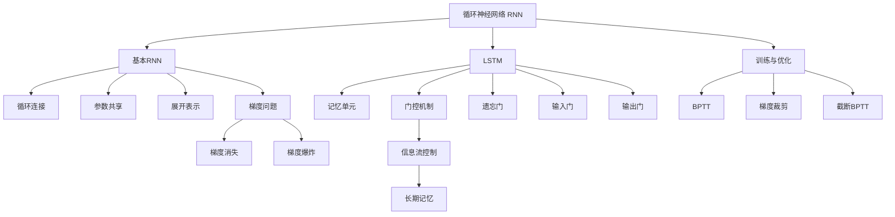

# 21.6 循环神经网络 - Deep Dive 分析

## 1. 背景与动机

### 1.1 序列数据建模的挑战

许多现实世界数据具有序列结构：
- **自然语言**：词语序列、句子序列
- **时间序列**：股票价格、传感器读数、天气数据
- **音频信号**：语音、音乐
- **视频**：帧序列

**挑战**：
1. **变长输入**：序列长度不固定
2. **时序依赖**：当前输出依赖历史信息
3. **长期依赖**：远距离元素间的关联

### 1.2 前馈网络的局限

**问题1**：输入尺寸固定
- 若限制为固定长度窗口，则无法捕捉长距离依赖
- 若窗口太大，参数量爆炸

**问题2**：参数不共享
- 每个时间位置需要独立学习
- 无法泛化到训练时未见过的序列长度

**问题3**：无记忆机制
- 无法保留历史信息影响当前决策

### 1.3 循环神经网络的思想

**核心思想**：引入循环连接，使网络具有内部状态（记忆）。

```
传统前馈网络：
x[t] → [网络] → y[t]

循环神经网络：
x[t] → [网络] ──→ y[t]
         ↑___│
       h[t-1] → h[t]
```

相同网络在每个时间步应用，参数共享处理变长序列。

---

## 2. 知识逻辑图谱



---

## 3. 核心概念与数学分析

### 3.1 基本RNN的形式化

**网络结构**：
- 输入序列：$\mathbf{x}_1, \mathbf{x}_2, \ldots, \mathbf{x}_T$
- 隐藏状态：$\mathbf{h}_1, \mathbf{h}_2, \ldots, \mathbf{h}_T$
- 输出序列：$\mathbf{y}_1, \mathbf{y}_2, \ldots, \mathbf{y}_T$（可选）

**更新方程**：

$$\mathbf{h}_t = g_h(\mathbf{W}_{xh}\mathbf{x}_t + \mathbf{W}_{hh}\mathbf{h}_{t-1} + \mathbf{b}_h) \tag{21-13}$$

$$\mathbf{y}_t = g_y(\mathbf{W}_{hy}\mathbf{h}_t + \mathbf{b}_y)$$

其中 $g_h$ 通常是tanh或ReLU，$g_y$ 取决于任务（如softmax用于分类）。

**矩阵形式**：

$$\mathbf{h}_t = g_h(\mathbf{W} [\mathbf{x}_t; \mathbf{h}_{t-1}] + \mathbf{b})$$

其中 $\mathbf{W} = [\mathbf{W}_{xh}, \mathbf{W}_{hh}]$，$[;]$ 表示拼接。

### 3.2 展开表示

将RNN在时间维度展开为前馈网络：

```
x₁ → [RNN cell] → h₁ → [输出层] → y₁
         ↑
x₂ → [RNN cell] → h₂ → [输出层] → y₂
         ↑
x₃ → [RNN cell] → h₃ → [输出层] → y₃
```

**关键特性**：
- 每个时间步使用相同的参数（权重共享）
- 深度随序列长度增长
- 隐藏状态作为信息传递的"载体"

### 3.3 RNN的变体

**1. 多对一（Many-to-One）**：
- 输入：序列
- 输出：单一结果
- 应用：情感分析、序列分类

```
x₁, x₂, ..., xT → RNN → y
```

**2. 一对多（One-to-Many）**：
- 输入：单一输入
- 输出：序列
- 应用：图像描述生成

```
x → RNN → y₁, y₂, ..., yT
```

**3. 多对多（Many-to-Many）**：
- 同步：每个时间步有输出（如视频逐帧分类）
- 异步：输出序列与输入序列长度不同（如机器翻译）

### 3.4 梯度问题分析

**梯度消失**：

对于简单RNN，误差反向传播时：

$$\frac{\partial \mathcal{L}}{\partial \mathbf{h}_t} = \frac{\partial \mathcal{L}}{\partial \mathbf{h}_{t+1}} \cdot \frac{\partial \mathbf{h}_{t+1}}{\partial \mathbf{h}_t} = \frac{\partial \mathcal{L}}{\partial \mathbf{h}_{t+1}} \cdot \mathbf{W}_{hh}^\top \cdot \text{diag}(g_h'(\mathbf{z}_{t+1}))$$

若激活函数导数 $|g'| < 1$（如tanh最大为0.25），且 $|\mathbf{W}_{hh}| < 1$，则梯度随时间指数衰减：

$$\|\frac{\partial \mathcal{L}}{\partial \mathbf{h}_t}\| \leq \gamma^{T-t} \cdot \|\frac{\partial \mathcal{L}}{\partial \mathbf{h}_T}\|, \quad \gamma < 1$$

**梯度爆炸**：

若 $|\mathbf{W}_{hh}| > 1$，梯度可能指数增长，导致数值不稳定。

**解决方案**：
1. **梯度裁剪**：限制梯度范数
2. **更好的初始化**：如正交初始化
3. **门控机制**：LSTM、GRU

---

## 4. 长短期记忆网络（LSTM）

### 4.1 核心思想

LSTM通过引入**门控机制**控制信息流：
- **细胞状态**（Cell State）：长期记忆的"传送带"
- **门**（Gates）：控制信息的保留、遗忘、输出

### 4.2 LSTM的数学描述

**遗忘门**（控制遗忘多少历史信息）：
$$\mathbf{f}_t = \sigma(\mathbf{W}_{xf}\mathbf{x}_t + \mathbf{W}_{hf}\mathbf{h}_{t-1} + \mathbf{b}_f)$$

**输入门**（控制写入多少新信息）：
$$\mathbf{i}_t = \sigma(\mathbf{W}_{xi}\mathbf{x}_t + \mathbf{W}_{hi}\mathbf{h}_{t-1} + \mathbf{b}_i)$$

**候选记忆**：
$$\tilde{\mathbf{c}}_t = \tanh(\mathbf{W}_{xc}\mathbf{x}_t + \mathbf{W}_{hc}\mathbf{h}_{t-1} + \mathbf{b}_c)$$

**细胞状态更新**：
$$\mathbf{c}_t = \mathbf{f}_t \odot \mathbf{c}_{t-1} + \mathbf{i}_t \odot \tilde{\mathbf{c}}_t$$

**输出门**（控制输出多少信息）：
$$\mathbf{o}_t = \sigma(\mathbf{W}_{xo}\mathbf{x}_t + \mathbf{W}_{ho}\mathbf{h}_{t-1} + \mathbf{b}_o)$$

**隐藏状态**：
$$\mathbf{h}_t = \mathbf{o}_t \odot \tanh(\mathbf{c}_t)$$

其中 $\odot$ 表示逐元素乘法。

### 4.3 LSTM为什么能解决梯度消失

**关键观察**：细胞状态更新是加法而非乘法！

$$\mathbf{c}_t = \mathbf{f}_t \odot \mathbf{c}_{t-1} + \mathbf{i}_t \odot \tilde{\mathbf{c}}_t$$

**梯度流动**：

$$\frac{\partial \mathbf{c}_t}{\partial \mathbf{c}_{t-1}} = \mathbf{f}_t$$

若遗忘门接近1（记住历史），梯度可以直接传播：
$$\frac{\partial \mathcal{L}}{\partial \mathbf{c}_t} = \frac{\partial \mathcal{L}}{\partial \mathbf{c}_{t+1}} \cdot \mathbf{f}_{t+1}$$

没有乘性衰减，信息可以跨越任意多时间步传递。

### 4.4 GRU：LSTM的简化变体

**门控循环单元（GRU）**合并细胞状态和隐藏状态，使用两个门：

**更新门**（控制保留多少旧状态）：
$$\mathbf{z}_t = \sigma(\mathbf{W}_{xz}\mathbf{x}_t + \mathbf{W}_{hz}\mathbf{h}_{t-1})$$

**重置门**（控制忽略多少旧状态）：
$$\mathbf{r}_t = \sigma(\mathbf{W}_{xr}\mathbf{x}_t + \mathbf{W}_{hr}\mathbf{h}_{t-1})$$

**候选状态**：
$$\tilde{\mathbf{h}}_t = \tanh(\mathbf{W}_{xh}\mathbf{x}_t + \mathbf{W}_{hh}(\mathbf{r}_t \odot \mathbf{h}_{t-1}))$$

**状态更新**：
$$\mathbf{h}_t = (1 - \mathbf{z}_t) \odot \mathbf{h}_{t-1} + \mathbf{z}_t \odot \tilde{\mathbf{h}}_t$$

**LSTM vs GRU**：
- GRU参数更少，训练更快
- 性能通常相近，任务依赖
- LSTM表达能力稍强，GRU更简单高效

---

## 5. 训练RNN

### 5.1 基于时间的反向传播（BPTT）

**算法**：

1. **前向传播**：沿时间步计算所有隐藏状态和输出
2. **计算损失**：通常是对所有时间步的损失求和
3. **反向传播**：从最后一个时间步向前传播梯度

**梯度计算**：

对于损失 $\mathcal{L} = \sum_{t=1}^T \mathcal{L}_t$，隐藏状态梯度：

$$\frac{\partial \mathcal{L}}{\partial \mathbf{h}_t} = \frac{\partial \mathcal{L}_t}{\partial \mathbf{h}_t} + \frac{\partial \mathcal{L}}{\partial \mathbf{h}_{t+1}} \cdot \frac{\partial \mathbf{h}_{t+1}}{\partial \mathbf{h}_t}$$

### 5.2 截断BPTT

**问题**：长序列导致：
- 内存需求大（保存所有中间状态）
- 计算时间长
- 梯度消失/爆炸更严重

**解决方案**：
- 截断BPTT：只反向传播固定长度的历史
- 状态截断：每k步截断梯度传播，但保持隐藏状态

### 5.3 梯度裁剪

对于梯度爆炸问题：

$$\text{if } \|\mathbf{g}\| > \theta: \quad \mathbf{g} \leftarrow \frac{\theta}{\|\mathbf{g}\|} \mathbf{g}$$

其中 $\theta$ 是阈值（如5或10）。

---

## 6. 定理与证明

### 6.1 RNN的通用性

**定理 21.13**：具有足够多隐藏单元的RNN可以近似任意可测序列到序列的映射。

**意义**：RNN在理论上是强大的序列模型。

### 6.2 LSTM的梯度边界

**定理 21.14（简化）**：在LSTM中，细胞状态的梯度传播满足：

$$\|\frac{\partial \mathcal{L}}{\partial \mathbf{c}_t}\| \leq C \cdot \prod_{\tau=t+1}^T \|\mathbf{f}_\tau\|$$

若遗忘门 $\mathbf{f}_\tau \approx \mathbf{1}$，梯度不会指数衰减。

---

## 7. 具体示例

### 7.1 字符级语言模型

**任务**：给定前文，预测下一个字符

**网络配置**：
- 输入：字符的one-hot编码（词汇量约100）
- LSTM隐藏维度：128
- 输出：Softmax预测下一个字符

**生成过程**：
```
"The " → LSTM预测 "q"（可能是"question"）
"The q" → LSTM预测 "u"
"The qu" → LSTM预测 "e"
...
生成: "The quick brown fox..."
```

### 7.2 序列到序列学习

**机器翻译（Encoder-Decoder架构）**：

```
源语言: "Hello world" → [Encoder] → 上下文向量 c
                                              ↓
目标语言: "Bonjour" ← [Decoder] ← c
              "le" ← [Decoder] ← c + 前输出
              "monde" ← [Decoder] ← c + 前输出
```

**注意力机制**：Decoder每个时间步关注Encoder的不同部分。

### 7.3 数值示例：LSTM门计算

假设简化情况（标量）：

$$x_t = 1.0, \quad h_{t-1} = 0.5, \quad c_{t-1} = 2.0$$

权重：$W_{xf} = 0.5, W_{hf} = 0.3, b_f = 0$

**遗忘门**：
$$f_t = \sigma(0.5 \times 1.0 + 0.3 \times 0.5) = \sigma(0.65) \approx 0.66$$

意味着保留66%的历史记忆。

---

## 8. 常见陷阱

### ⚠️ 陷阱1：忽视序列长度差异

**问题**：不同样本序列长度差异大，直接填充（padding）可能浪费计算

**解决方案**：
- 使用PackedSequence（PyTorch）按长度排序并打包
- 截断过长序列，填充过短序列

### ⚠️ 陷阱2：初始化不当导致训练失败

**建议**：
- 使用正交初始化或Xavier初始化
- LSTM的遗忘门偏置初始化为1（倾向于记住信息）

### ⚠️ 陷阱3：混淆隐藏状态和输出

**澄清**：
- 隐藏状态 $\mathbf{h}_t$：内部记忆，用于下一时间步
- 输出 $\mathbf{y}_t$：实际预测，通常由隐藏状态经变换得到

### ⚠️ 陷阱4：忽视双向结构

**局限**：单向RNN只能利用过去信息

**解决方案**：双向RNN（BiRNN）同时利用过去和未来信息：

$$\mathbf{h}_t = [\overrightarrow{\mathbf{h}}_t; \overleftarrow{\mathbf{h}}_t]$$

适用于整个序列已知后再预测的场景（如文本分类）。

---

## 9. 一句话本质

**循环神经网络通过引入循环连接和内部状态，使网络能够建模序列数据中的时序依赖；LSTM等门控机制通过精细控制信息流，解决了长期依赖学习中的梯度问题。**

---

## 10. 总结与反思

### 10.1 核心要点回顾

1. **序列建模**：RNN专为变长序列设计，参数共享处理任意长度
2. **循环结构**：隐藏状态传递历史信息
3. **梯度问题**：简单RNN面临梯度消失/爆炸，限制长期依赖学习
4. **LSTM解决**：门控机制控制信息流，加法更新保持梯度流动
5. **训练技巧**：BPTT、梯度裁剪、截断BPTT

### 10.2 深层思考

**RNN vs Transformer**：

Transformer（第24章）使用注意力机制替代循环，优势：
- 并行计算（RNN必须顺序计算）
- 直接建模长距离依赖
- 但RNN在极长序列和流式数据上仍有优势

**RNN的生物学合理性**：

RNN的结构与大脑处理时序信息的方式有相似之处，但：
- 生物神经元有更复杂的动力学
- 真实神经网络的连接更稀疏、更结构化

### 10.3 与其他章节的关系

- **14章**：与HMM、动态贝叶斯网络的联系
- **21.1-21.2**：RNN是计算图的循环扩展
- **21.4**：BPTT是反向传播的时间扩展
- **24章**：NLP中的RNN应用

### 10.4 前沿发展

1. **神经图灵机**：RNN + 可微分外部记忆
2. **RNN稀疏化**：减少计算和参数
3. **连续时间RNN**：处理不规则时间间隔的数据
4. **神经ODE**：用微分方程描述隐藏状态演化
