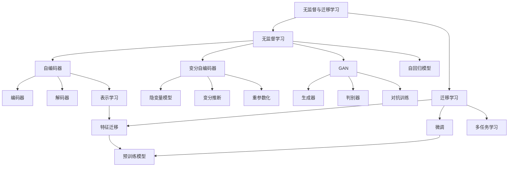

# 21.7 无监督学习与迁移学习 - Deep Dive 分析

## 1. 背景与动机

### 1.1 监督学习的局限

**数据依赖问题**：
- 需要大量标注数据，标注成本高
- 许多领域标注困难（医学影像、专业领域）
- 标注质量难以保证

**人类学习的启示**：
- 婴儿通过观察学习，而非大量"标注"
- 无监督预训练可能提供先验知识

### 1.2 无监督学习的价值

**学习目标**：
1. **表示学习**：发现数据的紧凑、有用表示
2. **生成模型**：学习数据分布，生成新样本
3. **结构发现**：聚类、降维、异常检测

**优势**：
- 利用大量无标注数据
- 学习数据的内在结构
- 为监督学习提供好的初始化

### 1.3 迁移学习的动机

**问题**：
- 每个任务都需要从头训练
- 数据稀缺任务难以训练
- 浪费已学习的知识

**迁移学习的价值**：
- 将任务A的知识迁移到任务B
- 少样本/零样本学习
- 加速新任务学习

---

## 2. 知识逻辑图谱

---

## 3. 核心概念与数学分析

### 3.1 自编码器（Autoencoder）

**结构**：
- **编码器**：$\mathbf{z} = f(\mathbf{x})$，将输入映射到低维潜在空间
- **解码器**：$\hat{\mathbf{x}} = g(\mathbf{z})$，从潜在表示重建输入

**目标**：
$$\min_{f,g} \mathbb{E}_{\mathbf{x}}[\|\mathbf{x} - g(f(\mathbf{x}))\|^2]$$

**与PCA的关系**：
- 线性自编码器（f,g为线性变换）等价于PCA
- 非线性自编码器学习非线性流形

**去噪自编码器（Denoising Autoencoder）**：
- 输入：被噪声污染的样本 $\tilde{\mathbf{x}}$
- 目标：重建原始干净样本 $\mathbf{x}$
- 效果：学习更鲁棒的表示

### 3.2 变分自编码器（VAE）

**动机**：自编码器学到的潜在空间可能不连续、难以解释

**概率视角**：
- 假设数据由隐变量 $\mathbf{z}$ 生成：$P(\mathbf{x}|\mathbf{z})$
- 目标：学习联合分布 $P(\mathbf{x}, \mathbf{z})$

**问题**：后验分布 $P(\mathbf{z}|\mathbf{x})$ 难以计算

**变分推断**：
用可处理的分布 $Q(\mathbf{z}|\mathbf{x})$ 近似真实后验

**证据下界（ELBO）**：

$$\mathcal{L}(\mathbf{x}, Q) = \mathbb{E}_{\mathbf{z} \sim Q}[\log P(\mathbf{x}|\mathbf{z})] - D_{KL}(Q(\mathbf{z}|\mathbf{x}) \| P(\mathbf{z})) \tag{21-17}$$

**两项含义**：
1. **重建项**：期望对数似然，确保好的重建
2. **KL散度**：使近似后验接近先验，正则化潜在空间

**重参数化技巧**：

从 $\mathcal{N}(\boldsymbol{\mu}, \boldsymbol{\sigma}^2)$ 采样：
$$\mathbf{z} = \boldsymbol{\mu} + \boldsymbol{\sigma} \odot \boldsymbol{\epsilon}, \quad \boldsymbol{\epsilon} \sim \mathcal{N}(\mathbf{0}, \mathbf{I})$$

使梯度可以通过采样传播。

### 3.3 生成对抗网络（GAN）

**框架**：两个网络的对抗博弈

**生成器 $G$**：
- 输入：随机噪声 $\mathbf{z} \sim P(\mathbf{z})$
- 输出：生成样本 $G(\mathbf{z})$
- 目标：欺骗判别器

**判别器 $D$**：
- 输入：真实样本或生成样本
- 输出：样本为真的概率 $D(\mathbf{x})$
- 目标：区分真实与生成样本

**目标函数**：

$$\min_G \max_D V(D, G) = \mathbb{E}_{\mathbf{x} \sim P_{data}}[\log D(\mathbf{x})] + \mathbb{E}_{\mathbf{z} \sim P(\mathbf{z})}[\log(1 - D(G(\mathbf{z})))]$$

**最优解**：
- 固定G时，最优 $D^*(\mathbf{x}) = \frac{P_{data}(\mathbf{x})}{P_{data}(\mathbf{x}) + P_G(\mathbf{x})}$
- 全局最优时，$P_G = P_{data}$

**训练挑战**：
- 模式崩溃（Mode Collapse）：生成器只产生有限种类的样本
- 训练不稳定：生成器和判别器需要平衡
- 梯度消失：判别器太强时，生成器梯度消失

### 3.4 深度自回归模型

**思想**：序列的每个元素基于前面所有元素生成

$$P(\mathbf{x}) = \prod_{i=1}^d P(x_i | x_1, \ldots, x_{i-1})$$

**应用**：
- **WaveNet**：原始音频生成，16000Hz采样
- **PixelCNN**：图像逐像素生成
- **GPT**：文本生成

**特点**：
- 显式建模数据分布
- 训练稳定（最大似然）
- 但生成慢（需顺序采样）

---

## 4. 迁移学习

### 4.1 迁移学习的形式化

**定义**：利用任务A的知识帮助任务B的学习

**场景**：
- **任务相关**：如猫狗分类 → 老虎狮子分类
- **域适应**：如合成图像 → 真实图像
- **多任务学习**：同时学习多个相关任务

### 4.2 特征迁移（Fine-tuning）

**策略**：
1. **预训练**：在大数据集（如ImageNet）上训练
2. **迁移**：将预训练权重作为初始化
3. **微调**：在新任务数据上继续训练

**微调策略**：
- **冻结底层**：底层学习通用特征，保持固定
- **逐层解冻**：先训练高层，逐步解冻更多层
- **学习率调整**：使用较小学习率微调

**为什么有效？**
- 底层特征（边缘、纹理）是通用的
- 预训练提供好的优化起点
- 避免在新任务上从头学习基础特征

### 4.3 多任务学习

**设置**：同时学习多个相关任务，共享表示

**结构**：
- 共享层：学习跨任务的通用表示
- 任务特定层：每个任务有自己的输出层

**目标**：
$$\mathcal{L} = \sum_{k=1}^K \lambda_k \mathcal{L}_k$$

其中 $\mathcal{L}_k$ 是任务k的损失，$\lambda_k$ 是权重。

**优势**：
- 任务间的知识共享
- 正则化效果（每个任务防止过拟合）
- 提高数据效率

---

## 5. 定理与证明

### 5.1 VAE的ELBO推导

**定理 21.15**：最大化ELBO等价于最大化数据似然的下界。

**证明**：

$$\log P(\mathbf{x}) = \log \int P(\mathbf{x}|\mathbf{z})P(\mathbf{z})d\mathbf{z}$$

$$= \log \int P(\mathbf{x}|\mathbf{z})P(\mathbf{z}) \frac{Q(\mathbf{z}|\mathbf{x})}{Q(\mathbf{z}|\mathbf{x})}d\mathbf{z}$$

$$= \log \mathbb{E}_{\mathbf{z} \sim Q}[\frac{P(\mathbf{x}|\mathbf{z})P(\mathbf{z})}{Q(\mathbf{z}|\mathbf{x})}]$$

由Jensen不等式（log是凹函数）：
$$\geq \mathbb{E}_{\mathbf{z} \sim Q}[\log \frac{P(\mathbf{x}|\mathbf{z})P(\mathbf{z})}{Q(\mathbf{z}|\mathbf{x})}]$$

$$= \mathbb{E}_{\mathbf{z} \sim Q}[\log P(\mathbf{x}|\mathbf{z})] - \mathbb{E}_{\mathbf{z} \sim Q}[\log \frac{Q(\mathbf{z}|\mathbf{x})}{P(\mathbf{z})}]$$

$$= \mathbb{E}_{\mathbf{z} \sim Q}[\log P(\mathbf{x}|\mathbf{z})] - D_{KL}(Q(\mathbf{z}|\mathbf{x}) \| P(\mathbf{z})) = \mathcal{L}(\mathbf{x}, Q)$$

因此 $\log P(\mathbf{x}) \geq \mathcal{L}(\mathbf{x}, Q)$。∎

### 5.2 GAN的全局最优

**定理 21.16**：GAN训练的全局最优解满足 $P_G = P_{data}$。

**证明概要**：

对于固定G，最优判别器：
$$D^*(\mathbf{x}) = \frac{P_{data}(\mathbf{x})}{P_{data}(\mathbf{x}) + P_G(\mathbf{x})}$$

代入目标函数，当 $P_G = P_{data}$ 时，$D^*(\mathbf{x}) = 0.5$，此时达到全局最小值 $-\log 4$。∎

---

## 6. 具体示例

### 6.1 VAE的潜在空间操作

**人脸生成**：
- 在潜在空间 $\mathbf{z}$ 中，不同方向对应不同属性
- 如：方向A控制"是否戴眼镜"，方向B控制"性别"

**潜在空间算术**：
$$\mathbf{z}_{\text{戴眼镜的女人}} \approx \mathbf{z}_{\text{戴眼镜的男人}} - \mathbf{z}_{\text{男人}} + \mathbf{z}_{\text{女人}}$$

### 6.2 图像到图像翻译（CycleGAN）

**任务**：无需配对样本，将马图像转为斑马图像

**架构**：
- 两个生成器：$G: X \to Y$，$F: Y \to X$
- 两个判别器：$D_X$，$D_Y$

**损失函数**：
- 对抗损失：生成图像被判别为真
- 循环一致性损失：$F(G(x)) \approx x$，$G(F(y)) \approx y$

### 6.3 BERT微调示例

**预训练**：
- 在大规模文本上预训练
- 任务1：掩码语言模型（预测被掩盖的词）
- 任务2：下一句预测

**微调**：
- 情感分析：在句子表示上加分类器
- 问答系统：学习答案边界
- 命名实体识别：序列标注

---

## 7. 常见陷阱

### ⚠️ 陷阱1：GAN训练不稳定

**症状**：模式崩溃、生成质量差、训练发散

**建议**：
- 使用Wasserstein GAN等改进版本
- 小心平衡生成器和判别器的训练
- 使用标签平滑等技术

### ⚠️ 陷阱2：VAE重建模糊

**原因**：MSE损失倾向于平均多个可能的输出

**解决方案**：
- 使用更复杂的解码器分布（如混合高斯）
- 调整KL散度的权重
- 尝试其他生成模型（如GAN）

### ⚠️ 陷阱3：迁移学习时学习率过大

**问题**：破坏预训练学到的特征

**建议**：
- 使用较小学习率（如预训练的1/10）
- 使用学习率预热
- 冻结底层，只训练顶层

### ⚠️ 陷阱4：忽视领域差异

**问题**：源域和目标域差异大，简单迁移无效

**解决方案**：
- 领域适应技术
- 在目标域上微调更多层
- 使用领域无关的特征

---

## 8. 一句话本质

**无监督学习通过挖掘数据的内在结构学习有意义的表示和生成模型，迁移学习则通过复用预训练知识实现少样本学习和跨任务泛化，共同拓展深度学习对标注数据的依赖边界。**

---

## 9. 总结与反思

### 9.1 核心要点回顾

1. **自编码器**：学习压缩表示，去噪版本更鲁棒
2. **VAE**：概率框架下的生成模型，学习可解释的潜在空间
3. **GAN**：对抗训练框架，生成高质量样本但训练困难
4. **自回归模型**：显式建模联合分布，生成慢但训练稳定
5. **迁移学习**：复用预训练知识，微调适应新任务
6. **多任务学习**：任务间知识共享，提高数据效率

### 9.2 深层思考

**无监督学习的核心挑战**：

如何定义"好"的表示？没有标签指导，需要设计合理的代理任务：
- 重建任务（自编码器）
- 对比任务（对比学习）
- 预测任务（自回归）

**迁移学习的本质**：

什么使知识可迁移？
- 底层特征的通用性
- 任务间的结构相似性
- 优化的便利性（好的初始化）

### 9.3 与其他章节的关系

- **20章**：概率模型基础
- **21.1-21.6**：无监督扩展了监督学习的架构
- **24章**：NLP中的预训练+微调范式
- **25章**：视觉中的迁移学习应用

### 9.4 前沿发展

1. **对比学习（Contrastive Learning）**：SimCLR、MoCo等方法
2. **掩码自编码器（MAE）**：BERT思想应用于视觉
3. **扩散模型（Diffusion Models）**：新的生成模型范式
4. **提示学习（Prompt Learning）**：更高效的迁移学习方式
5. **基础模型（Foundation Models）**：大规模预训练模型
