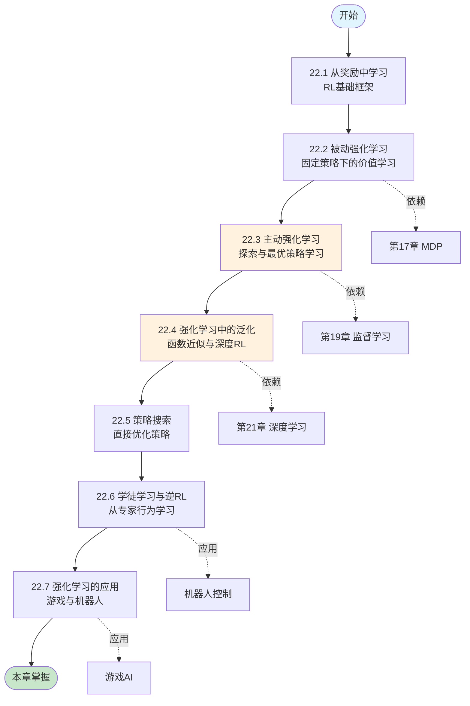
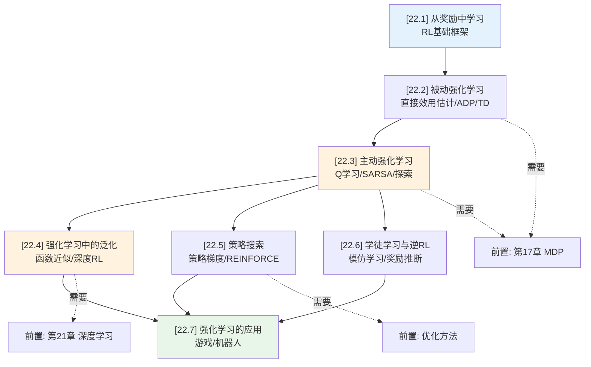
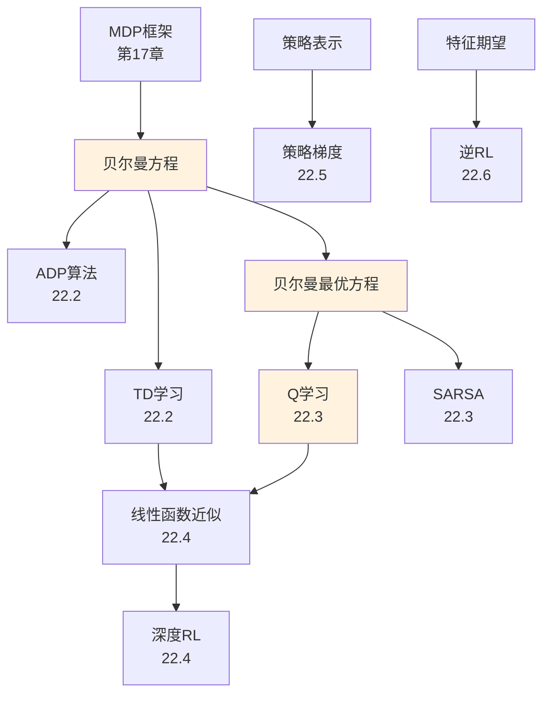
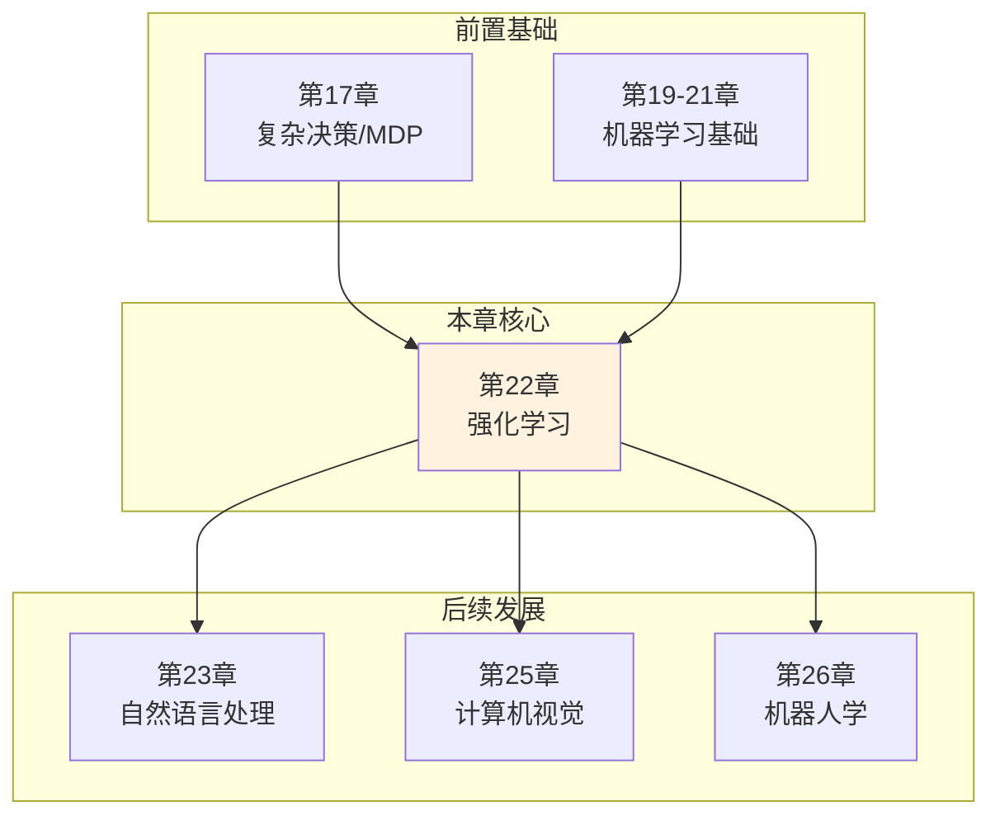

# 第 22 章：强化学习 - 概览与总结

> 📚 章节概览 | Deep Dive 学习导航 | 📝 本章复习指南
> ⏱️ 建议学习时间: 12-15 小时 | 🎯 难度: ⭐⭐⭐⭐

---

## 一、学习目标

学完本章后，你将能够：

- [ ] **理解**: 强化学习的基本框架，包括智能体、环境、状态、动作、奖励等核心概念
- [ ] **掌握**: 被动强化学习算法（直接效用估计、ADP、时序差分）的原理与实现
- [ ] **掌握**: 主动强化学习算法（Q学习、SARSA）及探索-利用权衡策略
- [ ] **应用**: 函数近似和深度强化学习解决大规模状态空间问题
- [ ] **分析**: 策略搜索、学徒学习和逆强化学习的适用场景与优缺点
- [ ] **评估**: 针对具体问题选择合适的强化学习方法

---

## 二、本章导览

### 2.1 核心问题与关键思想

**核心问题**
> 智能体如何在环境模型未知的情况下，通过与环境的交互和延迟奖励信号，学习最优行为策略？

**关键思想**
> 强化学习是一种无监督的学习范式，智能体通过试错与环境交互，根据获得的奖励信号调整策略，目标是最大化长期累积奖励。与监督学习不同，RL不需要标注数据，而是通过探索-利用权衡、时序差分学习、函数近似等技术，从延迟奖励中学习价值函数或策略。

### 2.2 本章地图



### 2.3 难度预警

| 类型 | 节号 | 标题 | 难度 | 预计时间 | 关键挑战 |
|:----:|:----:|------|:----:|:--------:|----------|
| 🔴 关键节 | 22.2 | 被动强化学习 | ⭐⭐⭐⭐ | 2.5h | 理解ADP与TD的区别和联系 |
| 🔴 关键节 | 22.3 | 主动强化学习 | ⭐⭐⭐⭐ | 3h | 探索-利用权衡、Q学习收敛性 |
| 🟡 难理解 | 22.4 | 强化学习中的泛化 | ⭐⭐⭐⭐ | 2.5h | 函数近似、深度RL训练技巧 |
| 🟡 难理解 | 22.5 | 策略搜索 | ⭐⭐⭐ | 2h | 策略梯度、REINFORCE算法 |
| 🟢 巩固节 | 22.6 | 学徒学习与逆RL | ⭐⭐⭐ | 1.5h | 特征匹配、奖励函数推断 |
| 🟢 巩固节 | 22.7 | 强化学习的应用 | ⭐⭐ | 1h | 了解实际应用案例 |

**攻克建议**: 
- 第22.2节和22.3节是理论基础，建议配合4×3世界的例子手动推导算法
- 深入理解贝尔曼方程在不同算法中的作用
- 实现简单的Q-learning算法加深理解

### 2.4 学习建议

**推荐学习顺序**
```
第一次: 快速浏览 → 理解框架 → 标记难点
    ↓
第二次: 精读概念 → 推导公式 → 理解算法
    ↓
第三次: 动手实践 → 完成示例 → 总结提炼
```

**时间规划**

| 阶段 | 内容 | 时间 | 产出 |
|------|------|:----:|------|
| 预习 | 读概览、查前置 | 30min | 问题清单 |
| 学习 | 精读各节 | 10h | 笔记+代码 |
| 练习 | 做示例、推导 | 3h | 练习本 |
| 复习 | 总结、自查 | 1h | 知识卡片 |
| **总计** | | **14h** | |

---

## 三、学习准备

### 3.1 前置知识检查

| 知识项 | 来源 | 重要程度 | 自检问题 |
|--------|------|:--------:|----------|
| 马尔可夫决策过程(MDP) | 第17章 | 🔴 必须 | 能写出贝尔曼方程吗？ |
| 动态规划 | 第17章 | 🔴 必须 | 理解价值迭代和策略迭代吗？ |
| 监督学习基础 | 第19-21章 | 🟡 建议 | 了解梯度下降和神经网络吗？ |
| 概率论基础 | 附录A | 🟡 建议 | 理解期望、条件概率吗？ |
| 随机梯度下降 | 第19章 | 🟢 可选 | 了解参数更新规则吗？ |

### 3.2 节依赖图



**依赖说明**: 实线=必须前序 | 虚线=前置知识 | 红色高亮=关键路径

### 3.3 定理/结果检查清单

| 编号 | 名称 | 类型 | 关键用途 | 位置 | 掌握状态 |
|:----:|------|:----:|----------|:----:|:--------:|
| 22.1 | 贝尔曼期望方程 | 方程 | 被动RL基础 | 22.2 | [ ] |
| 22.2 | TD更新规则 | 算法 | 时序差分学习 | 22.2 | [ ] |
| 22.3 | Q学习更新规则 | 算法 | 无模型RL | 22.3 | [ ] |
| 22.4 | 探索函数 | 方法 | 主动探索 | 22.3 | [ ] |
| 22.5 | 线性函数近似TD | 算法 | 泛化学习 | 22.4 | [ ] |
| 22.6 | 策略梯度定理 | 定理 | 策略搜索 | 22.5 | [ ] |
| 22.7 | 特征匹配IRL | 算法 | 逆强化学习 | 22.6 | [ ] |

---

## 四、知识梳理

### 4.1 核心逻辑线索

强化学习是机器学习中最接近人类学习方式的范式。本章从**为什么需要强化学习**这一根本问题出发，逐步深入到**如何让智能体自主学习**的核心技术。

首先，我们认识到监督学习在很多现实场景中的局限性：对于国际象棋等复杂问题，我们无法获得所有状态-动作对的正确标注。这引出了强化学习的核心思想——智能体通过与环境的交互，根据奖励信号自主学习的必要性（22.1节）。

接着，我们从最简单的情形开始：假设智能体遵循一个固定策略，它如何评估这个策略的好坏？这导出了被动强化学习的三种方法：直接效用估计（将RL转化为监督学习）、自适应动态规划（ADP，利用环境模型）、时序差分（TD，无模型学习）。TD方法特别重要，因为它既不需要环境模型，计算效率又高，是现代RL的基础（22.2节）。

然而，真正有趣的智能体应该能够自主选择动作。这就进入了主动强化学习领域，核心挑战是**探索-利用权衡**：智能体需要在利用当前知识获得奖励和探索未知状态获取新信息之间找到平衡。Q学习作为最著名的无模型RL算法，通过迭代更新Q值函数来学习最优策略，而无需显式建模环境（22.3节）。

当状态空间变得巨大时（如围棋有10^170个状态），表格型方法失效。函数近似技术，特别是深度强化学习，使用神经网络来近似价值函数或策略，使得RL能够处理高维输入（如原始图像像素）（22.4节）。

除了学习价值函数，我们还可以直接参数化策略并通过梯度上升优化。策略搜索方法，特别是策略梯度算法，在连续控制任务中表现出色（22.5节）。

当奖励函数难以明确定义时（如自动驾驶），我们可以从专家演示中学习。学徒学习通过模仿专家行为，逆强化学习则通过观察专家行为推断其背后的奖励函数（22.6节）。

最后，我们看到强化学习在Atari游戏、围棋、机器人控制等领域的成功应用，展示了这一范式的巨大潜力（22.7节）。

**知识发展时间线**
```
[背景与动机] → [基础概念建立] → [理论发展] → [核心算法] → [应用实践]
      ↓              ↓               ↓            ↓            ↓
   为什么        被动RL           主动RL        深度RL      实际应用
   研究？        价值学习         Q学习        泛化学习     游戏/机器人
```

### 4.2 核心要点速查

**一句话总结每节**

| 节号 | 标题 | 一句话总结 |
|:----:|------|------------|
| 22.1 | 从奖励中学习 | 强化学习通过奖励信号而非标注数据，让智能体在环境中自主学习最优行为 |
| 22.2 | 被动强化学习 | 固定策略下，通过直接效用估计、ADP或TD方法学习状态价值函数 |
| 22.3 | 主动强化学习 | 智能体通过探索-利用权衡，使用Q学习或SARSA学习最优策略 |
| 22.4 | 强化学习中的泛化 | 使用函数近似（特别是深度神经网络）处理大规模状态空间 |
| 22.5 | 策略搜索 | 直接参数化策略，通过策略梯度优化策略性能 |
| 22.6 | 学徒学习与逆RL | 从专家演示中学习，通过模仿或奖励函数推断获得良好策略 |
| 22.7 | 强化学习的应用 | RL在游戏AI、机器人控制等领域取得突破性成果 |

**必背要点（7条）**

1. **强化学习基本框架**: 智能体通过执行动作与环境交互，获得奖励和下一个状态，目标是最大化累积折扣奖励
   $$G_t = \sum_{k=0}^{\infty} \gamma^k R_{t+k+1}$$

2. **被动RL三种方法**: 
   - 直接效用估计：将累积奖励作为监督信号
   - ADP：学习环境模型，用动态规划求解
   - TD：直接调整估计值使其与后继状态一致

3. **TD更新规则**: 
   $$U(s) \leftarrow U(s) + \alpha[R(s, \pi(s), s') + \gamma U(s') - U(s)]$$

4. **Q学习更新规则**（离策略）：
   $$Q(s,a) \leftarrow Q(s,a) + \alpha[R(s,a,s') + \gamma \max_{a'}Q(s',a') - Q(s,a)]$$

5. **探索-利用权衡**: GLIE方案确保每个状态-动作对被无限次尝试，如ε-贪婪或乐观初始化

6. **函数近似**: 使用参数化函数（如神经网络）近似价值函数，梯度TD更新：
   $$\theta_i \leftarrow \theta_i + \alpha[R + \gamma \hat{U}_\theta(s') - \hat{U}_\theta(s)]\frac{\partial \hat{U}_\theta(s)}{\partial \theta_i}$$

7. **策略梯度**: 直接优化策略参数，REINFORCE算法使用蒙特卡洛估计：
   $$\nabla_\theta \rho(\theta) \approx \frac{1}{N}\sum_{j=1}^N \frac{u_j(s)\nabla_\theta \pi_\theta(s,a_j)}{\pi_\theta(s,a_j)}$$

**核心公式卡片**

| 公式 | 名称 | 使用条件 | 记忆要点 |
|------|------|----------|----------|
| $$U^\pi(s) = E[\sum_{t=0}^{\infty}\gamma^t R_t]$$ | 状态价值 | 被动RL | 从s出发的期望累积奖励 |
| $$Q^*(s,a) = \sum_{s'}P(s'|s,a)[R+\gamma\max_{a'}Q^*(s',a')]$$ | 最优Q函数 | 主动RL | 贝尔曼最优方程 |
| $$\delta = R + \gamma U(s') - U(s)$$ | TD误差 | TD学习 | 实际与估计的差异 |
| $$\pi_\theta(s,a) = \frac{e^{\beta Q_\theta(s,a)}}{\sum_{a'}e^{\beta Q_\theta(s,a')}}$$ | Softmax策略 | 策略搜索 | 可微分的随机策略 |

### 4.3 概念对比表

**相似概念辨析**

| 概念 A | 概念 B | 相似点 | 关键差异 | 适用场景 |
|--------|--------|--------|----------|----------|
| ADP | TD | 都利用贝尔曼方程 | **ADP**: 学习模型+规划<br>**TD**: 无模型+自举 | ADP: 模型易学习<br>TD: 大规模问题 |
| Q学习 | SARSA | 都学习Q函数 | **Q学习**: 离策略，用max<br>**SARSA**: 同策略，用实际动作 | Q学习: 探索灵活<br>SARSA: 在线学习 |
| 价值迭代 | 策略迭代 | 都求解MDP | **价值迭代**: 直接迭代V<br>**策略迭代**: 交替评估和改进 | 价值迭代: 简单<br>策略迭代: 收敛快 |
| 基于模型 | 无模型 | 都学习最优策略 | **基于模型**: 学习P和R<br>**无模型**: 直接学习V或Q | 基于模型: 模拟高效<br>无模型: 真实环境 |

**方法/算法对比**

| 方法 | 核心思想 | 优点 | 缺点 | 适用条件 |
|------|----------|------|------|----------|
| 直接效用估计 | 累积奖励作为监督信号 | ✅ 简单直观 | ❌ 忽略状态间关系<br>❌ 收敛慢 | 简单问题 |
| ADP | 学习模型+动态规划 | ✅ 样本效率高<br>✅ 利用领域结构 | ❌ 计算复杂<br>❌ 需要学习模型 | 中等规模 |
| TD学习 | 自举更新价值估计 | ✅ 无模型<br>✅ 在线学习<br>✅ 计算高效 | ❌ 可能发散<br>❌ 需要平衡参数 | 大规模问题 |
| Q学习 | 离策略学习最优Q | ✅ 离策略灵活<br>✅ 收敛保证 | ❌ 过估计max<br>❌ 样本效率低 | 离散动作 |
| 深度Q网络 | 神经网络近似Q | ✅ 处理高维输入<br>✅ 端到端学习 | ❌ 不稳定<br>❌ 样本需求大 | 图像输入 |
| 策略梯度 | 直接优化策略 | ✅ 连续动作<br>✅ 随机策略 | ❌ 高方差<br>❌ 局部最优 | 连续控制 |

### 4.4 定理依赖图

**完整依赖关系**



**证明路径分析**

| 目标定理/算法 | 直接依赖 | 间接依赖 | 证明策略 |
|----------|----------|----------|----------|
| TD收敛性 | 随机逼近理论 | 贝尔曼方程、收缩映射 | 证明更新算子是收缩映射 |
| Q学习收敛性 | TD收敛性、贝尔曼最优方程 | MDP性质 | 证明Q迭代收敛到最优Q* |
| 策略梯度定理 | 策略性能差分 | 期望计算、对数导数技巧 | 利用重要性采样 |

---

## 五、检验与反思

### 5.1 本章测验

**快速自测（5分钟）**

**Q1**: 被动强化学习和主动强化学习的主要区别是什么？
<details>
<summary>答案</summary>
被动RL中策略是固定的，目标是学习该策略的价值函数；主动RL中智能体可以自主选择动作，目标是找到最优策略。被动RL只需评估，主动RL需要探索。
</details>

**Q2**: TD学习和蒙特卡洛方法的主要区别是什么？
<details>
<summary>答案</summary>
蒙特卡洛方法需要等到一个回合结束才能更新，使用实际累积回报；TD学习在每一步都可以更新，使用自举（bootstrapping）——用当前估计的下一个状态价值来更新当前状态价值。
</details>

**Q3**: 为什么Q学习被称为"离策略"（off-policy）算法？
<details>
<summary>答案</summary>
Q学习在更新时使用max操作选择下一个状态的最优动作，而不考虑实际采取的动作。因此它可以学习最优策略的同时用不同的探索策略收集经验。
</details>

**深度思考题**

1. 在什么情况下，基于模型的RL方法（如ADP）比无模型方法（如Q学习）更合适？
2. 深度强化学习中的"灾难性遗忘"问题是如何产生的？经验回放如何解决它？
3. 逆强化学习与普通强化学习的本质区别是什么？为什么IRL在奖励难以定义的场景中有优势？

### 5.2 常见误解澄清

| 常见误解 ❌ | 正确理解 ✅ | 误解来源 | 纠正方法 |
|-------------|-------------|----------|----------|
| Q学习一定收敛到最优策略 | 需要满足条件：足够探索、适当学习率衰减、访问所有状态-动作对足够多次 | 忽视收敛条件 | 使用GLIE探索策略，衰减学习率 |
| 奖励越大学习越快 | 奖励的稀疏性和结构更重要；过大奖励可能导致数值不稳定 | 混淆奖励大小和学习信号质量 | 使用奖励塑形，设置合适奖励范围 |
| 深度RL可以解决任何RL问题 | 深度RL样本效率低、训练不稳定、可能过拟合 | 过度宣传 | 根据问题特点选择合适方法，简单问题用简单方法 |
| 探索就是随机选择动作 | 智能探索应考虑信息增益、不确定性、状态访问频率等 | 将探索简单等同于随机 | 使用UCB、乐观初始化、好奇心驱动等方法 |

**易错点提醒**

1. **折扣因子γ的影响**: 
   - ❌ 错误做法: 在所有问题中都使用γ=0.99
   - ✅ 正确做法: 根据任务时间范围选择，短任务γ小，长任务γ大
   - 💡 避免技巧: γ=0时只看即时奖励，γ接近1时重视长期回报

2. **学习率α的设置**:
   - ❌ 错误做法: 使用固定学习率
   - ✅ 正确做法: 随时间衰减，如α(t) = 1/(1+ visits(s,a))

### 5.3 学习反思

**掌握度自评**

| 评估项 | 完全掌握 | 基本理解 | 需要复习 | 完全不懂 |
|--------|:--------:|:--------:|:--------:|:--------:|
| 贝尔曼方程的推导 | ⭕ | 🔶 | 🔷 | ❌ |
| TD(0)算法实现 | ⭕ | 🔶 | 🔷 | ❌ |
| Q学习算法实现 | ⭕ | 🔶 | 🔷 | ❌ |
| 探索-利用权衡策略 | ⭕ | 🔶 | 🔷 | ❌ |
| 函数近似原理 | ⭕ | 🔶 | 🔷 | ❌ |
| 策略梯度推导 | ⭕ | 🔶 | 🔷 | ❌ |

**图例**: ⭕ 完全掌握 | 🔶 基本理解 | 🔷 需要复习 | ❌ 完全不懂

**疑难点记录**

| 序号 | 问题描述 | 严重程度 | 解决状态 | 备注 |
|:----:|----------|:--------:|:--------:|------|
| 1 | 为什么TD比蒙特卡洛方差小但可能有偏？ | 🔴 | 未解决 | 需要深入理解自举 |
| 2 | 深度RL中的目标网络作用？ | 🟡 | 未解决 | DQN稳定性相关 |

---

## 六、复习工具

### 6.1 一页纸总结

**第 22 章: 强化学习**

- **核心概念**
  - 状态价值U(s): 从s出发的期望累积奖励
  - 动作价值Q(s,a): 在s执行a后的期望累积奖励
  - 策略π(s): 状态到动作的映射
  - 探索-利用权衡: 尝试新动作vs利用已知好动作

- **关键算法**
  - TD(0): U(s) ← U(s) + α[R + γU(s') - U(s)]
  - Q学习: Q(s,a) ← Q(s,a) + α[R + γmax Q(s',a') - Q(s,a)]
  - SARSA: Q(s,a) ← Q(s,a) + α[R + γQ(s',a') - Q(s,a)]

- **重要公式**
  1. 贝尔曼方程: U^π(s) = Σ P(s'|s,π(s))[R + γU^π(s')]
  2. 贝尔曼最优: U*(s) = max_a Σ P(s'|s,a)[R + γU*(s')]
  3. 策略梯度: ∇ρ = E[G_t ∇log π(a_t|s_t)]

- **常见陷阱**
  - ✗ 忽视探索 → ✓ 使用ε-贪婪或乐观初始化
  - ✗ 固定学习率 → ✓ 随时间衰减学习率
  - ✗ 奖励稀疏 → ✓ 使用奖励塑形或分层RL

### 6.2 考前速记清单

**必须记住的（10条）**:
1. 强化学习三要素: 状态、动作、奖励
2. 贝尔曼期望方程用于评估策略
3. 贝尔曼最优方程用于寻找最优策略
4. TD误差: δ = R + γU(s') - U(s)
5. Q学习是离策略，SARSA是同策略
6. GLIE保证收敛: 无限探索+极限贪婪
7. 函数近似用梯度下降更新参数
8. 经验回放减少样本相关性
9. 策略梯度直接优化策略参数
10. 逆RL从专家行为推断奖励函数

**能够推导的（5条）**:
1. 从MDP定义推导贝尔曼方程
2. TD更新规则的贝尔曼误差最小化解释
3. Q学习作为随机逼近的收敛性
4. 策略梯度定理的直观理解
5. 线性函数近似的梯度更新

---

## 七、拓展与衔接

### 7.1 知识图谱

**本章在全书中的位置**



**跨章节联系**

| 本章内容 | 前置章节 | 后续章节 | 横向关联 |
|----------|----------|----------|----------|
| MDP框架 | 第17章 贝尔曼方程 | 第23章 对话系统 | 第5章 博弈搜索 |
| 函数近似 | 第19章 梯度下降<br>第21章 神经网络 | 第24章 NLP深度学习 | - |
| 探索策略 | 第16章 信息价值 | - | 第5章 MCTS |
| 逆RL | 第20章 EM算法 | - | 第18章 多智能体 |

### 7.2 扩展阅读

**理论深化**

| 资源 | 类型 | 难度 | 说明 | 阅读建议 |
|------|------|:----:|------|----------|
| Sutton & Barto (2018) | 教材 | ⭐⭐⭐⭐ | RL圣经，全面深入 | 系统学习必读 |
| "A Tutorial on RL" (Kaelbling et al.) | 论文 | ⭐⭐⭐ | 经典综述 | 快速入门 |
| "Human Level Control through DRL" (Mnih et al.) | 论文 | ⭐⭐⭐⭐ | DQN原始论文 | 深度RL必读 |
| "Trust Region Policy Optimization" (Schulman et al.) | 论文 | ⭐⭐⭐⭐⭐ | TRPO算法 | 策略优化进阶 |

**应用拓展**

| 应用领域 | 典型问题 | 本章理论的应用 | 延伸阅读 |
|----------|----------|----------------|----------|
| 游戏AI | Atari、围棋 | DQN、AlphaGo | Silver et al. (2016) |
| 机器人 | 运动控制、操作 | 策略搜索、模仿学习 | Levine et al. (2016) |
| 推荐系统 | 序列推荐 | 上下文bandits | Li et al. (2010) |
| 自动驾驶 | 端到端驾驶 | 深度RL+逆RL | Codevilla et al. (2018) |

### 7.3 下一步行动

**复习计划建议**

| 场景 | 步骤 | 时间 |
|------|------|:----:|
| **考前复习** | 核心要点 → 本章测验 → 常见误解 → 复习卡 | 45min |
| **查漏补缺** | 查看疑难点 → 重读相关节 → 做练习题 | 灵活 |

**与后续章节衔接**

学习下一章前，请确保：
- [ ] 本章核心算法能够复述（TD、Q学习）
- [ ] 贝尔曼方程能够独立推导
- [ ] 理解探索-利用权衡的本质
- [ ] 没有未解决的严重疑问

**进入第 23 章**: [自然语言处理 →](../第23章_自然语言处理/00_概览.md)

---

> 🎉 **恭喜完成第 22 章的学习！**
>
> 回顾是巩固知识的最佳方式。如果某些部分仍感到模糊，不要犹豫，回到对应小节再读一遍。
>
> 🎯 **下一步**: [习题与解答 →](习题与解答.md) | [返回导航 →](../导航.md)
