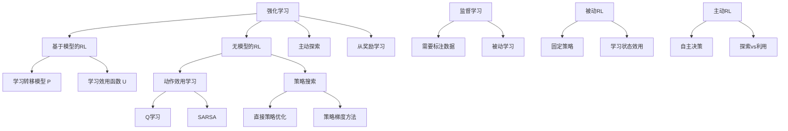

# 22.1 从奖励中学习

## 1. 背景与动机

### 1.1 监督学习的局限性

在传统的监督学习范式中，智能体通过被动地观测"老师"提供的输入/输出样例对进行学习。以学习下国际象棋为例，如果我们采用监督学习方法，需要为智能体提供一个包含数百万局象棋大师对局的数据库，其中每个棋盘局面都标有正确的走法。然而，这种方法面临着根本性的挑战：

**样本稀缺性问题**：国际象棋的可能局面数约为 $10^{40}$ 个，而现有的对局数据库仅有约 $10^8$ 个样本。在新的对局中，智能体很快就会遇到与训练样本明显不同的局面，导致失效。

**目标缺失问题**：监督学习智能体不知道自己下棋的目标是什么（将死对手），也不知道招式对棋子局面的影响。

**领域专家依赖**：为复杂任务提供标注数据需要领域专家，而专家资源往往稀缺且昂贵。

### 1.2 强化学习的兴起

强化学习（Reinforcement Learning, RL）提供了一种替代方案：智能体通过与环境互动并定期接收反映其表现的奖励信号来学习。这种范式源于心理学中的行为主义理论——动物会多做能得到奖励的事，少做会得到惩罚的事。

**核心思想**：智能体处于马尔可夫决策过程（MDP）中，但不知道转移模型或奖励函数，必须通过采取行动来了解更多信息。这就像玩一个不了解规则的新游戏，裁判只在游戏结束时告知输赢。

**历史渊源**：
- 1904年诺贝尔奖得主巴甫洛夫的条件反射实验
- 1911年桑代克的《动物智能》研究
- 1948年图灵提出强化学习作为计算机教学方法
- 1959年塞缪尔的西洋跳棋程序首次成功应用机器学习

### 1.3 奖励设计的优势

与监督学习相比，强化学习的奖励信号具有以下优势：

**简洁性**：奖励函数通常非常简洁。例如，国际象棋只需几行代码告知输赢，赛车只需告知是否获胜或撞车。

**非专家友好**：设计者不需要是领域专家，不需要能在任何情况下提供正确动作。

**通用性**：只要可以提供正确的奖励信号，强化学习就提供了一种非常通用的构建AI系统的方法，尤其在模拟环境中。

### 1.4 稀疏奖励与中间奖励

**稀疏奖励问题**：在许多任务中（如国际象棋、赛车），智能体只在游戏结束时获得奖励，绝大多数状态下没有信息量的奖励信号。

**解决方案——中间奖励**：
- 网球/板球：为每次击球得分提供奖励
- 赛车：奖励朝着正确方向前进的行为
- 机器人爬行：奖励任何向前的运动

这些中间奖励可以极大地加速学习过程。

## 2. 知识逻辑图谱

## 3. 核心概念与数学分析

### 3.1 强化学习的形式化定义

强化学习问题可以形式化为一个马尔可夫决策过程（MDP）的交互学习问题：

**MDP五元组**：$M = (S, A, P, R, \gamma)$

- $S$：状态空间
- $A$：动作空间  
- $P(s'|s,a)$：转移概率
- $R(s,a,s')$：奖励函数
- $\gamma \in [0,1]$：折扣因子

**关键区别**：与第17章的MDP求解不同，强化学习中智能体**不知道** $P$ 和 $R$，必须通过交互来学习。

### 3.2 强化学习的分类框架

#### 3.2.1 基于模型的强化学习（Model-Based RL）

智能体使用环境的转移模型来帮助解释奖励信号并决定如何行动。

**模型获取方式**：
- 模型最初未知：通过观测行为的影响来学习模型
- 模型已知：如国际象棋程序知道规则但不知道如何选择好的走法

**学习目标**：效用函数 $U(s)$，定义为从状态 $s$ 开始的期望总折扣奖励：

$$U(s) = \mathbb{E}\left[\sum_{t=0}^{\infty} \gamma^t R(S_t, A_t, S_{t+1}) \mid S_0 = s\right]$$

#### 3.2.2 无模型强化学习（Model-Free RL）

智能体不知道也不学习转移模型，直接学习行为方式。

**形式一：动作效用学习（Action-Utility Learning）**

学习Q函数（质量函数）：$Q(s,a)$ 表示从状态 $s$ 采取动作 $a$ 后的期望总折扣奖励。

$$Q(s,a) = \mathbb{E}\left[\sum_{t=0}^{\infty} \gamma^t R(S_t, A_t, S_{t+1}) \mid S_0 = s, A_0 = a\right]$$

最优动作选择：
$$\pi^*(s) = \arg\max_a Q(s,a)$$

**形式二：策略搜索（Policy Search）**

直接学习策略 $\pi(s)$，即从状态到动作的映射。这是一个反射型智能体，不需要显式的效用表示。

### 3.3 期望效用与折扣奖励

**累积奖励**：
$$G_t = R_{t+1} + \gamma R_{t+2} + \gamma^2 R_{t+3} + \cdots = \sum_{k=0}^{\infty} \gamma^k R_{t+k+1}$$

**折扣因子的作用**：
- $\gamma = 0$：只关心即时奖励（短视）
- $\gamma = 1$：平等对待所有未来奖励
- $\gamma \in (0,1)$：未来奖励按指数衰减

**数学性质**：
当 $\gamma < 1$ 且奖励有界 $|R| \leq R_{max}$ 时，累积奖励收敛：
$$|G_t| \leq \frac{R_{max}}{1-\gamma}$$

### 3.4 强化学习 vs 监督学习

| 维度 | 监督学习 | 强化学习 |
|------|---------|---------|
| 学习信号 | 正确标签 | 奖励信号 |
| 学习方式 | 被动观测 | 主动交互 |
| 数据需求 | 大量标注数据 | 环境交互经验 |
| 目标 | 拟合映射函数 | 最大化累积奖励 |
| 探索 | 无 | 必需 |
| 延迟反馈 | 无 | 有（信用分配） |

## 4. 定理与证明

### 4.1 贝尔曼最优性定理

**定理**：对于任意MDP，存在最优策略 $\pi^*$ 满足：

$$U^*(s) = \max_a \sum_{s'} P(s'|s,a)[R(s,a,s') + \gamma U^*(s')]$$

**证明概要**：

1. **存在性**：通过压缩映射原理，贝尔曼算子 $T$ 是压缩的：
   $$\|TU - TV\|_\infty \leq \gamma \|U - V\|_\infty$$

2. **唯一性**：由Banach不动点定理，存在唯一的不动点 $U^* = TU^*$

3. **最优性**：设 $\pi^*$ 为贪婪策略，$\pi^*(s) = \arg\max_a Q^*(s,a)$，则：
   $$U^{\pi^*}(s) = U^*(s) \geq U^\pi(s), \forall \pi, s$$

### 4.2 收敛性定理（价值迭代）

**定理**：价值迭代算法产生的效用估计序列 $\{U_k\}$ 收敛到最优效用 $U^*$。

**证明**：

设 $T$ 为贝尔曼最优算子，$U_{k+1} = TU_k$。

$$\|U_{k+1} - U^*\|_\infty = \|TU_k - TU^*\|_\infty \leq \gamma \|U_k - U^*\|_\infty$$

递推得：
$$\|U_k - U^*\|_\infty \leq \gamma^k \|U_0 - U^*\|_\infty \to 0 \text{ as } k \to \infty$$

**收敛速率**：指数收敛，速率由 $\gamma$ 决定。

## 5. 具体示例

### 5.1 国际象棋学习问题

**问题设置**：
- 状态空间：约 $10^{40}$ 个局面
- 动作空间：平均约35种合法走法
- 奖励：胜=1，负=0，和=0.5

**监督学习方案的问题**：
- 需要标注所有局面的"正确走法"
- 训练样本 ($10^8$) << 状态空间 ($10^{40}$)
- 泛化能力差

**强化学习方案**：
- 只需定义游戏结束时的奖励
- 智能体通过与自己对弈学习
- AlphaZero通过自我对弈达到超人类水平

### 5.2 网格世界示例

考虑 $4 \times 3$ 网格世界：
- 起点：(1,1)
- 正奖励终止状态：(4,3)，奖励 +1
- 负奖励终止状态：(4,2)，奖励 -1
- 每步代价：-0.04

**稀疏奖励版本**：
- 仅在终止状态获得奖励
- 智能体需要探索才能发现目标

**密集奖励版本**：
- 添加到达目标距离的负值作为中间奖励
- 学习速度显著加快

### 5.3 深度强化学习的突破

**DQN（深度Q网络）**：
- 输入：原始像素（Atari游戏画面）
- 输出：每个动作的Q值
- 网络：卷积神经网络
- 成就：在49款Atari游戏中达到人类专家水平

**关键创新**：
- 经验回放（Experience Replay）
- 目标网络（Target Network）
- 端到端学习，无需人工特征工程

## 6. 一句话本质

**强化学习是通过与环境的试错交互，利用延迟的奖励信号来学习最优行为策略的机器学习方法。**

## 7. 总结与反思

### 7.1 核心要点

1. **学习范式转变**：从被动接收标注数据到主动探索环境
2. **奖励信号的简洁性**：相比详细标注，奖励函数更容易设计
3. **探索-利用权衡**：智能体必须在利用已知策略和探索新策略之间平衡
4. **延迟奖励处理**：需要解决信用分配问题（哪个动作导致了最终奖励）

### 7.2 方法选择指南

**选择基于模型方法当**：
- 环境模型容易获得或学习
- 需要进行大量规划
- 样本效率要求高

**选择无模型方法当**：
- 环境复杂难以建模
- 需要端到端学习
- 有大量交互数据

### 7.3 现代应用

强化学习已在以下领域取得突破性进展：
- **游戏**：围棋、扑克、星际争霸
- **机器人**：行走、抓取、飞行
- **自动驾驶**：路径规划、决策控制
- **推荐系统**：个性化内容推荐
- **资源调度**：数据中心冷却、电网管理

### 7.4 未来挑战

1. **样本效率**：减少学习所需的交互次数
2. **安全探索**：在真实环境中安全地学习
3. **奖励设计**：自动学习或推断奖励函数
4. **泛化能力**：从模拟到真实、从任务到任务的迁移
5. **可解释性**：理解学习到的策略

### 7.5 与其他章节的联系

- **第17章（MDP）**：强化学习的理论基础
- **第19-21章（机器学习）**：函数近似和深度学习方法
- **第5章（博弈）**：多智能体强化学习
- **第26章（机器人）**：强化学习在物理系统中的应用
