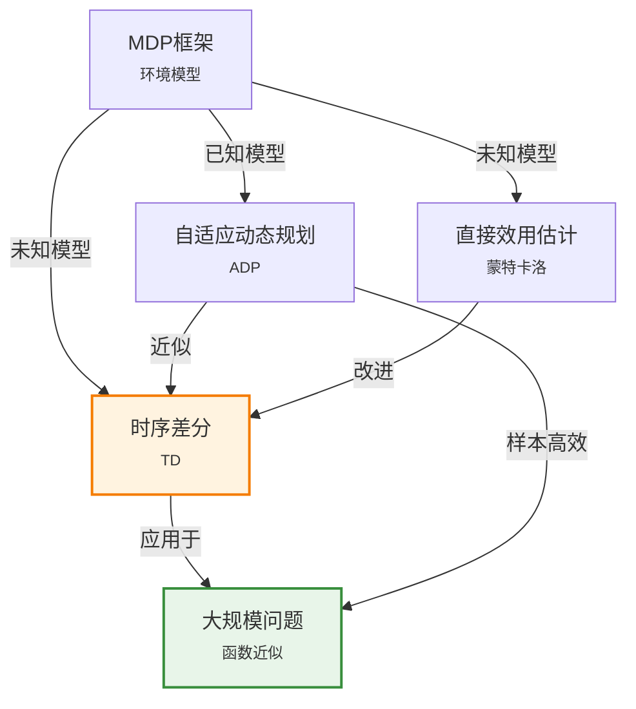

# 22.2 被动强化学习

> 📖 本节 Deep Dive | 预计学习时间: 90 分钟

---

## 1. 背景与动机

### 1.1 历史背景

**学科演进脉络**

被动强化学习（Passive Reinforcement Learning）是强化学习理论发展的基础阶段。在20世纪80年代，研究者首先研究了如何在固定策略下评估价值函数，这为后来的主动强化学习奠定了理论基础。

1988年，Sutton的里程碑论文《Learning to predict by the methods of temporal differences》正式提出了时序差分（TD）学习，这是被动RL最重要的算法之一。TD学习的核心思想是：不需要等待最终结果，而是利用当前估计值来更新预测，这大大提高了学习效率。

在此之前，研究者主要使用蒙特卡洛方法——必须等到一个完整的回合结束后才能更新价值估计。TD方法打破了这一限制，使得在线学习成为可能。

**里程碑事件**:

| 年份 | 人物/事件 | 贡献 | 影响 |
|------|-----------|------|------|
| 1959 | Samuel | 跳棋程序，使用值函数近似 | 最早的强化学习应用 |
| 1988 | Sutton | TD学习算法 | 现代RL的理论基础 |
| 1992 | Tesauro | TD-Gammon | 证明TD在高复杂度问题上的有效性 |
| 1993 | Moore & Atkeson | 优先扫描 | 提高ADP的样本效率 |

**演进动机**:
- 早期方法: 蒙特卡洛需要完整回合，学习效率低
- 局限性: 无法利用状态间的结构关系
- 突破: TD方法引入自举（bootstrapping），在线更新

### 1.2 研究动机

**为什么研究者关注这个主题？**

1. **理论意义**: 被动RL是理解主动RL的基础。只有理解了如何评估一个固定策略，才能进一步学习如何改进策略。

2. **方法创新**: TD学习结合了蒙特卡洛采样和动态规划的自举，是RL理论的重要突破。

3. **问题解决**: 在很多实际场景中，策略已经给定（如人类专家的行为），我们只需要评估其价值，这正是被动RL的应用场景。

**与其他领域的关系**:
- 与动态规划: 被动RL可以看作是在模型未知情况下的自适应动态规划
- 与蒙特卡洛: TD是蒙特卡洛和DP的折中，兼具两者的优点

### 1.3 实际应用场景

| 应用领域 | 具体问题 | 本节理论的作用 | 预期效果 |
|----------|----------|----------------|----------|
| 金融风控 | 评估固定交易策略的收益 | 从历史数据学习策略价值 | 评估策略风险 |
| 医疗决策 | 评估既定治疗方案的效果 | 学习治疗策略的长期效果 | 优化患者预后 |
| 系统运维 | 评估固定维护策略的效果 | 学习维护策略的期望成本 | 降低运维成本 |
| A/B测试 | 评估不同UI设计的长期效果 | 学习用户行为的累积奖励 | 优化产品设计 |

**典型案例预览**:
> 假设你是一名量化交易员，你的团队有一个运行中的交易策略。你想知道这个策略在不同市场环境下的期望收益是多少。被动强化学习可以帮助你从历史交易数据中学习这个策略的价值函数，而无需改变策略本身。

### 1.4 先决条件

**学习本节需要的前置知识**:

| 知识项 | 来源 | 掌握程度要求 | 关键概念 |
|--------|------|:------------:|----------|
| 马尔可夫决策过程 | 第17章 | 必须熟练掌握 | 状态、动作、转移概率、奖励 |
| 贝尔曼方程 | 第17章 | 必须熟练掌握 | 期望价值递归关系 |
| 策略评估 | 第17章 | 理解即可 | 给定策略下的价值计算 |
| 最大似然估计 | 第20章 | 了解 | 参数估计 |

**前置检查清单**:
- [ ] 能够复述MDP的五元组定义
- [ ] 能够写出贝尔曼期望方程
- [ ] 理解折扣因子γ的作用

**如果前置知识不足**: [回到第17章复习 →](../第17章_做复杂决策/00_概览.md)

---

## 2. 知识逻辑图谱

### 2.1 概念关系图



### 2.2 知识发展依赖链

```
【基础层】           【发展层】              【高潮层】             【应用层】
    ↓                   ↓                     ↓                   ↓
┌─────────┐      ┌─────────────┐       ┌───────────┐      ┌──────────┐
│ MDP框架 │ ──→  │ 直接效用估计 │  ──→  │ 时序差分  │ ──→  │ 函数近似  │
│         │      │             │       │   TD(0)   │      │   TD(λ)  │
│ 贝尔曼  │      │ 蒙特卡洛    │       │  自举更新 │      │  线性近似 │
│  方程   │      │ 采样平均    │       │  在线学习 │      │  深度网络 │
└─────────┘      └─────────────┘       └───────────┘      └──────────┘
     │                   │                   │                │
     └───────────────────┴───────────────────┴────────────────┘
                         知识演进脉络
```

**依赖链详解**:
1. **基础**: MDP提供了问题的数学框架，贝尔曼方程提供了递归结构
2. **发展**: 直接效用估计将RL问题转化为监督学习；ADP学习模型后使用DP
3. **高潮**: TD方法结合了两者的优点，无模型且在线更新
4. **应用**: 函数近似使TD能够处理大规模状态空间

### 2.3 本节在章节中的位置

```
第 22 章: 强化学习
├── 22.1 从奖励中学习 ← RL基础框架
│   └── [核心概念: 奖励、智能体、环境]
│
├── 22.2 被动强化学习 ← ⭐ 当前位置
│   ├── [核心概念: 固定策略、价值函数]
│   ├── [核心算法: ADP, TD(0)]
│   └── [贝尔曼方程的应用]
│
└── 22.3 主动强化学习 ← 后续发展
    └── [将价值学习扩展到策略优化]
```

**衔接说明**:
- **从前一节继承**: RL的基本框架和MDP定义
- **为后一节铺垫**: 价值学习是策略改进的基础（策略迭代中的评估步骤）

---

## 3. 核心概念与数学分析

### 3.1 核心术语定义

**定义 22.2.1** (被动强化学习 / Passive Reinforcement Learning):

> **正式定义**: 给定一个固定的策略 $\pi$，智能体通过与环境的交互学习该策略下的状态价值函数 $U^\pi(s)$。智能体不尝试改进策略，只评估当前策略的好坏。

**定义详解**:
- **直观解释**: 想象你是一名影评人，你的任务是评价一部电影（策略），而不是去拍一部更好的电影。你通过观看电影（执行策略）来学习如何评价它。
- **数学表述**: 
$$U^\pi(s) = \mathbb{E}\left[\sum_{t=0}^{\infty} \gamma^t R(S_t, \pi(S_t), S_{t+1}) \mid S_0 = s\right]$$
- **为什么这样定义**: 策略评估是策略改进的基础，只有知道当前策略的好坏，才能决定如何改进

**定义中的关键要素**:
| 要素 | 符号 | 含义 | 约束条件 |
|------|------|------|----------|
| 策略 | $\pi$ | 状态到动作的映射 | 确定性或随机性 |
| 状态价值 | $U^\pi(s)$ | 从s出发的期望累积奖励 | 依赖于策略π |
| 折扣因子 | $\gamma$ | 未来奖励的折现率 | $0 \leq \gamma < 1$ |
| 奖励 | $R(s,a,s')$ | 转移后的即时奖励 | 可正可负 |

---

**定义 22.2.2** (直接效用估计 / Direct Utility Estimation):

> **正式定义**: 将每个状态的价值视为从该状态出发获得的累积奖励的期望值，通过多次试验的样本平均来估计。

**定义详解**:
- **直观解释**: 就像通过多次掷骰子来估计期望值一样，我们让智能体多次从某状态出发执行策略，然后平均累积奖励。
- **数学表述**: 
$$\hat{U}^\pi(s) = \frac{1}{N_s} \sum_{i=1}^{N_s} u_i(s)$$
其中 $u_i(s)$ 是第 $i$ 次试验中从状态 $s$ 出发的累积奖励
- **局限**: 忽略了状态间的结构关系——相邻状态的价值应该相近

---

**定义 22.2.3** (时序差分学习 / Temporal-Difference Learning):

> **正式定义**: 利用贝尔曼方程的自举特性，根据观测到的转移 $(s, a, r, s')$ 更新价值估计，使当前估计与后继估计保持一致。

**定义详解**:
- **直观解释**: TD就像调整预测使其与"实际观测+后续预测"一致。如果你预测明天股市涨5%，但观测到今天涨了2%且你的模型预测明天还会涨3%，你会调整预测。
- **数学表述**: 
$$U(s) \leftarrow U(s) + \alpha[R(s, \pi(s), s') + \gamma U(s') - U(s)]$$
- **为什么这样定义**: 利用状态间的结构关系，更快传播奖励信息

---

### 3.2 符号系统与约定

**本节符号总表**:

| 符号 | 含义 | 数学表达 | 备注 |
|:----:|------|----------|------|
| $s$ | 状态 | $s \in \mathcal{S}$ | 环境状态 |
| $a$ | 动作 | $a \in \mathcal{A}$ | 智能体动作 |
| $r$ | 奖励 | $r \in \mathbb{R}$ | 标量信号 |
| $\pi$ | 策略 | $\pi: \mathcal{S} \to \mathcal{A}$ | 确定性策略 |
| $U^\pi(s)$ | 状态价值 | $\mathbb{R}$ | 策略π下从s出发的期望回报 |
| $P(s'|s,a)$ | 转移概率 | $[0,1]$ | 执行a后转移到s'的概率 |
| $\gamma$ | 折扣因子 | $[0,1)$ | 未来奖励折现 |
| $\alpha$ | 学习率 | $(0,1]$ | 更新步长 |
| $N_{s,a,s'}$ | 计数 | $\mathbb{N}$ | (s,a)→s'的观测次数 |

**符号使用约定**:
- 粗体表示向量（如 $\mathbf{U}$ 表示所有状态的价值向量）
- 花体表示集合（如 $\mathcal{S}$ 表示状态空间）
- 上标π表示依赖于策略

### 3.3 关键公式与性质

#### 公式 1: 贝尔曼期望方程 (固定策略)

**数学表述**:
$$U^\pi(s) = \sum_{s'} P(s'|s, \pi(s))[R(s, \pi(s), s') + \gamma U^\pi(s')]$$

**公式要素解析**:

| 维度 | 内容 |
|------|------|
| **直观解释** | 当前状态的价值等于即时奖励加上折扣后的后继状态价值的期望 |
| **几何意义** | 可以看作状态空间中的一个不动点方程 |
| **领域背景** | Bellman (1957) 提出，是动态规划和强化学习的核心理论基础 |

**使用条件**: 适用于任何有限MDP和任何固定策略

**代数推导**:
```
U^π(s) = E[Σ γ^t R_t | s_0 = s]
       = E[R_0 + γ Σ γ^t R_{t+1} | s_0 = s]
       = Σ P(s'|s,π(s)) R(s,π(s),s') + γ Σ P(s'|s,π(s)) E[Σ γ^t R_{t+1} | s_1 = s']
       = Σ P(s'|s,π(s))[R(s,π(s),s') + γ U^π(s')]
```

---

#### 公式 2: TD(0)更新规则

**数学表述**:
$$U(s) \leftarrow U(s) + \alpha[R(s, \pi(s), s') + \gamma U(s') - U(s)]$$

**公式要素解析**:

| 维度 | 内容 |
|------|------|
| **直观解释** | 根据实际观测与当前估计的差异（TD误差）来调整价值估计 |
| **几何意义** | 在价值函数空间中向目标方向移动 |
| **领域背景** | Sutton (1988) 提出，是RL最重要的算法之一 |

**使用条件**: 被动RL（策略固定），适用于无模型场景

**特殊情况**:
- 当 $\alpha = 1/N_s$ 时，TD等价于累积平均
- 当 $\gamma = 0$ 时，只考虑即时奖励

**与其他公式的关系**: 
- 是贝尔曼方程的随机逼近形式
- 目标 $R + \gamma U(s')$ 是"自举"目标

---

### 3.4 重要性质与推论

**性质 22.2.1** (TD误差作为随机梯度):

> **陈述**: TD更新可以看作最小化贝尔曼均方误差的随机梯度下降。

**证明概要**: 定义目标函数 $J(U) = \frac{1}{2}\mathbb{E}[(R + \gamma U(s') - U(s))^2]$，求梯度即得TD更新规则。

**直观理解**: TD试图让价值估计满足贝尔曼方程。

---

## 4. 算法详解

### 4.1 直接效用估计算法

**算法思想**: 将强化学习转化为监督学习问题

```
算法: 直接效用估计 (Direct Utility Estimation)
输入: 策略π，试验次数N
输出: 状态价值估计U(s)

初始化: 对每个状态s，样本列表Samples[s] = []

对每个试验i = 1 to N:
    从初始状态s_0开始
    执行策略π直到终止
    记录序列: (s_0, r_1, s_1, r_2, ..., s_T)
    
    计算累积奖励:
    对t = 0 to T-1:
        u_t = Σ_{k=t}^{T-1} γ^{k-t} r_{k+1}
        将u_t添加到Samples[s_t]

对每个状态s:
    U(s) = average(Samples[s])
    
返回U
```

**算法分析**:
- **优点**: 简单直观，无偏估计
- **缺点**: 
  - 忽略状态间关系（贝尔曼方程）
  - 收敛速度慢
  - 需要存储完整试验序列

### 4.2 自适应动态规划 (ADP)

**算法思想**: 学习转移模型，然后用动态规划求解

```
算法: 被动ADP学习 (Passive-ADP-Learner)
输入: 感知percept（当前状态s'和奖励r）
输出: 动作a

持久变量:
    π: 固定策略
    U: 状态价值表
    N[s,a,s']: 转移计数表
    s_prev, a_prev: 前一步的状态和动作

如果s'是新状态:
    U[s'] ← 0

如果s_prev非空:
    增加N[s_prev, a_prev, s']的计数
    更新转移概率: P(·|s_prev, a_prev) = Normalize(N[s_prev, a_prev, ·])
    更新奖励: R[s_prev, a_prev, s'] ← r
    
    // 使用策略评估求解
    U ← PolicyEvaluation(π, U, P, R, γ)

s_prev ← s'
a_prev ← π[s']
返回a_prev
```

**PolicyEvaluation**: 求解线性方程组或使用迭代方法（如价值迭代）

**算法分析**:
- **优点**: 
  - 样本效率高（利用贝尔曼方程的结构）
  - 收敛速度快
- **缺点**: 
  - 计算复杂度高（需要求解线性方程组或迭代）
  - 存储转移模型需要O(|S|²|A|)空间
  - 大规模问题不可行

### 4.3 时序差分学习 (TD)

**算法思想**: 直接利用观测到的转移更新价值估计

```
算法: 被动TD学习 (Passive-TD-Learner)
输入: 感知percept（当前状态s'和奖励r）
输出: 动作a

持久变量:
    π: 固定策略
    U: 状态价值表，初始为空
    N_s: 状态访问计数表
    s_prev: 前一步状态，初始为空

如果s'是新状态:
    U[s'] ← 0

如果s_prev非空:
    增加N_s[s_prev]
    // TD更新
    δ ← r + γ·U[s'] - U[s_prev]  // TD误差
    α ← α(N_s[s_prev])  // 学习率（如α(n) = 1/n）
    U[s_prev] ← U[s_prev] + α·δ

s_prev ← s'
返回π[s']
```

**算法分析**:
- **优点**: 
  - 无模型（不需要学习P和R）
  - 在线学习（每步都更新）
  - 计算高效（O(1)每步）
- **缺点**: 
  - 比ADP收敛慢
  - 价值估计波动较大
  - 超参数α需要仔细调整

**TD与ADP的关系**:
TD可以看作ADP的近似。ADP对所有可能的后继状态进行加权平均，而TD只对观测到的后继状态进行更新。当转移次数足够多时，TD的平均效果接近ADP。

### 4.4 算法比较

| 特性 | 直接效用估计 | ADP | TD(0) |
|------|:------------:|:---:|:-----:|
| 是否需要模型 | ❌ 否 | ✅ 是 | ❌ 否 |
| 是否在线更新 | ❌ 否 | ✅ 是 | ✅ 是 |
| 样本效率 | ⭐ | ⭐⭐⭐⭐ | ⭐⭐⭐ |
| 计算复杂度 | O(T) | O(\|S\|³)或迭代 | O(1) |
| 收敛速度 | 慢 | 快 | 中等 |
| 利用状态结构 | ❌ 否 | ✅ 是 | ✅ 是 |

---

## 5. 具体示例与详解

### 5.1 4×3世界数值示例

**示例 22.2.1**: 4×3世界的被动RL

**📋 问题陈述**:

考虑经典的4×3网格世界（如图22-1）：
- 状态: (1,1)到(4,3)，其中(4,2)是-1陷阱，(4,3)是+1目标
- 动作: 上、下、左、右
- 转移: 80%概率执行意图动作，20%概率滑向两侧
- 奖励: 每次转移-0.04（小惩罚），到达目标+1，掉入陷阱-1
- 策略: 图22-1a所示的"最优"策略

**给定策略**（部分）:
- (1,1): Up
- (1,2): Up  
- (1,3): Right
- (2,3): Right
- (3,3): Right

**求解**: 使用TD(0)学习该策略的状态价值函数

---

**🔍 解答过程**:

**步骤 1: 初始化**

对所有非终止状态: $U(s) = 0$
学习率: $\alpha(n) = 1/n$（每次访问该状态的次数的倒数）
折扣因子: $\gamma = 1$（无折扣）

**步骤 2: 执行一次试验并更新**

假设观测到一条试验路径：
```
(1,1) →[Up,-0.04]→ (1,2) →[Up,-0.04]→ (1,3) →[Right,-0.04]→ (2,3) →[Right,+0.96]→ (4,3)终止
```

计算累积奖励（实际u值）:
- u(1,1) = -0.04 + (-0.04) + (-0.04) + (-0.04) + 0.96 = 0.80
- u(1,2) = -0.04 + (-0.04) + (-0.04) + 0.96 = 0.84
- u(1,3) = -0.04 + (-0.04) + 0.96 = 0.88
- u(2,3) = -0.04 + 0.96 = 0.92

**步骤 3: TD(0)更新**

第一次访问(1,1):
- TD目标: $r + \gamma U(1,2) = -0.04 + 0 = -0.04$
- TD误差: $-0.04 - 0 = -0.04$
- 更新: $U(1,1) \leftarrow 0 + 1 \times (-0.04) = -0.04$

第一次访问(1,2):
- TD目标: $-0.04 + U(1,3) = -0.04 + 0 = -0.04$
- TD误差: $-0.04 - 0 = -0.04$
- 更新: $U(1,2) \leftarrow 0 + 1 \times (-0.04) = -0.04$

...以此类推

**步骤 4: 多次试验后**

经过足够多的试验，TD估计将收敛到真实价值（见图22-1b）:
- U(1,1) ≈ 0.812
- U(1,2) ≈ 0.868
- U(1,3) ≈ 0.918
- U(2,3) ≈ 0.960
- U(3,3) ≈ 0.960
- U(4,3) = +1（终止状态）

---

**✅ 验证与检验**:

**正确性检查**:
- [x] 结果满足贝尔曼方程
- [x] 接近目标的状态价值更高
- [x] 远离目标的状态价值逐渐降低
- [x] 终止状态价值等于终止奖励

**与ADP比较**:
- ADP收敛更快但需要学习转移模型
- TD收敛较慢但更简洁（无模型）

---

### 5.2 概念辨析示例

**示例 22.2.2**: 为什么直接效用估计收敛慢？

**场景**: 在4×3世界中，状态(3,2)很少被访问，但一旦访问后到达(3,3)就能获得高奖励。

**直接效用估计的问题**:
- 必须等到试验结束才能更新
- (3,2)的价值只能从直接访问它的试验中学习
- 无法利用(3,3)的高价值信息

**TD的优势**:
- 当从(3,2)转移到(3,3)时，立即利用U(3,3)≈0.96更新U(3,2)
- 奖励信息通过自举快速传播

**教训**: 利用问题结构（贝尔曼方程）可以显著加速学习。

### 5.3 类比与可视化

**直觉类比**:

| 抽象概念 | 日常类比 | 对应关系 |
|----------|----------|----------|
| 状态价值U(s) | 从某城市出发的"幸福度" | 城市s的未来期望幸福总分 |
| TD更新 | 调整天气预测 | 根据今天的实际天气和明天的预测来调整今天的预测 |
| TD误差 | 预测与实际观测的差异 | 今天预测 vs (今天实际 + 明天预测) |
| 学习率α | 调整幅度 | 相信新信息的程度 |

**局限性**: 这个类比的局限在于天气有随机性，而RL的状态转移也有随机性，但RL中的"预测"是价值函数，不是简单的数值。

---

## 6. 深入理解与拓展

### 6.1 一句话本质

> 🎯 **核心要点**: 被动强化学习通过观测固定策略下的转移序列，利用贝尔曼方程的递归结构（通过TD自举或ADP规划）来学习状态价值函数。

### 6.2 深入思考问题

1. **概念层面**: 为什么TD被称为"时序差分"？它与有限差分有什么联系？
   <!-- 思考方向: TD误差类似于导数估计，用连续时间步的价值差来估计变化 -->

2. **方法层面**: TD(0)和蒙特卡洛方法在什么极端条件下会等价？
   <!-- 思考方向: 当学习率α=1且只在回合结束时更新，TD(0)退化为蒙特卡洛 -->

3. **应用层面**: 在什么样的实际问题中，ADP明显优于TD？
   <!-- 思考方向: 当转移模型容易学习且状态空间适中时，ADP的样本效率更高 -->

4. **拓展层面**: 如何设计一个结合ADP和TD优点的算法？
   <!-- 思考方向: Dyna-Q架构，同时学习模型并用TD学习价值 -->

### 6.3 与其他节的关系

**本节输出**:
- 价值函数估计能力
- TD学习的基础框架
- 为策略迭代提供评估子程序

**后续发展预告**: 在22.3节中，我们将学习如何利用学到的价值函数来改进策略，从而进入主动强化学习。

---

## 7. 总结与反思

### 7.1 关键要点总结

本节必须掌握的 **5** 个核心要点:

1. **被动RL定义**: 在固定策略下学习价值函数，不涉及策略改进
   
   💡 *记忆技巧*: "被动" = 只看不改

2. **贝尔曼期望方程**: $U^\pi(s) = \sum_{s'} P(s'|s,\pi(s))[R + \gamma U^\pi(s')]$
   
   💡 *记忆技巧*: 当前价值 = 即时奖励 + 折扣后后继价值期望

3. **TD(0)更新**: $U(s) \leftarrow U(s) + \alpha[R + \gamma U(s') - U(s)]$
   
   💡 *记忆技巧*: 向"实际观测+自举预测"方向调整

4. **TD误差**: $\delta = R + \gamma U(s') - U(s)$
   
   💡 *记忆技巧*: 这是"惊喜"——实际与预期的差异

5. **ADP vs TD**: ADP学习模型+规划，TD无模型+在线
   
   💡 *记忆技巧*: ADP是"计划型"，TD是"行动派"

### 7.2 本节知识框架

```
┌─────────────────────────────────────────────────────────────┐
│  第22.2节: 被动强化学习                                      │
├─────────────────────────────────────────────────────────────┤
│  输入/前置                                                   │
│  • MDP框架                                                  │
│  • 固定策略π                                                │
│  • 转移序列观测                                             │
│                                                             │
│  处理/核心                                                   │
│  • 直接效用估计（蒙特卡洛）                                 │
│  • ADP（学习模型+动态规划）                                 │
│  • TD学习（时序差分，自举更新）                             │
│  ↓                                                          │
│  输出/结果                                                   │
│  • 状态价值函数U^π(s)                                       │
│  • 策略评估能力                                             │
│                                                             │
│  应用/价值                                                   │
│  • 策略迭代中的评估步骤                                     │
│  • 专家策略评估                                             │
│  • A/B测试的长期效果评估                                    │
└─────────────────────────────────────────────────────────────┘
```

### 7.3 常见误解与纠正

| 常见误解 ❌ | 正确理解 ✅ | 为什么容易错 | 如何避免 |
|-------------|-------------|--------------|----------|
| ❌ TD一定比蒙特卡洛好 | ✅ 各有优劣，TD有偏但方差小，MC无偏但方差大 | 忽视偏差-方差权衡 | 理解问题特性，选择合适方法 |
| ❌ TD不需要模型就能收敛到正确值 | ✅ 需要适当的学习率衰减（如1/n） | 混淆收敛性和学习率设置 | 学习率必须满足随机逼近条件 |
| ❌ ADP一定比TD快 | ✅ ADP样本效率高但每次更新计算量大 | 只考虑样本复杂度 | 综合考虑样本和计算复杂度 |
| ❌ 直接效用估计很简单所以没用 | ✅ 它揭示了RL与监督学习的联系 | 以复杂度论价值 | 理解其理论意义 |

### 7.4 反思问题

**连接性问题** (与本章其他节):
1. 被动RL的价值学习如何用于主动RL的策略改进？（提示: 策略迭代）
2. TD(0)如何扩展到主动设置？（提示: Q学习）

**应用性问题**:
1. 在金融交易中，如果你想评估一个固定交易策略的长期收益，应该选择哪种方法？
2. 如果状态空间很大（如围棋），本节的方法会遇到什么问题？（提示: 22.4节内容）

**批判性问题**:
1. 为什么在实际应用中，TD(0)比ADP更常用？
2. TD(0)的"自举"特性有什么潜在风险？

### 7.5 学习检查清单

- [ ] 能够复述被动RL的定义
- [ ] 能够写出贝尔曼期望方程并解释各项含义
- [ ] 能够独立推导TD(0)更新规则
- [ ] 能够手动执行一次TD更新计算
- [ ] 能够辨析直接效用估计、ADP、TD的区别
- [ ] 知道TD误差的意义
- [ ] 了解学习率对收敛的影响

---

## 附录

### A. 公式速查表

| 公式 | 名称 | 使用条件 | 备注 |
|:----:|------|----------|------|
| $$U^\pi(s) = \sum_{s'}P(s'|s,\pi(s))[R+\gamma U^\pi(s')]$$ | 贝尔曼期望 | 被动RL | 固定策略下的价值递归 |
| $$U(s) \leftarrow U(s) + \alpha\delta$$ | TD更新 | 无模型被动RL | $\delta = R + \gamma U(s') - U(s)$ |
| $$\hat{P}(s'|s,a) = \frac{N_{s,a,s'}}{\sum_{s''}N_{s,a,s''}}$$ | 最大似然估计 | ADP | 转移概率估计 |

### B. 术语索引

| 术语 | 英文 | 定义 | 位置 |
|------|------|------|:----:|
| 被动强化学习 | Passive RL | 固定策略下的价值学习 | 本节 |
| 直接效用估计 | Direct Utility Estimation | 蒙特卡洛式价值估计 | 22.2.1 |
| 自适应动态规划 | ADP | 学习模型+动态规划 | 22.2.2 |
| 时序差分 | Temporal Difference | 自举式价值更新 | 22.2.3 |
| TD误差 | TD Error | $R + \gamma U(s') - U(s)$ | 本节 |

### C. 延伸阅读

**理论深化**:
- Sutton (1988) "Learning to predict by the methods of temporal differences": TD学习奠基论文
- Bertsekas & Tsitsiklis (1996) "Neuro-Dynamic Programming": 深度理论分析

**应用拓展**:
- Tesauro (1992) TD-Gammon: 西洋双陆棋上的TD应用

---

> 📌 **下一节**: [22.3 主动强化学习](22.3_主动强化学习.md)
> 
> 📚 **返回概览**: [第22章概览](../00_概览.md)
