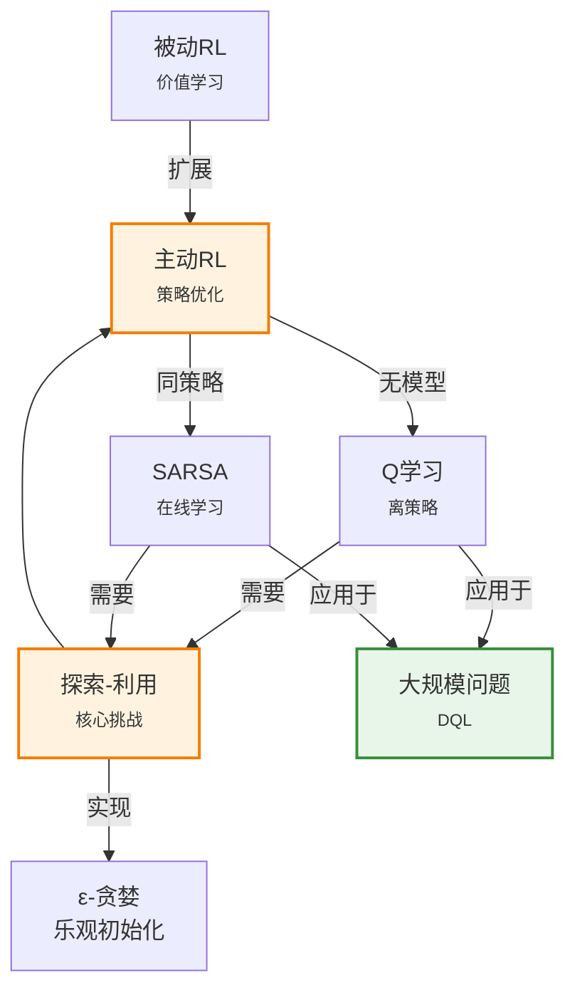

# 22.3 主动强化学习

> 📖 本节 Deep Dive | 预计学习时间: 120 分钟

---

## 1. 背景与动机

### 1.1 历史背景

**学科演进脉络**

主动强化学习（Active Reinforcement Learning）是强化学习的核心内容，解决了智能体如何自主学习最优策略的问题。从20世纪90年代开始，研究者在被动RL的基础上，开始探索如何让智能体自主决策并改进策略。

1989年，Watkins在其博士论文中提出了Q学习（Q-learning）算法，这是第一个被证明能够收敛到最优策略的无模型RL算法。Q学习的革命性在于：它可以在探索的同时学习最优策略，且不需要环境模型。

1994年，Rummery和Niranjan提出了SARSA算法，作为Q学习的同策略（on-policy）版本。与Q学习的离策略特性不同，SARSA学习的是当前探索策略的实际价值。

**里程碑事件**:

| 年份 | 人物/事件 | 贡献 | 影响 |
|------|-----------|------|------|
| 1989 | Watkins | Q学习算法 | 第一个收敛到最优的无模型算法 |
| 1994 | Rummery & Niranjan | SARSA算法 | 同策略学习的代表 |
| 1998 | Kearns & Singh | E³算法 | 多项式样本复杂度的探索算法 |
| 2000 | Brafman & Tennenholtz | R-MAX算法 | 乐观初始化探索 |

**演进动机**:
- 早期方法: 被动RL只能评估固定策略，无法改进
- 局限性: 需要平衡探索新动作和利用已知好动作
- 突破: Q学习证明了离策略学习的可行性

### 1.2 研究动机

**为什么研究者关注这个主题？**

1. **理论意义**: 探索-利用权衡（Exploration-Exploitation Tradeoff）是序贯决策的核心问题，涉及信息价值、不确定性和最优停止等深刻理论。

2. **方法创新**: Q学习引入了离策略（off-policy）学习的概念，允许智能体用探索策略收集数据，同时学习最优策略。

3. **问题解决**: 主动RL是自主智能体的基础，使机器能够在没有人类干预的情况下通过与环境交互学习最优行为。

**与其他领域的关系**:
- 与多臂老虎机: 主动RL可以看作是多臂老虎机在状态序列上的扩展
- 与信息论: 探索问题涉及信息增益和不确定性量化

### 1.3 实际应用场景

| 应用领域 | 具体问题 | 本节理论的作用 | 预期效果 |
|----------|----------|----------------|----------|
| 游戏AI | 学习游戏最优策略 | Q学习、DQN等 | 达到或超越人类水平 |
| 机器人控制 | 自主学习运动技能 | SARSA、策略梯度 | 适应不同环境 |
| 推荐系统 | 平衡探索新内容和推荐已知好内容 | ε-贪婪、UCB | 最大化长期用户满意度 |
| 资源调度 | 动态分配计算资源 | Q学习+函数近似 | 提高资源利用率 |

**典型案例预览**:
> 想象一个自动驾驶汽车在陌生的城市中学习驾驶。它需要探索不同的路线来了解哪些路线最快、最安全，同时又不能太激进（避免事故），也不能太保守（总是走已知路线）。主动强化学习提供了这种探索-利用权衡的数学框架。

### 1.4 先决条件

**学习本节需要的前置知识**:

| 知识项 | 来源 | 掌握程度要求 | 关键概念 |
|--------|------|:------------:|----------|
| 被动强化学习 | 22.2节 | 必须熟练掌握 | TD学习、价值函数 |
| 贝尔曼最优方程 | 第17章 | 必须熟练掌握 | 最优价值的递归关系 |
| 探索-利用权衡 | 第16章 | 理解即可 | 信息价值 |
| 随机逼近理论 | 外部 | 了解 | 收敛条件 |

**前置检查清单**:
- [ ] 能够写出TD(0)更新规则
- [ ] 理解贝尔曼最优方程
- [ ] 了解ε-贪婪策略

**如果前置知识不足**: [回到22.2节复习 →](22.2_被动强化学习.md)

---

## 2. 知识逻辑图谱

### 2.1 概念关系图



### 2.2 知识发展依赖链

```
【基础层】           【发展层】              【高潮层】             【应用层】
    ↓                   ↓                     ↓                   ↓
┌─────────┐      ┌─────────────┐       ┌───────────┐      ┌──────────┐
│ 被动RL  │ ──→  │ 贝尔曼最优  │  ──→  │  Q学习   │ ──→  │ 深度Q网络 │
│         │      │   方程      │       │  SARSA   │      │   DQN    │
│ 价值    │      │  最优价值   │       │ 离/同策略 │      │ 经验回放 │
│ 学习    │      │  递归定义   │       │ 最优收敛  │      │ 目标网络 │
└─────────┘      └─────────────┘       └───────────┘      └──────────┘
     │                   │                   │                │
     └───────────────────┴───────────────────┴────────────────┘
                         知识演进脉络
```

**依赖链详解**:
1. **基础**: 被动RL的价值学习是基础
2. **发展**: 贝尔曼最优方程定义了最优策略的标准
3. **高潮**: Q学习和SARSA提供了实际算法，Q学习的离策略特性特别重要
4. **应用**: 深度Q网络（DQN）将Q学习扩展到高维状态空间

### 2.3 本节在章节中的位置

```
第 22 章: 强化学习
├── 22.2 被动强化学习 ← 前置知识
│   └── [核心概念: TD学习、价值函数]
│
├── 22.3 主动强化学习 ← ⭐ 当前位置
│   ├── [核心概念: 探索-利用、最优策略]
│   ├── [核心算法: Q学习、SARSA]
│   └── [安全探索问题]
│
└── 22.4 强化学习中的泛化 ← 后续发展
    └── [将Q学习扩展到大规模问题]
```

**衔接说明**:
- **从前一节继承**: TD学习的基础框架
- **为后一节铺垫**: Q学习是深度RL（DQN）的基础

---

## 3. 核心概念与数学分析

### 3.1 核心术语定义

**定义 22.3.1** (主动强化学习 / Active Reinforcement Learning):

> **正式定义**: 智能体不仅要学习环境的价值函数，还要自主决定采取什么动作，目标是找到最优策略 $\pi^*$，使得期望累积奖励最大化。

**定义详解**:
- **直观解释**: 与被动RL（只看不改）相比，主动RL是"边看边学边改"——智能体在探索环境的同时学习最优策略
- **数学表述**: 
$$\pi^* = \arg\max_\pi \mathbb{E}\left[\sum_{t=0}^{\infty} \gamma^t R_t \mid \pi\right]$$
- **核心挑战**: 探索-利用权衡——智能体需要决定是探索未知动作获取信息，还是利用已知好动作获取奖励

---

**定义 22.3.2** (探索-利用权衡 / Exploration-Exploitation Tradeoff):

> **正式定义**: 智能体在每一时刻面临的决策困境：是选择当前估计最好的动作（利用）以获取即时奖励，还是尝试其他动作（探索）以获取可能改进策略的信息。

**定义详解**:
- **直观解释**: 就像在一个陌生的城市找餐厅——是去已知的不错的餐厅（利用），还是尝试新餐厅（探索）？
- **数学表述**: 
  - 利用: $a = \arg\max_a Q(s,a)$
  - 探索: 随机或以某种启发式选择其他动作
- **理想目标**: 在无限时间范围内，智能体应该无限次探索所有动作（保证找到最优），但最终主要利用最优动作

**探索方法分类**:
| 方法 | 类型 | 特点 |
|------|------|------|
| ε-贪婪 | 随机探索 | 以ε概率随机，1-ε概率贪婪 |
| 乐观初始化 | 引导探索 | 初始Q值设得较高 |
| UCB | 基于不确定性 | 选择置信上界最高的动作 |
| 玻尔兹曼探索 | 软贪婪 | 按Q值比例概率选择 |

---

**定义 22.3.3** (Q函数 / Action-Value Function):

> **正式定义**: $Q(s,a)$表示在状态$s$执行动作$a$，之后遵循最优策略的期望累积折扣奖励。

**定义详解**:
- **直观解释**: 告诉你在特定状态下，每个动作"值多少钱"
- **数学表述**: 
$$Q(s,a) = \sum_{s'} P(s'|s,a)[R(s,a,s') + \gamma \max_{a'} Q(s',a')]$$
- **与U函数的关系**: $U(s) = \max_a Q(s,a)$，$\pi^*(s) = \arg\max_a Q(s,a)$
- **优势**: 不需要模型就可以选择最优动作

**定义中的关键要素**:
| 要素 | 符号 | 含义 | 约束条件 |
|------|------|------|----------|
| 动作价值 | $Q(s,a)$ | 执行a后的期望累积奖励 | 最优策略后续 |
| 最优Q | $Q^*$ | 最优策略下的Q值 | 唯一存在 |
| 贝尔曼最优 | 方程 | Q值的递归定义 | MDP框架下成立 |

---

**定义 22.3.4** (离策略 vs 同策略 / Off-Policy vs On-Policy):

> **正式定义**: 
> - 离策略学习：学习的目标策略与用于生成数据的探索策略不同
> - 同策略学习：学习的目标策略与用于生成数据的探索策略相同

**定义详解**:
- **Q学习（离策略）**: 学习最优策略，用任意探索策略收集数据
- **SARSA（同策略）**: 学习当前探索策略的价值，跟随实际采取的动作
- **关键区别**: Q学习用$\max_{a'}Q(s',a')$，SARSA用$Q(s',a')$（实际采取的a'）

---

### 3.2 符号系统与约定

**本节符号总表**:

| 符号 | 含义 | 数学表达 | 备注 |
|:----:|------|----------|------|
| $Q(s,a)$ | 动作价值函数 | $\mathbb{R}$ | 状态-动作对的期望回报 |
| $Q^*$ | 最优Q函数 | $\max_\pi Q^\pi$ | 唯一存在 |
| $\pi^*$ | 最优策略 | $\arg\max_\pi V^\pi$ | 可能不唯一 |
| $\epsilon$ | 探索率 | $[0,1]$ | ε-贪婪策略参数 |
| $U^+(s)$ | 乐观价值 | $\mathbb{R}$ | 探索函数使用的乐观估计 |
| $N(s,a)$ | 访问计数 | $\mathbb{N}$ | 状态-动作对访问次数 |
| $f(u,n)$ | 探索函数 | $\mathbb{R} \times \mathbb{N} \to \mathbb{R}$ | 平衡探索和利用 |

### 3.3 关键公式与性质

#### 公式 1: 贝尔曼最优方程

**数学表述**:
$$Q^*(s,a) = \sum_{s'} P(s'|s,a)\left[R(s,a,s') + \gamma \max_{a'} Q^*(s',a')\right]$$

**公式要素解析**:

| 维度 | 内容 |
|------|------|
| **直观解释** | 最优动作价值等于即时奖励加上后继状态最优动作价值的折扣期望 |
| **几何意义** | 在最优策略下，状态-动作空间中的不动点 |
| **领域背景** | Bellman (1957)，动态规划的核心理论 |

**使用条件**: 有限MDP，折扣因子$\gamma < 1$

**代数推导**:
```
Q*(s,a) = E[R(s,a,S') + γ·max_a' Q*(S',a') | s,a]
        = Σ P(s'|s,a)[R(s,a,s') + γ·max_a' Q*(s',a')]
```

---

#### 公式 2: Q学习更新规则

**数学表述**:
$$Q(s,a) \leftarrow Q(s,a) + \alpha\left[R(s,a,s') + \gamma \max_{a'}Q(s',a') - Q(s,a)\right]$$

**公式要素解析**:

| 维度 | 内容 |
|------|------|
| **直观解释** | 向"实际奖励+最优后继估计"方向调整Q值 |
| **几何意义** | 向贝尔曼最优算子的不动点迭代 |
| **领域背景** | Watkins (1989)，离策略学习的奠基算法 |

**使用条件**: 任意探索策略（只要满足GLIE），无模型

**关键特性**:
- 离策略：用max选择最优动作，不考虑实际采取的动作
- 收敛性：在满足GLIE和适当学习率条件下，几乎必然收敛到$Q^*$

---

#### 公式 3: SARSA更新规则

**数学表述**:
$$Q(s,a) \leftarrow Q(s,a) + \alpha\left[R(s,a,s') + \gamma Q(s',a') - Q(s,a)\right]$$

**公式要素解析**:

| 维度 | 内容 |
|------|------|
| **直观解释** | 向"实际奖励+实际后继动作估计"方向调整Q值 |
| **几何意义** | 学习当前探索策略的价值 |
| **领域背景** | Rummery & Niranjan (1994)，同策略学习 |

**与Q学习的区别**: 
- Q学习：$Q(s',a')$中$a' = \arg\max_a Q(s',a)$
- SARSA：$Q(s',a')$中$a'$是实际采取的动作

---

#### 公式 4: ε-贪婪策略

**数学表述**:
$$\pi(a|s) = \begin{cases} 1 - \epsilon + \frac{\epsilon}{|A|} & \text{if } a = \arg\max_{a'} Q(s,a') \\ \frac{\epsilon}{|A|} & \text{otherwise} \end{cases}$$

**公式要素解析**:

| 维度 | 内容 |
|------|------|
| **直观解释** | 以1-ε概率选择最优动作，以ε概率随机探索 |
| **探索特性** | 简单但非最优——早期和晚期使用相同探索率 |
| **GLIE条件** | 如果$\epsilon \to 0$且所有动作被无限次访问，则满足GLIE |

---

### 3.4 重要性质与推论

**性质 22.3.1** (Q学习收敛性):

> **陈述**: 如果满足以下条件，Q学习几乎必然收敛到$Q^*$：
> 1. 所有状态-动作对被无限次访问（GLIE）
> 2. 学习率满足$\sum_t \alpha_t(s,a) = \infty$且$\sum_t \alpha_t^2(s,a) < \infty$

**证明概要**: Q学习可以看作对贝尔曼最优算子的随机逼近。贝尔曼最优算子是压缩映射，根据随机逼近理论，在满足条件下收敛到唯一不动点$Q^*$。

**直观理解**: 只要有足够探索（条件1）和适当学习率（条件2），Q学习就能找到最优策略。

---

**性质 22.3.2** (GLIE - 无限探索极限下的贪婪):

> **陈述**: 一个学习方案如果在无限时间内满足：(1) 每个状态-动作对被访问无限次；(2) 策略收敛到贪婪策略，则称为GLIE。

**重要性**: GLIE保证智能体最终能找到最优策略，同时保证收敛性。

**实现方法**:
- ε-贪婪，其中$\epsilon = 1/t$
- 乐观初始化
- UCB

---

## 4. 算法详解

### 4.1 Q学习算法

**算法思想**: 离策略学习最优Q函数

```
算法: Q-Learning-Agent
输入: 感知percept（当前状态s'和奖励r）
输出: 动作a

持久变量:
    Q: 状态-动作价值表，初始为零
    N_sa: 状态-动作访问计数表
    s_prev, a_prev: 前一步状态和动作，初始为空

如果s_prev非空:
    增加N_sa[s_prev, a_prev]
    // Q学习更新
    α ← 学习率(N_sa[s_prev, a_prev])
    目标 ← r + γ·max_{a'} Q[s', a']
    Q[s_prev, a_prev] ← Q[s_prev, a_prev] + α·(目标 - Q[s_prev, a_prev])

// 选择动作（使用探索函数f）
a ← argmax_a' f(Q[s', a'], N_sa[s', a'])
s_prev ← s'
a_prev ← a

返回a
```

**探索函数f示例**:
- ε-贪婪: 以ε概率随机，否则贪婪
- 乐观初始化: $f(u,n) = \begin{cases} R^+ & \text{if } n < N_e \\ u & \text{otherwise} \end{cases}$

**算法分析**:
- **优点**: 
  - 离策略：可以用任何探索策略收集数据
  - 收敛到最优策略（在GLIE条件下）
  - 简单直观，易于实现
- **缺点**: 
  - 可能过估计max（max操作引入正偏差）
  - 表格型方法无法处理大规模状态空间
  - 样本效率较低

### 4.2 SARSA算法

**算法思想**: 同策略学习当前探索策略的Q函数

```
算法: SARSA-Agent
输入: 感知percept（当前状态s'和奖励r）
输出: 动作a

持久变量:
    Q: 状态-动作价值表，初始为零
    s_prev, a_prev: 前一步状态和动作，初始为空

如果s_prev非空:
    // 选择下一动作（同策略）
    a_next ← ε-贪婪选择(s', Q)
    
    // SARSA更新（使用实际选择的a_next）
    α ← 学习率
    目标 ← r + γ·Q[s', a_next]
    Q[s_prev, a_prev] ← Q[s_prev, a_prev] + α·(目标 - Q[s_prev, a_prev])
    
    a_prev ← a_next
否则:
    a_prev ← 随机动作(s')

s_prev ← s'
返回a_prev
```

**算法分析**:
- **优点**: 
  - 学习实际探索策略的价值
  - 对于策略部分由外部控制的场景更合适
- **缺点**: 
  - 收敛到最优策略需要探索策略最终收敛到贪婪
  - 如果探索策略不好，学习到的Q值也不准确

**Q学习 vs SARSA**:
| 特性 | Q学习 | SARSA |
|------|:-----:|:-----:|
| 策略类型 | 离策略 | 同策略 |
| 学习目标 | 最优策略 | 当前探索策略 |
| 更新目标 | $\max_{a'}Q(s',a')$ | $Q(s',a')$（实际动作） |
| 风险厌恶 | 乐观（假设最优后续） | 现实（考虑实际探索） |
| 适用场景 | 探索可控 | 策略受外部约束 |

### 4.3 探索策略详解

**ε-贪婪策略**:
```
函数 ε-贪婪选择(s, Q):
    如果 random() < ε:
        返回 随机动作()
    否则:
        返回 argmax_a Q[s, a]
```
- ε可以随时间衰减（如$\epsilon = 1/t$）以满足GLIE

**乐观初始化**:
```
初始化: 对所有s,a, Q[s,a] = Q_max（高值）
// 智能体最初认为所有动作都很好
// 实际执行后发现不如预期，从而降低估计
// 自然鼓励探索未尝试的动作
```

**UCB（Upper Confidence Bound）**:
$$a = \arg\max_a \left[ Q(s,a) + c\sqrt{\frac{\ln N(s)}{N(s,a)}} \right]$$
- 第一项：利用（当前估计）
- 第二项：探索（不确定性）
- c：控制探索程度

### 4.4 安全探索

**问题**: 在某些场景中，探索可能导致灾难性后果（如自动驾驶中的事故）。

**解决方案**:
1. **贝叶斯强化学习**: 对模型假设赋予先验，选择对所有可能模型都鲁棒的策略
2. **鲁棒控制**: 考虑最坏情况下的最优策略
3. **人类监督**: 在学习初期由人类专家约束智能体的行为
4. **安全盾**: 在检测到危险状态时触发安全策略

---

## 5. 具体示例与详解

### 5.1 4×3世界Q学习示例

**示例 22.3.1**: 在4×3世界中学习最优策略

**📋 问题陈述**:

使用Q学习在4×3世界中学习最优策略：
- 初始Q值: 全部为0
- 探索策略: ε-贪婪，ε = 0.1
- 学习率: α = 0.1（固定）
- 折扣因子: γ = 1

**求解**: 展示几次Q值更新的过程

---

**🔍 解答过程**:

**步骤 1: 初始状态**

所有Q(s,a) = 0

**步骤 2: 第一次试验 - 从(1,1)开始**

状态(1,1)，选择动作（假设ε-贪婪选择了Up）：
- 观测: 转移到(1,2)，奖励r = -0.04

Q学习更新（注意：还没有s'的信息，延迟到下一步更新）

**步骤 3: 从(1,2)选择Up，转移到(1,3)，r = -0.04**

现在可以更新Q((1,1), Up):
- 目标 = r + γ·max_a' Q((1,2), a') = -0.04 + 1·0 = -0.04
- TD误差 = 目标 - Q((1,1), Up) = -0.04 - 0 = -0.04
- Q((1,1), Up) ← 0 + 0.1×(-0.04) = -0.004

**步骤 4: 从(1,3)选择Right，转移到(1,2)（滑移），r = -0.04**

更新Q((1,2), Up):
- 目标 = -0.04 + max_a' Q((1,3), a') = -0.04 + 0 = -0.04
- Q((1,2), Up) ← 0 + 0.1×(-0.04) = -0.004

**步骤 5: 继续直到到达终止状态(4,3)，获得r = +1**

假设路径: ... → (3,3) →[Right]→ (4,3)，r = +1

更新Q((3,3), Right):
- 目标 = 1 + max_a' Q((4,3), a') = 1 + 0 = 1（终止状态Q=0）
- Q((3,3), Right) ← 0 + 0.1×(1 - 0) = 0.1

**步骤 6: 多次试验后**

Q值逐渐传播:
- Q((3,3), Right) 会趋近于1
- Q((2,3), Right) 会趋近于0.96（考虑-0.04的转移成本）
- Q((1,3), Right) 会趋近于0.92
- ...以此类推

**步骤 7: 提取最优策略**

对每个状态s: $\pi(s) = \arg\max_a Q(s,a)$

最终收敛到图22-1a所示的最优策略。

---

**✅ 验证与检验**:

**正确性检查**:
- [x] 接近目标的Q值更高
- [x] 指向陷阱的动作Q值更低
- [x] 经过足够多试验后策略稳定

**探索的重要性**:
- 如果ε=0（纯贪婪），智能体可能陷入局部最优
- 适当的ε确保所有动作被尝试

---

### 5.2 概念辨析示例

**示例 22.3.2**: Q学习 vs SARSA在悬崖行走问题中的差异

**场景**: 智能体需要绕过"悬崖"到达目标。靠近悬崖的动作可能因滑移而掉入悬崖（大惩罚）。

**Q学习的行为**:
- 学习最优路径（沿着悬崖边走最短路径）
- 但实际执行时如果ε>0，可能因探索而掉下悬崖

**SARSA的行为**:
- 学习到最优路径有风险（可能因探索而掉下去）
- 实际学习到的路径可能离悬崖更远（更安全）

**教训**: 
- Q学习学习"最优策略应该是什么"
- SARSA学习"如果继续按当前方式探索，期望回报是多少"
- Q学习更乐观，SARSA更现实

### 5.3 类比与可视化

**直觉类比**:

| 抽象概念 | 日常类比 | 对应关系 |
|----------|----------|----------|
| Q函数 | 地图上的路标 | 告诉你从当前位置走哪条路最好 |
| 探索 | 尝试新餐厅 | 可能找到更好的，也可能踩雷 |
| 利用 | 去已知的餐厅 | 获得预期但可能不是最好的体验 |
| ε-贪婪 | 掷骰子决定 | 大部分时间贪婪，偶尔探索 |
| Q学习 | "纸上谈兵" | 学习理论最优，不考虑实际执行 |
| SARSA | "知行合一" | 学习实际执行的表现 |

---

## 6. 深入理解与拓展

### 6.1 一句话本质

> 🎯 **核心要点**: 主动强化学习通过探索-利用权衡收集经验，使用Q学习或SARSA等算法学习最优动作价值函数，使智能体能够自主学习最优策略。

### 6.2 深入思考问题

1. **概念层面**: 为什么Q学习被称为"离策略"？这个特性有什么实际优势？
   <!-- 思考方向: 可以用任何探索策略收集数据，包括从其他智能体或历史数据学习 -->

2. **方法层面**: 在什么情况下SARSA会比Q学习表现得更好？
   <!-- 思考方向: 当探索策略不可控或策略需要保守时，SARSA学习实际表现而非理论最优 -->

3. **应用层面**: 如何设计一个自适应的探索策略，在训练初期多探索、后期多利用？
   <!-- 思考方向: ε衰减、基于不确定性的探索（如UCB）、基于信息增益的探索 -->

4. **拓展层面**: 如果状态空间是连续的，表格型Q学习会遇到什么问题？如何解决？
   <!-- 思考方向: 无法存储所有Q值，需要使用函数近似（见22.4节） -->

### 6.3 与其他节的关系

**本节输出**:
- 最优策略的学习能力
- Q学习算法框架
- 探索-利用权衡的理论基础

**后续发展预告**: 在22.4节中，我们将学习如何使用神经网络近似Q函数，使Q学习能够处理大规模状态空间（如图像输入）。

---

## 7. 总结与反思

### 7.1 关键要点总结

本节必须掌握的 **6** 个核心要点:

1. **主动RL目标**: 学习最优策略$\pi^*$，而不仅是评估固定策略
   
   💡 *记忆技巧*: 主动 = 自己做决策

2. **探索-利用权衡**: 核心挑战是平衡获取新信息vs利用已知信息
   
   💡 *记忆技巧*: 新餐厅 vs 老餐厅

3. **Q学习更新**: $Q(s,a) \leftarrow Q(s,a) + \alpha[R + \gamma\max_{a'}Q(s',a') - Q(s,a)]$
   
   💡 *记忆技巧*: 离策略 = 用max选最优（不管实际做什么）

4. **SARSA更新**: $Q(s,a) \leftarrow Q(s,a) + \alpha[R + \gamma Q(s',a') - Q(s,a)]$
   
   💡 *记忆技巧*: 同策略 = 用实际a'（SARSA五个字母对应s,a,r,s',a）

5. **GLIE条件**: 无限探索 + 极限贪婪，保证收敛
   
   💡 *记忆技巧*: "Greedy in the Limit of Infinite Exploration"

6. **ε-贪婪**: 以ε概率随机，以1-ε概率贪婪
   
   💡 *记忆技巧*: ε=0纯贪婪，ε=1纯随机

### 7.2 本节知识框架

```
┌─────────────────────────────────────────────────────────────┐
│  第22.3节: 主动强化学习                                      │
├─────────────────────────────────────────────────────────────┤
│  输入/前置                                                   │
│  • 被动RL基础                                               │
│  • 贝尔曼最优方程                                           │
│  • 探索策略                                                 │
│                                                             │
│  处理/核心                                                   │
│  • 探索-利用权衡                                            │
│  • Q学习（离策略）                                          │
│  • SARSA（同策略）                                          │
│  • 安全探索                                                 │
│  ↓                                                          │
│  输出/结果                                                   │
│  • 最优Q函数Q*                                              │
│  • 最优策略π*                                               │
│                                                             │
│  应用/价值                                                   │
│  • 游戏AI                                                   │
│  • 机器人控制                                               │
│  • 推荐系统                                                 │
│  • 资源调度                                                 │
└─────────────────────────────────────────────────────────────┘
```

### 7.3 常见误解与纠正

| 常见误解 ❌ | 正确理解 ✅ | 为什么容易错 | 如何避免 |
|-------------|-------------|--------------|----------|
| ❌ Q学习一定比SARSA好 | ✅ 各有适用场景，Q学习学习最优但可能过度乐观 | 只看理论最优性 | 根据实际场景选择 |
| ❌ ε越大探索越好 | ✅ 过大的ε导致学习不稳定，过小的ε陷入局部最优 | 混淆探索量和探索效率 | 使用衰减ε或自适应探索 |
| ❌ 收敛到最优Q意味着智能体表现最优 | ✅ 实际表现还取决于探索策略 | 混淆学习目标和实际执行 | 区分学习阶段和执行阶段 |
| ❌ 表格型Q学习可以处理任何问题 | ✅ 状态空间爆炸导致不可行 | 忽视计算复杂度 | 理解函数近似的必要性 |

### 7.4 反思问题

**连接性问题** (与本章其他节):
1. 如何将被动RL的TD(0)扩展到主动设置？（提示: 从U到Q）
2. Q学习如何处理大规模状态空间？（提示: 22.4节函数近似）

**应用性问题**:
1. 在设计推荐系统时，你会选择Q学习还是SARSA？为什么？
2. 如何在安全关键场景（如医疗）中进行探索？

**批判性问题**:
1. Q学习的max操作有什么潜在问题？（提示: 过估计）
2. 在什么条件下，探索是完全不必要的？

### 7.5 学习检查清单

- [ ] 能够解释探索-利用权衡的含义
- [ ] 能够写出Q学习和SARSA的更新规则
- [ ] 能够区分离策略和同策略
- [ ] 能够解释GLIE条件
- [ ] 能够实现ε-贪婪策略
- [ ] 能够手动执行几次Q学习更新
- [ ] 知道Q学习和SARSA的适用场景
- [ ] 了解安全探索的基本思想

---

## 附录

### A. 公式速查表

| 公式 | 名称 | 使用条件 | 备注 |
|:----:|------|----------|------|
| $$Q^*(s,a) = \sum_{s'}P(s'|s,a)[R+\gamma\max_{a'}Q^*(s',a')]$$ | 贝尔曼最优 | 主动RL | 最优Q的递归定义 |
| $$Q(s,a) \leftarrow Q(s,a) + \alpha[R+\gamma\max_{a'}Q(s',a')-Q(s,a)]$$ | Q学习 | 无模型 | 离策略 |
| $$Q(s,a) \leftarrow Q(s,a) + \alpha[R+\gamma Q(s',a')-Q(s,a)]$$ | SARSA | 无模型 | 同策略 |
| $$\pi(a|s) = \frac{\epsilon}{|A|}$$（非最优） | ε-贪婪 | 探索策略 | 以1-ε选择最优 |

### B. 术语索引

| 术语 | 英文 | 定义 | 位置 |
|------|------|------|:----:|
| 主动RL | Active RL | 学习最优策略 | 本节 |
| Q函数 | Q-function | 状态-动作价值 | 22.3.1 |
| 离策略 | Off-policy | 学习策略≠数据策略 | 22.3.3 |
| 同策略 | On-policy | 学习策略=数据策略 | 22.3.3 |
| GLIE | Greedy in Limit | 无限探索极限贪婪 | 22.3.4 |
| 探索-利用 | Exploration-Exploitation | 信息vs奖励权衡 | 22.3.1 |

### C. 延伸阅读

**理论深化**:
- Watkins (1989) "Learning from Delayed Rewards": Q学习原始博士论文
- Sutton & Barto (2018) Chapter 6: TD学习的深度理论

**应用拓展**:
- Mnih et al. (2013) "Playing Atari with DRL": DQN原始论文

---

> 📌 **下一节**: [22.4 强化学习中的泛化](22.4_强化学习中的泛化.md)
> 
> 📚 **返回概览**: [第22章概览](../00_概览.md)
