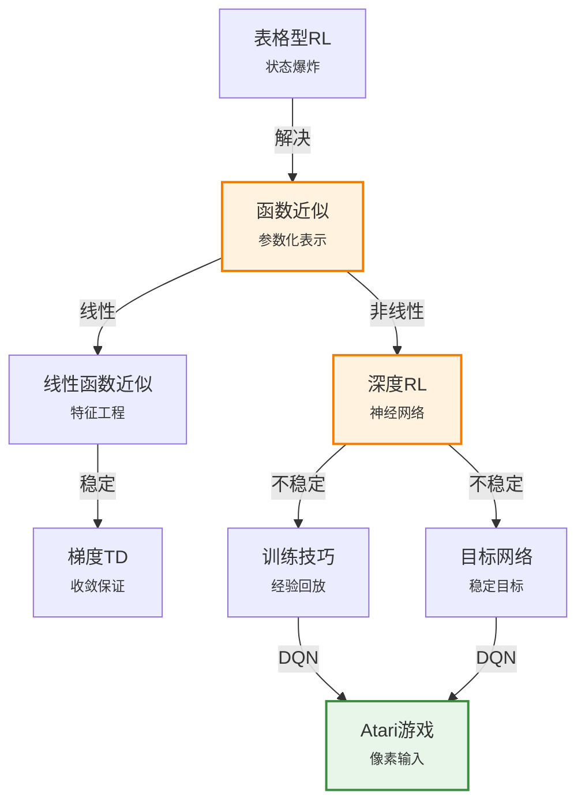

# 22.4 强化学习中的泛化

> 📖 本节 Deep Dive | 预计学习时间: 100 分钟

---

## 1. 背景与动机

### 1.1 历史背景

**学科演进脉络**

当强化学习面临大规模或连续状态空间时，表格型方法（存储每个状态的Q值）变得不可行。函数近似（Function Approximation）技术应运而生，它使用参数化函数来近似价值函数，使得智能体能够泛化到未访问过的状态。

函数近似在RL中的应用可以追溯到20世纪50年代Samuel的跳棋程序，但真正的发展始于20世纪90年代。Tesauro的TD-Gammon（1992）使用神经网络近似价值函数，在西洋双陆棋上达到世界冠军水平，证明了函数近似的强大潜力。

2013年，DeepMind的DQN（Deep Q-Network）将深度强化学习带入主流视野，证明了深度神经网络可以作为有效的函数近似器，从原始像素输入学习玩Atari游戏。

**里程碑事件**:

| 年份 | 人物/事件 | 贡献 | 影响 |
|------|-----------|------|------|
| 1959 | Samuel | 跳棋程序的函数近似 | 最早的函数近似应用 |
| 1992 | Tesauro | TD-Gammon | 神经网络+TD的成功应用 |
| 1997 | Tsitsiklis & Van Roy | 线性函数近似理论 | 收敛性理论分析 |
| 2013 | Mnih et al. | DQN | 深度强化学习时代开启 |
| 2015 | DQN Nature论文 | 经验回放、目标网络 | 训练稳定性技术 |

**演进动机**:
- 早期方法: 表格型方法无法处理大规模状态空间
- 局限性: 状态数呈指数增长（维度灾难）
- 突破: 函数近似使泛化成为可能

### 1.2 研究动机

**为什么研究者关注这个主题？**

1. **规模问题**: 现实世界问题（如围棋10^170状态、机器人连续状态）无法使用表格方法

2. **泛化能力**: 函数近似允许智能体从已访问状态泛化到未访问状态

3. **端到端学习**: 深度神经网络可以从原始感知（图像、传感器数据）直接学习，无需人工特征工程

**与其他领域的关系**:
- 与监督学习: 函数近似本质上是将RL问题转化为监督学习问题
- 与深度学习: 深度网络提供了强大的非线性函数近似能力

### 1.3 实际应用场景

| 应用领域 | 具体问题 | 本节理论的作用 | 预期效果 |
|----------|----------|----------------|----------|
| 游戏AI | 从原始像素学习玩Atari | DQN | 超越人类水平 |
| 机器人控制 | 连续状态-动作空间 | 策略梯度+神经网络 | 复杂运动技能 |
| 自动驾驶 | 从摄像头图像学习驾驶 | 深度RL | 端到端控制 |
| 推荐系统 | 大规模用户-物品空间 | 嵌入+神经网络 | 个性化推荐 |

**典型案例预览**:
> 想象一个机器人在迷宫中导航。表格型方法需要为迷宫的每个位置存储Q值。但如果使用神经网络，网络可以学习到"靠近目标的位置价值高"这样的抽象概念，从而泛化到整个迷宫，即使某些位置从未访问过。

### 1.4 先决条件

**学习本节需要的前置知识**:

| 知识项 | 来源 | 掌握程度要求 | 关键概念 |
|--------|------|:------------:|----------|
| Q学习 | 22.3节 | 必须熟练掌握 | 动作价值函数 |
| 神经网络 | 第21章 | 理解即可 | 前向传播、反向传播 |
| 梯度下降 | 第19章 | 理解即可 | 参数更新 |
| 函数近似 | 第19章 | 了解 | 特征映射 |

**前置检查清单**:
- [ ] 理解Q学习的更新规则
- [ ] 了解神经网络的基本结构
- [ ] 理解梯度下降优化

---

## 2. 知识逻辑图谱

### 2.1 概念关系图



### 2.2 知识发展依赖链

```
【基础层】           【发展层】              【高潮层】             【应用层】
    ↓                   ↓                     ↓                   ↓
┌─────────┐      ┌─────────────┐       ┌───────────┐      ┌──────────┐
│ 表格型  │ ──→  │  线性函数   │  ──→  │  深度RL   │ ──→  │   DQN    │
│   Q学习 │      │   近似      │       │           │      │ AlphaGo  │
│         │      │  特征提取   │       │  深度网络  │      │ 机器人   │
│ 精确值  │      │  梯度TD     │       │  端到端    │      │  控制    │
└─────────┘      └─────────────┘       └───────────┘      └──────────┘
     │                   │                   │                │
     └───────────────────┴───────────────────┴────────────────┘
                         知识演进脉络
```

### 2.3 本节在章节中的位置

```
第 22 章: 强化学习
├── 22.3 主动强化学习 ← 前置知识
│   └── [核心概念: Q学习、最优策略]
│
├── 22.4 强化学习中的泛化 ← ⭐ 当前位置
│   ├── [核心概念: 函数近似、深度RL]
│   ├── [核心算法: DQN、梯度TD]
│   └── [训练技巧: 经验回放、目标网络]
│
└── 22.5 策略搜索 ← 后续发展
    └── [直接优化策略参数]
```

---

## 3. 核心概念与数学分析

### 3.1 核心术语定义

**定义 22.4.1** (函数近似 / Function Approximation):

> **正式定义**: 使用参数化函数 $\hat{V}(s; \theta)$ 或 $\hat{Q}(s,a; \theta)$ 来近似价值函数，其中 $\theta$ 是可学习参数，参数数量远小于状态空间大小。

**定义详解**:
- **直观解释**: 不再存储每个状态的精确值，而是学习一个"公式"来计算价值
- **数学表述**: 例如线性近似：$\hat{Q}(s,a; \theta) = \theta^T \phi(s,a)$，其中$\phi$是特征向量
- **优势**: 泛化能力——未访问过的状态也能通过函数计算出价值

---

**定义 22.4.2** (特征工程 / Feature Engineering):

> **正式定义**: 设计状态的特征表示 $\phi(s)$，使得线性函数近似能够有效捕获价值函数的结构。

**定义详解**:
- **示例**: 在网格世界中，特征可以是到目标的曼哈顿距离、是否靠近陷阱等
- **重要性**: 好的特征使线性近似也能表现良好
- **局限性**: 需要领域知识，特征设计困难

**常用特征**:
| 特征类型 | 例子 | 适用场景 |
|----------|------|----------|
| 距离特征 | 到目标的欧氏距离 | 导航问题 |
| 二值特征 | 是否在目标附近 | 分类状态 |
| 径向基函数 | RBF核 | 连续状态 |
| 神经网络 | 隐藏层输出 | 原始输入 |

---

**定义 22.4.3** (深度强化学习 / Deep Reinforcement Learning):

> **正式定义**: 使用深度神经网络作为函数近似器的强化学习方法，能够自动从原始高维输入（如图像）学习特征表示。

**定义详解**:
- **核心思想**: 神经网络既学习特征表示，又学习价值函数
- **优势**: 端到端学习，无需人工特征工程
- **挑战**: 训练不稳定、样本效率低、可能发散

---

**定义 22.4.4** (经验回放 / Experience Replay):

> **正式定义**: 存储智能体的转移经验 $(s, a, r, s')$ 在回放缓冲区中，训练时从中随机采样小批量数据进行更新。

**定义详解**:
- **目的**: 
  1. 打破样本相关性（独立同分布假设）
  2. 提高样本效率（同一经验多次使用）
  3. 平滑数据分布变化
- **实现**: 使用固定大小的缓冲区，新经验覆盖旧经验

---

**定义 22.4.5** (目标网络 / Target Network):

> **正式定义**: 使用一个单独的网络（参数更新较慢）来计算TD目标，而不是使用正在训练的网络。

**定义详解**:
- **目的**: 稳定学习目标，避免追逐移动目标
- **更新**: 每隔一定步数将主网络参数复制到目标网络
- **效果**: 显著提高深度Q学习的稳定性

---

### 3.2 符号系统与约定

**本节符号总表**:

| 符号 | 含义 | 数学表达 | 备注 |
|:----:|------|----------|------|
| $\theta$ | 函数参数 | $\mathbb{R}^d$ | 可学习参数向量 |
| $\phi(s)$ | 状态特征 | $\mathbb{R}^n$ | 特征向量 |
| $\hat{Q}_\theta(s,a)$ | 近似Q函数 | $\mathbb{R}$ | 神经网络输出 |
| $\nabla_\theta$ | 关于θ的梯度 | 偏导数向量 | 反向传播计算 |
| $\mathcal{D}$ | 经验回放缓冲 | 转移元组集合 | 存储历史经验 |
| $\theta^-$ | 目标网络参数 | $\mathbb{R}^d$ | 更新较慢 |

### 3.3 关键公式与性质

#### 公式 1: 线性函数近似

**数学表述**:
$$\hat{Q}_\theta(s,a) = \theta^T \phi(s,a) = \sum_{i=1}^n \theta_i \phi_i(s,a)$$

**公式要素解析**:

| 维度 | 内容 |
|------|------|
| **直观解释** | Q值是特征的加权和，权重θ决定每个特征的重要性 |
| **几何意义** | 在特征空间中的线性超平面 |
| **优势** | 简单、可解释、收敛有保证 |

---

#### 公式 2: 梯度TD更新（函数近似）

**数学表述**:
$$\theta \leftarrow \theta + \alpha\left[R + \gamma \hat{Q}_\theta(s',a') - \hat{Q}_\theta(s,a)\right] \nabla_\theta \hat{Q}_\theta(s,a)$$

**公式要素解析**:

| 维度 | 内容 |
|------|------|
| **直观解释** | 沿TD误差的方向调整参数，使Q估计更准确 |
| **梯度计算** | 对于线性近似，$\nabla_\theta \hat{Q} = \phi(s,a)$ |
| **收敛性** | 线性情况下保证收敛；非线性（神经网络）可能发散 |

---

#### 公式 3: DQN损失函数

**数学表述**:
$$L(\theta) = \mathbb{E}_{(s,a,r,s') \sim \mathcal{D}}\left[\left(r + \gamma \max_{a'} \hat{Q}_{\theta^-}(s',a') - \hat{Q}_\theta(s,a)\right)^2\right]$$

**公式要素解析**:

| 维度 | 内容 |
|------|------|
| **目标** | 均方TD误差 |
| **关键区别** | 使用目标网络$\theta^-$计算目标 |
| **采样** | 从经验回放缓冲区均匀采样 |

---

### 3.4 重要性质与推论

**性质 22.4.1** (线性函数近似收敛性):

> **陈述**: 对于线性函数近似，在满足适当条件下（递减学习率、充分探索），梯度TD算法收敛到最小化均方投影贝尔曼误差的参数。

**重要性**: 这是函数近似RL中为数不多的理论保证之一。

**警告**: 非线性函数近似（神经网络）没有这样的收敛保证。

---

**性质 22.4.2** (灾难性遗忘):

> **陈述**: 在使用函数近似的RL中，学习新区域的价值可能导致已经学习好的区域的价值估计变差。

**直观解释**: 神经网络是"全局"近似器，更新一个区域的参数会影响所有区域的输出。

**解决方案**: 经验回放——定期复习旧经验，防止遗忘。

---

## 4. 算法详解

### 4.1 线性函数近似TD

**算法思想**: 使用线性组合近似Q函数

```
算法: 线性Q学习
输入: 状态s，动作a，奖励r，下一状态s'
参数: 学习率α，折扣因子γ

// 特征提取
φ ← φ(s, a)       // 当前特征
φ' ← φ(s', argmax_a' θ^T φ(s', a'))  // 下一状态最优动作特征

// 计算TD目标
target ← r + γ · θ^T φ'

// 计算预测
prediction ← θ^T φ

// 梯度更新
θ ← θ + α · (target - prediction) · φ
```

**算法分析**:
- **优点**: 收敛有保证，简单高效
- **缺点**: 需要好的特征设计，表达能力有限

### 4.2 DQN算法

**算法思想**: 使用深度神经网络+经验回放+目标网络

```
算法: Deep Q-Network (DQN)
初始化: 网络参数θ，目标网络θ^- = θ，回放缓冲区D = ∅

对每个回合:
    获得初始状态s_1
    
    对t = 1, T:
        // ε-贪婪选择动作
        以ε概率随机选择a_t，否则 a_t = argmax_a Q(s_t, a; θ)
        
        // 执行动作，观测奖励和下一状态
        执行a_t，获得r_t和s_{t+1}
        
        // 存储经验
        D ← D ∪ {(s_t, a_t, r_t, s_{t+1})}
        
        // 训练
        从D中随机采样小批量经验
        对每个(s_j, a_j, r_j, s_{j+1}):
            如果s_{j+1}是终止状态:
                y_j = r_j
            否则:
                y_j = r_j + γ · max_a' Q(s_{j+1}, a'; θ^-)
        
        // 梯度下降
        损失 L = (1/N) Σ_j (y_j - Q(s_j, a_j; θ))^2
        使用SGD更新θ
        
        // 定期更新目标网络
        每隔C步: θ^- ← θ
        
        s_t ← s_{t+1}
```

**关键技巧解释**:

1. **经验回放**: 
   - 打破样本时间相关性
   - 提高样本效率
   - 通常使用最近N条经验（如100万）

2. **目标网络**:
   - 目标$y_j$使用冻结的参数$\theta^-$
   - 每隔C步（如10000步）才更新
   - 稳定学习目标

3. **ε-衰减**:
   - 从ε=1（纯随机）逐渐衰减到ε=0.01
   - 先探索，后利用

**算法分析**:
- **优点**: 
  - 处理高维输入（图像）
  - 端到端学习
  - 在许多Atari游戏上达到人类水平
- **缺点**: 
  - 样本效率低（需要数百万帧）
  - 可能不稳定
  - 超参数敏感

### 4.3 奖励塑形 (Reward Shaping)

**问题**: 稀疏奖励导致学习困难

**解决方案**: 添加辅助奖励引导学习

**势函数奖励塑形**:
$$R'(s,a,s') = R(s,a,s') + \gamma \Phi(s') - \Phi(s)$$

其中$\Phi(s)$是势函数（如到目标的距离）。

**关键性质**: 这种奖励塑形不改变最优策略！

**示例**:
- 迷宫导航: 势函数 = -到目标的曼哈顿距离
- 机器人行走: 势函数 = 前进距离

### 4.4 分层强化学习 (HRL)

**核心思想**: 将复杂任务分解为层次化的子任务

**优势**:
- 降低长期信用分配的难度
- 抽象化动作（宏动作）
- 迁移学习——子策略可复用

**实现**: 使用局部程序（partial program）定义行为结构，学习选择点上的决策。

---

## 5. 具体示例与详解

### 5.1 线性函数近似示例

**示例 22.4.1**: 4×3世界的线性近似

**📋 问题陈述**:

在4×3世界中使用线性函数近似Q函数：
- 状态s = (x, y)
- 动作a ∈ {Up, Down, Left, Right}
- 特征设计: $\phi(s,a) = [1, x, y, a_{one-hot}]^T$

**求解**: 展示参数更新过程

---

**🔍 解答过程**:

**步骤 1: 特征设计**

对于状态(2,3)和动作Right:
$$\phi(s, a) = [1, 2, 3, 0, 0, 1, 0]^T$$
其中最后4维是动作的one-hot编码（Right是第3个动作）

**步骤 2: 参数初始化**

$$\theta = [0, 0, 0, 0, 0, 0, 0]^T$$

**步骤 3: 观测转移并更新**

观测: 从(2,3)执行Right到达(3,3)，r = -0.04

计算TD目标:
- 下一状态(3,3)，假设当前估计Q((3,3), Right) ≈ 0.1
- target = -0.04 + 1 × 0.1 = 0.06

计算预测:
- prediction = $\theta^T \phi(s,a)$ = 0

计算TD误差:
- δ = 0.06 - 0 = 0.06

梯度更新（α = 0.1）:
- $\nabla_\theta Q = \phi = [1, 2, 3, 0, 0, 1, 0]^T$
- $\theta \leftarrow \theta + 0.1 \times 0.06 \times \phi$
- $\theta = [0.006, 0.012, 0.018, 0, 0, 0.006, 0]^T$

**步骤 4: 泛化效果**

现在估计Q((2,2), Right):
$$\hat{Q} = \theta^T [1, 2, 2, 0, 0, 1, 0] = 0.006 + 0.024 + 0.036 + 0.006 = 0.072$$

虽然(2,2)从未被访问，但通过线性近似得到了估计值！

---

### 5.2 深度Q学习示例

**示例 22.4.2**: CartPole问题的DQN

**场景**: 经典的控制问题，状态是连续的4维向量（位置、速度、角度、角速度）

**DQN架构**:
```
输入: 4维状态
隐藏层1: 128神经元，ReLU
隐藏层2: 128神经元，ReLU
输出: 2维（Left和Right的Q值）
```

**训练过程**:
1. 收集经验存入回放缓冲区
2. 每步从缓冲区采样32条经验
3. 计算损失: $(r + \gamma \max Q(s', a'; \theta^-) - Q(s, a; \theta))^2$
4. 反向传播更新网络
5. 每1000步更新目标网络

**收敛**: 通常几百个回合后能够稳定保持杆不倒

### 5.3 类比与可视化

**直觉类比**:

| 抽象概念 | 日常类比 | 对应关系 |
|----------|----------|----------|
| 表格型RL | 查字典 | 每个词有精确定义 |
| 函数近似 | 学习语言规则 | 根据规则推断生词含义 |
| 神经网络 | 大脑学习 | 自动提取模式，泛化到新情况 |
| 经验回放 | 复习笔记 | 定期回顾旧知识防止遗忘 |
| 目标网络 | 稳定的参考答案 | 学习目标不频繁变化 |

---

## 6. 深入理解与拓展

### 6.1 一句话本质

> 🎯 **核心要点**: 函数近似通过参数化表示解决状态空间爆炸问题，使强化学习能够泛化到未访问状态；深度强化学习进一步使用神经网络自动学习特征表示，实现端到端的从高维输入到决策的学习。

### 6.2 深入思考问题

1. **概念层面**: 为什么线性函数近似有收敛保证，而非线性函数近似（神经网络）可能没有？
   <!-- 思考方向: 线性函数的贝尔曼算子性质，非线性的多重局部最优 -->

2. **方法层面**: 经验回放为什么能稳定训练？如果没有经验回放会有什么问题？
   <!-- 思考方向: 样本相关性、数据分布变化、非平稳性 -->

3. **应用层面**: 在设计DQN时，如何确定网络结构（层数、神经元数）？
   <!-- 思考方向: 问题复杂度、计算资源、经验法则、超参数搜索 -->

4. **拓展层面**: 奖励塑形如何保证不改变最优策略？你能证明吗？
   <!-- 思考方向: 势函数的差分形式，最优Q函数的变换不变性 -->

### 6.3 与其他节的关系

**本节输出**:
- 处理大规模状态空间的能力
- DQN算法框架
- 深度RL训练技巧

**后续发展预告**: 在22.5节中，我们将学习另一种处理连续动作空间的方法——策略搜索。

---

## 7. 总结与反思

### 7.1 关键要点总结

本节必须掌握的 **6** 个核心要点:

1. **函数近似动机**: 表格型方法无法处理大规模状态空间（维度灾难）
   
   💡 *记忆技巧*: 状态数指数增长，参数数固定

2. **线性函数近似**: $\hat{Q}(s,a) = \theta^T \phi(s,a)$
   
   💡 *记忆技巧*: 特征的加权和

3. **梯度TD更新**: $\theta \leftarrow \theta + \alpha \cdot \delta \cdot \nabla Q$
   
   💡 *记忆技巧*: TD误差×梯度，沿梯度方向调整

4. **DQN三大技巧**: 
   - 经验回放（打破相关性）
   - 目标网络（稳定目标）
   - ε-衰减（探索→利用）
   
   💡 *记忆技巧*: "回放-目标-探索"

5. **奖励塑形**: $R' = R + \gamma\Phi(s') - \Phi(s)$不改变最优策略
   
   💡 *记忆技巧*: 势函数的差分形式

6. **灾难性遗忘**: 函数近似可能遗忘旧知识，经验回放是解决之道
   
   💡 *记忆技巧*: 定期复习防止遗忘

### 7.2 本节知识框架

```
┌─────────────────────────────────────────────────────────────┐
│  第22.4节: 强化学习中的泛化                                  │
├─────────────────────────────────────────────────────────────┤
│  输入/前置                                                   │
│  • Q学习基础                                                │
│  • 神经网络基础                                             │
│  • 大规模状态空间问题                                       │
│                                                             │
│  处理/核心                                                   │
│  • 线性函数近似（特征工程）                                 │
│  • 深度函数近似（神经网络）                                 │
│  • DQN训练技巧（经验回放、目标网络）                        │
│  • 奖励塑形与分层RL                                         │
│  ↓                                                          │
│  输出/结果                                                   │
│  • 处理高维/连续状态的能力                                  │
│  • 端到端学习能力                                           │
│                                                             │
│  应用/价值                                                   │
│  • Atari游戏                                                │
│  • 连续控制                                                 │
│  • 自动驾驶                                                 │
└─────────────────────────────────────────────────────────────┘
```

### 7.3 常见误解与纠正

| 常见误解 ❌ | 正确理解 ✅ | 为什么容易错 | 如何避免 |
|-------------|-------------|--------------|----------|
| ❌ 函数近似总是比表格型好 | ✅ 各有优劣，小问题上表格型更精确 | 被深度学习的 hype 影响 | 根据问题规模选择 |
| ❌ DQN训练不稳定是因为网络太复杂 | ✅ 主要是目标函数的非平稳性 | 忽视TD目标的动态变化 | 使用目标网络稳定目标 |
| ❌ 经验回放只是存储更多数据 | ✅ 关键是打破样本相关性+重复使用 | 误解回放的核心作用 | 理解IID假设的重要性 |
| ❌ 奖励塑形可以随意添加 | ✅ 必须是势函数形式才保持最优策略 | 不了解理论保证 | 学习势函数奖励塑形 |

### 7.4 反思问题

**连接性问题**:
1. 函数近似如何与22.2节的TD学习结合？（提示: 梯度TD）
2. DQN的目标网络与22.3节的Q学习有什么联系？

**应用性问题**:
1. 对于一个新任务，你会如何设计DQN的网络结构？
2. 在什么情况下你会选择线性函数近似而非深度网络？

**批判性问题**:
1. DQN的样本效率问题有什么解决方案？（提示: 基于模型的方法、多步回报）
2. 函数近似的"灾难性遗忘"与人类的遗忘有什么异同？

### 7.5 学习检查清单

- [ ] 理解函数近似解决的核心问题
- [ ] 能够写出线性函数近似的Q函数形式
- [ ] 能够推导梯度TD更新规则
- [ ] 理解DQN的三大关键技巧
- [ ] 了解经验回放的作用和实现
- [ ] 理解目标网络的作用
- [ ] 知道奖励塑形的势函数形式
- [ ] 了解分层RL的基本思想

---

## 附录

### A. 公式速查表

| 公式 | 名称 | 使用条件 | 备注 |
|:----:|------|----------|------|
| $$\hat{Q}_\theta(s,a) = \theta^T\phi(s,a)$$ | 线性近似 | 有特征设计 | 简单可解释 |
| $$\theta \leftarrow \theta + \alpha\delta\nabla_\theta Q$$ | 梯度TD | 函数近似 | δ是TD误差 |
| $$L = \mathbb{E}[(y - Q(s,a;\theta))^2]$$ | DQN损失 | 深度RL | y来自目标网络 |
| $$R' = R + \gamma\Phi(s') - \Phi(s)$$ | 奖励塑形 | 稀疏奖励 | 不改变最优策略 |

### B. 术语索引

| 术语 | 英文 | 定义 | 位置 |
|------|------|------|:----:|
| 函数近似 | Function Approximation | 参数化价值函数 | 22.4.1 |
| 特征工程 | Feature Engineering | 设计状态特征 | 22.4.2 |
| 深度RL | Deep RL | 神经网络作为近似器 | 22.4.3 |
| 经验回放 | Experience Replay | 存储和重用经验 | 22.4.4 |
| 目标网络 | Target Network | 稳定学习目标 | 22.4.5 |
| 灾难性遗忘 | Catastrophic Forgetting | 学习新知识遗忘旧知识 | 本节 |

### C. 延伸阅读

**理论深化**:
- Tsitsiklis & Van Roy (1997): 线性函数近似分析
- Mnih et al. (2015) "Human-level control through deep RL": DQN原始论文

**应用拓展**:
- Silver et al. (2016) "Mastering Go": AlphaGo
- Levine et al. (2016) "End-to-end training of deep visuomotor policies"

---

> 📌 **下一节**: [22.5 策略搜索](22.5_策略搜索.md)
> 
> 📚 **返回概览**: [第22章概览](../00_概览.md)
