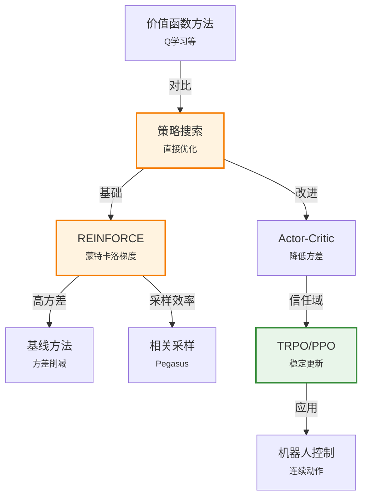

# 22.5 策略搜索

> 📖 本节 Deep Dive | 预计学习时间: 80 分钟

---

## 1. 背景与动机

### 1.1 历史背景

**学科演进脉络**

策略搜索（Policy Search）代表了强化学习的另一条主线——直接优化策略，而不是先学习价值函数。这种方法在连续控制和高维动作空间问题中具有独特优势。

策略搜索的思想可以追溯到20世纪90年代，Williams (1992) 提出的REINFORCE算法奠定了策略梯度方法的理论基础。与价值函数方法相比，策略搜索直接参数化策略，通过梯度上升优化策略性能，天然适合连续动作空间。

2000年后，随着机器人技术的发展，策略搜索在连续控制任务中展现出强大能力。Peters & Schaal (2006) 的自然策略梯度，以及后续的TRPO (Schulman et al., 2015) 和PPO算法，显著提高了策略搜索的稳定性和样本效率。

**里程碑事件**:

| 年份 | 人物/事件 | 贡献 | 影响 |
|------|-----------|------|------|
| 1992 | Williams | REINFORCE算法 | 策略梯度奠基 |
| 2000 | Ng & Jordan | Pegasus算法 | 相关采样减少方差 |
| 2006 | Peters & Schaal | 自然策略梯度 | 考虑参数空间几何 |
| 2015 | Schulman et al. | TRPO算法 | 信赖域优化，稳定性提升 |
| 2017 | Schulman et al. | PPO算法 | 简单高效的策略优化 |

**演进动机**:
- 价值函数方法: 在离散动作空间中效果好
- 局限性: 连续动作空间难以使用max操作
- 突破: 直接优化策略，天然适合连续控制

### 1.2 研究动机

**为什么研究者关注这个主题？**

1. **连续动作空间**: 机器人控制、自动驾驶等问题中动作是连续的（如转向角度、油门），价值函数方法难以处理

2. **随机策略**: 策略搜索天然支持随机策略，在某些任务中随机策略比确定性策略更优

3. **收敛性**: 策略梯度有明确的优化目标，收敛行为更可预测

**与其他领域的关系**:
- 与优化理论: 策略搜索本质上是随机优化问题
- 与控制理论: 与最优控制、模型预测控制有密切联系

### 1.3 实际应用场景

| 应用领域 | 具体问题 | 本节理论的作用 | 预期效果 |
|----------|----------|----------------|----------|
| 机器人控制 | 机械臂抓取、步态控制 | 策略梯度 | 连续平滑的动作 |
| 自动驾驶 | 端到端驾驶 | 策略搜索+模仿学习 | 流畅的驾驶行为 |
| 游戏AI | 物理模拟游戏 | PPO、TRPO | 自然的运动策略 |
| 对话系统 | 策略优化 | 策略梯度 | 连贯的对话流程 |

**典型案例预览**:
> 一个四足机器人学习行走。动作空间是12个关节的扭矩（连续值），难以使用Q学习。策略搜索方法可以直接优化策略参数，使机器人学会自然流畅的步态。

### 1.4 先决条件

**学习本节需要的前置知识**:

| 知识项 | 来源 | 掌握程度要求 | 关键概念 |
|--------|------|:------------:|----------|
| 随机梯度下降 | 第19章 | 必须熟练掌握 | 梯度、参数更新 |
| 期望计算 | 附录A | 理解即可 | 期望、方差 |
| 重要性采样 | 第14章 | 了解 | 采样比率 |
| 信赖域优化 | 外部 | 了解 | 约束优化 |

---

## 2. 知识逻辑图谱

### 2.1 概念关系图



### 2.2 本节在章节中的位置

```
第 22 章: 强化学习
├── 22.4 强化学习中的泛化 ← 前置知识
│   └── [核心概念: 函数近似、深度RL]
│
├── 22.5 策略搜索 ← ⭐ 当前位置
│   ├── [核心概念: 策略梯度、REINFORCE]
│   ├── [核心算法: Actor-Critic、TRPO/PPO]
│   └── [方差削减技术]
│
└── 22.6 学徒学习 ← 后续发展
    └── [从专家演示学习]
```

---

## 3. 核心概念与数学分析

### 3.1 核心术语定义

**定义 22.5.1** (策略搜索 / Policy Search):

> **正式定义**: 直接参数化策略 $\pi_\theta(a|s)$，通过优化策略性能指标 $J(\theta)$ 来找到最优策略参数 $\theta^*$。

**定义详解**:
- **直观解释**: 不学习"这个状态值多少钱"，直接学习"在这个状态下应该做什么"
- **数学表述**: $\theta^* = \arg\max_\theta J(\theta) = \arg\max_\theta \mathbb{E}[G|\pi_\theta]$
- **优势**: 连续动作空间、随机策略、更好的收敛性

---

**定义 22.5.2** (策略梯度 / Policy Gradient):

> **正式定义**: 策略性能关于参数的梯度 $\nabla_\theta J(\theta)$，用于指导参数更新方向。

**定义详解**:
- **关键公式**: $\nabla_\theta J(\theta) = \mathbb{E}[G \nabla_\theta \log \pi_\theta(a|s)]$
- **直观解释**: 好的回合（高回报）增强所采取动作的概率，差的回合降低
- **推导基础**: 对数导数技巧（log-derivative trick）

---

**定义 22.5.3** (随机策略 / Stochastic Policy):

> **正式定义**: 策略输出动作的概率分布 $\pi_\theta(a|s)$，而非确定性动作。

**定义详解**:
- **必要性**: 保证对参数可微，使得梯度方法适用
- **Softmax策略**: $\pi_\theta(a|s) = \frac{\exp(\beta Q_\theta(s,a))}{\sum_{a'}\exp(\beta Q_\theta(s,a'))}$
- **高斯策略**: 连续动作常用，$\pi_\theta(a|s) = \mathcal{N}(\mu_\theta(s), \sigma_\theta(s))$

---

**定义 22.5.4** (Actor-Critic):

> **正式定义**: 结合策略梯度（Actor）和价值函数估计（Critic）的方法，Critic估计价值函数用于减少梯度方差。

**定义详解**:
- **Actor**: 策略网络，决定动作
- **Critic**: 价值网络，评估动作好坏
- **优势**: 降低方差，提高样本效率

---

### 3.2 关键公式

#### 公式 1: 策略梯度定理

**数学表述**:
$$\nabla_\theta J(\theta) = \mathbb{E}_{\pi_\theta}[\sum_{t=0}^{T} \nabla_\theta \log \pi_\theta(a_t|s_t) \cdot G_t]$$

**公式要素解析**:

| 维度 | 内容 |
|------|------|
| **直观解释** | 高回报的回合，增强所采取动作的概率 |
| **对数导数技巧** | $\nabla p = p \nabla \log p$，将概率转换为对数概率的梯度 |
| **蒙特卡洛估计** | 使用实际观测的回报G估计期望 |

---

#### 公式 2: REINFORCE算法

**数学表述**:
$$\theta \leftarrow \theta + \alpha \sum_{t=0}^{T} \nabla_\theta \log \pi_\theta(a_t|s_t) G_t$$

**公式要素解析**:

| 维度 | 内容 |
|------|------|
| **特点** | 简单的蒙特卡洛策略梯度 |
| **问题** | 高方差，需要大量样本 |
| **改进方向** | 使用基线减少方差 |

---

#### 公式 3: Actor-Critic梯度

**数学表述**:
$$\nabla_\theta J(\theta) = \mathbb{E}[\nabla_\theta \log \pi_\theta(a|s) \cdot A(s,a)]$$

其中 $A(s,a) = Q(s,a) - V(s)$ 是优势函数。

**公式要素解析**:

| 维度 | 内容 |
|------|------|
| **优势函数** | 衡量动作比平均水平好多少 |
| **方差削减** | 减去状态价值作为基线 |
| **TD误差** | 可以用 $\delta = r + \gamma V(s') - V(s)$ 近似优势 |

---

## 4. 算法详解

### 4.1 REINFORCE算法

**算法思想**: 使用蒙特卡洛回报估计策略梯度

```
算法: REINFORCE
初始化: 策略参数θ

对每个回合:
    根据π_θ生成轨迹: s_0, a_0, r_1, s_1, a_1, ..., s_T
    
    对每个时间步t = 0, 1, ..., T:
        G_t ← Σ_{k=t}^{T} γ^{k-t} r_{k+1}  // 从t开始的累积回报
        
    θ ← θ + α Σ_{t=0}^{T} ∇_θ log π_θ(a_t|s_t) G_t
```

**算法分析**:
- **优点**: 简单、无偏估计
- **缺点**: 高方差、回合结束后才能更新、样本效率低

### 4.2 基线方法 (REINFORCE with Baseline)

**算法思想**: 使用状态价值函数作为基线减少方差

```
算法: REINFORCE with Baseline
初始化: 策略参数θ，价值函数参数w

对每个回合:
    根据π_θ生成轨迹
    
    对每个时间步t:
        G_t ← 从t开始的累积回报
        δ_t ← G_t - V_w(s_t)  // 使用价值函数作为基线
        
    θ ← θ + α Σ_t ∇_θ log π_θ(a_t|s_t) δ_t
    w ← w + β Σ_t δ_t ∇_w V_w(s_t)  // 更新价值函数
```

**方差削减原理**:
- 使用$G_t - V(s_t)$代替$G_t$
- $V(s_t)$是$G_t$的估计，两者相减降低方差
- 不改变梯度的期望（无偏）

### 4.3 Actor-Critic算法

**算法思想**: 在线学习，每步都更新

```
算法: Actor-Critic
初始化: 策略网络参数θ，价值网络参数w

对每个回合:
    s ← 初始状态
    
    while s不是终止状态:
        a ~ π_θ(·|s)  // 按策略采样动作
        执行a，获得r和s'
        
        δ ← r + γV_w(s') - V_w(s)  // TD误差作为优势估计
        
        // 更新Critic（价值函数）
        w ← w + β δ ∇_w V_w(s)
        
        // 更新Actor（策略）
        θ ← θ + α δ ∇_θ log π_θ(a|s)
        
        s ← s'
```

**算法分析**:
- **优点**: 在线更新、方差较低、样本效率较高
- **缺点**: 偏差-方差权衡、需要仔细设计网络结构

### 4.4 信赖域方法 (TRPO/PPO)

**问题**: 策略梯度的大步长更新可能破坏策略性能

**TRPO思想**: 限制策略更新的幅度，确保新策略不会太差

**约束优化**:
$$\max_\theta \mathbb{E}[\frac{\pi_\theta(a|s)}{\pi_{\theta_{old}}(a|s)} A(s,a)]$$
$$\text{约束: } KL(\pi_{\theta_{old}} || \pi_\theta) \leq \delta$$

**PPO简化**: 使用裁剪目标替代复杂的约束

```
PPO-Clip目标:
L^{CLIP}(θ) = E[min(r_t(θ)A_t, clip(r_t(θ), 1-ε, 1+ε)A_t)]

其中 r_t(θ) = π_θ(a_t|s_t) / π_{θ_old}(a_t|s_t)
```

**算法优势**:
- 训练稳定，超参数不敏感
- 实现简单，性能优异
- 成为连续控制任务的默认选择

---

## 5. 具体示例与详解

### 5.1 简单策略梯度示例

**示例 22.5.1**: 单状态问题的策略优化

**场景**: 
- 只有一个状态s
- 两个动作：Left, Right
- 参数化策略: $\pi_\theta(Left) = \sigma(\theta) = \frac{1}{1+e^{-\theta}}$, $\pi_\theta(Right) = 1 - \sigma(\theta)$
- 奖励: Left = +1, Right = -1

**求解**: 计算策略梯度并更新

---

**🔍 解答过程**:

**步骤 1: 计算对数概率的梯度**

$$\log \pi_\theta(Left) = \log \sigma(\theta) = -\log(1+e^{-\theta})$$
$$\nabla_\theta \log \pi_\theta(Left) = 1 - \sigma(\theta) = \pi_\theta(Right)$$

同理:
$$\nabla_\theta \log \pi_\theta(Right) = -\sigma(\theta) = -\pi_\theta(Left)$$

**步骤 2: 策略梯度**

假设采样得到Left，回报G = 1:
$$\nabla_\theta J = G \cdot \nabla_\theta \log \pi_\theta(Left) = 1 \cdot \pi_\theta(Right) > 0$$

如果采样得到Right，回报G = -1:
$$\nabla_\theta J = (-1) \cdot (-\pi_\theta(Left)) = \pi_\theta(Left) > 0$$

**步骤 3: 参数更新**

无论得到什么回报，梯度都指向增加Left概率的方向！
$$\theta \leftarrow \theta + \alpha \cdot \nabla_\theta J$$

**步骤 4: 收敛**

随着更新，$\pi_\theta(Left) \to 1$，$\pi_\theta(Right) \to 0$，策略收敛到总是选择Left。

---

### 5.2 方差问题示例

**示例 22.5.2**: 为什么需要基线？

**场景**: 
- 游戏有随机奖励，回报G ∈ [90, 110]
- 两个动作，真实价值Q(a1) = 100, Q(a2) = 101

**问题**: 
- 如果只用G作为目标，方差很大（约100）
- 难以区分两个动作的好坏

**基线解决方案**:
- 使用状态价值V(s) ≈ 100.5作为基线
- 优势A(a1) ≈ -0.5, A(a2) ≈ 0.5
- 方差大幅降低，更容易区分动作

**教训**: 基线不改变期望，但大幅降低方差，加速学习。

---

## 6. 总结与反思

### 6.1 关键要点总结

本节必须掌握的 **5** 个核心要点:

1. **策略搜索动机**: 连续动作空间、随机策略需求
   
   💡 *记忆技巧*: 价值函数方法做不了连续动作max

2. **策略梯度**: $\nabla J = \mathbb{E}[G \nabla \log \pi_\theta(a|s)]$
   
   💡 *记忆技巧*: 好回报→增强该动作，坏回报→减弱

3. **REINFORCE**: 蒙特卡洛策略梯度，简单但高方差
   
   💡 *记忆技巧*: 回合结束才更新，用完整回报

4. **Actor-Critic**: 在线更新，使用TD误差降低方差
   
   💡 *记忆技巧*: Actor做决策，Critic给反馈

5. **TRPO/PPO**: 信赖域约束保证稳定更新
   
   💡 *记忆技巧*: 步子别迈太大，PPO用裁剪更简单

### 6.2 常见误解与纠正

| 常见误解 ❌ | 正确理解 ✅ | 为什么容易错 | 如何避免 |
|-------------|-------------|--------------|----------|
| ❌ 策略搜索不需要价值函数 | ✅ Actor-Critic结合两者优势 | 只看REINFORCE | 理解Actor-Critic架构 |
| ❌ 策略梯度无偏所以更好 | ✅ 无偏但高方差，需要权衡 | 混淆无偏和低方差 | 理解偏差-方差权衡 |
| ❌ PPO总是最佳选择 | ✅ 根据任务选择，DQN在离散动作上可能更好 | 盲目跟随最新算法 | 理解算法适用条件 |

### 6.3 学习检查清单

- [ ] 理解策略搜索与价值函数方法的区别
- [ ] 能够推导策略梯度公式（对数导数技巧）
- [ ] 理解REINFORCE算法
- [ ] 理解基线方法减少方差的原理
- [ ] 了解Actor-Critic架构
- [ ] 知道TRPO/PPO的基本思想

---

## 附录

### A. 公式速查表

| 公式 | 名称 | 使用条件 | 备注 |
|:----:|------|----------|------|
| $$\nabla J = \mathbb{E}[G \nabla \log \pi_\theta]$$ | 策略梯度 | 策略搜索 | 核心公式 |
| $$\theta \leftarrow \theta + \alpha G \nabla \log \pi_\theta$$ | REINFORCE | 蒙特卡洛 | 回合更新 |
| $$\nabla J = \mathbb{E}[A \nabla \log \pi_\theta]$$ | Actor-Critic | 在线学习 | 用优势函数 |

### B. 延伸阅读

**理论深化**:
- Williams (1992) "Simple statistical gradient-following algorithms"
- Schulman et al. (2015) "Trust Region Policy Optimization"

---

> 📌 **下一节**: [22.6 学徒学习与逆强化学习](22.6_学徒学习与逆强化学习.md)
> 
> 📚 **返回概览**: [第22章概览](../00_概览.md)
