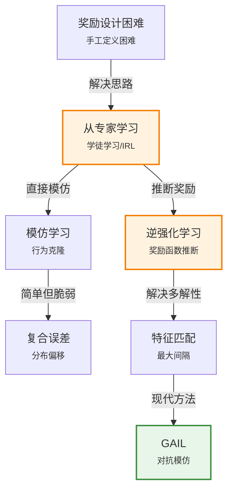

# 22.6 学徒学习与逆强化学习

> 📖 本节 Deep Dive | 预计学习时间: 70 分钟

---

## 1. 背景与动机

### 1.1 历史背景

**学科演进脉络**

在很多实际问题中，定义奖励函数是极其困难的。例如，自动驾驶汽车应该避免什么行为？仅仅是碰撞吗？突然刹车是否也应该惩罚？如何权衡乘客舒适度和行驶效率？

学徒学习（Apprenticeship Learning）和逆强化学习（Inverse Reinforcement Learning, IRL）提供了一种解决方案：不手工设计奖励函数，而是从专家示范中学习。

模仿学习（Imitation Learning）的历史可以追溯到1992年的Sammut等人在飞行模拟器中的工作。逆强化学习的概念由Russell (1998) 提出，Ng & Russell (2000) 开发了第一个IRL算法。Abbeel & Ng (2004) 的特征匹配算法使IRL在复杂任务中实用化。

近年来，IRL与生成对抗网络（GAN）的结合产生了生成对抗模仿学习（GAIL），显著提高了模仿学习的性能。

**里程碑事件**:

| 年份 | 人物/事件 | 贡献 | 影响 |
|------|-----------|------|------|
| 1992 | Sammut et al. | 行为克隆/模仿学习 | 最早的模仿学习 |
| 1998 | Russell | 逆强化学习概念 | 理论框架提出 |
| 2000 | Ng & Russell | 第一个IRL算法 | IRL算法奠基 |
| 2004 | Abbeel & Ng | 特征匹配算法 | 实用化IRL |
| 2016 | Ho & Ermon | GAIL | IRL+GAN结合 |

**演进动机**:
- 手工奖励设计困难且容易出错
- 专家示范容易获得但难以解释
- 突破: 从行为推断意图

### 1.2 研究动机

**为什么研究者关注这个主题？**

1. **奖励设计困难**: 复杂任务（如驾驶、家务）的奖励函数难以明确定义

2. **专家知识传承**: 人类专家可以将技能"示范"给机器，而无需编程

3. **安全性**: 从专家示范学习可能比随机探索更安全

**与其他领域的关系**:
- 与监督学习: 模仿学习可以看作是从专家数据中学习
- 与博弈论: 教学中存在教师-学生的博弈交互

### 1.3 实际应用场景

| 应用领域 | 具体问题 | 本节理论的作用 | 预期效果 |
|----------|----------|----------------|----------|
| 自动驾驶 | 学习人类驾驶风格 | 逆强化学习 | 自然安全的驾驶 |
| 机器人 | 学习操作技能 | 模仿学习 | 快速掌握复杂任务 |
| 游戏AI | 学习人类玩家风格 | GAIL | 类人的游戏行为 |
| 医疗决策 | 学习医生决策模式 | IRL | 可解释的决策逻辑 |

**典型案例预览**:
> 一个家务机器人需要学习如何整理房间。设计一个涵盖所有可能行为的奖励函数几乎不可能。但通过观察人类整理房间的过程，机器人可以推断出"整洁"的含义，并学习如何达到这个目标。

---

## 2. 知识逻辑图谱

### 2.1 概念关系图



---

## 3. 核心概念与数学分析

### 3.1 核心术语定义

**定义 22.6.1** (模仿学习 / Imitation Learning):

> **正式定义**: 也称为行为克隆（Behavior Cloning），将专家的状态-动作对作为监督学习数据，训练策略网络直接模仿专家动作。

**定义详解**:
- **方法**: 监督学习，最小化策略输出与专家动作的误差
- **优点**: 简单直接，训练快速
- **缺点**: 复合误差（distributional shift）——小误差累积导致严重偏离

---

**定义 22.6.2** (逆强化学习 / Inverse RL):

> **正式定义**: 给定专家示范，推断专家所优化的奖励函数，然后在该奖励函数上学习最优策略。

**定义详解**:
- **核心思想**: 奖励函数是对任务最简洁、最鲁棒的描述
- **优势**: 学到的奖励函数可以泛化到新环境
- **挑战**: 多解性——多个奖励函数可以解释同一行为

---

**定义 22.6.3** (特征匹配 / Feature Matching):

> **正式定义**: 找到奖励函数使得学习策略的特征期望与专家策略的特征期望匹配。

**定义详解**:
- **假设**: 奖励函数是特征的线性组合 $R = \theta^T \phi$
- **关键**: 如果特征期望匹配，则期望奖励也匹配
- **算法**: 迭代优化，交替更新奖励参数和学习策略

---

### 3.2 关键公式

#### 公式 1: 行为克隆目标

**数学表述**:
$$\min_\theta \sum_{(s,a) \in \mathcal{D}} \mathcal{L}(\pi_\theta(s), a)$$

其中$\mathcal{D}$是专家示范数据集，$\mathcal{L}$是损失函数（如交叉熵或MSE）。

---

#### 公式 2: 特征期望

**数学表述**:
$$\mu(\pi) = \mathbb{E}\left[\sum_{t=0}^{\infty} \gamma^t \phi(s_t, a_t) \mid \pi\right]$$

**重要性**: 如果$\mu(\pi) = \mu(\pi_E)$，则对于任何线性奖励函数$R = \theta^T \phi$，策略π和专家策略π_E的期望奖励相同。

---

#### 公式 3: 最大间隔IRL

**数学表述**:
$$\max_{\theta} \min_\pi \{\theta^T \mu(\pi_E) - \theta^T \mu(\pi)\}$$

**约束**: $||\theta||_2 \leq 1$

**直观解释**: 找到奖励函数使得专家策略显著优于其他策略。

---

## 4. 算法详解

### 4.1 行为克隆算法

```
算法: 行为克隆
输入: 专家示范数据集 D = {(s_i, a_i)}

重复:
    从D中采样小批量数据
    计算损失 L = Σ L(π_θ(s_i), a_i)
    使用梯度下降更新θ
直到收敛
```

**问题**: 
- 智能体可能进入专家数据分布之外的状态
- 小误差累积导致严重偏离（复合误差）

### 4.2 特征匹配IRL算法

```
算法: 特征匹配IRL
初始化: 策略π^(0)

对迭代i = 1, 2, ...:
    // 求解奖励参数
    求解 θ^(i) 使得专家策略在 θ^(i)·μ(π) 目标下优于所有之前的策略
    
    // 学习新策略
    在奖励 R^(i) = θ^(i)·φ 下学习最优策略 π^(i)
    
    计算 μ(π^(i))
直到收敛
```

### 4.3 GAIL (生成对抗模仿学习)

**核心思想**: 将IRL视为生成对抗网络问题

- **生成器**: 策略网络（生成轨迹）
- **判别器**: 区分专家轨迹和策略轨迹
- **奖励**: 来自判别器的输出

**优势**:
- 避免显式估计奖励函数
- 处理高维连续状态空间
- 与任意RL算法兼容

---

## 5. 具体示例

### 5.1 简单IRL示例

**场景**: 网格世界，专家总是向右移动

**特征**: $\phi(s) = [x, y]$（位置坐标）

**专家特征期望**: $\mu_E = [10, 5]$（假设目标在x=10）

**推断奖励**: 
- 奖励函数$R = \theta_1 x + \theta_2 y$
- 需要$\theta_1 > 0$使得向右移动获得高奖励
- $\theta_2$可以是任意值（y方向不影响专家行为）

**多解性问题**: 不同的$\theta$都可以解释专家行为，IRL需要额外假设（如最大间隔）来选择。

---

## 6. 总结与反思

### 6.1 关键要点总结

本节必须掌握的 **4** 个核心要点:

1. **模仿学习**: 监督学习模仿专家，简单但存在复合误差

2. **逆强化学习**: 从行为推断奖励函数，避免手工设计

3. **特征匹配**: 匹配特征期望使策略与专家表现相当

4. **GAIL**: 结合GAN和IRL，现代模仿学习方法

### 6.2 常见误解与纠正

| 常见误解 ❌ | 正确理解 ✅ | 为什么容易错 | 如何避免 |
|-------------|-------------|--------------|----------|
| ❌ 模仿学习总是有效的 | ✅ 存在分布偏移问题 | 忽视复合误差 | 使用DAgger等改进方法 |
| ❌ IRL可以恢复真实奖励 | ✅ 只能恢复等价类 | 忽视多解性 | 理解奖励函数等价性 |

---

## 附录

### A. 公式速查表

| 公式 | 名称 | 说明 |
|:----:|------|------|
| $$\mu(\pi) = \mathbb{E}[\sum \gamma^t \phi(s_t,a_t)]$$ | 特征期望 | IRL核心概念 |
| $$\min_\pi \theta^T(\mu(\pi_E) - \mu(\pi))$$ | 最大间隔 | 选择奖励函数 |

### B. 延伸阅读

- Abbeel & Ng (2004) "Apprenticeship Learning via IRL"
- Ho & Ermon (2016) "Generative Adversarial Imitation Learning"

---

> 📌 **下一节**: [22.7 强化学习的应用](22.7_强化学习的应用.md)
> 
> 📚 **返回概览**: [第22章概览](../00_概览.md)
