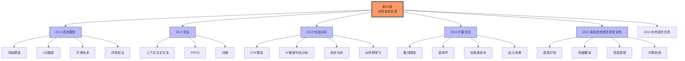

# 第23章 自然语言处理 - 章节概览

## 1. 章节定位与学习目标

### 1.1 在AI知识体系中的位置

```
第7章(逻辑智能体) ──┐
第8章(一阶逻辑) ────┼──→ 第23章(自然语言处理) ──→ 第24章(深度学习NLP)
第14章(概率推理) ──┤
第19章(样例学习) ──┘
```

**前置知识依赖**：
- 概率论基础（第12章、第14章）
- 搜索算法（第3章）
- 机器学习基础（第19章）

**后续发展**：
- 第24章将深入介绍深度学习在自然语言处理中的应用

### 1.2 核心学习目标

| 目标层级 | 具体要求 |
|---------|---------|
| **理解** | 理解语言模型的概念、n元模型、平滑技术、词性标注 |
| **应用** | 能够使用PCFG进行句法分析，理解CYK算法 |
| **分析** | 分析自然语言的歧义性、复杂性，理解扩展文法的必要性 |
| **综合** | 综合运用各种技术解决实际NLP任务 |

---

## 2. 知识图谱



---

## 3. 核心概念地图

### 3.1 从统计到结构的演进

```
┌─────────────────────────────────────────────────────────────┐
│                    自然语言处理的发展层次                      │
├─────────────────────────────────────────────────────────────┤
│  第1层：统计语言模型                                           │
│  ├─ 词袋模型：单词独立假设                                       │
│  ├─ n元模型：局部依赖建模                                        │
│  └─ 平滑技术：处理数据稀疏性                                      │
├─────────────────────────────────────────────────────────────┤
│  第2层：结构语言模型                                           │
│  ├─ PCFG：概率上下文无关文法                                     │
│  ├─ 句法分析：从字符串推导树结构                                  │
│  └─ 扩展文法：处理一致性和语义                                    │
├─────────────────────────────────────────────────────────────┤
│  第3层：真实语言复杂性                                          │
│  ├─ 量词限定、时态                                              │
│  ├─ 语用学、长距离依存                                          │
│  └─ 歧义消解                                                    │
├─────────────────────────────────────────────────────────────┤
│  第4层：应用任务                                               │
│  ├─ 语音识别、文本合成                                          │
│  ├─ 机器翻译、信息提取                                          │
│  └─ 问答系统                                                   │
└─────────────────────────────────────────────────────────────┘
```

### 3.2 关键概念关联图

```
                    ┌─────────────────┐
                    │   自然语言文本    │
                    └────────┬────────┘
                             │
              ┌──────────────┼──────────────┐
              ▼              ▼              ▼
        ┌─────────┐    ┌─────────┐    ┌─────────┐
        │ 词袋模型 │    │ n元模型 │    │ 文法模型 │
        └────┬────┘    └────┬────┘    └────┬────┘
             │              │              │
             ▼              ▼              ▼
        ┌─────────┐    ┌─────────┐    ┌─────────┐
        │ 文本分类 │    │ 语言识别 │    │ 句法分析 │
        │ 情感分析 │    │ 拼写校正 │    │ 语义解释 │
        └─────────┘    └─────────┘    └─────────┘
```

---

## 4. 学习路径建议

### 4.1 循序渐进路线

```
阶段1：基础理解（约3小时）
├── 阅读23.1节：理解语言模型的基本概念
├── 掌握n元模型和平滑技术
└── 完成基础练习题

阶段2：结构分析（约4小时）
├── 阅读23.2-23.3节：理解文法和句法分析
├── 理解CYK算法的工作原理
└── 完成中等难度练习

阶段3：深入拓展（约3小时）
├── 阅读23.4-23.5节：扩展文法和真实语言复杂性
├── 理解语义解释和歧义消解
└── 完成综合练习

阶段4：应用整合（约2小时）
├── 阅读23.6节：了解NLP主要任务
├── 思考不同技术的适用场景
└── 完成挑战练习和自测
```

### 4.2 重点难点分布

| 难度等级 | 内容 | 学习策略 |
|---------|------|---------|
| ⭐⭐ 基础 | 词袋模型、n元模型 | 通过实例理解概念 |
| ⭐⭐⭐ 中等 | 平滑技术、CYK算法 | 动手推导算法步骤 |
| ⭐⭐⭐⭐ 较难 | PCFG、扩展文法 | 结合数学公式理解 |
| ⭐⭐⭐⭐⭐ 挑战 | 语义解释、歧义消解 | 深入阅读文献 |

---

## 5. 章节核心思想

### 5.1 概率范式的统一

本章展示了一个核心思想：**用概率方法统一处理自然语言的模糊性和结构性**。

```
传统方法                      概率方法
─────────                    ─────────
合法/非法  ──────────────→   概率高低
确定规则   ──────────────→   统计规律
精确匹配   ──────────────→   最可能解释
```

### 5.2 形式与统计的融合

```
┌────────────────────────────────────────┐
│           自然语言处理的两种传统          │
├────────────────────────────────────────┤
│  形式语言学        │     统计语言学       │
│  ─────────        │    ─────────        │
│  严格的文法规则     │    从数据中学习      │
│  精确的语义解释     │    概率化的模型      │
│  符号推理          │    模式识别          │
├────────────────────────────────────────┤
│           本章：两者融合               │
│  PCFG = 形式文法 + 概率参数             │
│  扩展文法 = 句法结构 + 语义约束         │
└────────────────────────────────────────┘
```

### 5.3 层次化的语言理解

```
┌────────────────────────────────────┐
│  第5层：语用层 (Pragmatics)         │
│  - 说话者意图、上下文推理            │
├────────────────────────────────────┤
│  第4层：语义层 (Semantics)          │
│  - 逻辑表示、真值条件               │
├────────────────────────────────────┤
│  第3层：句法层 (Syntax)             │
│  - 短语结构、依存关系               │
├────────────────────────────────────┤
│  第2层：词汇层 (Lexicon)            │
│  - 词性、词形变化                   │
├────────────────────────────────────┤
│  第1层：语音/字符层 (Phonology)      │
│  - 音素、字素                       │
└────────────────────────────────────┘
```

---

## 6. 与其他章节的联系

### 6.1 横向联系

| 相关章节 | 联系内容 |
|---------|---------|
| 第7章（逻辑智能体） | 一阶逻辑的语法、语义概念 |
| 第8章（一阶逻辑） | 形式语言的定义、语义解释 |
| 第12章（概率） | 概率论基础、朴素贝叶斯 |
| 第14章（时序概率） | HMM、维特比算法 |
| 第19章（样例学习） | 逻辑斯谛回归、特征工程 |
| 第24章（深度学习NLP） | 神经网络语言模型、Transformer |

### 6.2 纵向演进

```
1950s                    1990s                    2020s
  │                        │                        │
  ▼                        ▼                        ▼
┌────────┐            ┌────────┐            ┌────────┐
│ 规则系统 │    →     │ 统计模型 │    →     │ 深度学习 │
│ SHRDLU │            │ PCFG   │            │ GPT    │
└────────┘            └────────┘            └────────┘
  │                        │                        │
  精确但脆弱              概率化、数据驱动         大规模预训练
  人工编写规则            自动学习参数            上下文理解
```

---

## 7. 一句话总结

> **自然语言处理通过概率语言模型捕捉语言的统计规律，通过形式文法刻画语言的结构特征，在统计与形式的双重驱动下，实现对自然语言的计算理解和生成。**

---

## 8. 预习与复习建议

### 8.1 预习检查清单

- [ ] 复习概率论基础（条件概率、贝叶斯定理）
- [ ] 回顾图搜索算法（A*搜索、动态规划）
- [ ] 了解基本语言学概念（词性、短语结构）

### 8.2 复习自查要点

- [ ] 能解释n元模型的工作原理和局限性
- [ ] 能描述CYK算法的步骤
- [ ] 能区分生成模型和判别模型
- [ ] 能理解扩展文法的必要性
- [ ] 能列举至少3种NLP应用任务
