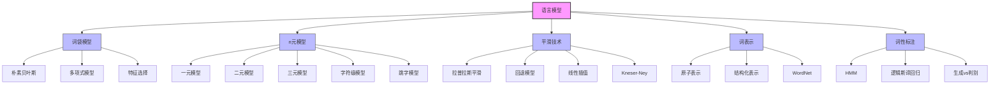

# 23.1 语言模型 - Deep Dive 分析

## 1. 背景与动机

### 1.1 自然语言的复杂性挑战

自然语言处理（Natural Language Processing, NLP）是人工智能领域最具挑战性的研究方向之一。与形式语言（如一阶逻辑）不同，自然语言（如英语、汉语）具有本质上的复杂性和模糊性。这种复杂性主要体现在三个层面：

**第一，合乎文法性的渐变特性**。形式语言通过严格的文法规则定义合法字符串的集合，形成明确的二分边界。然而，自然语言不存在这样清晰的界限。例如，"Not to be invited is sad"被普遍认为是合乎文法的英语语句，但对于"To be not invited is sad"的合乎文法性，母语者之间存在分歧。这种渐变特性使得传统的布尔判别方法失效。

**第二，歧义与模糊性的普遍存在**。自然语言在多个层面存在歧义：
- 词汇歧义："He saw her duck"可以解释为"他看到了她的鸭子"或"他看到她躲避某物"
- 句法歧义："I smelled a wumpus in 2,2"中，介词短语可以修饰名词或动词
- 语义歧义：同一语句可能对应不同的逻辑解释
- 语用歧义：依赖上下文和说话者意图

**第三，指称的不确定性**。在一阶逻辑中，符号"Richard"的每次出现必须指代同一个体。但在自然语言中，同一单词或短语的两次出现可能指代世界上完全不同的事物。

### 1.2 概率方法的引入

面对上述挑战，研究者转向概率方法。核心思想是：如果不能在合乎文法与不合文法的字符串之间做出明确的布尔判别，我们至少可以量化每个字符串作为自然语言实例的可能性或不可能性。

**语言模型**（Language Model）被定义为描述任意字符串可能性的概率分布。一个良好的语言模型应该赋予"Do I dare disturb the universe?"合理的概率，而认为"Universe dare the I disturb do?"是英语字符串的可能性极低。

### 1.3 语言模型的应用价值

语言模型是各种自然语言任务的核心基础设施：

| 应用场景 | 语言模型的作用 |
|---------|--------------|
| 文本补全 | 预测文本中接下来可能出现的单词，为电子邮件或短信息提供补全建议 |
| 拼写/语法校正 | 计算使文本具有更高概率的修改建议 |
| 机器翻译 | 通过双语言模型计算最可能的翻译 |
| 问答系统 | 给定问题-答案训练对，计算最可能的答案 |
| 语言理解评估 | 作为衡量语言理解进度的通用基准 |

### 1.4 历史演进脉络

语言模型的发展经历了从简单到复杂的演进过程：

```
词袋模型 (1954) → n元模型 (1913/1949) → 平滑技术 (1980s) → 神经语言模型 (2000s) → Transformer (2017)
```

马尔可夫（Markov, 1913）最早提出用于语言建模的n元字母模型。克劳德·香农（Shannon, 1949）首次生成了英语的n元单词模型。泽里格·哈里斯（Zellig Harris, 1954）提出了"词袋"（bag-of-words）的概念。

---

## 2. 知识逻辑图谱



---

## 3. 核心概念与数学分析

### 3.1 词袋模型（Bag-of-Words Model）

#### 3.1.1 模型定义

词袋模型是一种生成模型，描述了句子生成的随机过程。想象对于每个类别（如business、weather），我们都有一个装满单词的袋子。生成文本的过程如下：

1. 选择一个袋子（类别）
2. 从选中的袋子中随机抽取一个单词作为句子的第一个词
3. 将单词放回，重复抽取直到遇到句末指示符

#### 3.1.2 数学公式

给定由单词 $w_1, w_2, \ldots, w_N$ 组成的句子（记为 $w_{1:N}$），根据朴素贝叶斯公式：

$$
P(\text{Class} \mid w_{1:N}) = \alpha P(\text{Class}) \prod_{j} P(w_j \mid \text{Class})
$$

其中：
- $P(\text{Class})$ 是类别的先验概率
- $P(w_j \mid \text{Class})$ 是给定类别下单词的条件概率
- $\alpha$ 是归一化常数

#### 3.1.3 参数估计

使用语料库进行监督训练：

$$P(\text{Class}) \approx \frac{\text{类别为Class的文档数}}{\text{总文档数}}$$

$$P(w \mid \text{Class}) \approx \frac{\text{Class类中单词}w\text{的出现次数}}{\text{Class类中的总词数}}$$

**示例计算**：
- 总文档数：3000
- business类文档数：300
- business类总词数：100,000
- "stocks"在business类中出现次数：700

则：
$$P(\text{Class} = \text{business}) = \frac{300}{3000} = 0.1$$

$$P(\text{stocks} \mid \text{Class} = \text{business}) = \frac{700}{100000} = 0.007$$

#### 3.1.4 模型的局限性

词袋模型的核心假设是**单词独立性假设**：每个单词与其他单词无关。这显然是错误的——模型无法生成连贯的英语语句。然而，对于分类任务，该假设往往足够有效，因为：

- "stocks"和"earnings"明确指向business类
- "rain"和"cloudy"明确指向weather类

### 3.2 n元模型（n-gram Model）

#### 3.2.1 链式法则与马尔可夫假设

根据概率的链式法则，单词序列的联合概率为：

$$
P(w_{1:N}) = \prod_{j=1}^{N} P(w_j \mid w_{1:j-1})
$$

这个"完全正确"的模型需要估计 $10^{200}$ 个参数（词汇量100,000，句子长度40），完全不实用。

**马尔可夫假设**提供了一种折中：每个单词仅依赖于前面的 $n-1$ 个单词：

$$
P(w_j \mid w_{1:j-1}) = P(w_j \mid w_{j-n+1:j-1})
$$

$$
P(w_{1:N}) = \prod_{j=1}^{N} P(w_j \mid w_{j-n+1:j-1})
$$

#### 3.2.2 n元模型的类型

| n值 | 名称 | 依赖关系 | 示例 |
|-----|------|---------|------|
| 1 | 一元模型 (Unigram) | $P(w_j)$ | 无依赖 |
| 2 | 二元模型 (Bigram) | $P(w_j \mid w_{j-1})$ | 依赖前一个词 |
| 3 | 三元模型 (Trigram) | $P(w_j \mid w_{j-2:j-1})$ | 依赖前两个词 |
| n | n元模型 (n-gram) | $P(w_j \mid w_{j-n+1:j-1})$ | 依赖前n-1个词 |

#### 3.2.3 n元模型的生成示例

从AI教材训练的不同n元模型采样：

- **n=1（一元）**: "logical are as are confusion a may right tries agent goal the was"
- **n=2（二元）**: "systems are very similar computational approach would be represented"
- **n=3（三元）**: "planning and scheduling are integrated the success of naive Bayes model is"
- **n=4（四元）**: "taking advantage of the structure of Bayesian networks and developed various languages"

随着n的增加，生成的文本越来越流畅，但n元模型倾向于逐字复制训练数据中的长段落，而非生成真正的新文本。

### 3.3 平滑技术（Smoothing）

#### 3.3.1 平滑的必要性

平滑解决两个核心问题：

1. **零概率问题**：测试集中出现训练集中未见过的n元时，若直接赋予概率0，则整个句子的概率变为0
2. **方差问题**：低频n元由于计数低，容易受随机噪声干扰，方差较大

#### 3.3.2 拉普拉斯平滑（加1平滑）

拉普拉斯（1816）提出的方法：

$$P_{\text{Laplace}}(w) = \frac{\text{count}(w) + 1}{N + |V|}$$

其中 $N$ 是总词数，$|V|$ 是词汇表大小。

**历史背景**：拉普拉斯用此方法估计"明天太阳不会升起"的概率。假设太阳系有 $N=200$ 万天历史，则概率为 $1/(N+2) = 1/2000002$。

#### 3.3.3 回退与插值平滑

**线性插值平滑**：

$$\hat{P}(c_i \mid c_{i-2:i-1}) = \lambda_3 P(c_i \mid c_{i-2:i-1}) + \lambda_2 P(c_i \mid c_{i-1}) + \lambda_1 P(c_i)$$

其中 $\lambda_3 + \lambda_2 + \lambda_1 = 1$。

参数 $\lambda_i$ 可以：
- 固定预设
- 使用EM算法训练
- 根据计数值动态调整：三元计数高时赋予更大权重

**高级平滑方法**：
- Witten-Bell平滑
- Kneser-Ney平滑（当前最佳）
- Stupid Backoff（大数据场景）

### 3.4 词性标注（POS Tagging）

#### 3.4.1 问题定义

词性标注任务：为句子中的每个单词分配词性标签（名词、动词、形容词等）。

Penn Treebank使用45个标签，包括：
- NN（名词单数）、NNS（名词复数）、NNP（专有名词）
- VB（动词原形）、VBD（过去式）、VBG（动名词）
- JJ（形容词）、RB（副词）、IN（介词）

#### 3.4.2 隐马尔可夫模型（HMM）方法

HMM将词性标注视为序列标注问题：
- **观测序列**：单词序列 $W_{1:N}$
- **隐藏状态**：词性序列 $C_{1:N}$

模型组件：
- **转移模型**：$P(C_t \mid C_{t-1})$，一个词性紧跟另一词性的概率
- **传感器模型**：$P(W_t \mid C_t)$，给定词性生成某单词的概率

**示例**：
$$P(C_t = VB \mid C_{t-1} = MD) = 0.8$$

表示给定情态动词（如would），下一个词是动词（如think）的概率为0.8。

使用**维特比算法**寻找最可能的隐藏状态序列，精度约97%。

#### 3.4.3 逻辑斯谛回归方法

逻辑斯谛回归是一种判别模型，直接学习 $P(C \mid W)$。

对于每个词性类别，建立独立的逻辑斯谛回归模型：

$$P(c \mid \mathbf{x}) = \frac{1}{1 + e^{-\mathbf{w} \cdot \mathbf{x}}}$$

**特征设计**（二元特征）：
- 当前词、前后词的身份
- 词的拼写特征（如以"ous"结尾）
- 前一个词的词性
- 词典属性

**生成模型 vs 判别模型**：

| 特性 | 生成模型（HMM） | 判别模型（逻辑斯谛回归） |
|------|----------------|------------------------|
| 学习目标 | $P(W, C)$ | $P(C \mid W)$ |
| 收敛速度 | 快 | 慢 |
| 错误率 | 较高 | 较低 |
| 特征灵活性 | 受限 | 灵活 |
| 适用场景 | 数据有限 | 数据充足 |

---

## 4. 定理与证明

### 4.1 朴素贝叶斯的条件独立性假设

**定理**：在词袋模型中，给定类别，各单词的出现相互独立。

**形式化表述**：

$$P(w_1, w_2, \ldots, w_N \mid \text{Class}) = \prod_{j=1}^{N} P(w_j \mid \text{Class})$$

**证明**：

根据条件概率的链式法则：

$$P(w_1, \ldots, w_N \mid C) = P(w_1 \mid C) \cdot P(w_2 \mid w_1, C) \cdot \ldots \cdot P(w_N \mid w_1, \ldots, w_{N-1}, C)$$

朴素贝叶斯假设给定类别C，各特征条件独立：

$$P(w_j \mid w_1, \ldots, w_{j-1}, C) = P(w_j \mid C)$$

因此：

$$P(w_1, \ldots, w_N \mid C) = \prod_{j=1}^{N} P(w_j \mid C) \quad \square$$

### 4.2 n元模型的概率分解

**定理**：n元模型下，单词序列的概率可分解为条件概率的乘积。

**形式化表述**：

$$P(w_{1:N}) = \prod_{j=1}^{N} P(w_j \mid w_{j-n+1:j-1})$$

其中当 $j-n+1 < 1$ 时，使用起始符号 $<S>$ 填充。

**证明**：

根据概率的链式法则：

$$P(w_{1:N}) = P(w_1) \cdot P(w_2 \mid w_1) \cdot \ldots \cdot P(w_N \mid w_{1:N-1})$$

应用n元假设（马尔可夫假设）：

$$P(w_j \mid w_{1:j-1}) = P(w_j \mid w_{j-n+1:j-1})$$

代入即得：

$$P(w_{1:N}) = \prod_{j=1}^{N} P(w_j \mid w_{j-n+1:j-1}) \quad \square$$

### 4.3 平滑后的概率归一性

**定理**：拉普拉斯平滑后的概率分布满足归一性。

**形式化表述**：

对于词汇表 $V$ 中的所有单词，拉普拉斯平滑后的概率之和为1：

$$\sum_{w \in V} \frac{\text{count}(w) + 1}{N + |V|} = 1$$

**证明**：

$$\sum_{w \in V} \frac{\text{count}(w) + 1}{N + |V|} = \frac{1}{N + |V|} \sum_{w \in V} (\text{count}(w) + 1)$$

$$= \frac{1}{N + |V|} \left( \sum_{w \in V} \text{count}(w) + \sum_{w \in V} 1 \right)$$

$$= \frac{1}{N + |V|} (N + |V|) = 1 \quad \square$$

---

## 5. 具体示例

### 5.1 文本分类示例

**任务**：将新闻文章分类为business或weather

**训练数据**：
- 句子1（business）："Stocks rallied on Monday, with major indexes gaining 1% as optimism persisted over the first quarter earnings season."
- 句子2（weather）："Heavy rain continued to pound much of the east coast on Monday, with flood warnings issued in New York City and other locations."

**词袋模型分类过程**：

计算后验概率：

$$P(\text{business} \mid \text{text}) \propto P(\text{business}) \times P(\text{stocks} \mid \text{business}) \times P(\text{rallied} \mid \text{business}) \times \ldots$$

$$P(\text{weather} \mid \text{text}) \propto P(\text{weather}) \times P(\text{stocks} \mid \text{weather}) \times P(\text{rallied} \mid \text{weather}) \times \ldots$$

"stocks"和"earnings"在business类中的条件概率显著高于weather类，因此模型正确分类。

### 5.2 n元模型概率计算

**句子**："the cat sat on the mat"

**二元模型计算**（假设概率）：

| 二元组 | 概率 |
|--------|------|
| <S> the | 0.25 |
| the cat | 0.003 |
| cat sat | 0.0001 |
| sat on | 0.002 |
| on the | 0.01 |
| the mat | 0.001 |
| mat </S> | 0.5 |

$$P(\text{sentence}) = 0.25 \times 0.003 \times 0.0001 \times 0.002 \times 0.01 \times 0.001 \times 0.5$$

$$= 7.5 \times 10^{-16}$$

### 5.3 平滑效果示例

**场景**：训练语料库中未出现"colorless green ideas"

**未平滑**：$P(\text{colorless green ideas}) = 0$

**拉普拉斯平滑**（假设词汇量|V|=50000）：

$$P(\text{colorless}) = \frac{\text{count}(\text{colorless}) + 1}{N + 50000}$$

即使count(colorless)=0，概率仍为正数，保证整个句子概率不为零。

### 5.4 词性标注示例

**句子**："From the start, it took a person with great qualities to succeed"

**标注结果**：

| 单词 | 标签 | 说明 |
|------|------|------|
| From | IN | 介词 |
| the | DT | 限定词 |
| start | NN | 名词 |
| it | PRP | 人称代词 |
| took | VBD | 动词过去式 |
| a | DT | 限定词 |
| person | NN | 名词 |
| with | IN | 介词 |
| great | JJ | 形容词 |
| qualities | NNS | 名词复数 |
| to | TO | to |
| succeed | VB | 动词原形 |

---

## 6. 一句话本质

**语言模型是用概率分布刻画自然语言字符串合理性的数学框架，通过n元依赖和平滑技术，在计算可行性与建模能力之间寻求平衡，为自然语言处理提供基础的概率推理能力。**

---

## 7. 总结与反思

### 7.1 核心要点回顾

1. **概率范式的必要性**：自然语言的渐变性和歧义性使得布尔判别失效，概率方法提供了更自然的建模方式。

2. **独立性假设的权衡**：词袋模型和n元模型都依赖某种形式的独立性假设，这是计算可行性与建模精度之间的折中。

3. **数据稀疏性的挑战**：高频n元估计准确，低频n元方差大，平滑技术是解决这一问题的关键。

4. **生成与判别之分**：生成模型（HMM）学习联合分布，判别模型（逻辑斯谛回归）学习条件分布，各有优劣。

### 7.2 局限性与反思

**n元模型的根本局限**：
- 原子性：每个单词是独立原子，无内部结构
- 局部性：只能捕捉局部依赖，难以建模长距离关系
- 泛化性：无法利用单词间的相似性进行泛化

**哲学反思**：

爱德华·萨丕尔（Edward Sapir）指出："没有一种语言是绝对一成不变的，任何文法都会有所遗漏。"

唐纳德·戴维森（Donald Davidson）认为："如果语言是一个明确定义的共享结构，就不存在语言这种东西。"

这意味着：
1. 任何语言模型充其量只是自然语言的近似
2. 不同说话者拥有不同的语言模型，但仍能有效交流
3. 语言理解不仅是解码，更是推理和协商

### 7.3 演进方向

传统n元模型正在被更强大的方法取代：

- **词嵌入**（Word Embedding）：将单词表示为连续向量，捕捉语义相似性
- **神经网络语言模型**：利用分布式表示和深层架构
- **Transformer模型**：通过注意力机制建模长距离依赖

这些进展将在第24章详细讨论，它们代表了从"计数"到"学习表示"的范式转变。

### 7.4 实践启示

1. **简单模型的价值**：在数据有限时，简单的n元模型配合良好的平滑往往比复杂模型更有效。

2. **特征工程的重要性**：对于判别模型，精心设计的特征（如词缀、上下文）能显著提升性能。

3. **评估的谨慎性**：语言模型在特定语料库上的表现可能过拟合，需要跨领域验证。

4. **领域适应性**：通用语言模型在特定领域（如医学、法律）往往需要专门训练。
