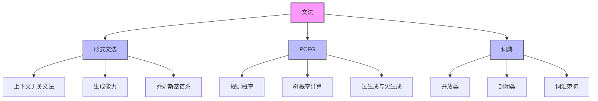

# 23.2 文法 - Deep Dive 分析

## 1. 背景与动机

### 1.1 从n元模型到文法模型

n元模型虽然在许多任务中表现出色，但存在根本性局限：

| 局限性 | 具体表现 |
|--------|---------|
| **缺乏结构信息** | 无法捕捉"名词短语"、"动词短语"等层次结构 |
| **长距离依赖弱** | n元只能捕捉局部依赖，难以处理句法约束 |
| **泛化能力差** | 无法利用句法规则推广到未见过的句子 |

**示例**：考虑句子 "The cat that chased the mouse sleeps."
- n元模型能判断其概率
- 但无法识别"The cat ... sleeps"的主谓一致关系

### 1.2 形式文法的引入

形式文法提供了刻画语言层次结构的数学框架。第7章中，我们使用巴克斯-诺尔范式（BNF）定义了一阶逻辑语言的文法。自然语言虽然更复杂，但同样可以（部分地）用文法描述。

**核心洞见**：
```
自然语言句子的层次结构

        S（句子）
       / \
     NP   VP（名词短语+动词短语）
    /     /   \
   Det   V     NP
   |     |    / \
  The  sleeps Det  N
              |    |
              the cat
```

### 1.3 概率上下文无关文法（PCFG）

PCFG结合了：
- **形式文法**：定义合法的句法结构
- **概率机制**：量化不同结构的可能性

这使得文法能够处理自然语言的模糊性（同一字符串可能有多个句法分析）。

---

## 2. 知识逻辑图谱



---

## 3. 核心概念与数学分析

### 3.1 上下文无关文法（CFG）

#### 3.1.1 形式定义

上下文无关文法是一个四元组 $G = (N, \Sigma, R, S)$：

- $N$：非终结符集合（句法范畴）
- $\Sigma$：终结符集合（词汇）
- $R$：产生式规则集合
- $S \in N$：起始符号（通常为句子S）

#### 3.1.2 产生式规则

规则形式：$X \rightarrow \alpha$，其中 $X \in N$，$\alpha \in (N \cup \Sigma)^*$

**示例规则**（来自$\mathcal{E}_0$文法）：
```
S → NP VP          [句子由名词短语+动词短语构成]
NP → Det Noun      [名词短语由限定词+名词构成]
VP → Verb NP       [动词短语由动词+名词短语构成]
```

#### 3.1.3 推导过程

从起始符号S开始，反复应用规则，最终得到终结符串：

$$
S \Rightarrow NP\ VP \Rightarrow Det\ Noun\ VP \Rightarrow \text{The}\ cat\ VP \Rightarrow \text{The}\ cat\ Verb\ NP \Rightarrow \ldots
$$

### 3.2 概率上下文无关文法（PCFG）

#### 3.2.1 带概率的规则

PCFG为每个规则附加概率：

$$
X \rightarrow \alpha\ [p]
$$

其中 $p$ 表示在展开 $X$ 时选择此规则的概率。

**概率约束**：对于每个非终结符X，所有以X为左部的规则概率之和为1：

$$
\sum_{\alpha} P(X \rightarrow \alpha) = 1
$$

#### 3.2.2 树概率计算

句法分析树的概率是其所用规则概率的乘积：

$$
P(T) = \prod_{i=1}^{n} P(R_i)
$$

**示例**：计算"Every wumpus smells"的树概率

```
        S [0.9]
       / \
     NP   VP [0.40]
    /|\      |
  Det Noun  Verb
   |   |      |
 Every wumpus smells

P = 0.9 × 0.25 × 0.05 × 0.15 × 0.40 × 0.10 = 0.0000675
```

#### 3.2.3 文法的表达能力

**过生成（Overgeneration）**：
- 文法生成了不合语法的句子
- 例如：$\mathcal{E}_0$生成"Me go I"

**欠生成（Undergeneration）**：
- 文法无法生成合法的句子
- 例如：$\mathcal{E}_0$无法生成"I think the wumpus is smelly"

### 3.3 词典结构

#### 3.3.1 开放类 vs 封闭类

| 特征 | 开放类 | 封闭类 |
|------|--------|--------|
| **词数** | 成千上万 | 很少（通常<20） |
| **变化** | 频繁新增 | 数百年稳定 |
| **示例** | 名词、动词、形容词、副词 | 代词、冠词、介词、连词 |
| **实例** | "humblebrag"、"microbiome" | "the"、"and"、"of" |

#### 3.3.2 词汇规则示例

```
Noun → stench [0.05] | breeze [0.10] | wumpus [0.15] | ...
Verb → is [0.10] | feel [0.10] | smells [0.10] | ...
Article → the [0.40] | a [0.30] | an [0.10] | ...
```

---

## 4. 定理与证明

### 4.1 PCFG的概率归一性

**定理**：对于任意PCFG，所有合法句子的概率之和不超过1。

**证明**：

设文法生成的所有句法树集合为$\mathcal{T}$。对于每棵树$T$，其概率为：

$$P(T) = \prod_{r \in T} P(r)$$

考虑所有以S为根的树：

$$\sum_{T: root(T)=S} P(T) \leq 1$$

这是因为PCFG可以看作一个分支过程，每次展开非终结符时，选择一个规则。如果分支过程以概率1终止（即生成有限树），则概率归一。

**终止条件**：存在某个非终结符展开为终结符的概率下界，保证过程几乎必然终止。

### 4.2 PCFG的歧义性

**定理**：PCFG能够为歧义句子分配不同分析的概率，但无法消除歧义。

**形式化**：

对于歧义句子$w$，存在多棵分析树$T_1, T_2, \ldots, T_k$，满足：

$$P(w) = \sum_{i=1}^{k} P(T_i)$$

其中$P(T_i) = P(T_i \rightarrow w)$。

**示例**：考虑"Flying planes can be dangerous"

- 树1（飞行中的飞机）：$[NP Flying\ planes]\ [VP can\ be\ dangerous]$
- 树2（驾驶飞机这件事）：$[S [VP Flying\ planes]\ can\ be\ dangerous]$

PCFG可以为两种分析分配不同概率，但句法分析器仍需选择最可能的那个。

---

## 5. 具体示例

### 5.1 $\mathcal{E}_0$文法详解

$\mathcal{E}_0$是用于Wumpus世界智能体通信的简单英语子集：

**句法规则**：
```
S → NP VP [0.90]
  | S Conj S [0.10]

NP → Pronoun [0.25]
   | Name [0.10]
   | Noun [0.10]
   | Article Noun [0.25]
   | Article Adjs Noun [0.05]
   | Digit Digit [0.05]
   | NP PP [0.10]
   | NP RelClause [0.05]
   | NP Conj NP [0.05]

VP → Verb [0.40]
   | VP NP [0.35]
   | VP Adjective [0.05]
   | VP PP [0.10]
   | VP Adverb [0.10]
```

### 5.2 句法分析树构建

**输入**："I feel a breeze"

**分析过程**：
```
步骤1: 词法分析
I → Pronoun
feel → Verb
a → Article
breeze → Noun

步骤2: 应用规则
NP → Pronoun            (产生"I")
NP → Article Noun       (产生"a breeze")
VP → Verb NP            (产生"feel a breeze")
S → NP VP               (产生完整句子)

步骤3: 计算概率
P(I) = 0.10          (Pronoun概率)
P(feel) = 0.10       (Verb概率)
P(a) = 0.30          (Article概率)
P(breeze) = 0.10     (Noun概率)

P(NP→Pronoun) = 0.25
P(NP→Article Noun) = 0.25
P(VP→Verb NP) = 0.35
P(S→NP VP) = 0.90

P(树) = 0.25 × 0.90 × 0.35 × 0.10 × 0.25 × 0.30 × 0.10
     = 5.90625 × 10⁻⁶
```

### 5.3 歧义处理示例

**输入**："I saw the man with the telescope"

**两种分析**：

```
分析1: [I saw [the man [with the telescope]]]
        (介词短语修饰man)
        
分析2: [I [saw [the man] [with the telescope]]]
        (介词短语修饰saw)
```

PCFG为两种分析分配不同概率，歧义消解器选择概率最高的。

---

## 6. 一句话本质

**概率上下文无关文法通过将概率机制引入形式文法，既保留了层次结构刻画能力，又能量化不同句法分析的可能性，为处理自然语言的歧义性和不确定性提供了数学框架。**

---

## 7. 总结与反思

### 7.1 核心要点

1. **层次结构的重要性**：句法范畴（NP、VP等）提供了约束和泛化的基础
2. **概率的必要性**：自然语言的模糊性要求概率化表示
3. **文法的双重性**：既要充分覆盖（避免欠生成），又要避免过度覆盖（避免过生成）

### 7.2 局限性与反思

**PCFG的局限**：
- **结构性假设过强**：假设上下文无关，但自然语言存在大量上下文依赖
- **词汇信息不足**：仅使用句法范畴，忽略具体词汇的偏好
- **长距离依赖**：难以处理主谓一致、代词指代等长距离约束

**改进方向**（将在23.4节讨论）：
- 词汇化PCFG：引入短语中心词信息
- 扩展文法：增加一致性约束
- 特征文法：使用特征结构替代原子范畴

### 7.3 与其他模型的关系

```
CFG < PCFG < 词汇化PCFG < 扩展文法
 │       │          │           │
 │       │          │           └── 一致性、语义
 │       │          └────────────── 短语头信息
 │       └───────────────────────── 概率
 └───────────────────────────────── 结构
```

### 7.4 实践启示

1. **规则设计**：平衡覆盖率和精确度，可通过树库学习
2. **概率估计**：平滑技术同样适用于文法规则
3. **效率考虑**：乔姆斯基范式可简化解析算法
