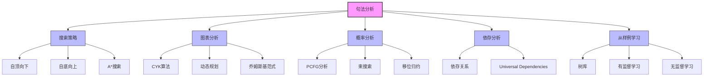

# 23.3 句法分析 - Deep Dive 分析

## 1. 背景与动机

### 1.1 句法分析的定义与意义

**句法分析（Parsing）**是根据文法规则分析单词串以获得其短语结构的过程。它是自然语言处理的核心任务之一，连接着词汇层面和语义/语用层面。

**为什么需要句法分析？**

| 需求 | 说明 |
|------|------|
| **消歧** | "I saw the man with the telescope"需要句法分析确定修饰关系 |
| **语义解释** | 句法结构为语义组合提供框架 |
| **机器翻译** | 源语言的句法结构指导目标语言的生成 |
| **信息提取** | 识别实体及其关系需要结构信息 |

### 1.2 搜索视角

句法分析可以看作在巨大的分析空间中的搜索问题：

```
搜索问题四要素：
- 状态：待分析的符号序列
- 初始状态：输入的单词序列
- 目标状态：单个符号S（句子）
- 操作：应用文法规则进行展开或归约
```

**两种搜索方向**：
- **自顶向下**：从S开始，尝试推导出输入串
- **自底向上**：从输入串开始，尝试归约到S

### 1.3 效率挑战

朴素的回溯搜索面临严重效率问题：

**示例**："Have the students in section 2 of Computer Science 101 take the exam."

vs

"Have the students in section 2 of Computer Science 101 taken the exam?"

前10个单词相同，但一个是祈使句，一个是疑问句。从左到右的算法在第11个单词前无法确定，错误选择会导致完全回溯。

**解决方案**：动态规划（图表句法分析）

---

## 2. 知识逻辑图谱



---

## 3. 核心概念与数学分析

### 3.1 图表句法分析器（Chart Parser）

#### 3.1.1 核心思想

使用**图表（Chart）**数据结构存储子串的分析结果，避免重复计算。

**图表条目**：$[X, i, j]$ 表示从位置$i$到位置$j$的子串可以被分析为范畴$X$

#### 3.1.2 示例图表

对于句子"The wumpus is dead"：

```
位置: 0      1       2      3       4
     The   wumpus   is    dead
     
[Det, 0, 1] ──────→ [Noun, 1, 2]
                    ↓
              [NP, 0, 2]
               
[Article, 0, 1] + [Noun, 1, 2] ⇒ [NP, 0, 2]
```

### 3.2 CYK算法

#### 3.2.1 算法前提

CYK算法要求文法为**乔姆斯基范式（Chomsky Normal Form, CNF）**：

- **词法规则**：$X \rightarrow \text{word}\ [p]$
- **句法规则**：$X \rightarrow Y\ Z\ [p]$（恰好两个非终结符）

**任何CFG都可转换为CNF**，这是理论上的保证。

#### 3.2.2 算法描述

**输入**：单词列表 $words$，文法 $grammar$

**数据结构**：
- $P[X, i, k]$：子串$words[i:k]$分析为$X$的最大概率
- $T[X, i, k]$：对应的分析树

**算法步骤**：

```
1. 初始化（词法规则）
   对于每个位置i和单词words[i]：
       对于每个规则 X → words[i] [p]：
           P[X, i, i] = p
           T[X, i, i] = 叶子节点

2. 归纳（句法规则）
   对于长度从2到n：
       对于起始位置i：
           k = i + length - 1
           对于分割点j（i ≤ j < k）：
               对于规则 X → Y Z [p]：
                   score = P[Y, i, j] × P[Z, j+1, k] × p
                   如果 score > P[X, i, k]：
                       更新P和T

3. 返回 T[S, 1, n]
```

#### 3.2.3 复杂度分析

- **时间复杂度**：$O(n^3 \cdot m)$
  - $n$：句子长度
  - $m$：非终结符数量
  - 三层循环：长度、起始位置、分割点

- **空间复杂度**：$O(n^2 \cdot m)$
  - 二维表存储所有子串的分析

### 3.3 概率句法分析

#### 3.3.1 最大概率分析

给定歧义句子，选择概率最高的分析树：

$$
T^* = \arg\max_{T} P(T) = \arg\max_{T} \prod_{r \in T} P(r)
$$

CYK算法通过动态规划找到最大概率分析。

#### 3.3.2 内部概率与外部概率

**内部概率** $\beta(X, i, j)$：子串$words[i:j]$分析为$X$的概率

**外部概率** $\alpha(X, i, j)$：$X$生成$words[i:j]$作为句子一部分的概率

用于EM算法学习文法参数（向内-向外算法）。

### 3.4 A*搜索句法分析

#### 3.4.1 启发式搜索

将句法分析视为状态空间搜索，使用A*算法：

- **状态**：待分析的符号序列
- **代价**：已应用规则概率的负对数
- **启发式**：估计到达目标（S）的剩余代价

#### 3.4.2 优势

- 无需搜索整个空间
- 保证找到最优解（可容许启发式）
- 实际应用中通常比CYK快

### 3.5 束搜索与移位归约分析

#### 3.5.1 束搜索（Beam Search）

- 维护$b$个最可能的部分分析
- 每一步只扩展这$b$个状态
- 复杂度降至$O(n \cdot b)$

#### 3.5.2 移位归约分析（Shift-Reduce Parsing）

**操作**：
- **移位（Shift）**：将下一个单词压入栈
- **归约（Reduce）**：根据规则将栈顶符号归约为非终结符

**确定性分析**：$b=1$时，贪心选择每个动作，$O(n)$时间。

### 3.6 依存分析

#### 3.6.1 依存文法 vs 短语结构文法

| 特征 | 短语结构 | 依存结构 |
|------|---------|---------|
| **基本单位** | 短语（NP, VP等） | 词汇项 |
| **关系** | 成分包含 | 词汇依赖 |
| ** headedness** | 不明确 | 每个依存有中心词 |
| **适用语言** | 词序固定语言（英语） | 词序自由语言（拉丁语） |

#### 3.6.2 依存关系示例

```
         detects（中心词）
        /    |    \
       /     |     \
      I    wumpus   me
            |
          smelly
            |
          the

关系：nsubj(detects, I) - 名词主语
      dobj(detects, wumpus) - 直接宾语
      amod(wumpus, smelly) - 形容词修饰
      det(wumpus, the) - 限定词
      nmod(detects, me) - 名词修饰
```

---

## 4. 定理与证明

### 4.1 CYK算法的正确性

**定理**：对于CNF文法$G$和字符串$w$，CYK算法正确判断$w \in L(G)$。

**证明概要**：

**归纳基础**：长度为1的子串
- CYK填充所有$P[X, i, i]$，对应词法规则$X \rightarrow w_i$
- 正确性由词法规则的定义保证

**归纳假设**：假设CYK正确填充所有长度$< L$的子串

**归纳步骤**：长度为$L$的子串$w[i:j]$
- 考虑所有可能的分割点$k$（$i \leq k < j$）
- 由归纳假设，$w[i:k]$和$w[k+1:j]$的分析正确
- 对于规则$X \rightarrow Y\ Z$，若$Y$覆盖$w[i:k]$，$Z$覆盖$w[k+1:j]$
- 则$X$可以覆盖$w[i:j]$
- CYK检查所有可能，因此正确

**结论**：CYK正确判断可派生性。

### 4.2 CYK复杂度下界

**定理**：对于一般CFG，句法分析的时间复杂度下界为$\Omega(n^3)$。

**说明**：
- CYK达到$O(n^3)$，是理论最优
- 但对于特定文法（如自然语言），可以利用结构特性达到更快

---

## 5. 具体示例

### 5.1 CYK算法执行示例

**输入**："the wumpus is dead"

**文法（CNF）**：
```
S → NP VP
NP → Det Noun | Det Adj Noun
VP → Verb Adj
Det → the
Noun → wumpus
Verb → is
Adj → dead
```

**执行过程**：

```
步骤1: 词法分析
P[Det, 0, 1] = 1.0    (the)
P[Noun, 1, 2] = 1.0   (wumpus)
P[Verb, 2, 3] = 1.0   (is)
P[Adj, 3, 4] = 1.0    (dead)

步骤2: 长度为2的子串
- "the wumpus" [0:2]:
  NP → Det Noun: 1.0 × 1.0 = 1.0
  P[NP, 0, 2] = 1.0

- "is dead" [2:4]:
  VP → Verb Adj: 1.0 × 1.0 = 1.0
  P[VP, 2, 4] = 1.0

步骤3: 长度为4的子串（整句）
- "the wumpus is dead" [0:4]:
  分割点: 2 ("the wumpus" | "is dead")
  S → NP VP: P[NP,0,2] × P[VP,2,4] = 1.0 × 1.0 = 1.0
  P[S, 0, 4] = 1.0

结果: 成功分析，概率1.0
```

### 5.2 歧义句分析示例

**输入**："I saw the man with the telescope"

**两种分析**：

```
分析1（介词修饰man）:
    P = 0.00012
    
分析2（介词修饰saw）:
    P = 0.00008
    
CYK选择分析1（概率更高）
```

### 5.3 移位归约分析示例

**输入**："I feel a breeze"

```
步骤    栈              输入              动作
─────────────────────────────────────────────
1       []             [I, feel, a, breeze]  移位
2       [I]            [feel, a, breeze]     归约 NP→I
3       [NP]           [feel, a, breeze]     移位
4       [NP, feel]     [a, breeze]           移位
5       [NP, feel, a]  [breeze]              移位
6       [NP, feel, a, breeze]  []            归约 NP→a breeze
7       [NP, feel, NP] []                   归约 VP→feel NP
8       [NP, VP]       []                    归约 S→NP VP
9       [S]            []                    接受
```

---

## 6. 一句话本质

> **句法分析通过动态规划（CYK）、启发式搜索（A*）或贪心策略（移位归约），在文法约束下寻找最优的层次结构分析，将线性词串转换为树形句法结构。**

---

## 7. 总结与反思

### 7.1 算法对比

| 算法 | 时间复杂度 | 空间复杂度 | 最优性保证 | 适用场景 |
|------|-----------|-----------|-----------|---------|
| CYK | $O(n^3 m)$ | $O(n^2 m)$ | 是 | 精确分析 |
| A* | $O(n^3)$（最坏） | $O(n^2)$ | 是 | 启发式有效时 |
| 束搜索 | $O(n \cdot b)$ | $O(n \cdot b)$ | 否 | 快速近似 |
| 移位归约 | $O(n)$ | $O(n)$ | 否 | 实时处理 |

### 7.2 学习文法的挑战

**有监督学习**：
- 需要树库（如Penn Treebank）
- 从标注数据计数规则概率
- 树库标注代价高

**无监督学习**：
- 向内-向外算法（类似EM）
- 课程学习：从简单句子开始

**半监督学习**：
- 利用HTML等部分标注数据
- 少量标注+大量未标注数据

### 7.3 现代发展

- **神经网络句法分析器**：Parsey McParseface、Stanford Parser等达到95%准确率
- **争议**：可能过拟合于特定评测语料
- **趋势**：句法分析与其他NLP任务联合学习

### 7.4 实践建议

1. **文法预处理**：转换为CNF简化实现
2. **概率平滑**：规则概率需要平滑处理
3. **剪枝策略**：实际应用中可使用束搜索加速
4. **错误分析**：关注常见错误模式改进文法
