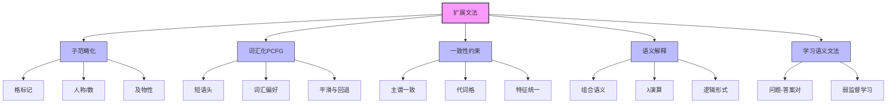

# 23.4 扩展文法 - Deep Dive 分析

## 1. 背景与动机

### 1.1 上下文无关文法的局限

PCFG虽然强大，但在处理真实自然语言时面临挑战：

| 问题 | 示例 | 说明 |
|------|------|------|
| **主语-动词不一致** | "Me go I" | PCFG可能生成不合语法的句子 |
| **格不一致** | "I saw she" | 代词格未受约束 |
| **词汇偏好** | "ate a bandanna" | 无意义的组合被赋予概率 |
| **结构歧义** | "spaghetti and meatballs or lasagna" | 需要语义偏好解决 |

### 1.2 扩展的必要性

标准PCFG存在三个核心问题：

```
1. 过生成问题
   PCFG生成 "Me go I" 的概率 > 0
   但 "Me" 不能作主语，"go" 的主语应该是 "I" 而非 "me"

2. 词汇信息不足
   PCFG规则: VP → Verb NP
   无法区分 "ate a banana" vs "ate a bandanna"

3. 组合语义缺失
   无法从子短语语义组合得到整句语义
```

### 1.3 扩展文法的解决方案

**扩展文法（Augmented Grammar）**通过以下方式增强表达能力：

1. **特征结构**：用结构化信息替代原子范畴
2. **词汇化**：引入短语中心词信息
3. **语义组合**：从句法分析推导语义表示

---

## 2. 知识逻辑图谱



---

## 3. 核心概念与数学分析

### 3.1 子范畴化（Subcategorization）

#### 3.1.1 特征结构

用特征-值对表示更精细的分类：

```
代词 "I" 的特征:
- 格: 主格 (Sbj)
- 人称: 第一人称
- 数: 单数 (1S)
- 语义: Speaker

表示: NP(Sbj, 1S, Speaker)

代词 "me" 的特征:
- 格: 宾格 (Obj)
- 人称: 第一人称
- 数: 单数 (1S)
- 语义: Speaker

表示: NP(Obj, 1S, Speaker)
```

#### 3.1.2 格系统

| 代词 | 主格 | 宾格 |
|------|------|------|
| 第一人称单数 | I | me |
| 第一人称复数 | we | us |
| 第三人称复数 | they | them |

### 3.2 词汇化PCFG

#### 3.2.1 短语头（Head）

每个短语有一个最重要的词——**中心词（Head）**：
- NP的中心词：名词（"a banana" → "banana"）
- VP的中心词：动词（"ate a banana" → "ate"）

#### 3.2.2 词汇化规则

符号 $VP(v)$ 表示中心词为$v$的VP：

$$
VP(v) \rightarrow Verb(v)\ NP(n)\ [P_1(v, n)]
$$

$$
VP(v) \rightarrow Verb(v)\ [P_2(v)]
$$

$$
NP(n) \rightarrow Article(a)\ Adjs(j)\ Noun(n)\ [P_3(n, a)]
$$

**概率依赖词汇**：
- $P_1(\text{ate}, \text{banana}) > P_1(\text{ate}, \text{bandanna})$

#### 3.2.3 参数规模与回退

若词汇量：5000动词 + 10000名词

- 完整表$P_1(v, n)$：5000万条目
- 回退到$P_1(v, *)$：仅5000条目

**回退策略**：
```
如果 count(v, n) > 阈值:
    使用 P₁(v, n)
否则:
    回退到 P₁(v) × P(n)
```

### 3.3 一致性约束

#### 3.3.1 主谓一致

```
S(v) → NP(Sbj, pn, n) VP(pn, v) [P₅(n, v)]
```

约束：**NP和VP的人称/数（pn）必须相同**

**合法组合**：
- "I see" (1S, 1S) ✓
- "He sees" (3S, 3S) ✓

**非法组合**：
- "I sees" (1S, 3S) ✗
- "He see" (3S, 1S) ✗

#### 3.3.2 代词格约束

```
S(v) → NP(Sbj, pn, n) VP(pn, v)
VP(pn, v) → Verb(pn, v) NP(Obj, pn, n)
```

确保：
- 主语位置必须为主格（Sbj）
- 宾语位置必须为宾格（Obj）

### 3.4 语义解释

#### 3.4.1 组合语义原则

**弗雷格组合性原则**：短语的语义是其子短语语义的函数。

**算术表达式示例**：

```
Exp(op(x₁, x₂)) → Exp(x₁) Operator(op) Exp(x₂)
Exp(x) → (Exp(x))
Exp(x) → Number(x)
Number(x) → Digit(x)
```

对于 "3 + (4 ÷ 2)":
- "3" → 3
- "4" → 4
- "2" → 2
- "4 ÷ 2" → 4 ÷ 2 = 2
- "3 + 2" → 3 + 2 = 5

#### 3.4.2 λ演算表示

**基本思想**：将VP表示为谓词（需要参数的函数）

**示例**："loves Bo"

```
语义: λx Loves(x, Bo)

应用: (λx Loves(x, Bo))(Ali) = Loves(Ali, Bo)
```

#### 3.4.3 英语语义文法规则

```
S(pred(n)) → NP(n) VP(pred)
VP(pred(n)) → Verb(pred) NP(n)
NP(n) → Name(n)
Name(Ali) → Ali
Name(Bo) → Bo
Verb(λy λx Loves(x, y)) → loves
```

**推导 "Ali loves Bo"**：

```
1. Ali → Name(Ali) → NP(Ali)
2. loves → Verb(λy λx Loves(x, y))
3. Bo → Name(Bo) → NP(Bo)
4. Verb(λy λx Loves(x, y)) + NP(Bo) 
   → VP((λy λx Loves(x, y))(Bo))
   = VP(λx Loves(x, Bo))
5. NP(Ali) + VP(λx Loves(x, Bo))
   → S((λx Loves(x, Bo))(Ali))
   = S(Loves(Ali, Bo))
```

### 3.5 从样例学习语义文法

#### 3.5.1 训练数据

**(句子, 逻辑形式)** 对：
- 句子："What states border Texas?"
- 逻辑形式：$\lambda x. state(x) \wedge borders(x, Texas)$

#### 3.5.2 弱监督学习

更实用的数据形式：**(问题, 答案)** 对：
- 问题："What states border Texas?"
- 答案："Louisiana, Arkansas, Oklahoma, New Mexico."

**挑战**：答案不提供中间逻辑形式

**解决方案**：
- 创建内部逻辑形式（组合但受限的搜索空间）
- 使用期望最大化（EM）同时学习文法和语义

---

## 4. 定理与证明

### 4.1 组合语义的良构性

**定理**：在良构的语义文法中，每个合法句子的分析树都有唯一确定的语义解释。

**证明概要**：

**归纳基础**：词法规则
- 每个词汇项都有明确的语义（常量或λ表达式）

**归纳步骤**：句法规则
- 设规则 $S \rightarrow A\ B$，语义 $sem(S) = f(sem(A), sem(B))$
- 由归纳假设，$sem(A)$和$sem(B)$唯一确定
- 因此$sem(S)$唯一确定

**结论**：通过结构归纳，整棵树的语义唯一。

### 4.2 λ归约的正确性

**定理**：$(\lambda x. E)(a)$ $\beta$-归约为 $E[x/a]$ 保持语义等价。

**证明**：

根据λ演算的语义定义，应用操作是函数调用：

$$(\lambda x. E)(a)$$

表示将参数$a$绑定到变量$x$，然后计算$E$。

替换$E[x/a]$正是这一操作的实现。

**示例**：

$$(\lambda x. Loves(x, Bo))(Ali)$$

归约为：

$$Loves(Ali, Bo)$$

语义等价得证。

---

## 5. 具体示例

### 5.1 扩展文法规则示例

**完整的扩展规则**（部分）：

```
// 句子规则：主谓一致
S(v) → NP(Sbj, pn, n) VP(pn, v) [P₅(n, v)]

// 名词短语规则：保留格和语义
NP(c, pn, n) → Pronoun(c, pn, n) | Noun(c, pn, n)

// 动词短语规则：传递人称/数
VP(pn, v) → Verb(pn, v) NP(Obj, pn, n)

// 介词短语
PP(head) → Prep(head) NP(Obj, pn, h)

// 词汇规则
Pronoun(Sbj, 1S, I) → I [0.005]
Pronoun(Obj, 1S, me) → me [0.005]
Pronoun(Obj, 3P, them) → them [0.003]

Verb(3S, see) → sees [0.002]
Verb(1S, see) → see [0.002]
```

### 5.2 语义分析示例

**句子**："Ali loves Bo"

**分析树（带语义）**：

```
              S(Loves(Ali, Bo))
             /                  \
      NP(Ali)                    VP(λx Loves(x, Bo))
        |                            /               \
   Name(Ali)                Verb(λyλx Loves(x,y))   NP(Bo)
       |                          |                   |
      Ali                       loves              Name(Bo)
                                                          |
                                                          Bo
```

**β归约过程**：

```
1. VP语义 = (λy λx Loves(x, y))(Bo)
          = λx Loves(x, Bo)

2. S语义 = (λx Loves(x, Bo))(Ali)
         = Loves(Ali, Bo)
```

### 5.3 问答系统语义分析

**问题**："What states border Texas?"

**预期逻辑形式**：

$$\lambda x. state(x) \wedge borders(x, Texas)$$

**文法推导**：

```
S(λx.state(x) ∧ borders(x, Texas))
├── WhNP(λx.state(x)) : "What states"
│   └── WhWord(what) + Noun(states)
│       └── λx.state(x)
└── VP(λy.borders(y, Texas)) : "border Texas"
    └── Verb(border) + NP(Texas)
        └── λy λz.borders(z, y)(Texas)
        = λy.borders(Texas, y) ... 调整论元顺序
```

---

## 6. 一句话本质

> **扩展文法通过特征结构、词汇化和语义组合，将形式文法从纯句法描述提升为能够处理一致性约束、词汇偏好和语义解释的完整语言模型。**

---

## 7. 总结与反思

### 7.1 扩展层次

```
Level 1: CFG (上下文无关文法)
    ↓ + 概率
Level 2: PCFG (概率上下文无关文法)
    ↓ + 短语头
Level 3: 词汇化PCFG
    ↓ + 特征约束
Level 4: 特征文法 (TAG, HPSG, LFG)
    ↓ + 语义组合
Level 5: 语义文法
```

### 7.2 权衡与选择

| 方法 | 表达能力 | 计算复杂度 | 数据需求 |
|------|---------|-----------|---------|
| PCFG | 低 | $O(n^3)$ | 中等 |
| 词汇化PCFG | 中 | $O(n^3)$ | 高 |
| 特征文法 | 高 | $O(n^5)$+ | 高 |
| 语义文法 | 很高 | NP难 | 专家标注 |

### 7.3 现代替代方案

**神经网络方法**（第24章）：
- 隐式学习子范畴和词汇偏好
- 端到端语义学习
- 但仍需要结构归纳偏置

**混合方法**：
- 神经网络 + 结构化预测
- 结合数据驱动和知识驱动优势

### 7.4 实践建议

1. **从简单开始**：先用PCFG建立基线
2. **逐步扩展**：根据需要添加特征
3. **数据驱动**：利用树库学习规则概率
4. **语义优先**：如果目标涉及语义，尽早引入语义表示
