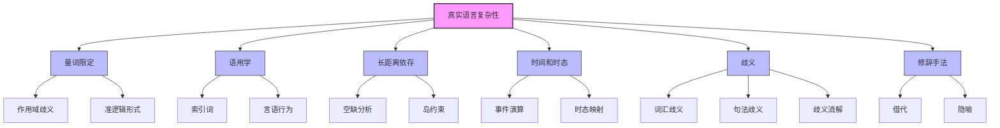

# 23.5 真实自然语言的复杂性 - Deep Dive 分析

## 1. 背景与动机

### 1.1 理想模型与真实语言的差距

前几节介绍的文法模型（PCFG、扩展文法）虽然强大，但仍是对自然语言的简化。真实自然语言的复杂性远超形式化模型。

```
理想假设                          真实语言
─────────────────────────────────────────────────────────
明确的合法/非法界限      ←→      渐变、模糊的边缘案例
单一确定的句法结构       ←→      多重歧义分析
静态固定的规则           ←→      动态演变的用法
字面意思优先             ←→      隐喻、借代普遍存在
语境无关                 ←→      高度依赖上下文
```

### 1.2 复杂性的来源

| 复杂性来源 | 核心问题 |
|-----------|---------|
| **量词限定** | 量词作用域的歧义 |
| **语用学** | 语境依赖、说话者意图 |
| **长距离依存** | 句法成分远距离关联 |
| **时间和时态** | 时间表达的复杂推理 |
| **歧义** | 词汇、句法、语义多层歧义 |
| **修辞** | 借代、隐喻的非字面意义 |

---

## 2. 知识逻辑图谱



---

## 3. 核心概念与数学分析

### 3.1 量词限定（Quantification）

#### 3.1.1 作用域歧义

**例句**："Every agent feels a breeze."

**两种解释**：

1. **宽域存在量词**（每个agent感觉自己的微风）：
   $$
   \forall a \in Agents \Rightarrow \exists b \in Breezes \wedge Feel(a, b)
   $$

2. **窄域存在量词**（所有agent感觉同一阵微风）：
   $$
   \exists b \in Breezes \wedge \forall a \in Agents \Rightarrow Feel(a, b)
   $$

#### 3.1.2 准逻辑形式

文法不直接生成最终逻辑形式，而是生成**准逻辑形式**，后续算法确定量词作用域：

```
准逻辑形式:
Q(∀, a ∈ Agents, Q(∃, b ∈ Breezes, Feel(a, b)))

作用域规则:
- 默认：量词按出现顺序（左到右）
- 偏好：某些动词偏好特定解读
```

### 3.2 语用学（Pragmatics）

#### 3.2.1 索引词（Indexicals）

直接指代当前情境的短语：

| 索引词 | 指代对象 | 确定方式 |
|--------|---------|---------|
| I | 说话者 | 语境中的speaker |
| you | 听者 | 语境中的hearer |
| today | 说话当天 | 语境中的时间 |
| here | 说话地点 | 语境中的地点 |

**语义表示**：
```
"I am in Boston today"
→ At(Speaker, Boston, Today)
```

#### 3.2.2 言语行为（Speech Acts）

说话不仅是传递信息，还是执行行为：

| 类型 | 示例 | 语力 |
|------|------|------|
| 断言 | "The wumpus is dead." | 陈述事实 |
| 问题 | "Is there a wumpus?" | 请求信息 |
| 命令 | "Go to 2 2" | 指示行动 |
| 承诺 | "I will help you." | 承担义务 |

**命令的语义表示**：
```
S(Command(pred(Hearer))) → VP(pred)
```

### 3.3 长距离依存（Long-Distance Dependencies）

#### 3.3.1 空缺（Gaps）

**例句**："Who did the agent tell you to give the gold to ___?"

空缺标记（$\sqcup$）与句首的"Who"相隔11个词。

**分析挑战**：
- 确保空缺与先行词匹配
- 遵守约束（如岛约束）

#### 3.3.2 约束条件

```
有效空缺:
"What did she play ___?" ✓

无效空缺（岛约束）:
"What did she play [NP Dungeons and ___]?" ✗
（空缺不能出现在NP的并列结构中）
```

### 3.4 时间和时态

#### 3.4.1 事件演算表示

使用事件演算表示时间关系：

**现在时**：
```
"Ali loves Bo"
→ ∃e ∈ Loves(Ali, Bo) ∧ During(Now, Extent(e))
```

**过去时**：
```
"Ali loved Bo"
→ ∃e ∈ Loves(Ali, Bo) ∧ After(Now, Extent(e))
```

#### 3.4.2 词汇规则扩展

```
Verb(λy λx ∃e ∈ Loves(x,y) ∧ During(Now, e)) → loves
Verb(λy λx ∃e ∈ Loves(x,y) ∧ After(Now, e)) → loved
```

### 3.5 歧义（Ambiguity）

#### 3.5.1 歧义的层次

```
词法歧义 → 句法歧义 → 语义歧义 → 语用歧义
  │           │           │           │
  ▼           ▼           ▼           ▼
"back"    "Flying      "Every      "I am 
(多义词)   planes..."   agent..."   dead."
         (结构歧义)    (量词作用域)  (字面/比喻)
```

#### 3.5.2 报纸标题歧义示例

| 标题 | 意外解读 |
|------|---------|
| "Squad helps dog bite victim." | 小队帮助狗咬受害者（而非帮助受害者） |
| "Milk drinkers are turning to powder." | 喝牛奶的人变成粉末（而非改喝奶粉） |
| "Include your children when baking cookies." | 把孩子包含在饼干里（而非一起烤） |

### 3.6 修辞手法

#### 3.6.1 借代（Metonymy）

用一个对象代表另一个相关对象：

**例句**："Chrysler announced a new model."

**字面解释**：克莱斯勒公司（作为实体）宣布消息。
**实际理解**：克莱斯勒公司的发言人宣布消息。

**语义表示扩展**：
```
字面: x = Chrysler ∧ e ∈ Announce(x)
借代: x = Chrysler ∧ e ∈ Announce(m) ∧ Metonymy(m, x)
```

**借代类型**：
- 组织 → 发言人
- 作者 → 作品（"I read Shakespeare.")
- 生产者 → 产品（"I drive a Honda.")
- 部分 → 整体（"The Red Sox need a strong arm.")

#### 3.6.2 隐喻（Metaphor）

通过类比暗示不同含义：

**例句**："Time is money."

**理解**：时间具有金钱的属性（宝贵、可花费、可节省）。

隐喻可视为特殊借代，关系为"相似"。

### 3.7 歧义消解模型

#### 3.7.1 四模型框架

完整歧义消解需要结合四个模型：

```
┌─────────────────────────────────────────┐
│  P(解释 | 话语, 语境)                    │
│                                         │
│  ∝ P(世界模型) × P(心理模型)             │
│    × P(语言模型) × P(声学模型)           │
└─────────────────────────────────────────┘
```

| 模型 | 作用 |
|------|------|
| **世界模型** | 命题在世界上发生的可能性 |
| **心理模型** | 说话者形成传达意图的可能性 |
| **语言模型** | 选择特定表达的偏好 |
| **声学模型** | 语音信号到单词的映射 |

---

## 4. 定理与证明

### 4.1 歧义的必然性

**定理**：对于任何足够表达力的自然语言文法，存在句子具有多重语义解释。

**证明概要**：

构造性证明：考虑包含量词的句子。

对于"Every X sees a Y"：
- 至少两种量词作用域解读
- 若语言能表达多重量化，则歧义存在

**推论**：歧义消解无法仅通过句法分析完成，需要语义/语用信息。

---

## 5. 具体示例

### 5.1 量词作用域分析

**句子**："Every agent in a room smells a wumpus."

**可能的解读**（按普遍性排序）：

```
解读1（最普遍）:
∀a ∃r ∃w [Agent(a) ∧ Room(r) ∧ In(a,r) ∧ Wumpus(w) ∧ Smell(a,w)]
（每个agent在不同房间，闻到不同wumpus）

解读2:
∃r ∀a ∃w [Agent(a) ∧ Room(r) ∧ In(a,r) ∧ Wumpus(w) ∧ Smell(a,w)]
（所有agent在同一个房间，各闻到不同wumpus）

解读3（最特殊）:
∃r ∃w ∀a [Agent(a) ∧ Room(r) ∧ In(a,r) ∧ Wumpus(w) ∧ Smell(a,w)]
（所有agent在同房间，闻到同一wumpus）
```

### 5.2 借代消解示例

**句子**："The ham sandwich on Table 4 wants another beer."

**分析**：
```
字面:
- x = ham_sandwich
- x 想要另一瓶啤酒
- （荒谬：三明治不能喝酒）

借代:
- x = ham_sandwich
- m = 点三明治的顾客
- Metonymy(m, x) （用食物指代顾客）
- m 想要另一瓶啤酒
- （合理）
```

### 5.3 长距离依存示例

**句子**："What did you say that Mary thought that John claimed ___?"

**依存链**：
```
What → claimed (距离3个从句)
     
约束检查:
- 每个中间从句允许传递空缺
- 岛约束：并列结构中不能有空缺
```

---

## 6. 一句话本质

> **真实自然语言的复杂性体现在量词作用域、语用依赖、长距离关联、多层歧义和修辞手法等多个维度，要求NLP系统超越纯句法分析，整合世界知识、心理模型和语境信息进行深度理解。**

---

## 7. 总结与反思

### 7.1 复杂性层次总结

```
Level 1: 形式语言 (确定性、无歧义)
    ↓ + 概率
Level 2: PCFG (统计不确定性)
    ↓ + 语义
Level 3: 语义文法 (逻辑形式)
    ↓ + 语用
Level 4: 完整理解 (语境、意图、世界知识)
```

### 7.2 工程实践启示

1. **分层处理**：句法→语义→语用，逐步消解歧义
2. **默认偏好**：设定量词作用域、结构分析的默认值
3. **知识整合**：连接语言模型与知识图谱
4. **上下文维护**：对话历史对消解索引词至关重要

### 7.3 理论反思

**乔姆斯基 vs 统计学派**：
- 乔姆斯基：语言能力是先天、模块化的
- 统计学派：语言能力从数据中学习
- 本章立场：两者结合——形式结构+概率参数

**理解的本质**：
- 不仅是符号操作
- 涉及推理、模拟、共情
- 图灵测试的语言基础

### 7.4 未来方向

- **神经符号融合**：神经网络+符号推理
- **多模态理解**：语言+视觉+听觉
- **常识推理**：整合大规模世界知识
- **可解释性**：理解系统如何做出解释
