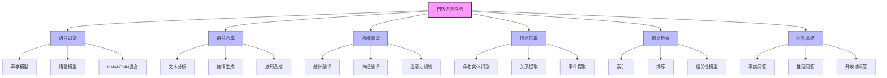

# 23.6 自然语言任务 - Deep Dive 分析

## 1. 背景与动机

### 1.1 NLP应用全景

自然语言处理技术已渗透到现代生活的方方面面：

```
┌─────────────────────────────────────────────────────────────┐
│                      自然语言应用生态                        │
├─────────────────────────────────────────────────────────────┤
│  人机交互          知识获取            内容生成              │
│  ├─ 语音助手       ├─ 搜索引擎        ├─ 机器翻译            │
│  ├─ 智能客服       ├─ 问答系统        ├─ 文本摘要            │
│  └─ 语音输入       ├─ 信息提取        └─ 创意写作            │
│                    └─ 知识图谱构建                           │
├─────────────────────────────────────────────────────────────┤
│  分析理解          辅助工具            特定领域              │
│  ├─ 情感分析       ├─ 拼写检查        ├─ 医疗NLP            │
│  ├─ 主题分类       ├─ 语法纠错        ├─ 法律NLP            │
│  └─ 实体识别       └─ 写作辅助        └─ 金融NLP            │
└─────────────────────────────────────────────────────────────┘
```

### 1.2 任务分类维度

| 维度 | 类别 |
|------|------|
| **模态** | 语音 ↔ 文本 ↔ 多模态 |
| **方向** | 理解（分析） ↔ 生成（合成） |
| **粒度** | 词汇 → 句子 → 文档 → 对话 |
| **目标** | 分类 → 结构化 → 生成 → 推理 |

---

## 2. 知识逻辑图谱



---

## 3. 核心任务详解

### 3.1 语音识别（Speech Recognition）

#### 3.1.1 任务定义

将语音信号转换为文本：

$$
\hat{W} = \arg\max_{W} P(W | \text{声学信号}) \propto P(\text{信号}|W) \cdot P(W)
$$

#### 3.1.2 技术演进

```
1960s-1980s: 模板匹配 → 动态时间规整（DTW）
1990s-2000s: 隐马尔可夫模型（HMM）+ GMM
2010s:      HMM + 深度神经网络（DNN-HMM混合）
2015+:      端到端神经网络（CTC, Attention）
```

#### 3.1.3 深度学习的突破

2011年，深度神经网络引入语音识别：
- **错误率降低**：立即降低约30%
- **原因**：深度网络的层次特征学习与语音的多层结构（波形→音素→单词→句子）天然匹配

**当前状态**：
- 单词错误率（WER）：3%~5%
- 已接近人工转录水平

**核心挑战**：
- 口音和方言适应
- 噪声环境鲁棒性
- 流式识别延迟

### 3.2 文本-语音合成（Text-to-Speech, TTS）

#### 3.2.1 任务定义

将文本转换为自然语音，需要解决：
- **发音**：每个单词的正确读音
- **韵律**：停顿、重音、语调
- **音质**：自然度、清晰度

#### 3.2.2 技术架构

```
文本输入
   ↓
文本分析（分词、词性标注、注音）
   ↓
韵律预测（停顿、重音、语调曲线）
   ↓
声学模型（谱参数或波形生成）
   ↓
声码器（波形合成）
   ↓
语音输出
```

#### 3.2.3 神经革命

**WaveNet（2016）**：
- 基于深度卷积神经网络的原始波形生成
- 约2/3听者认为比传统方法更自然
- 开创TTS神经时代

**现代系统**：
- Tacotron 2：端到端谱预测
- VITS：端到端波形生成
- 支持声音克隆、风格控制

### 3.3 机器翻译（Machine Translation, MT）

#### 3.3.1 任务定义

将源语言文本转换为目标语言文本：

$$
\hat{e} = \arg\max_{e} P(e | f)
$$

其中$f$是源语言句子，$e$是目标语言句子。

#### 3.3.2 技术演进

| 时代 | 方法 | 特点 |
|------|------|------|
| 1950s-1990s | 基于规则 | 人工编写转换规则 |
| 1990s-2010s | 统计翻译（SMT） | 从双语语料学习 |
| 2015-2017 | 神经翻译（NMT） | 序列到序列模型 |
| 2017+ | Transformer | 注意力机制主导 |

#### 3.3.3 神经机器翻译

**编码器-解码器架构**：

```
源语言句子 → [编码器] → 上下文向量 → [解码器] → 目标语言句子
                    ↓
              注意力机制（动态权重）
```

**注意力机制**：
- 解决长距离依赖问题
- 目标词可聚焦源句子不同位置
- 直观可解释的对齐

**当前状态**：
- 某些语言对达到人类水平
- 主要挑战：低资源语言、领域适应、罕见词

### 3.4 信息提取（Information Extraction, IE）

#### 3.4.1 任务定义

从非结构化文本中提取结构化信息：

```
输入文本:
"Apple Inc. CEO Tim Cook announced on January 27, 2021 
that the company earned $111.4 billion in Q4 2020."

提取结果:
- 实体: Apple Inc. (ORG), Tim Cook (PER)
- 关系: CEO(Apple Inc., Tim Cook)
- 事件: 盈利公告(时间: 2021-01-27, 金额: $111.4B, 季度: Q4 2020)
```

#### 3.4.2 子任务

| 子任务 | 定义 | 示例 |
|--------|------|------|
| **命名实体识别（NER）** | 识别文本中的实体及其类型 | "Apple" → ORG |
| **关系提取（RE）** | 识别实体间的关系 | "CEO(Apple, Tim Cook)" |
| **事件提取（EE）** | 识别事件及其参与者 | "盈利公告" |
| **共指消解** | 确定哪些指代指向同一实体 | "the company" → Apple |

#### 3.4.3 方法演进

```
基于规则: 正则表达式、模式匹配
   ↓
统计方法: HMM、CRF
   ↓
深度学习方法: BiLSTM-CRF、BERT + 分类器
   ↓
统一框架: 序列标注、阅读理解式抽取
```

### 3.5 信息检索（Information Retrieval, IR）

#### 3.5.1 任务定义

查找与查询相关的文档：

$$
\text{返回文档} = \text{TopK}(\text{Score}(q, d_i))
$$

#### 3.5.2 核心组件

```
用户查询 → 查询理解（扩展、改写）
              ↓
         文档索引（倒排索引）
              ↓
         相关性计算（排序模型）
              ↓
         结果呈现（摘要、高亮）
```

#### 3.5.3 排序模型演进

| 模型 | 特点 |
|------|------|
| **VSM** | 向量空间模型，TF-IDF权重 |
| **BM25** | 概率模型，当前主流基线 |
| **LTR** | 学习排序，直接优化NDCG |
| **神经网络** | 语义匹配（DSSM、BERT） |

**PageRank**：
- 考虑页面间的链接结构
- 重要页面链接的页面也重要

### 3.6 问答系统（Question Answering, QA）

#### 3.6.1 任务定义

直接回答问题，而非返回文档列表。

**输入**："Who founded the U.S. Coast Guard?"
**输出**："Alexander Hamilton."

#### 3.6.2 问答类型

| 类型 | 数据源 | 示例 |
|------|--------|------|
| **数据库QA** | 结构化数据库 | SQL/SPARQL查询 |
| **知识库QA** | 知识图谱（如Freebase） | "Obama's wife?" → "Michelle Obama" |
| **文档QA** | 非结构化文档 | 阅读理解 |
| **开放域QA** | 互联网/大规模语料 | "Why is the sky blue?" |

#### 3.6.3 经典系统

**AskMSR**：
- 基于网络搜索的QA
- 使用查询模板："[* founded the U.S. Coast Guard]"
- 从搜索结果中提取答案
- 简单但有效

**现代系统**：
- 结合信息检索和阅读理解
- BERT等预训练模型作为核心
- 多跳推理能力

---

## 4. 任务间关系

### 4.1 技术栈层次

```
┌─────────────────────────────────────────┐
│  应用层: 对话系统、智能助手               │
├─────────────────────────────────────────┤
│  任务层: 问答、翻译、摘要                 │
├─────────────────────────────────────────┤
│  技术层: 句法分析、语义分析、推理         │
├─────────────────────────────────────────┤
│  基础层: 分词、词性标注、NER              │
├─────────────────────────────────────────┤
│  表示层: 词嵌入、句嵌入、上下文表示       │
└─────────────────────────────────────────┘
```

### 4.2 任务依赖图

```
        词性标注
           ↓
    句法分析 ← 词法分析
       ↓         ↓
    语义分析 → 实体识别
       ↓         ↓
    问答系统 ← 关系提取
       ↑         ↑
    机器翻译  信息提取
       ↑
    语音识别 → 语音合成
```

---

## 5. 一句话本质

> **自然语言处理应用涵盖从语音到文本、从理解到生成、从分析到推理的广泛任务，核心技术从基于规则和统计的方法演进为深度神经网络驱动的端到端学习系统。**

---

## 6. 总结与反思

### 6.1 技术演进总结

```
规则时代 (1950s-1990s)
├── 优势: 可控、可解释
└── 局限: 人工成本高、覆盖率低

统计时代 (1990s-2010s)
├── 优势: 数据驱动、自动学习
└── 局限: 特征工程、独立优化

神经网络时代 (2010s+)
├── 优势: 端到端、表示学习
└── 局限: 可解释性、资源需求

预训练时代 (2018+)
├── 优势: 大规模预训练+微调
└── 局限: 偏见、安全性
```

### 6.2 当前挑战

| 挑战 | 说明 |
|------|------|
| **多语言** | 低资源语言支持不足 |
| **多模态** | 文本、图像、语音融合 |
| **常识推理** | 隐含知识的获取与使用 |
| **可解释性** | 模型决策的透明度 |
| **公平性** | 避免偏见和歧视 |
| **安全性** | 对抗攻击和误用防范 |

### 6.3 未来趋势

1. **统一预训练模型**：一个模型支持多种任务
2. **知识增强**：结合符号知识和神经网络
3. **持续学习**：动态适应新知识和场景
4. **多模态融合**：视觉-语言-语音统一建模

### 6.4 实践建议

1. **任务分解**：复杂任务分解为子任务流水线
2. **数据质量**：标注数据的质量比数量更重要
3. **领域适应**：通用模型需针对特定领域微调
4. **人机协作**：关键场景保持人工审核环节
