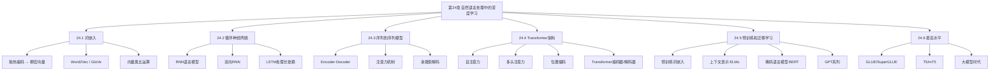
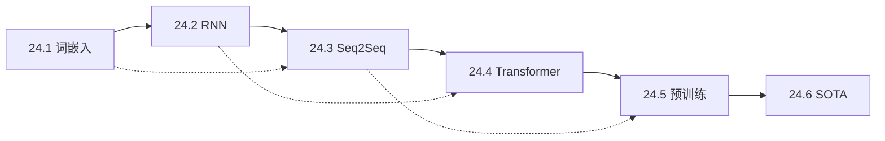
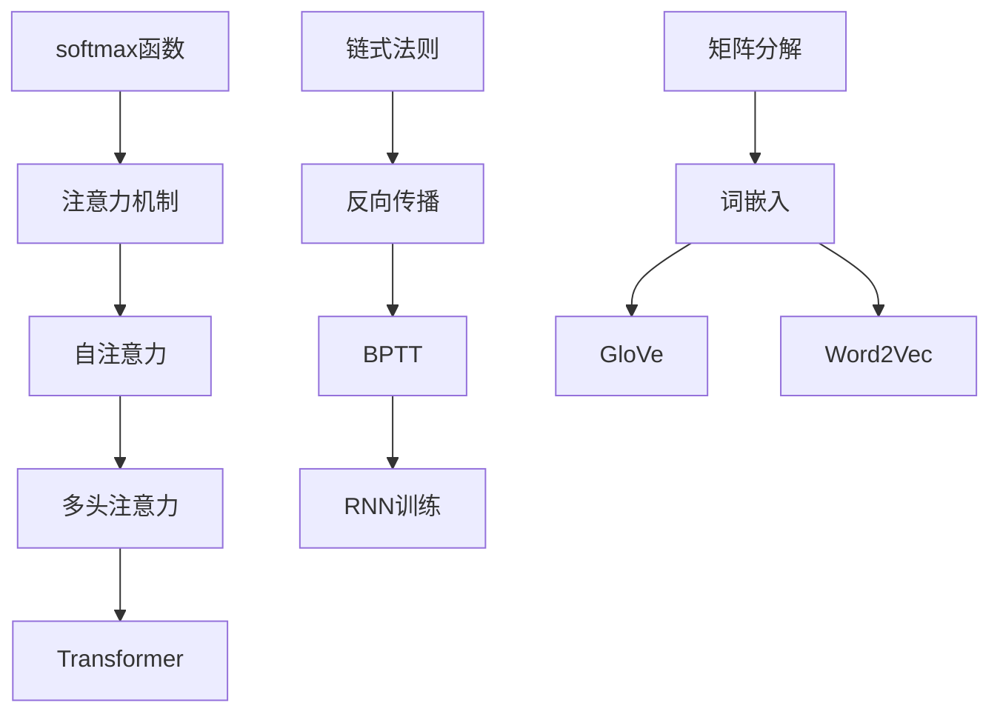

# 第24章 自然语言处理中的深度学习 - 概览

## 学习目标

完成本章学习后，你将能够：

1. **理解词嵌入原理**：掌握词嵌入的基本概念、训练方法（Word2Vec、GloVe）以及向量空间中的语义关系
2. **掌握RNN在NLP中的应用**：理解循环神经网络如何处理序列数据，以及LSTM如何解决长距离依赖问题
3. **理解序列到序列模型**：掌握Encoder-Decoder架构、注意力机制及其在机器翻译中的应用
4. **深入理解Transformer架构**：理解自注意力机制、多头注意力、位置编码等核心组件
5. **掌握预训练和迁移学习**：理解BERT、GPT等预训练模型的原理和应用方法
6. **了解SOTA发展**：掌握NLP领域的最新进展和发展趋势

## 本章速览



## 难度预警

| 章节 | 难度 | 关键挑战 |
|------|------|----------|
| 24.1 词嵌入 | ⭐⭐ | 理解向量空间语义关系 |
| 24.2 RNN | ⭐⭐⭐ | 理解梯度消失/爆炸、BPTT |
| 24.3 Seq2Seq | ⭐⭐⭐⭐ | 注意力机制数学推导 |
| 24.4 Transformer | ⭐⭐⭐⭐⭐ | 自注意力机制、多头注意力 |
| 24.5 预训练 | ⭐⭐⭐⭐ | 理解MLM、NSP等预训练任务 |
| 24.6 SOTA | ⭐⭐⭐ | 跟踪快速发展的新模型 |

## 前置知识

### 必备基础
- **第21章 深度学习**：神经网络基础、反向传播、梯度下降
- **第23章 自然语言处理**：语法、句法分析、语言模型基础
- **线性代数**：矩阵运算、向量空间、点积
- **概率论**：条件概率、贝叶斯定理

### 推荐预习
- Python编程基础
- PyTorch/TensorFlow基本使用

## 节依赖图



## 定理/公式清单

### 核心公式

| 公式名称 | 表达式 | 应用场景 |
|----------|--------|----------|
| 词嵌入类比 | $\vec{D} = \vec{C} + (\vec{B} - \vec{A})$ | 解决"A之于B如C之于?"问题 |
| RNN隐藏状态 | $\mathbf{h}_t = \sigma(W_{hh}\mathbf{h}_{t-1} + W_{xh}\mathbf{x}_t)$ | 序列建模 |
| LSTM门控 | $f_t = \sigma(W_f \cdot [h_{t-1}, x_t] + b_f)$ | 遗忘门计算 |
| 注意力权重 | $\alpha_{ij} = \frac{\exp(e_{ij})}{\sum_k \exp(e_{ik})}$ | 注意力分布 |
| 自注意力 | $\text{Attention}(Q,K,V) = \text{softmax}(\frac{QK^T}{\sqrt{d_k}})V$ | Transformer核心 |
| GloVe损失 | $J = \sum_{i,j} f(X_{ij})(w_i^T \tilde{w}_j - \log X_{ij})^2$ | 词嵌入训练 |

## 核心逻辑线索

### 主线：从离散到连续的语义表示

```
独热编码 → 静态词嵌入 → 上下文词嵌入 → 预训练语言模型
   ↓           ↓            ↓              ↓
稀疏高维    稠密低维     动态表示      通用理解
无语义      有语义       消歧义        迁移学习
```

### 副线：模型架构演进

```
前馈网络 → RNN → LSTM → Seq2Seq+Attention → Transformer
   ↓        ↓      ↓         ↓                ↓
 无记忆   有记忆  长记忆   选择性关注      全局关注
```

## 核心要点速查

### 词嵌入关键性质
- ✅ **语义相似性**：余弦相似度衡量词语语义接近程度
- ✅ **向量运算**：词向量支持加减运算，实现类比推理
- ✅ **多维度语义**：捕捉语法、语义、主题等多层面关系

### RNN vs Transformer

| 特性 | RNN/LSTM | Transformer |
|------|----------|-------------|
| 并行性 | ❌ 顺序处理 | ✅ 完全并行 |
| 长距离依赖 | ⚠️ 梯度问题 | ✅ 直接连接 |
| 位置信息 | 隐式编码 | 显式位置编码 |
| 计算复杂度 | O(n) | O(n²) |

### 预训练模型对比

| 模型 | 架构 | 预训练任务 | 特点 |
|------|------|------------|------|
| Word2Vec | 浅层 | CBOW/Skip-gram | 静态词向量 |
| ELMo | 双向LSTM | 语言模型 | 上下文表示 |
| BERT | Transformer Encoder | MLM + NSP | 双向上下文 |
| GPT | Transformer Decoder | 自回归LM | 单向生成 |
| T5 | Encoder-Decoder | Span Corruption | 文本到文本 |

## 概念对比表

### 词嵌入方法对比

| 方法 | 训练目标 | 上下文考虑 | 代表模型 |
|------|----------|------------|----------|
| 基于计数 | 共现矩阵分解 | 固定窗口 | LSA, GloVe |
| 基于预测 | 预测上下文词 | 固定窗口 | Word2Vec |
| 基于语言模型 | 预测下一个词 | 全序列 | ELMo, GPT |
| 基于掩码 | 预测掩码词 | 双向上下文 | BERT |

### 注意力类型对比

| 类型 | 查询来源 | 键值来源 | 应用场景 |
|------|----------|----------|----------|
| Encoder-Decoder Attention | Decoder | Encoder | 机器翻译 |
| Self-Attention | 同序列 | 同序列 | 表示学习 |
| Masked Self-Attention | 同序列(前向) | 同序列(前向) | 语言生成 |
| Cross-Attention | 同序列 | 另一序列 | 多模态 |

## 定理依赖图



## 常见误解澄清

| 误解 | 真相 |
|------|------|
| "词嵌入维度越高越好" | 维度需权衡：高维表达能力更强，但也更易过拟合、计算成本更高 |
| "BERT是双向的，所以比GPT好" | 两者适用场景不同：BERT适合理解任务，GPT适合生成任务 |
| "注意力权重就是可解释性" | 注意力权重只是相关性的一种度量，不总是对应人类理解的"关注" |
| "预训练模型不需要微调" | 预训练提供通用表示，微调对特定任务性能至关重要 |
| "Transformer完全替代了RNN" | RNN在资源受限、序列较短场景仍有优势 |

## 本章测验

### 快速检测（5分钟）

1. 词嵌入中的"king - man + woman ≈ queen"体现了什么性质？
2. LSTM相比普通RNN主要解决了什么问题？
3. 注意力机制中的Q、K、V分别代表什么？
4. BERT和GPT的主要架构区别是什么？
5. 为什么Transformer需要位置编码？

<details>
<summary>点击查看答案</summary>

1. **向量空间的语义关系保持** - 词嵌入捕捉了性别关系这一语义属性
2. **梯度消失/爆炸和长距离依赖** - 通过门控机制选择性传递信息
3. **Query（查询）、Key（键）、Value（值）** - Q用于查询，K用于匹配，V提供内容
4. **BERT使用Encoder，双向；GPT使用Decoder，单向** - 导致适用任务不同
5. **自注意力本身是无序的** - 需要显式注入位置信息来理解序列顺序
</details>

### 深度思考题

1. 为什么词嵌入能够捕捉语义关系？这种能力的理论上限是什么？
2. 自注意力的计算复杂度是O(n²)，这在处理长文档时有什么问题？有什么改进方法？
3. 预训练-微调范式为什么有效？从表示学习的角度解释。

## 快速复习卡

### 词嵌入
```
核心思想：分布式假设 - "相似词出现在相似上下文"
训练方式：预测上下文 / 矩阵分解
关键属性：语义相似度、类比推理、聚类结构
```

### RNN
```
核心机制：隐藏状态传递历史信息
训练难点：BPTT导致的梯度问题
解决方案：LSTM/GRU门控机制
```

### Transformer
```
核心创新：自注意力取代循环
关键组件：多头注意力、位置编码、残差连接
优势：并行计算、长距离依赖
```

### 预训练
```
核心范式：大规模无监督预训练 + 下游任务微调
典型模型：BERT(理解)、GPT(生成)、T5(转换)
关键突破：上下文表示、迁移学习
```

## 扩展阅读

### 经典论文
1. **Mikolov et al. (2013)** - "Efficient Estimation of Word Representations" (Word2Vec)
2. **Pennington et al. (2014)** - "GloVe: Global Vectors for Word Representation"
3. **Sutskever et al. (2014)** - "Sequence to Sequence Learning with Neural Networks"
4. **Bahdanau et al. (2015)** - "Neural Machine Translation by Jointly Learning to Align and Translate" (注意力机制)
5. **Vaswani et al. (2017)** - "Attention Is All You Need" (Transformer)
6. **Devlin et al. (2019)** - "BERT: Pre-training of Deep Bidirectional Transformers"

### 在线资源
- [The Illustrated Transformer](http://jalammar.github.io/illustrated-transformer/)
- [The Illustrated BERT](http://jalammar.github.io/illustrated-bert/)
- [Hugging Face Transformers文档](https://huggingface.co/docs/transformers/)

---

*本章内容是自然语言处理深度学习的基础，理解这些概念对于跟进最新研究和实践应用至关重要。*
