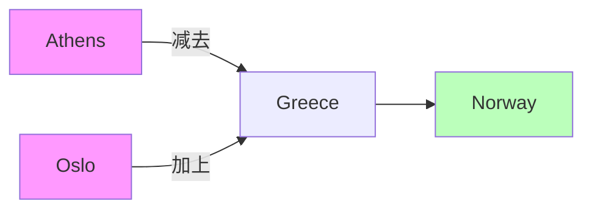
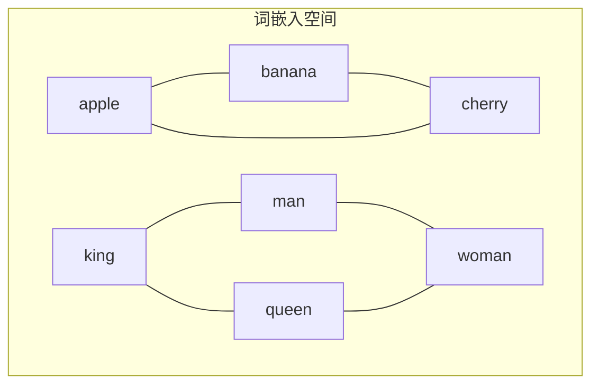

# 24.1 词嵌入

## 背景与动机

### 从独热编码到分布式表示

在自然语言处理中，最基本的任务之一是将离散的词语转换为计算机可以处理的数值形式。最简单的方法是**独热编码（One-Hot Encoding）**：

```
假设词汇表大小为 |V| = 10000
"apple"  = [1, 0, 0, 0, ..., 0]   (第1位为1)
"banana" = [0, 1, 0, 0, ..., 0]   (第2位为1)
"cherry" = [0, 0, 1, 0, ..., 0]   (第3位为1)
```

**独热编码的问题**：
1. **维度灾难**：词汇表通常有数万到数十万个词
2. **语义鸿沟**：任意两个词的向量点积都为0，无法表示相似性
3. **稀疏性**：每个向量只有一位非零，信息密度极低

### 分布假设

词嵌入的核心理论基础来自语言学家 **John R. Firth (1957)** 的名言：

> "You shall know a word by the company it keeps."  
> （要知道一个词的含义，就看它周围的词）

**分布假设**：语义相似的词倾向于出现在相似的上下文中。

## 核心概念

### 词嵌入定义

**词嵌入（Word Embedding）**是将词汇映射到低维连续向量空间的表示方法：

$$\text{embedding}: \text{word} \rightarrow \mathbb{R}^d$$

其中 $d$ 通常是 50-300 维，远小于词汇表大小 $|V|$。

### 词嵌入的关键性质

#### 1. 语义相似性

语义相近的词在向量空间中距离较近：

```
cosine_similarity(embedding("king"), embedding("queen")) ≈ 0.8
cosine_similarity(embedding("king"), embedding("apple")) ≈ 0.1
```

#### 2. 向量类比（Analogical Reasoning）

词嵌入可以捕捉语义关系，通过向量运算解决类比问题：

$$\vec{D} = \vec{C} + (\vec{B} - \vec{A})$$

**经典例子**：
- Athens（雅典）之于 Greece（希腊）就像 Oslo（奥斯陆）之于 **Norway（挪威）**
- 数学表达：$\vec{v}_{\text{Oslo}} + (\vec{v}_{\text{Greece}} - \vec{v}_{\text{Athens}}) \approx \vec{v}_{\text{Norway}}$



## 词嵌入学习算法

### 方法一：基于计数的方法（Count-Based）

#### 共现矩阵

构建词-词共现矩阵 $X$，其中 $X_{ij}$ 表示词 $i$ 和词 $j$ 在固定窗口内共同出现的次数。

**示例**（窗口大小为1）：

语料："the cat sat on the mat"

|       | the | cat | sat | on | mat |
|-------|-----|-----|-----|-----|-----|
| the   | 0   | 1   | 0   | 1   | 1   |
| cat   | 1   | 0   | 1   | 0   | 0   |
| sat   | 0   | 1   | 0   | 1   | 0   |
| on    | 1   | 0   | 1   | 0   | 1   |
| mat   | 1   | 0   | 0   | 1   | 0   |

#### GloVe（Global Vectors）

**核心思想**：利用词-词共现矩阵中的全局统计信息。

**损失函数**：

$$J = \sum_{i,j=1}^{|V|} f(X_{ij})(w_i^T \tilde{w}_j + b_i + \tilde{b}_j - \log X_{ij})^2$$

其中：
- $w_i, \tilde{w}_j$：词 $i$ 和词 $j$ 的词向量（GloVe为每个词学习两组向量）
- $b_i, \tilde{b}_j$：偏置项
- $f(X_{ij})$：权重函数，控制罕见词和常见词的贡献

**权重函数**：

$$f(x) = \begin{cases} (x/x_{\max})^\alpha & \text{if } x < x_{\max} \\ 1 & \text{otherwise} \end{cases}$$

通常 $\alpha = 0.75$，$x_{\max} = 100$。

### 方法二：基于预测的方法（Prediction-Based）

#### Word2Vec

**两种架构**：

1. **CBOW（Continuous Bag of Words）**：用上下文词预测中心词
   ```
   输入：["the", "cat", "on", "the", "mat"]
   输出："sat"
   ```

2. **Skip-gram**：用中心词预测上下文词
   ```
   输入："sat"
   输出：["the", "cat", "on", "the", "mat"]
   ```

**目标函数（Skip-gram）**：

$$\mathcal{L} = \frac{1}{T} \sum_{t=1}^{T} \sum_{-c \leq j \leq c, j \neq 0} \log p(w_{t+j} | w_t)$$

其中条件概率使用softmax：

$$p(w_O | w_I) = \frac{\exp(v_{w_O}'^T v_{w_I})}{\sum_{w=1}^{|V|} \exp(v_w'^T v_{w_I})}$$

**负采样（Negative Sampling）**：

由于softmax分母需要遍历整个词汇表，计算成本太高。负采样将问题转化为二分类：

$$\log \sigma(v_{w_O}'^T v_{w_I}) + \sum_{i=1}^{k} \mathbb{E}_{w_i \sim P_n(w)}[\log \sigma(-v_{w_i}'^T v_{w_I})]$$

### 方法对比

| 特性 | GloVe | Word2Vec |
|------|-------|----------|
| 训练数据 | 全局共现统计 | 局部上下文窗口 |
| 训练速度 | 较快 | 较快（负采样） |
| 内存需求 | 需存储共现矩阵 | 较低 |
| 捕获信息 | 全局统计信息 | 局部上下文模式 |
| 常见用途 | 通用词向量 | 通用词向量 |

## 实践应用：词性标注

### 任务定义

给定句子，为每个词标注其词性（名词、动词、形容词等）。

**示例**：
```
They/PRON cut/VERB the/DET cake/NOUN yesterday/ADV
```

### 基于词嵌入的模型架构

```
输入窗口（w=5）: [w_{t-2}, w_{t-1}, w_t, w_{t+1}, w_{t+2}]
         ↓
    词嵌入查找
         ↓
    [e_{t-2}; e_{t-1}; e_t; e_{t+1}; e_{t+2}] ∈ ℝ^{5d}
         ↓
    全连接层 + ReLU
         ↓
    Softmax分类器
         ↓
    词性标签概率分布
```

**数学表达**：

$$\mathbf{z}_1 = \sigma(W_1 \mathbf{x})$$
$$\mathbf{z}_2 = \sigma(W_2 \mathbf{z}_1)$$
$$\hat{\mathbf{y}} = \text{softmax}(W_{out} \mathbf{z}_2)$$

其中 $\mathbf{x}$ 是5个词嵌入的拼接，$\sigma$ 是非线性激活函数。

### 位置编码的实现

每个词在窗口中的位置决定了它与隐藏层哪部分相乘：

```python
# 伪代码
embedding_matrix = nn.Embedding(vocab_size, embed_dim)
hidden_size = embed_dim * window_size

# 位置1的词嵌入 → 隐藏层第1个位置
# 位置2的词嵌入 → 隐藏层第2个位置
# ...
```

## 预训练词嵌入资源

| 资源 | 特点 | 链接 |
|------|------|------|
| Word2Vec | Google发布的预训练向量 | [code.google.com](https://code.google.com/archive/p/word2vec/) |
| GloVe | Stanford发布，多种维度 | [nlp.stanford.edu](https://nlp.stanford.edu/projects/glove/) |
| fastText | 支持157种语言，子词信息 | [fasttext.cc](https://fasttext.cc/) |

## 可视化与理解

### 降维可视化

使用t-SNE或PCA将高维词向量降维到2D/3D进行可视化：



### 语义聚类

词嵌入空间中的聚类现象：
- **国家聚类**：China, Japan, France, Germany...
- **首都聚类**：Beijing, Tokyo, Paris, Berlin...
- **亲属关系聚类**：father, mother, brother, sister...

## 常见陷阱与注意事项

### 1. 多义词问题

**问题**：传统词嵌入为每个词分配单一向量，无法处理多义词。

**示例**：
- "bank"（银行）vs "bank"（河岸）
- "apple"（苹果）vs "Apple"（公司）

**解决方案**：
- 使用上下文相关的词嵌入（ELMo, BERT）
- 为每个词的每个意义学习不同向量

### 2. 稀有词问题

**问题**：语料中出现次数少的词，词嵌入质量较差。

**缓解策略**：
- 使用子词信息（fastText）
- 回退到字符级模型
- 使用预训练模型并微调

### 3. 偏差问题

**问题**：词嵌入可能反映训练数据中的社会偏见。

**示例**：
- doctor - man + woman ≈ nurse（反映职业性别刻板印象）

**应对**：
- 意识并记录训练数据的来源
- 使用后处理去偏方法
- 在敏感应用中进行偏见审计

## 与其他节的联系

- **24.2 RNN**：词嵌入是RNN语言模型的输入表示
- **24.4 Transformer**：位置编码与词嵌入相加作为输入
- **24.5 预训练**：从静态词嵌入到上下文词嵌入的发展

## 关键公式总结

| 公式 | 说明 |
|------|------|
| $\vec{D} = \vec{C} + (\vec{B} - \vec{A})$ | 词向量类比运算 |
| $J_{GloVe} = \sum_{i,j} f(X_{ij})(w_i^T \tilde{w}_j - \log X_{ij})^2$ | GloVe损失函数 |
| $p(w_O\|w_I) = \frac{\exp(v_{w_O}'^T v_{w_I})}{\sum_w \exp(v_w'^T v_{w_I})}$ | Skip-gram条件概率 |

## 小结

词嵌入是自然语言处理的重要基础技术：

1. **理论基础**：分布假设 - 相似词出现在相似上下文中
2. **核心优势**：低维稠密表示、语义相似性、向量运算
3. **主要方法**：基于计数（GloVe）vs 基于预测（Word2Vec）
4. **应用场景**：词性标注、文本分类、机器翻译等几乎所有NLP任务
5. **发展趋势**：从静态词嵌入向上下文相关表示发展
