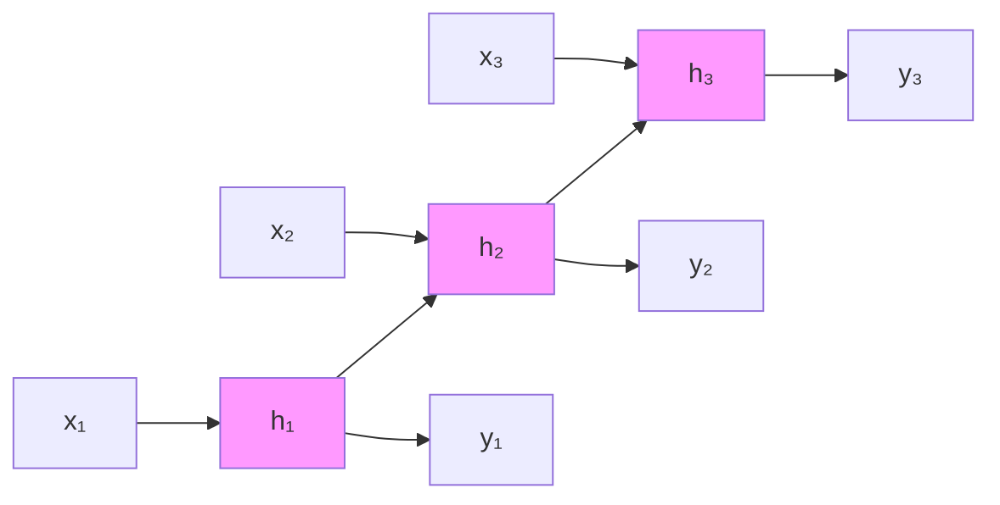
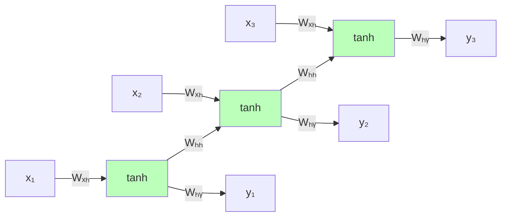
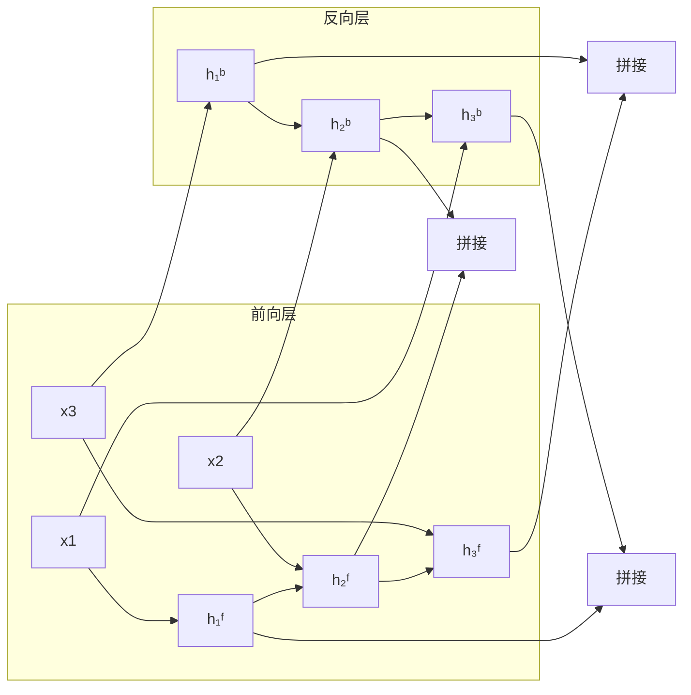

# 24.2 自然语言处理中的循环神经网络

## 背景与动机

### 序列数据的挑战

自然语言是**序列数据** - 词与词之间的顺序和上下文关系至关重要。

**示例**：理解指代消解
```
"Eduardo told me that Miguel was very sick so I took him to the hospital."
```
这里的"him"指代谁？需要理解整个句子的上下文才能确定是"Miguel"。

### 前馈网络的局限

前馈神经网络处理NLP任务的限制：

1. **固定窗口**：只能看到有限上下文（如5个词）
2. **位置不对称**：每个位置的权重不同，"him"在第12个位置学到的规律不适用于其他位置
3. **参数爆炸**：扩大窗口会指数级增加参数量

### 解决方案：循环神经网络

**核心思想**：维护一个"记忆"状态，随序列处理不断更新。



## 核心概念

### RNN基本结构

**数学定义**：

$$\mathbf{h}_t = \sigma(W_{hh}\mathbf{h}_{t-1} + W_{xh}\mathbf{x}_t + \mathbf{b}_h)$$

$$\mathbf{y}_t = W_{hy}\mathbf{h}_t + \mathbf{b}_y$$

其中：
- $\mathbf{x}_t \in \mathbb{R}^{d_{in}}$：时刻 $t$ 的输入（词嵌入）
- $\mathbf{h}_t \in \mathbb{R}^{d_{hidden}}$：时刻 $t$ 的隐藏状态
- $\mathbf{y}_t \in \mathbb{R}^{d_{out}}$：时刻 $t$ 的输出
- $W_{hh}, W_{xh}, W_{hy}$：权重矩阵
- $\sigma$：非线性激活函数（通常用tanh）

### 时间展开

RNN在时间维度上展开形成前馈网络：



**关键特性**：所有时间步共享相同的权重矩阵 $W_{xh}, W_{hh}, W_{hy}$。

## RNN语言模型

### 任务定义

给定词序列 $w_1, w_2, ..., w_T$，计算其联合概率：

$$P(w_1, w_2, ..., w_T) = \prod_{t=1}^{T} P(w_t | w_1, ..., w_{t-1})$$

### RNN实现

**训练过程**：
1. 输入：词嵌入序列 $\mathbf{x}_1, \mathbf{x}_2, ..., \mathbf{x}_T$
2. 目标：下一个词 $w_2, w_3, ..., w_{T+1}$
3. 损失：交叉熵损失

$$\mathcal{L} = -\sum_{t=1}^{T} \log P(w_{t+1} | w_1, ..., w_t)$$

**生成过程**：
```python
# 伪代码
def generate_text(model, start_token, max_length):
    current_token = start_token
    generated = [current_token]
    
    for _ in range(max_length):
        # 前向传播
        output = model(current_token, hidden_state)
        
        # 从softmax分布中采样
        next_token = sample(output)
        
        if next_token == END_TOKEN:
            break
            
        generated.append(next_token)
        current_token = next_token
    
    return generated
```

### 文本生成示例

使用莎士比亚作品训练的RNN生成：

> "Marry, and will, my lord, to weep in such a one were prettiest;  
> Yet now I was adopted heir  
> Of the world's lamentable day,  
> To watch the next way with his father with his face?"

**观察**：局部语法结构合理，但长期语义连贯性较差。

## RNN用于分类任务

### 词性标注（Sequence Labeling）

**架构**：
```
输入序列：["They", "cut", "the", "cake", "yesterday"]
           ↓
        RNN处理
           ↓
输出序列：[PRON, VERB_PAST, DET, NOUN, ADV]
```

**数学表达**：

$$\mathbf{\hat{y}}_t = \text{softmax}(W_{out}\mathbf{h}_t)$$

每个时间步独立预测当前词的标签。

### 双向RNN（Bidirectional RNN）

**动机**：词性标注不仅依赖前文，也依赖后文。

**示例**：
```
"The old man the boat."
```
- 正向处理时，难以确定第二个"man"是动词
- 反向处理时，看到"boat"有助于判断"man"是动词（驾船）

**架构**：



**隐藏状态计算**：

$$\overrightarrow{\mathbf{h}}_t = \text{RNN}_{\text{forward}}(\mathbf{x}_t, \overrightarrow{\mathbf{h}}_{t-1})$$

$$\overleftarrow{\mathbf{h}}_t = \text{RNN}_{\text{backward}}(\mathbf{x}_t, \overleftarrow{\mathbf{h}}_{t+1})$$

$$\mathbf{h}_t = [\overrightarrow{\mathbf{h}}_t; \overleftarrow{\mathbf{h}}_t]$$

### 句子级分类

**情感分析示例**：

输入："This movie was poorly written and poorly acted"
输出：负面情感（Negative）

**池化策略**：

1. **最后隐藏状态**：$\mathbf{h}_{final}$
2. **平均池化**：$\tilde{\mathbf{z}} = \frac{1}{T}\sum_{t=1}^{T} \mathbf{h}_t$
3. **最大池化**：$\tilde{\mathbf{z}}_i = \max_t \mathbf{h}_{t,i}$

## LSTM：长短期记忆网络

### 动机：梯度消失问题

**问题**：RNN难以捕捉长距离依赖。

**原因**：反向传播时，梯度需要经过多个时间步的连乘：

$$\frac{\partial \mathcal{L}}{\partial W} = \frac{\partial \mathcal{L}}{\partial \mathbf{h}_T} \cdot \frac{\partial \mathbf{h}_T}{\partial \mathbf{h}_{T-1}} \cdots \frac{\partial \mathbf{h}_1}{\partial W}$$

如果雅可比矩阵的特征值小于1，梯度会指数级衰减（**梯度消失**）；如果大于1，会指数级增长（**梯度爆炸**）。

### LSTM架构

**核心思想**：通过门控机制控制信息的流动。

```mermaid
graph TB
    subgraph LSTM单元
    C_prev[C_{t-1}] --> ft[遗忘门]
    C_prev --> Ct[C_t]
    
    x_t --> ft
    h_prev[h_{t-1}] --> ft
    
    x_t --> it[输入门]
    h_prev --> it
    
    x_t --> gt[候选状态]
    h_prev --> gt
    
    x_t --> ot[输出门]
    h_prev --> ot
    
    ft --> Ct
    it --> mul1[*]
    gt --> mul1
    mul1 --> Ct
    
    Ct --> tanh[tanh]
    ot --> mul2[*]
    tanh --> mul2
    mul2 --> h_t[h_t]
    
    Ct --> C_out[C_t输出]
    end
```

### 门控机制

**遗忘门**（决定丢弃哪些信息）：

$$\mathbf{f}_t = \sigma(W_f \cdot [\mathbf{h}_{t-1}, \mathbf{x}_t] + \mathbf{b}_f)$$

**输入门**（决定存储哪些新信息）：

$$\mathbf{i}_t = \sigma(W_i \cdot [\mathbf{h}_{t-1}, \mathbf{x}_t] + \mathbf{b}_i)$$

$$\tilde{\mathbf{C}}_t = \tanh(W_C \cdot [\mathbf{h}_{t-1}, \mathbf{x}_t] + \mathbf{b}_C)$$

**细胞状态更新**：

$$\mathbf{C}_t = \mathbf{f}_t \odot \mathbf{C}_{t-1} + \mathbf{i}_t \odot \tilde{\mathbf{C}}_t$$

**输出门**（决定输出什么）：

$$\mathbf{o}_t = \sigma(W_o \cdot [\mathbf{h}_{t-1}, \mathbf{x}_t] + \mathbf{b}_o)$$

$$\mathbf{h}_t = \mathbf{o}_t \odot \tanh(\mathbf{C}_t)$$

### LSTM解决长距离依赖

**示例任务**：
```
"The athletes, who all won their local qualifiers and advanced to 
the finals in Tokyo, now ___"
```

**主谓一致**：空白处应填"compete"（复数），与"athletes"一致。

LSTM通过**细胞状态**直接传递主语信息，跳过中间从句。

## 训练细节

### BPTT（Backpropagation Through Time）

**算法步骤**：

1. **前向传播**：展开RNN，计算所有时间步的输出
2. **计算损失**：每个时间步的损失累加
3. **反向传播**：沿时间反向计算梯度
4. **参数更新**：由于权重共享，梯度累加后更新

**截断BPTT**：

对于长序列，限制反向传播的步数（如只回溯20步）：

```python
# 伪代码
max_truncate = 20

for t in range(T, 0, -1):
    if T - t > max_truncate:
        break
    # 计算梯度...
```

### 梯度裁剪（Gradient Clipping）

防止梯度爆炸：

$$\text{if } \|\mathbf{g}\| > \text{threshold:}$$
$$\mathbf{g} \leftarrow \frac{\text{threshold}}{\|\mathbf{g}\|} \cdot \mathbf{g}$$

## 与其他节的联系

| 概念 | 联系 |
|------|------|
| 24.1 词嵌入 | RNN的输入是词嵌入序列 |
| 24.3 Seq2Seq | RNN是Seq2Seq的基本组件 |
| 21.6 RNN基础 | 本章是RNN在NLP的具体应用 |

## 关键公式总结

| 公式 | 说明 |
|------|------|
| $\mathbf{h}_t = \sigma(W_{hh}\mathbf{h}_{t-1} + W_{xh}\mathbf{x}_t)$ | RNN隐藏状态更新 |
| $\mathbf{f}_t = \sigma(W_f[\mathbf{h}_{t-1}, \mathbf{x}_t])$ | LSTM遗忘门 |
| $\mathbf{C}_t = \mathbf{f}_t \odot \mathbf{C}_{t-1} + \mathbf{i}_t \odot \tilde{\mathbf{C}}_t$ | LSTM细胞状态更新 |
| $\mathbf{h}_t = \mathbf{o}_t \odot \tanh(\mathbf{C}_t)$ | LSTM隐藏状态输出 |

## 小结

RNN及其变体是处理序列数据的基础架构：

1. **核心优势**：
   - 处理任意长度的序列
   - 参数共享，模型大小与序列长度无关
   - 理论上可捕获任意长距离依赖

2. **主要局限**：
   - 梯度消失/爆炸问题
   - 顺序计算，难以并行
   - 长距离依赖仍具挑战（部分由LSTM缓解）

3. **关键变体**：
   - **双向RNN**：利用未来上下文
   - **LSTM/GRU**：通过门控机制改善长距离依赖

4. **应用场景**：
   - 语言模型
   - 序列标注（词性标注、命名实体识别）
   - 文本分类
   - 机器翻译（Encoder部分）
