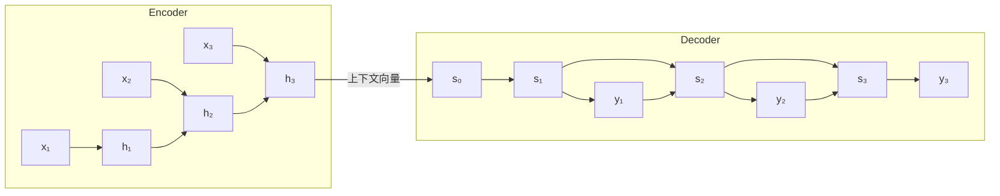
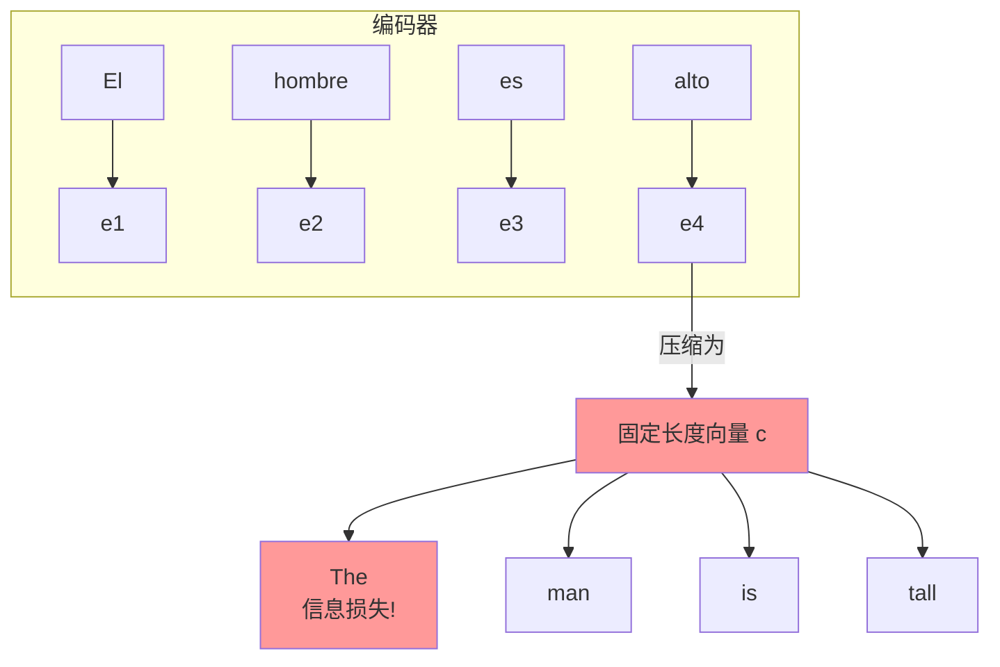
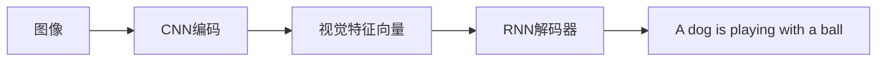

# 24.3 序列到序列模型

## 背景与动机

### 机器翻译的挑战

机器翻译是将源语言句子转换为目标语言句子的任务：

**示例**（西班牙语 → 英语）：
```
源语言："La puerta de entrada es roja"
目标语言："The front door is red"
```

**核心难点**：

1. **长度差异**：源语言和目标语言句子长度不同
2. **词序重排**：西班牙语"puerta de entrada"对应英语"front door"（顺序颠倒）
3. **非一一对应**：西班牙语3个词"caballo de mar"对应英语1个词"seahorse"
4. **长距离依赖**：句首的词可能需要与句末的词建立联系

### 传统方法的局限

**统计机器翻译（SMT）**：
- 依赖人工设计的特征
- 复杂的多模块管道
- 难以捕捉深层语义

### 神经网络解决方案

**序列到序列（Sequence-to-Sequence, Seq2Seq）**架构：



## 核心概念

### Encoder-Decoder架构

**编码器（Encoder）**：
- 将源语言句子压缩为固定维度的上下文向量
- 通常使用RNN或LSTM

$$\mathbf{h}_t^{enc} = \text{LSTM}(\mathbf{x}_t, \mathbf{h}_{t-1}^{enc})$$

**上下文向量**：

$$\mathbf{c} = \mathbf{h}_T^{enc}$$

**解码器（Decoder）**：
- 以上下文向量为初始状态
- 自回归生成目标语言序列

$$\mathbf{h}_t^{dec} = \text{LSTM}(\mathbf{y}_{t-1}, \mathbf{h}_{t-1}^{dec})$$

$$P(y_t | y_{<t}, \mathbf{x}) = \text{softmax}(W_{out}\mathbf{h}_t^{dec})$$

### 训练过程

**Teacher Forcing**：

训练时使用真实的标签作为解码器的输入，而非上一时刻的预测：

```
时间步1：输入 <START>，目标 "The"
时间步2：输入 "The"（真实标签），目标 "front"
时间步3：输入 "front"（真实标签），目标 "door"
...
```

**损失函数**：

$$\mathcal{L} = -\sum_{t=1}^{T_{target}} \log P(y_t^* | y_{<t}^*, \mathbf{x})$$

其中 $y_t^*$ 是真实的目标词。

## 注意力机制

### 动机

**瓶颈问题**：



长句子的信息被压缩到固定向量中，导致信息损失。

### 注意力原理

**核心思想**：解码时动态关注源句子的不同部分。

**注意力计算过程**：

```mermaid
graph LR
    s[Decoder状态 s_{t-1}] --> score[计算注意力分数]
    h[Encoder隐藏状态 h_j] --> score
    
    score --> softmax[Softmax归一化]
    softmax --> alpha[注意力权重 α_tj]
    
    alpha --> weighted[加权求和]
    h --> weighted
    weighted --> c[上下文向量 c_t]
    
    c --> concat[拼接]
    s --> concat
    concat --> output[输出]
```

### 注意力分数计算

**点积注意力（Dot-Product Attention）**：

$$e_{tj} = \mathbf{s}_{t-1}^T \mathbf{h}_j$$

**缩放点积注意力（Scaled Dot-Product）**：

$$e_{tj} = \frac{\mathbf{s}_{t-1}^T \mathbf{h}_j}{\sqrt{d}}$$

**注意力权重**：

$$\alpha_{tj} = \frac{\exp(e_{tj})}{\sum_{k=1}^{T_{source}} \exp(e_{tk})}$$

**上下文向量**：

$$\mathbf{c}_t = \sum_{j=1}^{T_{source}} \alpha_{tj} \mathbf{h}_j$$

### 注意力Decoder更新

$$\mathbf{h}_t = \text{LSTM}([\mathbf{y}_{t-1}; \mathbf{c}_t], \mathbf{h}_{t-1})$$

其中 $[\cdot; \cdot]$ 表示向量拼接。

### 注意力可视化

**示例**：英语 → 德语翻译

```
Source: "The front door is red"
Target: "Die Eingangstür ist rot"

注意力矩阵：
        Die  Eingangs-  tür  ist  rot
The     0.8   0.1      0.0  0.0  0.0
front   0.1   0.7      0.1  0.0  0.0
door    0.0   0.1      0.8  0.0  0.0
is      0.0   0.0      0.0  0.9  0.0
red     0.0   0.0      0.0  0.0  1.0
```

深色表示高注意力权重，可以看到德语复合词"Eingangstür"（入口门）分别对应英语"front"和"door"。

## 解码策略

### 贪心解码（Greedy Decoding）

**算法**：
每一步选择概率最高的词：

$$\hat{y}_t = \arg\max_{y} P(y | \hat{y}_{<t}, \mathbf{x})$$

**问题**：
- 局部最优 ≠ 全局最优
- 没有纠错机制

**示例**：
```
西班牙语 → 英语
"La puerta de entrada es roja"

贪心选择：
Step 1: "La" → "The" ✓
Step 2: 选择 "front" → 得到 "The front"
         但接下来难以正确生成 "door"
         
最优选择：
"La" → "The"
"puerta" → "door" 
"de entrada" → "front"
"es" → "is"
"roja" → "red"
```

### 束搜索（Beam Search）

**核心思想**：保留 $k$ 个最优假设，而非仅保留1个。

**算法步骤**：

```
初始化：Beam = [(<START>, score=0)]

对于每个时间步：
    1. 扩展：每个假设生成词汇表中所有词的候选
    2. 评分：计算新假设的累积分数
    3. 剪枝：只保留分数最高的 k 个假设
    
直到所有假设都生成 <END> 标记
```

**示例**（Beam size = 2）：

```
Step 1:
候选：("The", -0.5), ("A", -1.2), ("This", -1.8), ...
保留：("The", -0.5), ("A", -1.2)

Step 2:
从"The"扩展：("The front", -1.0), ("The door", -1.3), ...
从"A"扩展：("A front", -1.8), ("A door", -2.0), ...
保留：("The front", -1.0), ("The door", -1.3)

Step 3:
从"The front"扩展：("The front door", -1.5), ...
从"The door"扩展：("The door front", -2.5), ...
保留：("The front door", -1.5), ...
```

**束大小选择**：
- 机器翻译：4-8
- 早期统计翻译：100+（现代神经网络更精确，可用更小的束）

## Seq2Seq的局限与改进

### 三个主要问题

1. **邻近上下文偏差（Nearby Context Bias）**
   - 隐藏状态更新时会替换部分旧信息
   - 近期上下文权重过高

2. **固定上下文大小限制**
   - 上下文向量维度固定（如1024维）
   - 长句子信息压缩损失

3. **顺序处理限制**
   - RNN必须顺序处理
   - 无法充分利用并行计算

### 改进方向

| 问题 | 解决方案 |
|------|----------|
| 邻近偏差 | 注意力机制 |
| 固定上下文 | Transformer的自注意力 |
| 顺序处理 | Transformer的并行计算 |

## 应用扩展

### 文本摘要

**任务**：将长文本压缩为短文本，保留关键信息。

**示例**：
```
输入（长文）：
"Scientists have discovered a new species of frog in the Amazon 
rainforest. The frog, which has bright blue skin and can change 
color, was found by a team of researchers from..."

输出（摘要）：
"New color-changing frog species discovered in Amazon."
```

**挑战**：
- 需要理解全文
- 生成新词而非复制
- 保持语义一致性

### 对话系统

**任务**：根据上下文生成回复。

**编码**：
```
输入："你好，今天天气怎么样？"
上下文：[历史对话...]
输出："今天天气不错，阳光明媚！"
```

### 图像描述生成

**多模态应用**：



## 关键公式总结

| 公式 | 说明 |
|------|------|
| $\mathbf{c}_t = \sum_{j} \alpha_{tj} \mathbf{h}_j$ | 注意力上下文向量 |
| $\alpha_{tj} = \frac{\exp(e_{tj})}{\sum_k \exp(e_{tk})}$ | 注意力权重 |
| $e_{tj} = \mathbf{s}_{t-1}^T \mathbf{h}_j$ | 注意力分数（点积） |
| $\mathcal{L} = -\sum_t \log P(y_t^* \| y_{<t}^*, \mathbf{x})$ | 训练损失 |

## 与其他节的联系

| 章节 | 联系 |
|------|------|
| 24.2 RNN | Seq2Seq基于RNN/LSTM构建 |
| 24.4 Transformer | Transformer是Seq2Seq的升级版 |
| 24.5 预训练 | T5等模型使用Seq2Seq架构进行预训练 |

## 小结

序列到序列模型是神经机器翻译的突破：

1. **核心贡献**：
   - 端到端学习，无需人工设计特征
   - 编码器-解码器架构处理变长序列
   - 注意力机制解决信息瓶颈

2. **注意力机制**：
   - 动态关注源序列的相关部分
   - 可解释的权重分布
   - 缓解长距离依赖问题

3. **解码策略**：
   - 贪心解码：快速但次优
   - 束搜索：平衡效率和质量

4. **历史意义**：
   - 神经机器翻译误差降低60%
   - 开启NLP深度学习时代
   - 为Transformer奠定基础
