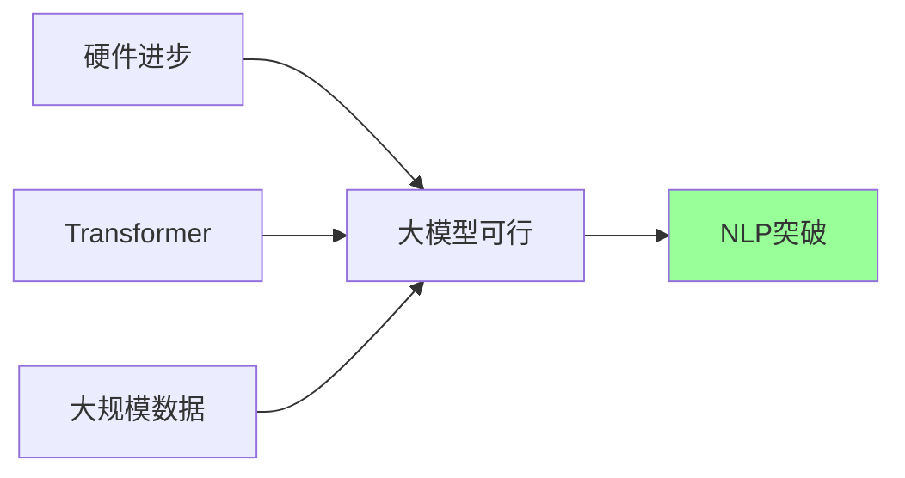

# 24.6 最高水平（SOTA）

## ImageNet时刻

### 什么是"ImageNet时刻"

2012年，深度学习在ImageNet图像识别竞赛中取得突破性进展，标志着计算机视觉进入深度学习时代。

**2018年，NLP领域迎来自己的"ImageNet时刻"**：
- 迁移学习在NLP任务上表现优异
- 预训练模型可下载并针对特定任务微调
- 多项任务达到或超过人类水平

### 关键驱动力



1. **硬件进步**：GPU/TPU普及，计算能力大幅提升
2. **Transformer**：高效并行训练，强长距离依赖建模
3. **大规模数据**：Common Crawl等项目提供海量文本

## 里程碑模型

### GPT-2：语言模型的力量

**规格**：
- 参数量：15亿
- 训练数据：40GB互联网文本
- 架构：Transformer Decoder

**能力展示**：

给定提示生成连贯文本：
```
提示："It is a truth universally acknowledged that"

GPT-2生成：
"the earth is not the center of the universe. There are 
those who assert there is. I do not accept them, but 
others I consider to be of the same opinion..."
```

**特点**：
- 无需微调，零样本（Zero-shot）即可完成任务
- 法英翻译、问答、指代消解等任务表现良好
- 展示了规模的力量

### RoBERTa：BERT的优化

**改进点**：
1. **更多数据**：160GB（BERT使用16GB）
2. **更大batch**：8K（BERT使用256）
3. **更长训练**：500K步
4. **移除NSP**：仅使用MLM任务
5. **动态掩码**：每次epoch使用不同mask

**效果**：
- GLUE基准测试：超越人类基准
- 问答和阅读理解：SOTA表现

### T5：统一的Text-to-Text框架

**预训练**：
- 数据：C4（Colossal Clean Crawled Corpus），750GB
- 任务：Span Corruption

**评估**：
- GLUE：89.3分（人类基线89.8分）
- 在3个任务上超越人类：
  - 是/否问答
  - 阅读理解（段落）
  - 阅读理解（新闻文章）

### 后续发展

| 模型 | 年份 | 特点 |
|------|------|------|
| GPT-3 | 2020 | 175B参数，少样本学习 |
| Gopher | 2021 | 280B参数，DeepMind |
| Chinchilla | 2022 | 优化数据/参数比例 |
| PaLM | 2022 | 540B参数，Google |
| GPT-4 | 2023 | 多模态，推理能力大幅提升 |
| Claude | 2023 | Anthropic，安全性设计 |

## 评估基准

### GLUE：通用语言理解评估

**组成**（9个任务）：
- 单句任务：CoLA（语法判断）、SST-2（情感分析）
- 相似性/释义：MRPC、QQP、STS-B
- 推理任务：MNLI、QNLI、RTE、WNLI

**评价方式**：所有任务平均得分

### SuperGLUE：更具挑战性

**动机**：GLUE任务对人类太简单，模型分数饱和

**特点**：
- 人工设计，对人类容易但对模型难
- 包含阅读理解、指代消解、常识推理
- 人类基线显著高于GLUE

### 其他重要基准

| 基准 | 任务类型 | 代表模型表现 |
|------|----------|-------------|
| SQuAD | 阅读理解 | F1 > 90% |
| WMT | 机器翻译 | BLEU持续提升 |
| SNLI/MNLI | 自然语言推理 | 准确率>90% |
| Winograd Schema | 常识推理 | 持续提升中 |

## 当前研究前沿

### 1. 长上下文建模

**问题**：Transformer的$O(n^2)$复杂度限制上下文长度

**解决方案**：
- **Reformer**：使用LSH注意力，复杂度降至$O(n\log n)$
- **Longformer**：局部+全局注意力，可处理100万token
- **BigBird**：随机+窗口+全局注意力

### 2. 知识增强

**问题**：预训练模型缺乏结构化知识

**方向**：
- 知识图谱注入
- 检索增强生成（RAG）
- 工具使用能力

### 3. 多模态学习

**CLIP**：连接图像和文本
```
图像编码器 + 文本编码器 → 对比学习
应用：零样本图像分类、图像检索
```

**DALL-E/GPT-4V**：
- 文本生成图像
- 图像理解+文本生成

### 4. 高效微调

**Prompt Tuning**：
- 冻结模型参数
- 只训练输入前添加的soft prompt

**LoRA**：
- 低秩适应，减少可训练参数
- 保持性能的同时大幅降低计算成本

### 5. 对齐与安全

**RLHF（基于人类反馈的强化学习）**：
1. 收集人类偏好数据
2. 训练奖励模型
3. 使用PPO等算法微调策略

**应用**：
- ChatGPT、Claude等对话系统
- 减少有害输出
- 提高指令遵循能力

## 混合方法的未来

### 符号与神经的融合

**神经符号AI**：
- 结合深度学习的模式识别能力
- 结合符号系统的可解释性和推理能力

**示例**：
- 注意力机制改进句法分析器（Kitaev & Klein, 2018）
- SLING系统：直接解析到语义框架

### 语言学知识的重新引入

**趋势**：
- 显式语法建模
- 句法约束的神经模型
- 语言学特征指导注意力

## 与人类水平的差距

### 已超越人类的任务

- ImageNet图像分类
- 某些阅读理解数据集
- 特定领域的问答

### 仍落后人类的任务

1. **常识推理**：
   ```
   Q: "Gary bought a new bag. Where is the bag now?"
   人类：可能在Gary家或他手上
   模型：难以准确回答
   ```

2. **多步推理**：
   - 复杂数学问题
   - 长链逻辑推理

3. **因果关系**：
   - 理解"如果...那么..."
   - 反事实推理

4. **指代消解**（复杂场景）：
   - 长距离指代
   - 多轮对话中的指代

### 数据效率差距

| 能力 | 人类 | 模型 |
|------|------|------|
| 学习样本 | 数十例 | 数百万例 |
| 泛化能力 | 强 | 有限 |
| 概念抽象 | 强 | 弱 |

**关键问题**：
模型阅读了人类一辈子都无法阅读的数千倍文本后，仍落后于人类。这表明我们还需要：
- 更好的学习算法
- 更有效的知识表示
- 更接近人类的学习方式

## 未来发展方向

### 短期（1-3年）

1. **上下文扩展**：百万级token上下文
2. **多模态统一**：文本、图像、音频、视频的统一模型
3. **工具使用**：模型自主调用外部工具（搜索引擎、计算器、代码解释器）

### 中期（3-5年）

1. **持续学习**：模型可以不断更新知识而不遗忘
2. **少样本学习**：从几个例子快速学习新任务
3. **可解释性**：理解模型的推理过程

### 长期（5年以上）

1. **通用人工智能（AGI）**：
   - 跨领域泛化
   - 自主学习和发现

2. **世界模型**：
   - 对物理世界的理解
   - 因果推理能力

## 关键观察

### 规模定律（Scaling Laws）

**发现**：
- 模型性能随规模（参数、数据、计算）可预测地提升
- 对数-线性关系

**公式**（简化）：

$$L(N) = \left(\frac{N_c}{N}\right)^{\alpha_N}$$

其中 $N$ 是参数数量，$L$ 是损失。

**启示**：
- 规模仍是提升性能的有效途径
- 但效率（每参数性能）同样重要

### 涌现能力（Emergent Abilities）

**现象**：某些能力在模型达到一定规模后才突然出现

**示例**：
- 上下文学习（In-context learning）
- 思维链推理（Chain-of-thought reasoning）
- 指令遵循

**意义**：难以通过小规模实验预测大模型能力

## 小结

NLP领域正处于快速发展期：

1. **当前成就**：
   - 多项任务达到或超越人类水平
   - 统一预训练-微调范式成熟
   - 大规模模型展现强大能力

2. **持续挑战**：
   - 常识推理
   - 数据效率
   - 可解释性和安全性

3. **未来方向**：
   - 更大规模和更高效率
   - 多模态和工具使用
   - 符号与神经的融合

4. **核心洞察**：
   - 规模带来质变（涌现能力）
   - 预训练+微调是主流范式
   - 与人类水平仍有差距，需要新的突破
