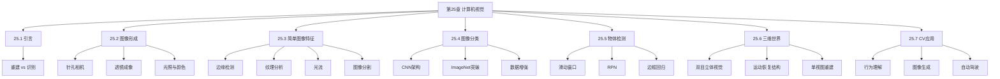
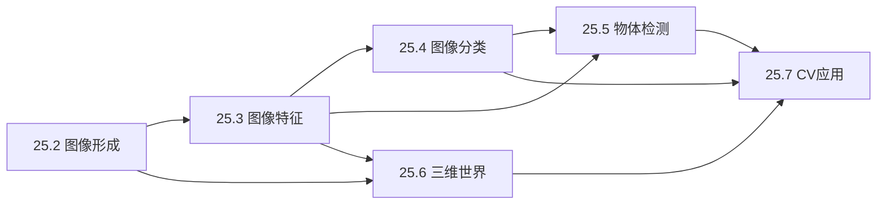
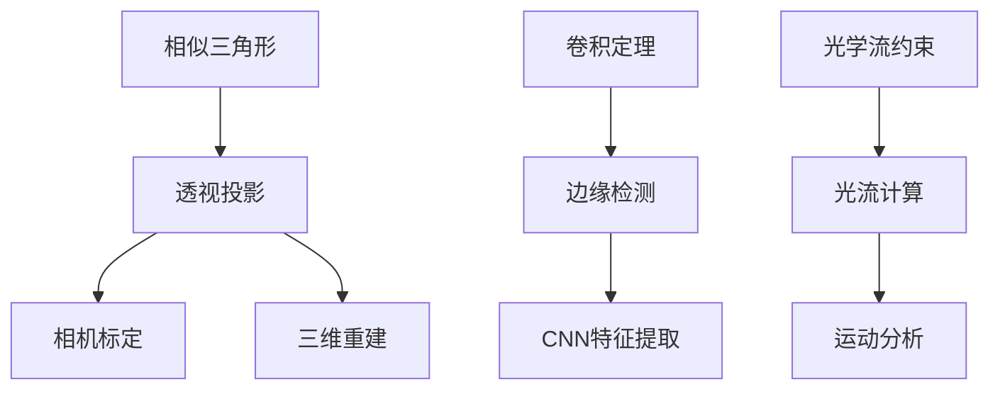

# 第25章 计算机视觉 - 概览

## 学习目标

完成本章学习后，你将能够：

1. **理解图像形成原理**：掌握针孔相机、透镜成像、透视投影等基础光学知识
2. **掌握图像特征提取**：理解边缘检测、纹理分析、光流计算等低级视觉处理
3. **理解图像分类**：掌握卷积神经网络（CNN）在图像分类中的应用原理
4. **掌握物体检测**：理解RPN、Fast R-CNN、非极大值抑制等检测技术
5. **理解三维视觉**：掌握双目立体视觉、运动恢复结构等三维重建方法
6. **了解CV应用**：理解人类行为理解、图像生成、自动驾驶等前沿应用

## 本章速览



## 难度预警

| 章节 | 难度 | 关键挑战 |
|------|------|----------|
| 25.2 图像形成 | ⭐⭐ | 理解透视投影几何 |
| 25.3 图像特征 | ⭐⭐⭐ | 卷积运算和边缘检测算法 |
| 25.4 图像分类 | ⭐⭐⭐ | CNN架构设计和训练技巧 |
| 25.5 物体检测 | ⭐⭐⭐⭐ | 多任务学习和边框回归 |
| 25.6 三维世界 | ⭐⭐⭐⭐ | 多视图几何和深度估计 |
| 25.7 CV应用 | ⭐⭐⭐ | 理解多技术融合 |

## 前置知识

### 必备基础
- **线性代数**：矩阵运算、特征值分解
- **微积分**：梯度、偏导数
- **概率论**：概率分布、贝叶斯定理
- **第21章 深度学习**：神经网络基础、反向传播

### 推荐预习
- 基础光学知识
- Python图像处理（OpenCV/PIL）

## 节依赖图



## 定理/公式清单

### 核心公式

| 公式名称 | 表达式 | 应用场景 |
|----------|--------|----------|
| 透视投影 | $x = -f\frac{X}{Z}, y = -f\frac{Y}{Z}$ | 3D到2D投影 |
| 兰伯特定律 | $I = \rho I_0 \cos\theta$ | 光照模型 |
| 高斯滤波 | $G_\sigma(x,y) = \frac{1}{2\pi\sigma^2}e^{-\frac{x^2+y^2}{2\sigma^2}}$ | 图像平滑 |
| 梯度计算 | $\nabla I = \left(\frac{\partial I}{\partial x}, \frac{\partial I}{\partial y}\right)$ | 边缘检测 |
| SSD光流 | $SSD(D_x, D_y) = \sum_{(x,y)}[I(x,y,t) - I(x+D_x, y+D_y, t+D_t)]^2$ | 光流估计 |
| 视差与深度 | $Z = \frac{fb}{d}$ | 立体视觉 |

## 核心逻辑线索

### 主线：从像素到语义的理解层次

```
原始像素 → 低级特征 → 中级特征 → 高级语义
    ↓          ↓           ↓          ↓
 RGB值     边缘/纹理   物体部件    完整物体
  矩阵      梯度/滤波    CNN特征    检测/分类
```

### 副线：从2D到3D的几何推理

```
单视图 → 多视图 → 深度图 → 3D模型
   ↓        ↓        ↓        ↓
 线索    立体匹配  深度估计  表面重建
```

## 核心要点速查

### 成像模型对比

| 模型 | 投影方程 | 适用场景 |
|------|----------|----------|
| 针孔相机 | $x = -fX/Z$ | 理想模型、几何分析 |
| 透视投影 | 同上 | 一般相机建模 |
| 正交投影 | $x = X, y = Y$ | 远距离小物体 |
| 缩放正交 | $x = sX, y = sY$ | 中等距离物体 |

### 边缘检测步骤

```
1. 高斯平滑（降噪）
2. 计算梯度幅值和方向
3. 非极大值抑制（细化边缘）
4. 双阈值检测（确定边缘）
5. 边缘连接
```

### CNN层次结构

| 层 | 功能 | 输出变化 |
|----|------|----------|
| 卷积层 | 特征提取 | 高×宽↓，通道↑ |
| 激活层 | 非线性 | 维度不变 |
| 池化层 | 降采样 | 高×宽↓ |
| 全连接层 | 分类 | 展平为一维 |

## 概念对比表

### 主动视觉 vs 被动视觉

| 特性 | 主动视觉 | 被动视觉 |
|------|----------|----------|
| 光源 | 自己发射（激光/雷达） | 依赖环境光 |
| 例子 | 激光雷达、结构光 | 普通相机、人眼 |
| 优点 | 可控、准确 | 自然、普遍 |
| 缺点 | 成本高、能耗大 | 受环境限制 |

### 重建 vs 识别

| 任务 | 目标 | 方法 |
|------|------|------|
| 重建 | 恢复3D结构 | 几何计算、多视图 |
| 识别 | 确定物体类别 | 特征匹配、深度学习 |

## 定理依赖图



## 常见误解澄清

| 误解 | 真相 |
|------|------|
| "像素值直接反映物体颜色" | 像素值受光照、相机响应函数、白平衡等多重因素影响 |
| "边缘就是物体的边界" | 边缘可能来自深度不连续、表面法向变化、阴影、纹理等多种原因 |
| "CNN看到的和人眼一样" | CNN依赖统计模式，可能对对抗样本敏感，感知方式与人眼不同 |
| "深度图就是三维模型" | 深度图是2.5D表示，缺少被遮挡部分的信息 |
| "更多层总是更好" | 过深的网络可能导致优化困难，需要残差连接等技术 |

## 本章测验

### 快速检测（5分钟）

1. 针孔相机的成像为什么上下左右颠倒？
2. 卷积神经网络中，卷积层和池化层分别起什么作用？
3. 双目立体视觉如何计算深度？
4. 非极大值抑制在物体检测中的作用是什么？
5. 风格迁移是如何分离"内容"和"风格"的？

<details>
<summary>点击查看答案</summary>

1. **光线直线传播，穿过小孔后在另一侧倒像** - 这是针孔相机的基本光学原理
2. **卷积层提取局部特征，池化层降采样减少计算量** - 卷积学习滤波器，池化提供平移不变性
3. **通过匹配左右图像对应点，利用视差与深度成反比的关系** - $Z = fb/d$
4. **去除重复检测框，保留最佳检测结果** - 避免同一物体被多次检测
5. **利用CNN不同层：浅层表示风格，深层表示内容** - Gram矩阵捕获风格，特征图捕获内容
</details>

### 深度思考题

1. 为什么CNN在图像任务上表现优异？从图像的局部性和平移不变性角度分析。
2. 自动驾驶中的视觉系统面临哪些特殊挑战？与普通图像分类有何不同？
3. 深度学习方法与传统计算机视觉方法（如SIFT、HOG）相比有何优劣？

## 快速复习卡

### 成像几何
```
针孔模型：x = -fX/Z
消失点：平行线在图像中的交点
景深：清晰成像的深度范围
```

### 图像特征
```
边缘：亮度剧烈变化处
纹理：局部模式的重复
光流：像素的 apparent motion
分割：像素聚类为区域
```

### CNN
```
局部连接：每个神经元只看局部区域
权重共享：同一卷积核遍历全图
层次特征：浅层边缘，深层语义
```

### 3D视觉
```
双目：视差→深度
SfM：运动→结构
单视图：学习→深度
```

## 扩展阅读

### 经典论文
1. **Lowe (1999)** - "Object Recognition from Local Scale-Invariant Features" (SIFT)
2. **Krizhevsky et al. (2012)** - "ImageNet Classification with Deep CNN" (AlexNet)
3. **Girshick et al. (2014)** - "Rich Feature Hierarchies for Accurate Object Detection" (R-CNN)
4. **He et al. (2016)** - "Deep Residual Learning for Image Recognition" (ResNet)
5. **Redmon et al. (2016)** - "You Only Look Once: Unified, Real-Time Object Detection" (YOLO)

### 在线资源
- [CS231n: Convolutional Neural Networks for Visual Recognition](http://cs231n.stanford.edu/)
- [OpenCV官方文档](https://docs.opencv.org/)
- [Distill.pub可视化解释](https://distill.pub/)

---

*计算机视觉是人工智能最活跃的领域之一，理解本章内容对跟进最新研究和应用开发至关重要。*
