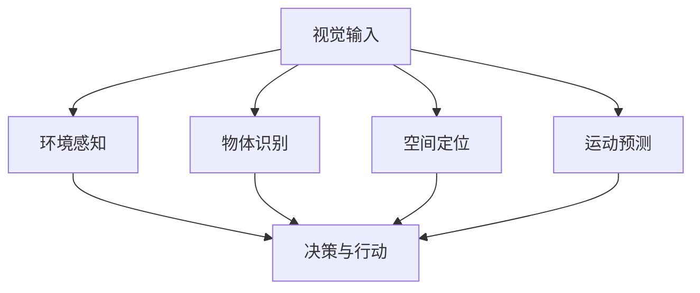
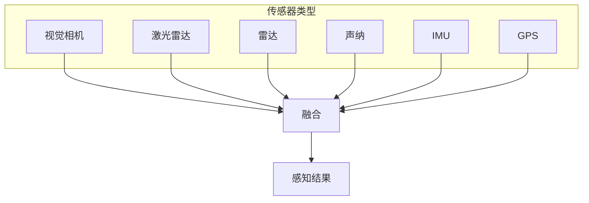

# 25.1 引言

## 视觉的重要性

### 为什么视觉如此重要？

视觉是大多数动物最重要的感知渠道：

> "大多数动物都有'眼睛'这个器官，同时眼睛的存在通常需要较大的代价：眼睛占据了较大空间，需要消耗能量，而且非常脆弱。但这种代价是合理的，因为眼睛提供的功能有巨大的价值。"

**视觉的核心价值**：

1. **预测未来**：
   - "它可能会撞到什么？"
   - "前方是沼泽还是硬地？"

2. **危险判断**：
   - "应该反击、逃跑还是求助？"

3. **空间感知**：
   - "水果距离我多远？"
   - "路有多宽？"



## 计算机视觉的核心问题

### 两大核心任务

#### 1. 重建（Reconstruction）

**定义**：从一幅或一组图像中建立关于世界的模型。

**示例**：
- 从照片重建建筑物的3D模型
- 从视频恢复相机运动轨迹
- 创建场景的纹理贴图

**输出形式**：
- 3D点云
- 网格模型
- 深度图
- 表面法向图

#### 2. 识别（Recognition）

**定义**：根据视觉信息对所见物体进行辨识。

**示例**：
- 这是猫还是狗？
- 这个人是谁？
- 这个水果成熟了吗？

**识别层次**：
```
低层：它是物体（vs背景）
  ↓
中层：它是什么类别（猫）
  ↓
高层：它在做什么（猫在睡觉）
  ↓
更高层：它的意图/情感
```

### 问题的广泛性

**重建的广义理解**：
- 几何模型重建（传统）
- 纹理/材质重建
- 光照环境重建
- 场景语义重建

**识别的广义理解**：
- 物体分类（是什么）
- 实例识别（是哪个）
- 属性识别（颜色、形状）
- 行为识别（在做什么）

## 感知渠道的分类

### 被动感知 vs 主动感知

| 特性 | 被动感知 | 主动感知 |
|------|----------|----------|
| **定义** | 接收环境中的光 | 主动发射信号并接收反射 |
| **例子** | 人眼、普通相机 | 蝙蝠（超声波）、激光雷达 |
| **优点** | 低能耗、隐蔽 | 可控、精度高 |
| **缺点** | 受环境光限制 | 能耗高、设备复杂 |

**自然界中的主动感知**：
- 蝙蝠：超声波回声定位
- 海豚：声波探测
- 深海鱼：生物发光

### 多传感器融合

实际机器人系统往往使用多种传感器：



## 处理歧义

### 视觉的固有歧义性

**示例**：玩具哥斯拉 vs 真实怪兽

```
[小玩具照片] vs [真实怪兽照片]
     ↓                    ↓
  在图像上可能完全相同！
```

**歧义来源**：
1. **投影丢失信息**：3D到2D是多对一映射
2. **光照变化**：不同光照下同一物体外观不同
3. **材质混淆**：白色物体在阴影中 vs 黑色物体在强光下

### 处理歧义的两种方法

#### 方法1：概率推断

**思想**：某些解释比其他解释更可能

```
解释A：这是一个真正的哥斯拉摧毁城市
   P(A) ≈ 0 （哥斯拉不存在）

解释B：这是一个玩具哥斯拉摧毁玩具建筑
   P(B) ≫ P(A)
```

**实现**：
- 使用先验知识
- 贝叶斯推理
- 学习数据的统计规律

#### 方法2：无关性识别

**思想**：有些歧义对任务无关紧要

```
远处的景物：
- 可能是真实的树木
- 可能是平面的油画

但对于导航任务：
- 两者都表示"那里有障碍物，不要撞上去"
```

## 基于模型的视觉

### 两种模型

#### 1. 物体模型

**精确几何模型**：
- CAD模型
- 精确的尺寸、形状
- 用于工业检测、机器人操作

**模糊性质描述**：
- "所有人脸看起来大致相同"
- "汽车有四个轮子"
- 用于一般物体识别

#### 2. 绘制模型（Rendering Model）

描述产生图像的物理过程：

```
场景（3D模型 + 材质 + 光照）
         ↓
    绘制模型
         ↓
    图像（2D像素）
```

**应用**：
- 计算机图形学（正向使用）
- 计算机视觉（逆向推断）

## 特征的重要性

### 什么是特征？

**定义**：通过对图像进行简单计算而获得的数字，可以直接提供有用信息。

**Wumpus智能体的特征**：
- 5个传感器，每个输出1位
- 这些位就是特征
- 程序可直接解释

### 简单特征示例：碰撞时间估计

**生物应用**：许多飞行动物计算简单的光流特征来估计碰撞时间。

**公式**（简化）：

$$\tau = \frac{\theta}{\dot{\theta}}$$

其中：
- $\theta$：物体在视野中的角度大小
- $\dot{\theta}$：角度变化率

**特点**：
- 计算简单
- 直接传递给运动控制系统
- 响应极快

## 本章内容预览


### 学习路径

1. **基础**（25.2）：理解图像是如何形成的
2. **低级处理**（25.3）：学习边缘、纹理等基础特征
3. **中级理解**（25.4-25.5）：图像分类和物体检测
4. **高级推理**（25.6）：从2D图像恢复3D世界
5. **实际应用**（25.7）：了解CV在现实中的广泛应用

## 小结

本章引言介绍了计算机视觉的全景：

1. **核心价值**：视觉是智能体理解世界、预测未来的关键能力

2. **核心问题**：
   - 重建：从图像恢复世界结构
   - 识别：理解图像内容含义

3. **基本挑战**：
   - 3D到2D投影的信息丢失
   - 视觉固有的歧义性
   - 光照、视角、遮挡等变化

4. **处理思路**：
   - 利用先验知识和概率推断
   - 识别无关的歧义
   - 基于模型的分析

5. **后续内容**：
   - 图像形成的物理原理
   - 特征提取和表示学习
   - 深度学习在CV中的应用
   - 3D视觉和应用
