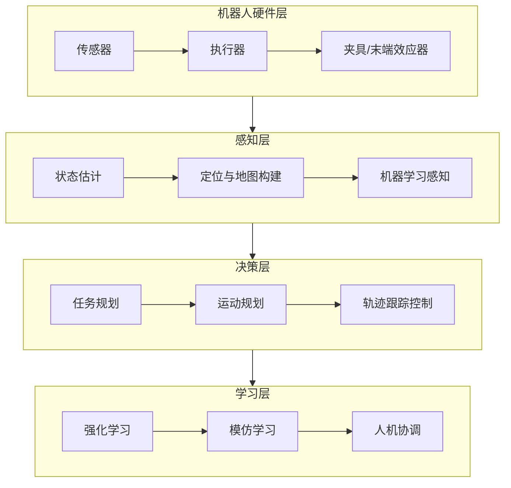
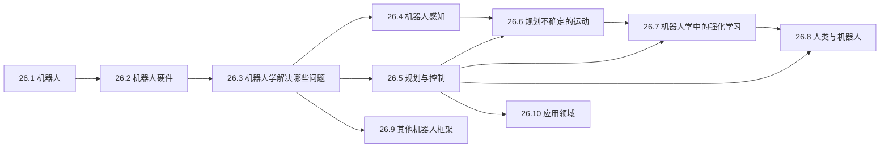

# 第26章 机器人学 - 概览

## 学习目标

完成本章学习后，你应该能够：

1. **理解机器人学的基本概念**：区分不同类型的机器人（机械手、移动机器人、腿式机器人等）及其应用领域
2. **掌握机器人硬件组成**：了解传感器（被动/主动、测距、位置、本体感受）、执行器（电动、液压、气动）和夹具的类型与原理
3. **理解机器人问题的计算框架**：将机器人问题形式化为MDP、POMDP和博弈
4. **掌握机器人感知技术**：理解状态估计、卡尔曼滤波、粒子滤波、蒙特卡罗定位、扩展卡尔曼滤波和SLAM
5. **掌握运动规划方法**：理解构形空间、能见度图、沃罗诺伊图、单元分解、PRM、RRT和轨迹优化
6. **理解轨迹跟踪控制**：掌握P、PD、PID控制器和计算扭矩控制
7. **了解不确定运动规划**：理解在线重规划、模型预测控制和信息收集
8. **理解机器人强化学习**：掌握基于模型的RL、域随机化和从模拟到现实的迁移
9. **理解人机协调**：掌握人类预测、博弈建模和协调交互

## 本章速览

机器人学是将AI理论与物理世界结合的学科。本章从硬件到软件、从感知到控制、从规划到学习，全面介绍了使机器人能够在真实世界中行动的核心技术。

## 难度预警

| 主题 | 难度 | 原因 |
|------|------|------|
| 构形空间与运动学 | ⭐⭐⭐⭐ | 需要从几何直观抽象到数学表示 |
| 卡尔曼滤波与粒子滤波 | ⭐⭐⭐⭐ | 涉及概率推理和递归估计 |
| 轨迹优化与最优控制 | ⭐⭐⭐⭐⭐ | 涉及变分法和泛函优化 |
| 博弈论人机协调 | ⭐⭐⭐⭐ | 需要理解不完全信息博弈 |

## 前置知识

- **第3章**：搜索算法基础
- **第14章**：概率滤波（卡尔曼滤波、粒子滤波）
- **第17章**：MDP与决策
- **第18章**：博弈论基础
- **第19章**：机器学习基础
- **第22章**：强化学习
- **第25章**：计算机视觉（部分相关）

## 节依赖图

## 定理/公式清单

| 公式 | 名称 | 应用领域 |
|------|------|----------|
| $P(X_{t+1}\|z_{1:t+1},a_{1:t}) = \alpha P(z_{t+1}\|X_{t+1})\int P(X_{t+1}\|x_t,a_t)P(x_t\|z_{1:t},a_{1:t-1})dx_t$ | 递归贝叶斯滤波 | 状态估计 |
| $C_{obs} = \{q: q \in C \text{且} \mathcal{A}(q) \cap O \neq \{\}\}$ | C空间障碍物 | 运动规划 |
| $u(t) = K_P(\xi(t)-q_t) + K_I\int_0^t(\xi(s)-q_s)ds + K_D(\dot{\xi}(t)-\dot{q}_t)$ | PID控制律 | 轨迹跟踪 |
| $P(u_H\|x,J_H) \propto e^{-Q(x,u_H;J_H)}$ | softmax人类模型 | 人机协调 |

## 核心逻辑线索

本章的核心线索是：**从感知到行动的完整机器人智能体设计**

1. **感知层**：通过传感器获取环境信息，使用概率滤波进行状态估计
2. **表示层**：将物理世界映射到构形空间，使几何问题转化为搜索问题
3. **规划层**：在运动学和动力学约束下寻找可行路径
4. **控制层**：将规划转化为实际的执行器命令
5. **学习层**：通过RL和IL改进性能，适应不确定性
6. **协调层**：在多智能体环境中实现安全高效的人机协作

## 核心要点速查

### 机器人分类
- **机械手**：固定基座，用于操纵物体
- **移动机器人**：轮式/腿式/UUV/UAV
- **拟人机器人**：模仿人类形态

### 传感器类型
- **被动**：相机、麦克风（仅观测环境）
- **主动**：声呐、激光雷达、雷达（发射能量并检测反射）
- **测距**：飞行时间相机、扫描激光雷达
- **位置**：GPS（室外）、信标（室内）
- **本体感受**：编码器、陀螺仪、加速度计

### 运动规划算法对比

| 算法 | 完备性 | 最优性 | 适用维度 | 特点 |
|------|--------|--------|----------|------|
| 能见度图 | 完备 | 最优 | 2D | 路径最短但贴近障碍物 |
| 沃罗诺伊图 | 完备 | 非最优 | 2D | 远离障碍物，安全 |
| 单元分解 | 分辨率完备 | 分辨率最优 | 低维 | 网格化，易实现 |
| PRM | 概率完备 | 非最优 | 高维 | 多查询高效 |
| RRT | 概率完备 | 非最优 | 高维 | 单查询快速 |
| RRT* | 概率完备 | 渐近最优 | 高维 | 渐进收敛到最优 |

### 控制器类型

| 控制器 | 公式 | 特点 |
|--------|------|------|
| P | $u = K_P e$ | 简单，可能震荡 |
| PD | $u = K_P e + K_D \dot{e}$ | 抑制震荡，严格稳定 |
| PID | $u = K_P e + K_I \int e + K_D \dot{e}$ | 消除稳态误差 |
| 计算扭矩 | $u = f^{-1}(\xi,\dot{\xi},\ddot{\xi}) + m(K_P e + K_D \dot{e})$ | 结合模型与反馈 |

## 概念对比表

| 概念A | 概念B | 区别 |
|-------|-------|------|
| 工作空间 | 构形空间 | 工作空间是物理3D空间；构形空间是机器人所有可能状态的抽象空间 |
| 运动学 | 动力学 | 运动学只关心位置/速度/加速度关系；动力学考虑力和质量 |
| 卡尔曼滤波 | 粒子滤波 | KF使用高斯分布（参数化）；PF使用样本（非参数化） |
| MCL | EKF定位 | MCL用粒子表示多峰分布；EKF用单峰高斯 |
| 开环控制 | 闭环控制 | 开环无反馈；闭环使用传感器反馈纠正误差 |
| 任务规划 | 运动规划 | 任务规划是高层动作序列；运动规划是低层几何路径 |

## 常见误解澄清

**误解1**：机器人就是人形机器
- **澄清**：机器人包括机械臂、移动平台、无人机等多种形式，人形只是其中一种

**误解2**：传感器越多，机器人感知越好
- **澄清**：传感器融合和算法同样重要；不当的传感器配置可能引入更多噪声

**误解3**：运动规划只需要找到一条可行路径
- **澄清**：好的运动规划还需考虑路径长度、平滑性、动力学可行性、安全裕度等

**误解4**：PID控制器已经过时
- **澄清**：PID因其简单可靠，仍是工业控制的主流；复杂任务才需要更高级的控制器

**误解5**：模拟器训练的策略可以直接用于真实机器人
- **澄清**：存在模拟到现实的鸿沟（reality gap），需要域随机化等技术进行迁移

## 本章测验

1. **为什么机器人需要将工作空间映射到构形空间？**

点击查看答案

工作空间中的碰撞检测需要计算机器人上所有点与障碍物的几何关系，非常复杂。构形空间将机器人表示为抽象空间中的一个点，碰撞检测简化为检查该点是否在障碍物区域内，大大降低了计算复杂度。

2. **卡尔曼滤波器和粒子滤波器各适用于什么情况？**

点击查看答案

- **卡尔曼滤波器**：适用于线性系统（或近似线性）和高斯噪声，计算高效，但只能表示单峰分布
- **粒子滤波器**：适用于非线性系统和任意分布，可以表示多峰分布（如全局定位），但计算成本较高，在高维空间面临挑战

3. **什么是"模拟到现实"问题？如何解决？**

点击查看答案

模拟到现实问题指在模拟环境中训练的策略在真实环境中表现不佳。原因包括：模拟器物理模型不精确、视觉渲染不真实、未建模的物理效应（如摩擦力、齿轮间隙）等。解决方法包括：
- 域随机化：在训练中随机化模拟参数
- 系统识别：用真实数据校准模拟器
- 域适应：使用迁移学习技术
- 混合方法：结合模型学习和真实经验

4. **为什么在人机协调中仅预测人类动作是不够的？**

点击查看答案

仅预测人类动作而忽略机器人动作对人类的影响会导致次优解。在真实交互中，机器人的行为会影响人类的决策（如自动驾驶汽车并线时影响人类司机的行为）。完全解需要考虑博弈论中的相互影响，但这计算复杂度高，通常采用分离预测和决策的近似方法。

## 快速复习卡

### 关键术语
- **DOF (Degree of Freedom)**：自由度，描述机器人独立运动的数量
- **C-space (Configuration Space)**：构形空间，机器人所有可能构形的抽象空间
- **SLAM**：同时定位与地图构建
- **MCL**：蒙特卡罗定位，使用粒子滤波的定位方法
- **PRM/RRT**：概率路线图/快速探索随机树，运动规划算法
- **PID**：比例-积分-微分控制器
- **LQR**：线性二次调节器，最优控制方法

### 公式速记
- **贝叶斯滤波**：新信念 ∝ 似然 × 预测
- **C空间障碍物**：使机器人与障碍碰撞的所有构形
- **PID控制**：比例项纠错 + 积分项消偏 + 微分项抑振

### 算法选择指南
- **全局定位** → 粒子滤波（MCL）
- **局部跟踪** → 扩展卡尔曼滤波
- **低维规划** → 能见度图/单元分解
- **高维规划** → PRM/RRT/RRT*
- **轨迹优化** → 梯度下降/变分法
- **实时控制** → PID/计算扭矩控制

## 扩展阅读

### 经典论文
- Thrun, S., Burgard, W., & Fox, D. (2005). *Probabilistic Robotics*. MIT Press.
- LaValle, S. M. (2006). *Planning Algorithms*. Cambridge University Press.
- Karaman, S., & Frazzoli, E. (2011). Sampling-based algorithms for optimal motion planning. *IJRR*.

### 近期进展
- 机器人学习中的Sim-to-Real迁移
- 基于学习的运动规划（Learning-based Planning）
- 人机交互中的安全性和可解释性

### 相关章节
- 第14章（概率滤波基础）
- 第17章（MDP和决策）
- 第22章（强化学习）
