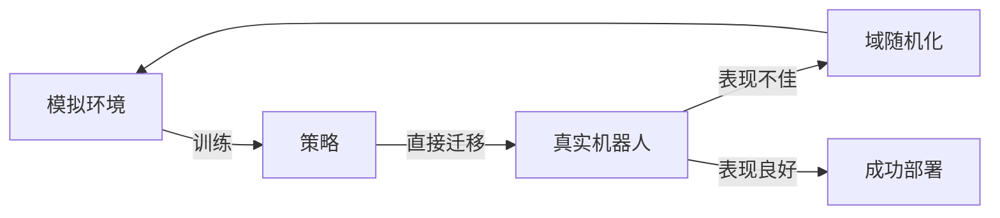

# 26.1 机器人

## 背景与动机

机器人学代表了人工智能从纯软件走向物理世界的关键一步。与前几章讨论的抽象智能体不同，机器人必须：
- 在**部分可观测**的环境中运行（摄像头看不到拐角背后）
- 处理**随机性**（齿轮打滑、传感器噪声）
- 应对**连续状态空间**（位置、速度是连续值）
- 在**真实时间**约束下决策（世界不会等待计算完成）

## 核心概念

### 机器人定义

机器人是通过**效应器（effector）**对环境施加物理力量的**实体智能体**。核心特征：

```
┌─────────────────────────────────────────────────────────┐
│                      机器人智能体                        │
├─────────────────────────────────────────────────────────┤
│  传感器层  │ 摄像头、激光雷达、GPS、编码器、陀螺仪、力传感器  │
├─────────────────────────────────────────────────────────┤
│  感知层   │ 状态估计、定位、地图构建、物体识别              │
├─────────────────────────────────────────────────────────┤
│  决策层   │ 规划（任务/运动）、控制、学习                   │
├─────────────────────────────────────────────────────────┤
│  执行层   │ 电动机、液压/气动执行器、夹具                   │
└─────────────────────────────────────────────────────────┘
```

### 机器人学的挑战

| 挑战 | 描述 | 解决思路 |
|------|------|----------|
| **现实鸿沟** | 模拟到真实的迁移困难 | 域随机化、系统识别 |
| **时间约束** | 真实世界运行速度固定 | 实时算法、模型预测控制 |
| **安全性** | 物理伤害不可逆 | 保守探索、安全学习 |
| **维度灾难** | 高维状态/动作空间 | 概率方法、采样算法 |

### 机器人问题形式化

机器人问题可以形式化为不同复杂度的决策框架：

| 场景 | 形式化 | 特点 |
|------|--------|------|
| 已知环境，单独行动 | **MDP** | 状态完全可观测 |
| 缺失信息，单独行动 | **POMDP** | 需要状态估计 |
| 在人类附近行动 | **博弈** | 多智能体交互 |

### 从模拟到现实（Sim-to-Real）



**核心问题**：
- 模拟器物理模型不精确
- 视觉渲染不真实
- 未建模的物理效应（摩擦力、齿轮间隙）
- 传感器噪声特性不同

## 与其他章节的联系

| 章节 | 在机器人学中的应用 |
|------|-------------------|
| 第14章 | 状态估计（卡尔曼滤波、粒子滤波） |
| 第17章 | MDP决策、价值迭代 |
| 第18章 | 人机博弈、协调 |
| 第21章 | 深度学习感知 |
| 第22章 | 强化学习控制 |

## 常见陷阱

1. **过度依赖模拟**：在模拟中完美的策略可能在真实环境中失败
2. **忽视动力学**：仅考虑运动学（几何）而忽略动力学（力/质量）会导致不可行的轨迹
3. **低估感知难度**："只是识别物体"实际上涉及复杂的状态估计
4. **忽视安全**：机器人可能造成物理伤害，需要严格的安全机制

## 深入思考

**Q**: 为什么机器人学习比软件AI学习困难得多？

**A**: 主要原因：
1. **样本效率**：真实世界不能加速，一次试验需要真实时间
2. **安全性**：错误的动作可能造成物理损坏
3. **数据获取**：不能像软件那样轻松收集百万级样本
4. **环境变化**：真实环境比模拟器更加多变

**Q**: 弱人工智能vs强人工智能在机器人学中的意义？

**A**: 当前所有机器人都是弱AI——它们表现出智能行为，但是否"真正思考"是哲学问题。机器人学关注的是实际性能，而非意识问题。
