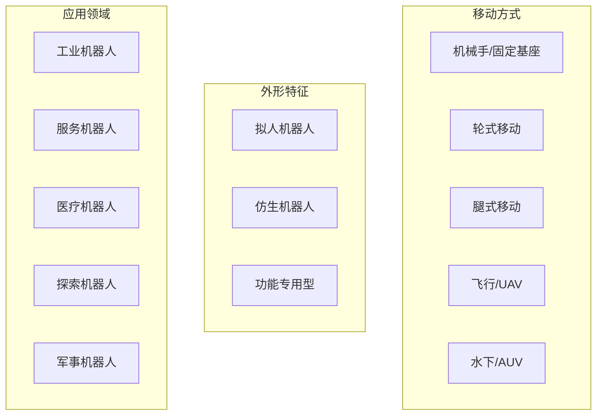
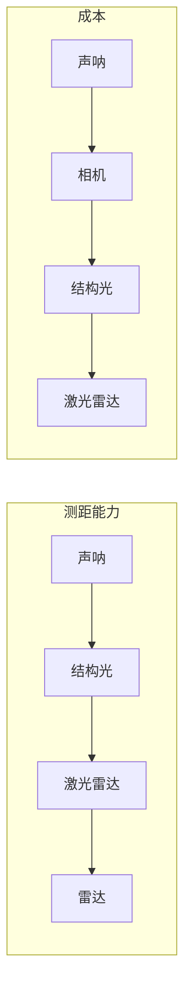

# 26.2 机器人硬件

## 背景与动机

成功的机器人不仅依赖智能算法，更需要适合任务的**传感器**和**效应器**设计。硬件选择直接影响：
- 可获取的信息质量和类型
- 可执行的动作范围
- 成本、重量、功耗约束

## 核心概念

### 机器人硬件分类



### 传感器详解

#### 1. 按能量来源分类

| 类型 | 原理 | 例子 | 优缺点 |
|------|------|------|--------|
| **被动传感器** | 捕获环境中的信号 | 相机、麦克风、GPS | 低功耗，信息可能不足 |
| **主动传感器** | 发射能量并检测反射 | 声呐、激光雷达、雷达 | 信息丰富，可能干扰其他设备 |

#### 2. 按功能分类

**测距传感器（Range Finder）**

| 传感器 | 原理 | 范围 | 精度 | 应用 |
|--------|------|------|------|------|
| **声呐** | 超声波发射/接收 | 0.1-10m | cm级 | 水下导航、早期室内机器人 |
| **立体视觉** | 双目视差计算 | 0.5-50m | cm级 | 低成本测距 |
| **Kinect/结构光** | 投射网格，观测变形 | 0.5-5m | mm级 | 室内3D扫描 |
| **飞行时间相机** | 测量光往返时间 | 0.1-10m | mm级 | 实时深度感知 |
| **扫描激光雷达** | 旋转激光束 | 10-100m | <1cm | 自动驾驶、地图构建 |
| **雷达** | 无线电波反射 | km级 | m级 | 航空、全天候感知 |
| **触觉传感器** | 物理接触 | <1cm | 接触检测 | 精细操作 |

**位置传感器（Location Sensor）**

| 传感器 | 原理 | 适用环境 | 精度 |
|--------|------|----------|------|
| **GPS** | 卫星三角定位 | 室外 | 1-10m (差分GPS: mm级) |
| **室内信标** | 已知位置标记 | 室内 | dm级 |
| **WiFi定位** | 信号强度分析 | 室内 | m级 |
| **水下声呐信标** | 声学定位 | 水下 | m级 |

**本体感受传感器（Proprioceptive Sensor）**

| 传感器 | 测量量 | 应用 |
|--------|--------|------|
| **轴编码器** | 关节角度/轮旋转 | 关节位置、里程计 |
| **陀螺仪** | 角速度 | 方向估计 |
| **加速度计** | 线加速度 | 姿态估计、振动检测 |
| **力/扭矩传感器** | 作用力/力矩 | 精细操作、安全控制 |

#### 传感器特性对比



### 执行器详解

#### 执行器类型

| 类型 | 原理 | 优点 | 缺点 | 典型应用 |
|------|------|------|------|----------|
| **电动执行器** | 电动机转换电能为机械能 | 精确、清洁、易控制 | 功率/重量比低 | 大多数机器人 |
| **液压执行器** | 加压液体驱动 | 高功率/重量比 | 需要泵、可能泄漏 | 重载机械 |
| **气动执行器** | 压缩气体驱动 | 简单、快速 | 精度低、需要气源 | 轻载、快速运动 |

#### 关节类型

| 关节类型 | 运动 | DOF | 例子 |
|----------|------|-----|------|
| **旋转关节（Revolute）** | 相对旋转 | 1 | 机械臂肘关节 |
| **平移关节（Prismatic）** | 相对滑动 | 1 | 伸缩臂 |
| **球形关节** | 3D旋转 | 3 | 肩关节 |
| **平面关节** | 平面运动 | 3 | 某些仿生关节 |

### 夹具（Gripper）设计

| 类型 | 执行器数 | 特点 | 应用 |
|------|----------|------|------|
| **平行钳夹具** | 1 | 简单、可靠 | 规则物体抓取 |
| **三指夹具** | 3 | 适应性好 | 不规则物体 |
| **仿人手（如Shadow Hand）** | 20 | 高自由度 | 复杂操作、掌上操作 |

**设计权衡**：
- 自由度↑ → 灵活性↑，但控制难度↑
- 简单夹具适合特定任务
- 复杂夹具需要更多学习/规划

## 关键公式

### 里程计模型
轮子旋转角度 $\Delta\theta$ → 行进距离 $d = r \cdot \Delta\theta$（$r$为轮子半径）

### 编码器分辨率
角度分辨率 = $360° / (编码器线数 \times 4)$（四倍频计数）

## 常见陷阱

1. **传感器选择误区**
   - ❌ 激光雷达一定比相机好
   - ✅ 取决于任务：激光雷达测距精确但缺乏纹理；相机丰富但计算复杂

2. **忽视传感器噪声模型**
   - 真实传感器有各种噪声（高斯、椒盐、系统偏差）
   - 滤波算法需要准确的噪声模型

3. **执行器饱和**
   - 执行器有最大速度/力矩限制
   - 规划时需考虑动态约束

4. **忽视功率预算**
   - 主动传感器（激光雷达）功耗高
   - 移动机器人电池有限，需平衡感知与续航

## 可视化：典型机器人硬件配置

### 自动驾驶汽车
```
┌─────────────────────────────────────┐
│   [激光雷达]    [GPS天线]           │
│         ↓              ↓            │
│   [相机组] ← [计算单元] → [雷达]    │
│         ↓              ↓            │
│   [超声波]    [IMU]                │
└─────────────────────────────────────┘
              ↓
        [转向电机]
        [制动系统]
        [驱动电机]
```

### 机械臂
```
┌─────────────────────────────────────┐
│   基座 ← [编码器]                    │
│    ↓                               │
│   关节1 ← [电机+减速器+编码器]       │
│    ↓                               │
│   关节2 ← [电机+减速器+编码器]       │
│    ↓                               │
│   ...                              │
│    ↓                               │
│   末端执行器 ← [力/扭矩传感器]       │
│    ↓                               │
│   夹具 ← [电机/气动]                │
└─────────────────────────────────────┘
```

## 与其他小节的联系

- **26.4 机器人感知**：传感器数据如何被处理成有用的状态估计
- **26.5 规划与控制**：执行器如何响应控制命令
- **26.7 强化学习**：传感器-执行器回路如何构成RL的智能体-环境接口
